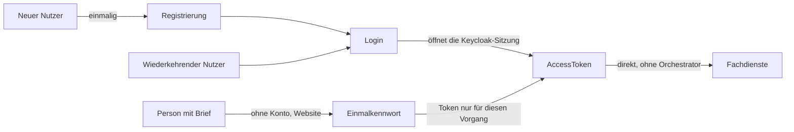
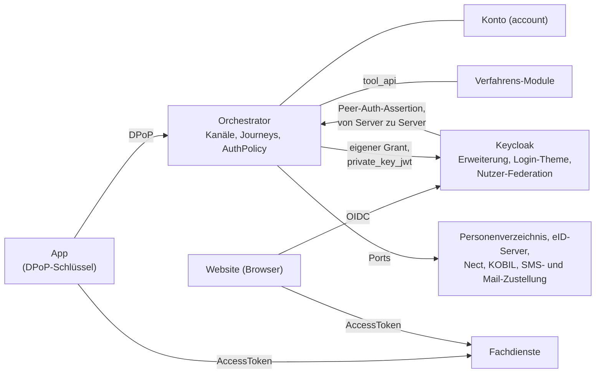

# Überblick

Die Einführung in dieses Projekt: worum es geht, das Zielbild mit seinen Komponenten, die
wichtigsten Begriffe und die tragenden Ideen in Kurzform. Jeder Abschnitt verweist auf das Kapitel, das ihn ausführt. Am
Ende steht, was Sie je nach Rolle als Nächstes lesen.

---

## 1) Worum es geht

Eine Krankenversicherung bietet eine **App** und eine **Website** an. Beide nutzen dieselben
Konten. Wer neu ist, **registriert** sich einmal, indem er sich ausweist (etwa mit einem
Freischaltcode per Brief oder dem Online-Ausweis), und richtet dabei Anmeldeverfahren ein: SMS,
Passwort, E-Mail, einen Geräteschlüssel. Danach **meldet** er sich mit diesen Verfahren **an**.
Für einzelne Vorgänge geht es auch ohne Konto: Die Versicherung schickt einen Brief mit einem
**Einmalkennwort**, und die Anmeldung damit gilt nur für diesen einen Vorgang.

Nicht jede Aktion verlangt dasselbe Vertrauen. Das System kennt drei **Sicherheitsniveaus**
(`loa1` bis `loa3`). Verlangt eine Aktion mehr, als die laufende Anmeldung nachgewiesen hat, muss
der Nutzer einen weiteren Nachweis erbringen: den **Step-up**.

Das Ziel ist immer ein `AccessToken`, mit dem App oder Website anschließend die Fachdienste der
Versicherung **direkt** aufrufen. Die Registrierung ist kein Selbstzweck, sondern die einmalige
Voraussetzung für die Anmeldung. Das Token stellt Keycloak im üblichen OIDC-Ablauf aus; für die
App wickelt der Orchestrator diesen Ablauf auf dem Server ab, sodass die App keine eigene Logik zum
Erneuern der Tokens braucht.

Wie das für eine einzelne Person aussieht – Registrierung, Login, Step-up, QR-Login im Browser,
Löschung –, erzählt [11-beispiel-story.md](11-beispiel-story.md).

---

## 2) Das Zielbild: Komponenten und Zusammenspiel

**Die Komponenten und ihre Aufgabe**

- **App**: spricht direkt mit dem Orchestrator. Sie erzeugt einen eigenen Schlüssel, und jede
  Anfrage trägt einen DPoP-Beweis damit; so erkennt der Orchestrator das Gerät wieder
  ([09-dpop.md](09-dpop.md)). Sie folgt `next` und entscheidet nichts selbst.
- **Website (Browser)**: meldet sich bei **Keycloak** an und spricht nie direkt mit dem
  Orchestrator.
- **Keycloak**: stellt die Tokens aus und führt die Anmeldung auf der Website. Dazu bringt das
  Projekt drei Teile mit: eine **Erweiterung** (`keycloak-extension/`), die beim Orchestrator
  nachfragt, welche Verfahren angeboten werden und ob ein Nachweis reicht; ein **Login-Theme**
  (`keycloak-theme/`), das die Schritte der Verfahren darstellt; und eine **Nutzer-Federation**, über
  die Keycloak die Konten beim Orchestrator nachliest, statt sie zu kopieren
  ([ADR-38](adr/ADR-038-keycloak-liest-konten.md)).
- **Orchestrator**: der Kern dieses Projekts. Er führt die **Kanäle** (App und Web), entscheidet
  über **Intents** und **Journeys**, welche Schritte ein Nutzer durchläuft, und bewertet die
  Nachweise mit der **`AuthPolicy`** ([04-orchestrierung.md](04-orchestrierung.md)).
- **Konto** (Modul `account`): Konten, Anker, Angaben und eingerichtete Anmeldeverfahren.
- **Verfahrens-Module**: je Verfahren ein Modul mit eigenen Tool-Endpunkten (`ident_*`, `auth_*`).
  Sie erreichen den Orchestrator nur über den Vertrag `tool_api`
  ([03-tool-architektur.md](03-tool-architektur.md)).
- **Fremdsysteme hinter Ports**: das **Personenverzeichnis** mit den Stammdaten der Versicherung
  (Personen, Partnernummer, Mitgliedsnummer, KVNR), das Freischaltcodes und Einladungen mit
  Einmalkennwort ausstellt; der **eID-Server** für den Online-Ausweis; **Nect** (Identifizierung per
  Ausweis, Reisepass, EUDI-Wallet); **KOBIL** (Gerätebindung); die Zustellung von **SMS** und
  **E-Mail**. Was jedes davon zusagen muss, steht in [port-vertraege.md](port-vertraege.md).
- **Fachdienste**: die Dienste der Versicherung. App und Website rufen sie mit dem `AccessToken`
  direkt auf, ohne Orchestrator.

**Vertrauensgrenzen**

- **App → Orchestrator:** DPoP-Proof je Anfrage; der Kanal ist an den Schlüssel des Geräts gebunden
  ([09-dpop.md](09-dpop.md)).
- **Keycloak → Orchestrator:** eine signierte Peer-Auth-Assertion je Anfrage statt DPoP, die
  Antwort des Orchestrators ist ebenfalls signiert
  ([ADR-7](adr/ADR-007-web-kanal-ohne-mtls-signierte-request-assertion-statt.md),
  [05-api.md](05-api.md) Abschnitt 3b).
- **Orchestrator → Keycloak:** `private_key_jwt` je Client und ein eigener Grant, den nur der
  Orchestrator aufrufen darf
  ([ADR-9](adr/ADR-009-profilabhaengiges-token-retrieval-account-keypair-custom-oauth2-grant.md)).
- **Orchestrator → Fremdsysteme:** nur über Ports; der Kern vertraut einem System nur mit dem, was
  sein Port-Vertrag zusagt.

Alle Grenzen samt den Stellen im Code zeigt [16-lesepfad-sicherheit.md](16-lesepfad-sicherheit.md)
Abschnitt 0.

**Wem welche Daten gehören**

- **Konto, Anker und Angaben** führt der Orchestrator im Modul `account`; Kanäle, Journeys und
  Nachweise der Sitzungen das Modul `orchestrator`.
- **Stammdaten** einer Person führt das Personenverzeichnis. Der Orchestrator liest sie bei Bedarf
  über einen Port und hält im Konto nur die Historie der Angaben.
- **Credentials** (Telefonnummer, Passwort-Hash, Geräteschlüssel) gehören dem jeweiligen
  Verfahrens-Modul, in seinem eigenen Schema.
- **Keycloak liest nur nach.** Es hält keine Kopie der Konten, sondern nur, was zu seiner eigenen
  Aufgabe gehört: Sitzungen, Fehlversuche und Zustimmungen.

**Drei Abläufe**

- **App:** Die App öffnet mit DPoP einen Kanal beim Orchestrator. Der startet eine Journey,
  meist `FAST_ACCESS`, und bietet die Verfahren an, die ihr Zustand zulässt; die App folgt `next`
  zu den Tool-Endpunkten. Reicht der Nachweis, öffnet der Orchestrator über seinen eigenen Grant
  eine Keycloak-Sitzung und hält die Tokens; die App holt das `AccessToken` mit DPoP ab und ruft
  damit die Fachdienste auf.
- **Web:** Der Browser beginnt eine OIDC-Anmeldung bei Keycloak. Dessen Erweiterung fragt den
  Orchestrator von Server zu Server, der die Journey `WEB_SELECT_METHOD` startet; das Login-Theme
  zeigt das passende Formular, und Keycloak reicht die Eingaben an dieselben Tool-Endpunkte weiter.
  Nach Erfolg übernimmt Keycloak Konto, `acr` und `amr` in seine Sitzung, liest das Konto über die
  Federation und stellt das Token aus.
- **Vorgangszugang mit Einladung:** Das Personenverzeichnis lädt eine Person per Brief mit einem
  Einmalkennwort zu einem Vorgang ein. Auf der Website gibt sie KVNR oder Partnernummer und das
  Kennwort ein (`auth-invite-lookup`), auch ohne Konto; der Kanal gehört dann der Einladung, nicht
  einem Konto. Keycloak liest die Einladung als eigenen Nutzer, und die Tokens tragen den Vorgang
  (`process`) und gelten nur für ihn, bis zur Frist oder bis der Vorgang abgeschlossen ist
  ([ADR-48](adr/ADR-048-vorgangszugang-mit-einmalkennwort.md)).

**In dieser Demo**

Alle Fremdsysteme sind simuliert (Modulgruppe `simulation/`), ebenso die Kartenlesung des
Online-Ausweises. Verfahren, deren Niveau nur auf einer Simulation beruht, laufen ausschließlich im
**Demomodus** ([ADR-36](adr/ADR-036-niveaus-und-ihre-nachweise.md)). Die App ist eine
React-Oberfläche im Browser, ihre Schlüssel liegen in IndexedDB. Dazu kommen eine Willkommens- und
eine Admin-Seite und Testpersonen, mit denen man sich registrieren kann. Keycloak ist echt und läuft
als Container. Was Demo ist und was ein echtes System zusagen muss, steht in
[14-stand-und-weg-zur-produktion.md](14-stand-und-weg-zur-produktion.md) Abschnitt 4 und
[port-vertraege.md](port-vertraege.md).

---

## 3) Die wichtigsten Begriffe

Die Doku ist deutsch, der Code englisch. Hinter jedem Begriff steht in Klammern sein Name im Code.

- **Kanal** (`ChannelSession`): die Verbindung eines Clients, App oder Website, zum Orchestrator.
  Bewusst kurzlebig ([ADR-3](adr/ADR-003-channelsession-bewusst-kurzlebig-geraete-identitaet-in-deviceaccountlink.md)).
- **Intent** (`AuthIntent`): was der Nutzer erreichen will, samt dem Weg dorthin, etwa `FAST_ACCESS`,
  `REGISTER` oder `STEP_UP`. Die Liste steht in [04-orchestrierung.md](04-orchestrierung.md)
  Abschnitt 2.
- **Journey** (`AuthJourney`): ein laufender Durchlauf zu einem Intent; er nutzt ein oder mehrere
  Tools. Wo sie gerade steht, sagt ihr **Zustand** (`JourneyState`).
- **Tool** (`toolId`, z. B. `enroll-sms`): ein einzelner Schritt zum Identifizieren, Einrichten
  oder Anmelden.
- **Anmeldeverfahren** (`AccountAuthMethod`, im Code „Methode“): was im Konto eingerichtet ist und
  eine Anmeldung ermöglicht, etwa Passwort oder SMS. Zu einem Verfahren gehören meist zwei Tools,
  eines zum Einrichten (`enroll-…`), eines zum Anmelden (`auth-…`).
- **Identifizierung**: ein Tool, das bestätigt, wer jemand ist (`ident-fsc`, `ident-eid`,
  `ident-nect`).
- **Niveau**, ausführlich **Sicherheitsniveau** (`acr`, Werte `loa1`, `loa2`, `loa3`): wie sehr einer
  Anmeldung vertraut wird.
- **Nachweis** (`SessionEvidence`, daraus `acr` und `amr`): was in der laufenden Sitzung bewiesen
  wurde.
- **Angabe** (`AccountClaim`, Tabelle `account.claim`): ein Eintrag im Konto, dass ein Attribut einen
  bestimmten Wert hat, mit der Quelle, die dafür einsteht, und einer Stufe: *belegt*, *nachgewiesen*
  oder *behauptet* (`ClaimTrust`).
- **Anker** (`AccountAnchor`, Tabelle `account.anchor`): ein Attribut, über das ein Konto
  eindeutig wiedergefunden wird, etwa die Partnernummer oder die bestätigte E-Mail-Adresse.

Alle weiteren Begriffe stehen im [Glossar](glossar/glossar.md), unter anderem Tool-Durchlauf,
Tokens der App, Bestätigen, Widerruf, die Rollen Interessent, Partner und Versicherter, Mindestniveau
für einen Anker, Obergrenzen eines Verfahrens, Einladung und Einmalkennwort, Subjekt und
Geräteverknüpfung. Das [externe Glossar](glossar/externes-glossar.md) ist ein fremdes
Nachschlagewerk; wie seine Begriffe hier heißen, zeigt der
[Abgleich](glossar/abgleich-externes-glossar.md).

---

## 4) Drei Sitzungsebenen

Die Sitzungen sind ineinander geschachtelt, von lang- zu kurzlebig: der **Kanal**
(`ChannelSession`), darin höchstens eine laufende **Journey** (`AuthJourney`), darin nacheinander
die **Tool-Durchläufe** (`ToolSession`). Dauerhaft bleibt nur die Geräteverknüpfung. Wie lange jede
Ebene lebt und was sie hält, steht in [02-domaenenmodell.md](02-domaenenmodell.md) Abschnitt 1.

Eine Registrierung läuft zum Beispiel so: `ident-fsc` -> `confirm-email` -> `enroll-sms` ->
`enroll-password`. Nach dem Identifizieren bestätigt der Nutzer seine E-Mail-Adresse und richtet so
lange Verfahren ein, bis das verlangte Niveau erreicht ist. SMS allein reicht nur für `loa1`,
deshalb folgt ein Verfahren anderer Art, hier das Passwort; in der App stünde auch die Bindung an das
Gerät zur Wahl.

---

## 5) Tools beschreiben sich selbst

Jedes Modul bringt die Beschreibung seiner Tools selbst mit: Tool-Rolle, Verfahren, Faktortyp und
das höchste erreichbare Niveau. Es gibt keine zentral gepflegte Liste, die man beim Hinzufügen
eines Verfahrens vergessen könnte.

Über die Grenze eines Moduls geht nur ein `ToolOutcome`: Das Tool läuft noch, ist abgeschlossen
oder ist fehlgeschlagen. Was ein Tool geprüft hat, meldet es als Angabe (`Claim`).

Details: [03-tool-architektur.md](03-tool-architektur.md)

---

## 6) Der Client folgt `next`, er entscheidet nicht

Jede Antwort enthält ein `next`-Objekt: eine reine Adresse, entweder auf ein Tool oder auf eine
Seite des Orchestrators (Auswahl, Abschluss). Der Client ordnet `next` über eine feste
Routing-Tabelle einem Endpunkt zu und entscheidet nie selbst, welches Verfahren als Nächstes
kommt. Was ein Schritt zum Anzeigen braucht – fehlende Felder, Auswahl, Fehlergründe –, steht in
`stepData`.

Details: [05-api.md](05-api.md), für die Oberfläche [10-frontend.md](10-frontend.md)

---

## 7) Der Orchestrator entscheidet, die Module melden nur ihr Ergebnis

Nach jedem abgeschlossenen Tool entscheidet der Orchestrator, wie es weitergeht. Er verarbeitet
das Ergebnis (Konto anlegen, Verfahren einrichten, Nachweis übernehmen) und fragt dann die
`AuthPolicy`, ob die Nachweise für das verlangte Niveau reichen. Nur die Policy weiß, was eine
*Kombination* von Nachweisen bedeutet; ein Modul kennt nur sich selbst.

Für jeden Intent gibt es ein Zustandsdiagramm in [journeys/](journeys/); ein Test prüft, dass es zum
Code passt.

Details: [04-orchestrierung.md](04-orchestrierung.md)

---

## 8) Zwei Kanäle, eine Tool-API

**App – der Orchestrator führt.**

1. Die App legt per `POST /app/channels` einen Kanal an; jede Anfrage trägt einen DPoP-Beweis.
2. Der Orchestrator startet eine Journey zum Intent des Kanals (meist `FAST_ACCESS`) und bietet die
   Verfahren an, die ihr Zustand zulässt.
3. Ist die Anmeldung erfolgreich, holt der Orchestrator die Tokens bei Keycloak; der Kanal ist
   `AUTHENTICATED`.
4. Braucht die App später ein höheres Niveau, fordert sie es per
   `POST /channels/{channelSessionId}/step-ups` an. Reicht der Nachweis nicht, beginnt eine
   Journey `STEP_UP`, und die Antwort nennt gleich den nächsten Schritt.

**Website – Keycloak führt.**

1. Keycloaks Anmeldung ruft bei Bedarf über eine eigene Erweiterung den Orchestrator auf, von
   Server zu Server. Sie weist sich mit einer signierten Assertion aus statt mit DPoP.
2. Der Orchestrator startet die Journey `WEB_SELECT_METHOD` und bietet alle im Web nutzbaren Tools
   in einem Auswahlschritt an.
3. Keycloak zeigt das passende Formular und reicht die Eingaben an dieselben Tool-Endpunkte weiter,
   die auch die App nutzt.
4. Nach Erfolg übernimmt Keycloak Konto, `acr` und `amr` in seine Sitzung und stellt damit das
   Token aus.

Nur der Einstieg unterscheidet sich; danach nutzen beide Kanäle dieselben Tool-Endpunkte.

Details: [05-api.md](05-api.md) Abschnitte 2 und 3 (3a App-Kanal, 3b Web-Kanal)

---

## 9) Sicherheitsniveaus

- **`loa1`**: ein einzelnes Verfahren, etwa SMS oder Passwort.
- **`loa2`**: zwei Faktortypen – zwei Verfahren verschiedener Art (SMS plus Passwort), ein
  Verfahren mit zwei Faktoren (Geräteschlüssel mit PIN oder Biometrie) oder eine Identifizierung
  in derselben Sitzung. Verfahren verwalten und das Konto löschen verlangen `loa2`; bei einem nie
  identifizierten Konto reicht `loa1`.
- **`loa3`**: nur über eine starke Identifizierung (Online-Ausweis, Nect); beide sind simuliert
  und laufen daher nur im Demomodus ([ADR-36](adr/ADR-036-niveaus-und-ihre-nachweise.md)).

Das Niveau ist zweifach nach oben begrenzt
([ADR-5](adr/ADR-005-drei-obergrenzen-fuer-das-sicherheitsniveau.md)): Ein Verfahren liefert nie
mehr, als es technisch hergibt, und nie mehr, als die Sitzung bei seiner Einrichtung nachgewiesen
hatte. So kann niemand in einer schwach gesicherten Sitzung ein Verfahren einrichten und sich
damit dauerhaft ein höheres Niveau verschaffen.

Details: [04-orchestrierung.md](04-orchestrierung.md) Abschnitt 4

---

## 10) Wie der Code aufgebaut ist

Das Backend ist ein Spring-Modulith in Kotlin (`src/main/kotlin/com/example/identity/`). Die Module
liegen in fünf Gruppen, der Ordner sagt also schon, was ein Modul ist
([Projektrahmen](08-projektrahmen.md) Abschnitt 3):

- **`core/`**: `orchestrator` (Kanäle, Journeys, Policy, die REST-API der Kanäle und die
  Schnittstelle für Keycloak) und `account` (Konten, Angaben, Anker, Anmeldeverfahren).
- **`contract/`**: `tool_api`, der Vertrag zwischen Orchestrator und Verfahren, und `texts`.
- **`tools/`**: die Verfahren, je ein Modul mit eigenen Tool-Endpunkten (`ident_*`, `auth_*`). Sie
  erreichen den Orchestrator nur über `tool_api`.
- **`simulation/`**: die simulierten Fremdsysteme `personenverzeichnis`, `nect`, `kobil`, `sms`,
  `mail`.
- **`demo/`**: was es nur in der Demo gibt, `demo_mode` und `demo_seed`.

Daneben: `frontend/` (React), `keycloak-extension/` (Java-Erweiterung für Keycloak),
`keycloak-theme/` (Anmeldeseiten), `keycloak-migrations/` (Realm-Einrichtung), `api/` (der
API-Vertrag, aus dem Code erzeugt, [ADR-26](adr/ADR-026-api-vertrag-wird-generiert.md)).

**Der fachliche Kern** liegt in `orchestrator` und `account` jeweils im Paket `domain`, ohne
Framework, per ArchUnit geprüft
([ADR-40](adr/ADR-040-fachkern-im-paket-domain.md),
[08-projektrahmen.md](08-projektrahmen.md) Abschnitt 3). Wer die Regeln verstehen will, beginnt
dort:

- `orchestrator/domain/`: das Vokabular (`AuthIntent`, `AcrLevels`, `ToolCatalog`, Fehlercodes).
- `orchestrator/domain/journey/`: `IntentStrategy` mit `Transition` und `Action`, darunter die
  Zustände (`state/`) und die Strategie je Intent (`strategy/`), dazu `AccountRules.kt` und
  `CredentialRules.kt`.
- `orchestrator/domain/policy/`: `AuthPolicy`, `DefaultAuthPolicy`, `SessionEvidence`.
- `account/domain/`: `AnchorDecision`, `ClaimValues`, `PassportForm`.

Außen herum liegt die Technik: `JourneyService` und `JourneyActionExecutor` lesen, fragen die
Regel und schreiben; in `account` übernehmen das `application` (`ClaimLedger`, `AnchorRegistry`,
`ChangeLog`, `IdentityMatchingService`) und `infrastructure` (Entities, Repositories).

Wie Sie das System bauen, starten und testen, steht in [13-ausfuehren.md](13-ausfuehren.md).

---

## 11) Wie es weitergeht

Die Nummern der Kapitel geben keine Leserichtung vor. Je nach Rolle:

- **Fachexperte, Reviewer**: [11-beispiel-story.md](11-beispiel-story.md) ->
  [04-orchestrierung.md](04-orchestrierung.md) „Einstieg für Fachexperten“ -> die Diagramme in
  [journeys/](journeys/) -> [12-entscheidungen.md](12-entscheidungen.md) für das Warum.
- **Backend-Entwickler**: [03-tool-architektur.md](03-tool-architektur.md) „Einstieg:
  Zusammenspiel an einem Schritt“ -> [02-domaenenmodell.md](02-domaenenmodell.md) ->
  [04-orchestrierung.md](04-orchestrierung.md) -> [06-ablaeufe.md](06-ablaeufe.md) und
  [verfahren/](verfahren/README.md) ->
  [09-dpop.md](09-dpop.md) -> [08-projektrahmen.md](08-projektrahmen.md); vor Änderungen am Kern
  [invarianten.md](invarianten.md).
- **Frontend-Entwickler**: [10-frontend.md](10-frontend.md) „Einstieg: Wie `next` die App
  steuert“ -> [05-api.md](05-api.md). Die Interna des Backends verbirgt die API.
- **Betrieb**: [13-ausfuehren.md](13-ausfuehren.md) -> [07-betrieb.md](07-betrieb.md) ->
  [port-vertraege.md](port-vertraege.md), bevor ein simuliertes System durch ein echtes ersetzt
  wird.
- **Sicherheitsexperte**: [16-lesepfad-sicherheit.md](16-lesepfad-sicherheit.md), von außen nach
  innen mit Links auf den Code, danach [invarianten.md](invarianten.md) und die
  [offenen Befunde](offene-befunde.md).
- **KI-Agent**: [00-agent-quickstart.md](00-agent-quickstart.md), danach nur die Kapitel, die die
  Aufgabe braucht.

Alle Dokumente auf einer Seite: [README.md](README.md).
