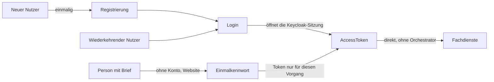
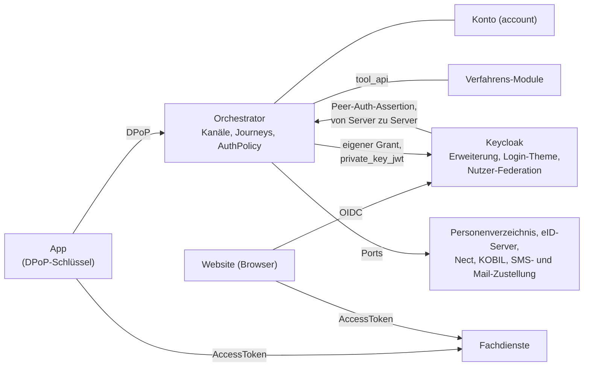

# Überblick

Dieses Kapitel führt in das Projekt ein. Es erklärt, worum es geht, wie das Zielbild aussieht und
aus welchen Teilen es besteht. Danach folgen die wichtigsten Begriffe und die tragenden Ideen in
Kurzform. Jeder Abschnitt nennt das Kapitel, in dem das Thema ausführlich steht. Am Ende steht, was
Sie je nach Rolle als Nächstes lesen.

Sie brauchen kein Vorwissen über das Projekt. Jeder Begriff wird erklärt, wenn er zum ersten Mal
vorkommt. Wenn Sie einen Begriff später noch einmal nachschlagen wollen, finden Sie ihn im
[Glossar](glossar/glossar.md).

---

## 1) Worum es geht

Eine Krankenversicherung bietet ihren Kunden eine **App** für das Smartphone und eine **Website**
an. Beide nutzen dieselben Konten.

- **Registrieren:** Wer neu ist, registriert sich einmal. Dabei weist er nach, wer er ist, etwa mit
  einem Freischaltcode, den die Versicherung per Brief schickt, oder mit dem Online-Ausweis (der
  Ausweisfunktion des Personalausweises). Außerdem richtet er Anmeldeverfahren ein, also Wege, mit
  denen er sich später anmeldet: SMS, Passwort, E-Mail oder einen Geräteschlüssel.
- **Anmelden:** Danach meldet er sich mit diesen Verfahren an.
- **Ohne Konto:** Für einzelne Vorgänge geht es auch ohne Konto. Die Versicherung schickt dann einen
  Brief mit einem **Einmalkennwort**. Die Anmeldung damit gilt nur für diesen einen Vorgang.

Nicht jede Aktion verlangt dasselbe Vertrauen. Deshalb kennt das System drei
**Sicherheitsniveaus**, `loa1` (niedrig) bis `loa3` (hoch). Sie sagen, wie sicher es ist, dass
wirklich der richtige Mensch angemeldet ist. Verlangt eine Aktion ein höheres Niveau, als die laufende Anmeldung erreicht hat, muss der Nutzer einen weiteren
Nachweis erbringen. Diesen zusätzlichen Schritt nennt das Projekt **Step-up**.

Am Ende steht immer ein **`AccessToken`**. Das ist ein signierter digitaler Ausweis, der nur kurz
gilt. Mit ihm rufen App oder Website anschließend die **Fachdienste** der Versicherung **direkt**
auf, also ihre eigentlichen Anwendungen. Die Registrierung ist kein Selbstzweck. Sie ist die einmalige Voraussetzung dafür, dass sich jemand anmelden kann.

Das Token stellt **Keycloak** aus. Keycloak ist ein verbreitetes Produkt für Anmeldung und
Token-Ausgabe. Es arbeitet nach dem Standard **OIDC** (OpenID Connect), der festlegt, wie eine
Anwendung einen Nutzer zur Anmeldung schickt und danach ein Token erhält. Die Logik dieses Projekts
steckt im **Orchestrator**, dem Server, den dieses Repository baut. Er entscheidet, welche Schritte
ein Nutzer durchläuft. Für die App wickelt der Orchestrator den OIDC-Ablauf auf dem Server ab. So
braucht die App keine eigene Logik, um abgelaufene Tokens zu erneuern.

Wie das für eine einzelne Person aussieht, erzählt [11-beispiel-story.md](11-beispiel-story.md). Die
Geschichte reicht von der Registrierung über Login, Step-up und die Anmeldung im Browser per
QR-Code bis zur Löschung des Kontos.

---

## 2) Das Zielbild: Komponenten und Zusammenspiel

Dieser Abschnitt zeigt, aus welchen Teilen das System besteht und wie sie miteinander sprechen. Die
Begriffe werden hier kurz erklärt. Abschnitt 3 fasst die wichtigsten noch einmal zusammen.

**Die Komponenten und ihre Aufgabe**

- **App**: Sie spricht direkt mit dem Orchestrator. Sie erzeugt einen eigenen Schlüssel. Jede
  Anfrage unterschreibt sie damit nach dem Standard **DPoP** (Demonstrating Proof of Possession). So belegt jede Anfrage, dass sie vom Besitzer dieses Schlüssels kommt, und der
  Orchestrator erkennt das Gerät wieder ([09-dpop.md](09-dpop.md)). Die App entscheidet nichts
  selbst. Jede Antwort des Orchestrators nennt im Feld `next` den nächsten Schritt, und die App
  folgt ihm (mehr dazu in Abschnitt 6).
- **Website (Browser)**: Sie meldet sich bei **Keycloak** an. Mit dem Orchestrator spricht sie nie
  direkt.
- **Keycloak**: Es stellt die Tokens aus und führt auf der Website durch die Anmeldung. Dafür bringt
  das Projekt drei Teile für Keycloak mit:
  - eine **Erweiterung** (`keycloak-extension/`). Sie fragt beim Orchestrator nach, welche
    Verfahren angeboten werden und ob ein Nachweis ausreicht.
  - ein **Login-Theme** (`keycloak-theme/`), also die Gestaltung der Anmeldeseiten. Es stellt die
    Schritte der einzelnen Verfahren dar.
  - eine **Nutzer-Federation**. Über sie liest Keycloak die Konten beim Orchestrator nach, statt
    eine eigene Kopie zu halten ([ADR-38](adr/ADR-038-keycloak-liest-konten.md)).
- **Orchestrator**: der Kern dieses Projekts. Er verwaltet die **Kanäle**, also die laufenden
  Verbindungen von App oder Website zu ihm. Er legt fest, welche Schritte ein Nutzer durchläuft.
  Dazu gehört zu jedem Kanal ein **Intent**, das Ziel des Nutzers (etwa „anmelden“ oder
  „registrieren“). Für dieses Ziel startet der Orchestrator eine **Journey**, also einen geführten
  Ablauf aus mehreren Schritten. Ob die gesammelten Nachweise für ein Sicherheitsniveau reichen,
  bewertet er mit seiner Richtlinie für Sicherheitsniveaus (`AuthPolicy`)
  ([04-orchestrierung.md](04-orchestrierung.md)).
- **Konto** (Modul `account`): Hier liegen die Konten mit ihren Ankern, Angaben und eingerichteten
  Anmeldeverfahren. Ein **Anker** ist ein Merkmal, über das ein Konto eindeutig wiedergefunden wird,
  etwa die Partnernummer. Eine **Angabe** ist eine Information über den Kontoinhaber, etwa Name oder
  E-Mail-Adresse, zusammen mit der Quelle, von der sie stammt.
- **Verfahrens-Module**: Jedes Verfahren (SMS, Passwort, Online-Ausweis …) ist ein eigenes Modul.
  Es bietet eigene Endpunkte für seine **Tools** an. Ein Tool ist ein einzelner Arbeitsschritt, etwa
  „SMS einrichten“ oder „mit Passwort anmelden“. Die Module heißen `ident_*` (Identifizierung) und
  `auth_*` (Anmeldeverfahren). Mit dem Orchestrator sprechen sie nur über einen festen Vertrag, das
  Modul `tool_api` ([03-tool-architektur.md](03-tool-architektur.md)).
- **Fremdsysteme hinter Ports**: Das sind Systeme außerhalb des Orchestrators. Der Orchestrator
  spricht mit ihnen nur über **Ports**, also fest vereinbarte Schnittstellen. So lässt sich jedes
  Fremdsystem austauschen, ohne den Kern zu ändern. Es gibt diese Fremdsysteme:
  - das **Personenverzeichnis** mit den Stammdaten der Versicherung: Personen, Partnernummer,
    Mitgliedsnummer und KVNR (Krankenversichertennummer). Es stellt auch die Freischaltcodes und die
    Einladungen mit Einmalkennwort aus.
  - den **eID-Server** für den Online-Ausweis.
  - **Nect**, einen Dienst zur Identifizierung per Personalausweis, Reisepass oder EUDI-Wallet
    (der digitalen Brieftasche der EU).
  - **KOBIL** für die Gerätebindung, also eine Anmeldung, die an ein bestimmtes Smartphone gebunden
    ist.
  - die Zustellung von **SMS** und **E-Mail**.

  Was jedes dieser Systeme zusagen muss, steht in [port-vertraege.md](port-vertraege.md).
- **Fachdienste**: die Dienste der Versicherung. App und Website rufen sie mit dem `AccessToken`
  direkt auf. Der Orchestrator ist daran nicht beteiligt.

**Vertrauensgrenzen**

An jeder Stelle, an der zwei Teile miteinander sprechen, muss der Empfänger prüfen können, wer der
Absender ist. Diese Stellen heißen Vertrauensgrenzen. Es gibt vier:

- **App → Orchestrator:** Jede Anfrage enthält einen DPoP-Beweis (DPoP-Proof), mit dem Schlüssel der
  App unterschrieben. Der Kanal ist an diesen Schlüssel des Geräts gebunden
  ([09-dpop.md](09-dpop.md)).
- **Keycloak → Orchestrator:** Hier gibt es kein DPoP. Stattdessen enthält jede Anfrage eine
  signierte Bestätigung, dass sie von Keycloak kommt (die Peer-Auth-Assertion). Auch die Antwort des
  Orchestrators ist signiert. Mehr dazu in
  [ADR-7](adr/ADR-007-web-kanal-ohne-mtls-signierte-request-assertion-statt.md) und
  [05-api.md](05-api.md) Abschnitt 3b.
- **Orchestrator → Keycloak:** Der Orchestrator weist sich bei Keycloak mit `private_key_jwt` aus,
  also mit einer Nachricht, die er mit seinem eigenen privaten Schlüssel signiert. Das geschieht für
  jeden Client getrennt. Die Tokens holt er über einen eigenen **Grant**, das ist eine eigene Art
  von Token-Anfrage, die nur der Orchestrator stellen darf
  ([ADR-9](adr/ADR-009-profilabhaengiges-token-retrieval-account-keypair-custom-oauth2-grant.md)).
- **Orchestrator → Fremdsysteme:** Der Orchestrator spricht mit ihnen nur über Ports. Er vertraut
  einem System nur in dem, was dessen Port-Vertrag zusagt.

Alle Grenzen und die Stellen im Code, an denen sie geprüft werden, zeigt
[16-lesepfad-sicherheit.md](16-lesepfad-sicherheit.md) Abschnitt 0.

**Wem welche Daten gehören**

Hier steht, welcher Teil des Systems welche Daten führt.

- **Konto, Anker und Angaben** führt der Orchestrator im Modul `account`. Kanäle, Journeys und die
  Nachweise der Sitzungen führt er im Modul `orchestrator`.
- **Stammdaten** einer Person führt das Personenverzeichnis. Der Orchestrator liest sie bei Bedarf
  über einen Port. Im Konto hält er nur die Historie der Angaben.
- **Zugangsdaten** (Credentials) wie Telefonnummer, Passwort-Hash oder Geräteschlüssel gehören dem
  jeweiligen Verfahrens-Modul. Es speichert sie in seinem eigenen Datenbankschema.
- **Keycloak liest nur nach.** Es hält keine Kopie der Konten. Es speichert nur, was zu seiner
  eigenen Aufgabe gehört: Sitzungen, Fehlversuche und Zustimmungen.

**Drei Abläufe**

Es gibt drei Wege, auf denen ein Nutzer zu einem Token kommt.

- **App:**
  1. Die App öffnet mit DPoP einen Kanal beim Orchestrator.
  2. Der Orchestrator startet eine Journey, meist mit dem Intent `FAST_ACCESS` (schnell anmelden).
     Er bietet die Verfahren an, die im aktuellen Zustand der Journey erlaubt sind.
  3. Die App folgt `next` zu den Endpunkten der Tools.
  4. Reicht der Nachweis, öffnet der Orchestrator über seinen eigenen Grant eine
     **Keycloak-Sitzung**, also eine Anmeldesitzung in Keycloak. Die Tokens behält er bei sich.
  5. Die App holt das `AccessToken` mit DPoP beim Orchestrator ab und ruft damit die Fachdienste
     auf.
- **Web:**
  1. Der Browser beginnt eine OIDC-Anmeldung bei Keycloak.
  2. Die Erweiterung in Keycloak fragt den Orchestrator, von Server zu Server. Der Orchestrator
     startet die Journey `WEB_SELECT_METHOD` (Verfahren auswählen).
  3. Das Login-Theme zeigt das passende Formular. Keycloak reicht die Eingaben an dieselben
     Endpunkte der Tools weiter, die auch die App nutzt.
  4. Nach Erfolg übernimmt Keycloak das Konto sowie `acr` und `amr` in seine Sitzung. `acr` ist das
     erreichte Sicherheitsniveau, `amr` die Liste der benutzten Verfahren.
  5. Keycloak liest das Konto über die Nutzer-Federation und stellt das Token aus.
- **Vorgangszugang mit Einladung:**
  1. Das Personenverzeichnis lädt eine Person per Brief zu einem Vorgang ein. Der Brief enthält ein
     Einmalkennwort.
  2. Auf der Website gibt die Person ihre KVNR oder Partnernummer und das Kennwort ein (Tool
     `auth-invite-lookup`). Das geht auch ohne Konto.
  3. Der Kanal gehört dann der Einladung, nicht einem Konto. Keycloak liest die Einladung wie einen
     eigenen Nutzer.
  4. Die Tokens nennen den Vorgang (`process`) und gelten nur für ihn. Sie gelten bis zum Ablauf der
     Frist oder bis der Vorgang abgeschlossen ist
     ([ADR-48](adr/ADR-048-vorgangszugang-mit-einmalkennwort.md)).

**In dieser Demo**

Das Repository ist eine Demo. Alle Fremdsysteme sind simuliert (Modulgruppe `simulation/`), ebenso
das Auslesen der Ausweiskarte beim Online-Ausweis. Manche Verfahren erreichen ihr Niveau nur, weil
eine Simulation es bestätigt. Diese Verfahren laufen ausschließlich im **Demomodus**, einem Schalter,
der alles nur zum Vorführen Gedachte einschaltet ([ADR-36](adr/ADR-036-niveaus-und-ihre-nachweise.md)).

Die App ist eine React-Oberfläche im Browser. Ihre Schlüssel liegen in IndexedDB, dem Speicher des
Browsers. Dazu kommen eine Willkommensseite, eine Admin-Seite und Testpersonen, mit denen man sich
registrieren kann. Keycloak dagegen ist echt und läuft als Container.

Was Demo ist und was ein echtes System zusagen muss, steht in
[14-stand-und-weg-zur-produktion.md](14-stand-und-weg-zur-produktion.md) Abschnitt 4 und in
[port-vertraege.md](port-vertraege.md).

---

## 3) Die wichtigsten Begriffe

Diese Begriffe kommen in der ganzen Doku immer wieder vor. Die Doku ist deutsch, der Code englisch.
Hinter jedem Begriff steht deshalb in Klammern sein Name im Code.

- **Kanal** (`ChannelSession`): die Verbindung eines Clients zum Orchestrator. Ein Client ist die
  App oder die Website. Ein Kanal lebt bewusst nur kurz
  ([ADR-3](adr/ADR-003-channelsession-bewusst-kurzlebig-geraete-identitaet-in-deviceaccountlink.md)).
- **Intent** (`AuthIntent`): was der Nutzer erreichen will, zusammen mit dem Weg dorthin. Beispiele
  sind `FAST_ACCESS` (anmelden), `REGISTER` (registrieren) und `STEP_UP` (Niveau erhöhen). Die
  vollständige Liste steht in [04-orchestrierung.md](04-orchestrierung.md) Abschnitt 2.
- **Journey** (`AuthJourney`): ein laufender Durchlauf zu einem Intent. Eine Journey nutzt ein
  oder mehrere Tools. Wo sie gerade steht, sagt ihr **Zustand** (`JourneyState`).
- **Tool** (`toolId`, z. B. `enroll-sms`): ein einzelner Schritt, mit dem sich ein Nutzer
  identifiziert, ein Verfahren einrichtet oder sich anmeldet.
- **Anmeldeverfahren** (`AccountAuthMethod`, im Code „Methode“): ein Weg zur Anmeldung, der im
  Konto eingerichtet ist, etwa Passwort oder SMS. Zu einem Verfahren gehören meist zwei Tools: eines
  zum Einrichten (`enroll-…`) und eines zum Anmelden (`auth-…`).
- **Identifizierung**: ein Tool, das bestätigt, wer jemand wirklich ist. Beispiele sind `ident-fsc`
  (Freischaltcode), `ident-eid` (Online-Ausweis) und `ident-nect` (Nect).
- **Niveau**, ausführlich **Sicherheitsniveau** (`acr`, Werte `loa1`, `loa2`, `loa3`): wie sehr
  das System einer Anmeldung vertraut.
- **Nachweis** (`SessionEvidence`, daraus `acr` und `amr`): was der Nutzer in der laufenden Sitzung
  bewiesen hat. Aus dem Nachweis folgen das Niveau (`acr`) und die Liste der benutzten Verfahren
  (`amr`).
- **Angabe** (`AccountClaim`, Tabelle `account.claim`): ein Eintrag im Konto, dass ein Merkmal einen
  bestimmten Wert hat, etwa der Name. Zu jeder Angabe gehören die Quelle, von der sie stammt, und
  eine Stufe, wie verlässlich sie ist: *belegt*, *nachgewiesen* oder *behauptet* (`ClaimTrust`).
  Auf Englisch heißt eine Angabe Claim.
- **Anker** (`AccountAnchor`, Tabelle `account.anchor`): ein Merkmal, über das sich ein Konto
  eindeutig wiederfinden lässt, etwa die Partnernummer oder die bestätigte E-Mail-Adresse.

Alle weiteren Begriffe stehen im [Glossar](glossar/glossar.md). Dazu gehören zum Beispiel:

- Tool-Durchlauf, Tokens der App, Bestätigen und Widerruf,
- die Rollen Interessent, Partner und Versicherter,
- das Mindestniveau für einen Anker und die Obergrenzen eines Verfahrens,
- Einladung und Einmalkennwort, Subjekt und Geräteverknüpfung.

Das [externe Glossar](glossar/externes-glossar.md) ist ein fremdes Nachschlagewerk zu allgemeinen
Fachbegriffen. Wie seine Begriffe in diesem Projekt heißen, zeigt der
[Abgleich](glossar/abgleich-externes-glossar.md).

---

## 4) Drei Sitzungsebenen

Während ein Nutzer sich anmeldet, merkt sich der Orchestrator den Stand auf drei Ebenen. Sie sind
ineinander geschachtelt, von langlebig zu kurzlebig:

1. der **Kanal** (`ChannelSession`),
2. darin höchstens eine laufende **Journey** (`AuthJourney`),
3. darin nacheinander die **Tool-Durchläufe** (`ToolSession`). Ein Tool-Durchlauf ist ein einmal
   gestartetes Tool, etwa das Warten auf eine eingegebene TAN.

Dauerhaft bleibt nur die Geräteverknüpfung, also die Verbindung zwischen einem Gerät und einem
Konto. Wie lange jede Ebene lebt und was sie speichert, steht in
[02-domaenenmodell.md](02-domaenenmodell.md) Abschnitt 1.

Eine Registrierung läuft zum Beispiel so: `ident-fsc` -> `confirm-email` -> `enroll-sms` ->
`enroll-password`. Zuerst identifiziert sich der Nutzer mit dem Freischaltcode. Dann bestätigt er
seine E-Mail-Adresse. Danach richtet er so lange Verfahren ein, bis das verlangte Niveau erreicht
ist. SMS allein reicht nur für `loa1`. Deshalb folgt ein Verfahren anderer Art, hier das Passwort.
In der App stünde stattdessen auch die Bindung an das Gerät zur Wahl.

---

## 5) Tools beschreiben sich selbst

Jedes Modul bringt die Beschreibung seiner Tools selbst mit. Die Beschreibung nennt:

- die Tool-Rolle, also was das Tool fachlich tut (etwa identifizieren oder ein Verfahren
  einrichten),
- das Verfahren, zu dem es gehört,
- den Faktortyp, also die Art des Beweises: etwas, das man weiß (Passwort), etwas, das man hat
  (Smartphone), oder etwas, das man ist (Fingerabdruck),
- das höchste Niveau, das das Tool erreichen kann.

Es gibt also keine zentral gepflegte Liste der Tools. Wer ein neues Verfahren hinzufügt, kann
deshalb auch nicht vergessen, es dort einzutragen.

Über die Grenze eines Moduls geht nur ein Ergebnis (`ToolOutcome`). Es sagt eines von drei Dingen:
Das Tool läuft noch, es ist abgeschlossen, oder es ist fehlgeschlagen. Was ein Tool geprüft hat,
meldet es als Angabe (`Claim`).

Details: [03-tool-architektur.md](03-tool-architektur.md)

---

## 6) Der Client folgt `next`, er entscheidet nicht

Die Clients, also App und Website, sollen keine eigenen Regeln kennen. Deshalb enthält jede Antwort
des Orchestrators ein `next`-Objekt. Es ist eine reine Adresse. Sie zeigt entweder auf ein Tool oder
auf eine Seite des Orchestrators, etwa die Auswahl oder den Abschluss.

Der Client ordnet `next` über eine feste Tabelle einem Endpunkt zu (Routing-Tabelle). Er entscheidet
nie selbst, welches Verfahren als Nächstes kommt. Was ein Schritt zum Anzeigen braucht, steht im
Feld `stepData`. Das sind zum Beispiel fehlende Felder, die Auswahlmöglichkeiten oder Gründe für
einen Fehler.

Details: [05-api.md](05-api.md), für die Oberfläche [10-frontend.md](10-frontend.md)

---

## 7) Der Orchestrator entscheidet, die Module melden nur ihr Ergebnis

Wie es nach einem Schritt weitergeht, entscheidet immer der Orchestrator, nie ein Modul. Nach jedem
abgeschlossenen Tool verarbeitet er zuerst das Ergebnis. Er legt zum Beispiel ein Konto an, richtet
ein Verfahren ein oder übernimmt einen Nachweis. Dann fragt er die Richtlinie für
Sicherheitsniveaus (`AuthPolicy`), ob die Nachweise für das verlangte Niveau reichen.

Nur diese Richtlinie weiß, was eine *Kombination* von Nachweisen bedeutet. Ein Modul kennt nur sich
selbst.

Für jeden Intent gibt es ein Zustandsdiagramm in [journeys/](journeys/). Es zeigt, über welche
Zustände die Journey laufen kann. Ein Test prüft, dass jedes Diagramm zum Code passt.

Details: [04-orchestrierung.md](04-orchestrierung.md)

---

## 8) Zwei Kanäle, eine Tool-API

App und Website kommen auf verschiedenen Wegen zum Orchestrator. Danach nutzen sie aber dieselben
Endpunkte der Tools.

**App – der Orchestrator führt.**

1. Die App legt per `POST /app/channels` einen Kanal an. Jede Anfrage enthält einen DPoP-Beweis.
2. Der Orchestrator startet eine Journey zum Intent des Kanals, meist `FAST_ACCESS`. Er bietet die
   Verfahren an, die im aktuellen Zustand der Journey erlaubt sind.
3. Ist die Anmeldung erfolgreich, holt der Orchestrator die Tokens bei Keycloak. Der Kanal hat dann
   den Zustand `AUTHENTICATED` (angemeldet).
4. Braucht die App später ein höheres Niveau, fordert sie es per
   `POST /channels/{channelSessionId}/step-ups` an. Reicht der bisherige Nachweis nicht, beginnt
   eine Journey `STEP_UP`. Die Antwort nennt gleich den nächsten Schritt.

**Website – Keycloak führt.**

1. Während der Anmeldung ruft Keycloak bei Bedarf den Orchestrator auf, über die eigene
   Erweiterung und von Server zu Server. Keycloak weist sich dabei nicht mit DPoP aus, sondern mit
   einer signierten Bestätigung (Assertion).
2. Der Orchestrator startet die Journey `WEB_SELECT_METHOD`. Er bietet in einem Auswahlschritt alle
   Tools an, die im Web nutzbar sind.
3. Keycloak zeigt das passende Formular. Die Eingaben reicht es an dieselben Endpunkte der Tools
   weiter, die auch die App nutzt.
4. Nach Erfolg übernimmt Keycloak das Konto sowie `acr` und `amr` in seine Sitzung. Damit stellt es
   das Token aus.

Nur der Einstieg unterscheidet sich. Danach nutzen beide Kanäle dieselben Endpunkte der Tools.

Details: [05-api.md](05-api.md) Abschnitte 2 und 3 (3a App-Kanal, 3b Web-Kanal)

---

## 9) Sicherheitsniveaus

Die drei Niveaus bauen aufeinander auf:

- **`loa1`**: ein einzelnes Verfahren, etwa SMS oder Passwort.
- **`loa2`**: zwei verschiedene Faktortypen. Das kann auf drei Wegen geschehen:
  - zwei Verfahren verschiedener Art, etwa SMS plus Passwort,
  - ein Verfahren, das selbst zwei Faktoren hat, etwa ein Geräteschlüssel mit PIN oder Biometrie,
  - eine Identifizierung in derselben Sitzung.

  Um Verfahren zu verwalten oder das Konto zu löschen, braucht der Nutzer `loa2`. Bei einem Konto,
  das nie identifiziert wurde, reicht `loa1`.
- **`loa3`**: nur über eine starke Identifizierung, also mit dem Online-Ausweis oder mit Nect. Beide
  sind in dieser Demo simuliert und laufen deshalb nur im Demomodus
  ([ADR-36](adr/ADR-036-niveaus-und-ihre-nachweise.md)).

Das Niveau eines Verfahrens ist zweifach nach oben begrenzt
([ADR-5](adr/ADR-005-drei-obergrenzen-fuer-das-sicherheitsniveau.md)):

- Ein Verfahren liefert nie mehr, als es technisch hergibt.
- Ein Verfahren liefert nie mehr, als die Sitzung nachgewiesen hatte, in der es eingerichtet wurde.

So kann niemand in einer schwach gesicherten Sitzung ein Verfahren einrichten und sich damit
dauerhaft ein höheres Niveau verschaffen.

Details: [04-orchestrierung.md](04-orchestrierung.md) Abschnitt 4

---

## 10) Wie der Code aufgebaut ist

Das Backend ist ein Spring-Modulith in Kotlin (`src/main/kotlin/com/example/identity/`). Ein
Modulith ist eine einzige Anwendung, die intern in klar getrennte Module aufgeteilt ist. Die Module
liegen in fünf Ordnern. Schon der Ordner sagt also, welche Art von Modul es ist
([Projektrahmen](08-projektrahmen.md) Abschnitt 3):

- **`core/`**: der Kern. Dazu gehören `orchestrator` (Kanäle, Journeys, die Richtlinie, die
  REST-API der Kanäle und die Schnittstelle für Keycloak) und `account` (Konten, Angaben, Anker,
  Anmeldeverfahren).
- **`contract/`**: die Verträge. Dazu gehören `tool_api`, der Vertrag zwischen Orchestrator und
  Verfahren, und `texts`.
- **`tools/`**: die Verfahren. Jedes ist ein eigenes Modul mit eigenen Endpunkten für seine Tools
  (`ident_*`, `auth_*`). Den Orchestrator erreichen sie nur über `tool_api`.
- **`simulation/`**: die simulierten Fremdsysteme `personenverzeichnis`, `nect`, `kobil`, `sms` und
  `mail`.
- **`demo/`**: was es nur in der Demo gibt, nämlich `demo_mode` und `demo_seed`.

Daneben gibt es diese Ordner:

- `frontend/`: die Oberfläche in React,
- `keycloak-extension/`: die Java-Erweiterung für Keycloak,
- `keycloak-theme/`: die Anmeldeseiten,
- `keycloak-migrations/`: die Einrichtung des Realms, also des Bereichs in Keycloak, in dem die
  Nutzer und Clients des Projekts liegen,
- `api/`: der API-Vertrag. Er wird aus dem Code erzeugt
  ([ADR-26](adr/ADR-026-api-vertrag-wird-generiert.md)).

**Der fachliche Kern** liegt in `orchestrator` und in `account`, jeweils im Paket `domain`. Dort
stehen die fachlichen Regeln ohne Framework-Code. ArchUnit, ein Werkzeug für Architekturtests,
prüft das ([ADR-40](adr/ADR-040-fachkern-im-paket-domain.md),
[08-projektrahmen.md](08-projektrahmen.md) Abschnitt 3). Wer die Regeln verstehen will, beginnt
dort:

- `orchestrator/domain/`: das Vokabular, etwa `AuthIntent`, `AcrLevels`, `ToolCatalog` und die
  Fehlercodes.
- `orchestrator/domain/journey/`: `IntentStrategy` mit `Transition` und `Action`. Darunter liegen
  die Zustände (`state/`) und die Strategie je Intent (`strategy/`), dazu `AccountRules.kt` und
  `CredentialRules.kt`.
- `orchestrator/domain/policy/`: `AuthPolicy`, `DefaultAuthPolicy` und `SessionEvidence`.
- `account/domain/`: `AnchorDecision`, `ClaimValues` und `PassportForm`.

Um diesen Kern herum liegt die Technik. `JourneyService` und `JourneyActionExecutor` lesen die
Daten, fragen die Regel und schreiben das Ergebnis. In `account` übernehmen das die Pakete
`application` (`ClaimLedger`, `AnchorRegistry`, `ChangeLog`, `IdentityMatchingService`) und
`infrastructure` (Entities, Repositories).

Wie Sie das System bauen, starten und testen, steht in [13-ausfuehren.md](13-ausfuehren.md).

---

## 11) Wie es weitergeht

Die Nummern der Kapitel geben keine Reihenfolge zum Lesen vor. Was Sie als Nächstes lesen, hängt
von Ihrer Rolle ab:

- **Fachexperte, Reviewer**:
  1. [11-beispiel-story.md](11-beispiel-story.md),
  2. [04-orchestrierung.md](04-orchestrierung.md), Abschnitt „Einstieg für Fachexperten“,
  3. die Diagramme in [journeys/](journeys/),
  4. [12-entscheidungen.md](12-entscheidungen.md) für das Warum.
- **Backend-Entwickler**:
  1. [03-tool-architektur.md](03-tool-architektur.md), Abschnitt „Einstieg: Zusammenspiel an einem
     Schritt“,
  2. [02-domaenenmodell.md](02-domaenenmodell.md),
  3. [04-orchestrierung.md](04-orchestrierung.md),
  4. [06-ablaeufe.md](06-ablaeufe.md) und [verfahren/](verfahren/README.md),
  5. [09-dpop.md](09-dpop.md),
  6. [08-projektrahmen.md](08-projektrahmen.md).

  Lesen Sie vor Änderungen am Kern [invarianten.md](invarianten.md).
- **Frontend-Entwickler**: [10-frontend.md](10-frontend.md), Abschnitt „Einstieg: Wie `next` die
  App steuert“, danach [05-api.md](05-api.md). Die Interna des Backends bleiben hinter der API
  verborgen.
- **Betrieb**: [13-ausfuehren.md](13-ausfuehren.md), danach [07-betrieb.md](07-betrieb.md). Bevor
  ein simuliertes System durch ein echtes ersetzt wird, außerdem
  [port-vertraege.md](port-vertraege.md).
- **Sicherheitsexperte**: [16-lesepfad-sicherheit.md](16-lesepfad-sicherheit.md). Er führt von
  außen nach innen und verlinkt auf den Code. Danach [invarianten.md](invarianten.md) und die
  [offenen Befunde](offene-befunde.md).
- **KI-Agent**: [00-agent-quickstart.md](00-agent-quickstart.md), danach nur die Kapitel, die die
  Aufgabe braucht.

Alle Dokumente auf einer Seite: [README.md](README.md).
