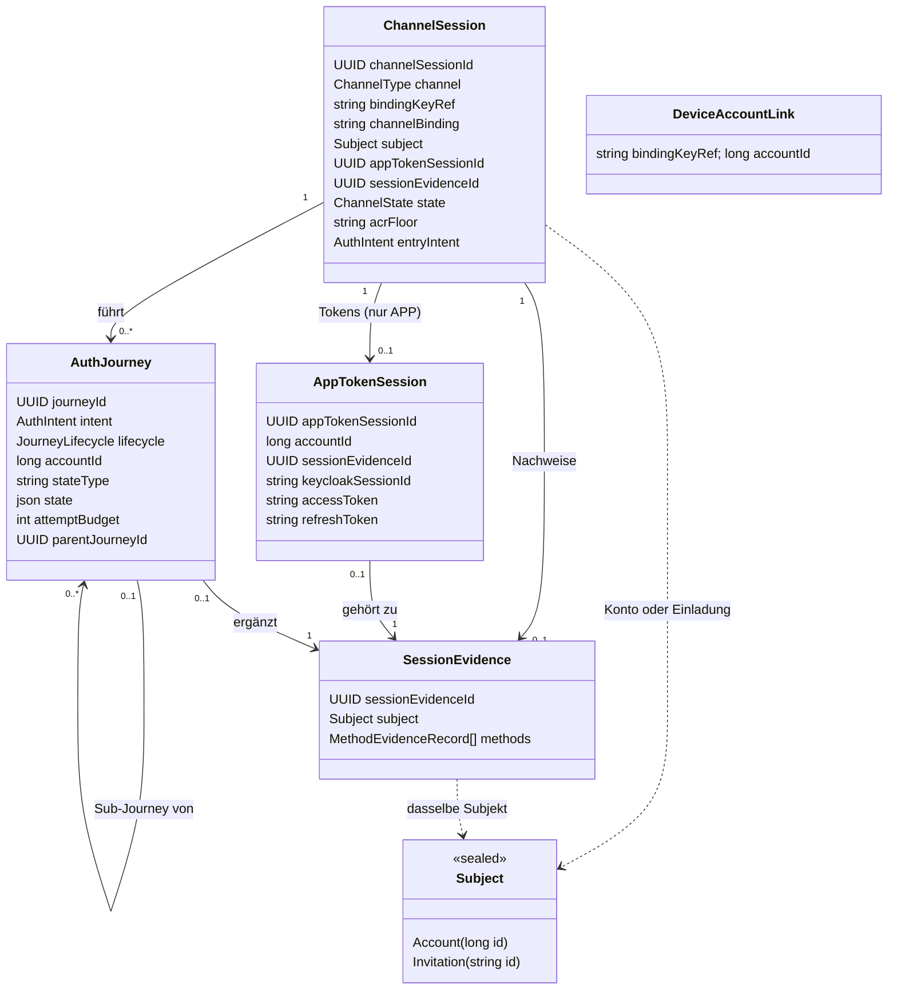
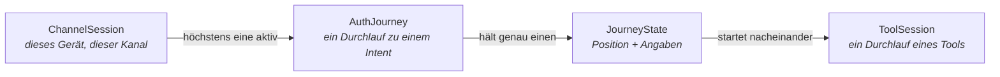
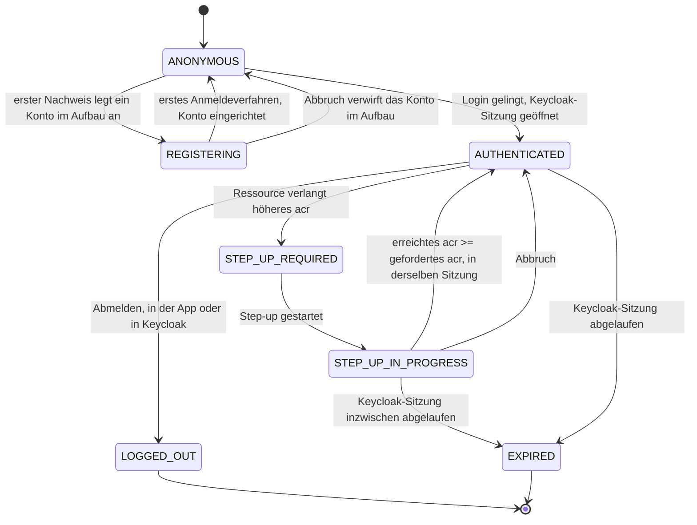
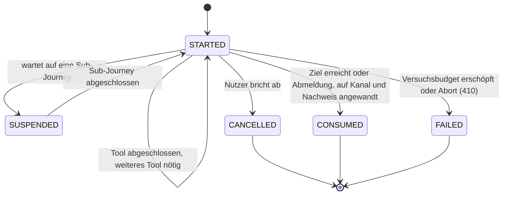
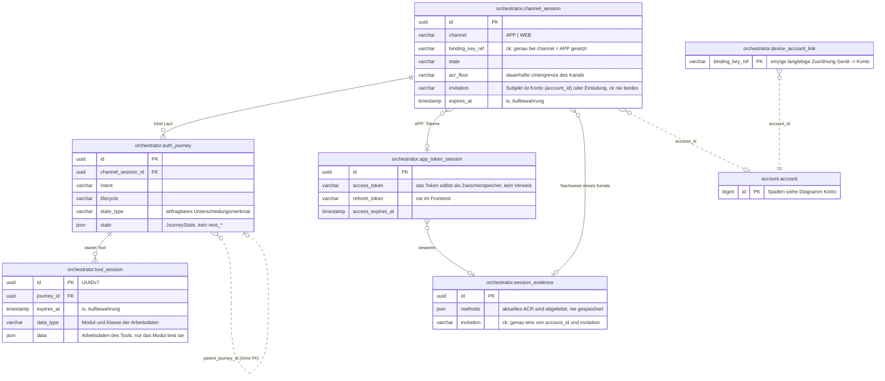

# Domänenmodell

Dieses Kapitel beschreibt die Daten, mit denen der Orchestrator arbeitet. Der **Orchestrator** ist
der Server dieses Projekts: Er entscheidet, welche Schritte ein Nutzer bei Registrierung und
Anmeldung durchläuft. Das Kapitel zeigt die Entitäten des Zielmodells, die Zustände, die sie
annehmen können, und die Regeln, nach denen sie gespeichert werden. Wie die Tools auf diesem Modell
aufsetzen, beschreibt [03-tool-architektur.md](03-tool-architektur.md). Unbekannte Begriffe erklärt
das [Glossar](glossar/glossar.md).

---

## 1) Klassenmodell

Das Modell hat zwei Schwerpunkte: die Sitzung und das Konto.

- Die **Sitzung** führt der Orchestrator. Im Mittelpunkt steht der **Kanal** (`ChannelSession`),
  also die Verbindung eines Nutzers zum Orchestrator über die App oder über die Website. Zum Kanal
  gehören seine Journeys, sein Nachweis und im App-Kanal auch seine Tokens. Eine **Journey** ist ein
  geführter Ablauf mit mehreren Schritten, etwa eine Registrierung. Der **Nachweis** hält fest, was
  der Nutzer in dieser Sitzung schon bewiesen hat.
- Das **Konto** führt das Modul `account`. Dazu gehören die Anker, die Angaben und die
  eingerichteten Anmeldeverfahren (Abschnitt 6). Ein **Anker** ist eine Angabe, über die sich ein
  Konto eindeutig wiederfinden lässt, etwa die Partnernummer.

Sitzung und Konto sind nur über die `accountId` verbunden. Daneben gibt es die
**Geräteverknüpfung**: Sie ordnet ein Gerät dauerhaft einem Konto zu.

### Drei Sitzungsebenen

Der Orchestrator führt drei Ebenen von Sitzungen. Sie sind ineinander geschachtelt: außen die
langlebigste, innen die kurzlebigste.

- **`ChannelSession`** ist der Kanal. Er überdauert einzelne Journeys, lebt aber trotzdem nur kurz.
  Dauerhaft bleibt nur die Geräteverknüpfung. Bei der Anmeldung öffnet der Kanal genau eine
  **Keycloak-Sitzung**. Das ist die Sitzung, die Keycloak für einen angemeldeten Nutzer führt;
  Keycloak ist das Produkt, das die Tokens ausstellt. Von da an lebt der Kanal nicht länger als
  diese Sitzung (Abschnitt 3, „Lebensdauer“).
- **`AuthJourney`** ist ein Durchlauf zu einem Intent, solange er läuft. Ein **Intent** ist das
  Anliegen, mit dem der Nutzer kommt, etwa sich registrieren oder sich anmelden (Abschnitt 3,
  „Lebenszyklus der AuthJourney“).
- **`ToolSession`** ist der Durchlauf eines einzelnen Tools und dauert oft nur Minuten. Ein **Tool**
  ist ein abgeschlossener Arbeitsschritt, etwa „SMS-Code prüfen“. Die `ToolSession` hält nur den
  Lebenszyklus des Durchlaufs. Die Fachdaten, etwa TAN oder Freischaltcode, gehören dem Modul des
  Tools (Abschnitt 7).

### Geräteverknüpfung und Kanalbindung

Die **Geräteverknüpfung** (`DeviceAccountLink`) merkt sich, welches Smartphone zu welchem Konto
gehört. Sie ist bewusst **nicht** Teil einer `ChannelSession`, denn sie soll länger bestehen als
jeder einzelne Kanal. Sie ist die einzige langlebige Zuordnung von Gerät zu Konto
(`bindingKeyRef -> accountId`). Als Anmeldung zählt sie nicht. Sie ist also keine Gerätebindung im
Sinne des externen Glossars. Details stehen in [DPoP-Bindung](09-dpop.md) Abschnitt 3. Die
Geräteverknüpfung gibt es **nur im App-Kanal**. Im Web-Kanal bleibt `bindingKeyRef` `null`.

**Kanalbindung, je Zugang verschieden.** Jede Anfrage an den Orchestrator muss eindeutig einem
Kanal zugeordnet werden. Damit niemand eine Anfrage auf einen fremden Kanal umlenken kann, ist der
Kanal an ein Merkmal gebunden. App und Website nutzen dafür verschiedene Merkmale:

- Die App (`APP`) nutzt `bindingKeyRef`, also den Geräteschlüssel. Dass die App diesen Schlüssel
  besitzt, belegt sie mit jeder Anfrage durch einen **DPoP-Proof**: Das ist ein Beleg, den sie mit
  dem Schlüssel signiert und der nur für diese eine Anfrage gilt.
- Die Website (`WEB`) nutzt `channelBinding`. Das ist immer der eigene `channelSessionId`-Wert
  **dieses** Login-Durchlaufs. Keycloak schickt ihn in der **Peer-Auth-Assertion** mit, also in der
  signierten Anfrage, mit der Keycloak sich beim Orchestrator ausweist.

Für den Web-Kanal ist das bewusst nicht Keycloaks langlebige Sitzung (`UserSessionModel`). Sonst
würden sich zwei **gleichzeitige** Login-Durchläufe derselben SSO-Sitzung dieselbe Bindung teilen.
Die Zugriffsprüfung `ChannelAccessGuard` ([05-api.md](05-api.md) Abschnitt 3b) hat für jede der
beiden Formen der Bindung eine eigene Implementierung. Die Ressource dahinter ist in beiden Fällen
dieselbe, nämlich die `ChannelSession`.

---

## 2) Zustand statt Vererbung

Journeys zu verschiedenen Intents verlaufen unterschiedlich. Man könnte dafür je Intent eine
Unterklasse bilden. Dieses Modell trennt stattdessen die gespeicherten Daten vom Verhalten:

- `AuthJourney` ist eine flache Entity ohne Unterklassen. Was sich je Intent unterscheidet, steht
  im `JourneyState`. Das ist eine abgeschlossene Menge von Zuständen **je Intent**
  ([Orchestrierung](04-orchestrierung.md)). Das Verhalten dazu steht in einer eigenen Strategie je
  Intent (`IntentStrategy`). Die Strategie braucht nämlich Services, die eine JPA-Entity nicht
  halten darf: die Richtlinie für Sicherheitsniveaus (`AuthPolicy`), den `AccountService` und den
  Tool-Katalog.
- Der Orchestrator speichert den Zustand in zwei Teilen: `stateType` ist ein
  Unterscheidungsmerkmal, nach dem sich abfragen lässt. `state` enthält die Attribute als JSON.
- Die laufende Challenge, also die gerade gestellte Aufgabe eines Tools, liegt bewusst **nicht** in
  der `AuthJourney`. Das gewählte Tool steht als `ToolRef` im `JourneyState`. Die Challenge selbst
  kennt ausschließlich das jeweilige Tool-Modul. Diese Regel ist strikt; sie steht in der
  [Tool-Architektur](03-tool-architektur.md).
- Ebenfalls **nicht** gespeichert werden Felder wie `next*`. Den nächsten Schritt (`next`) leitet
  der Orchestrator allein aus dem Zustand ab.

---

## 3) Zustandsdiagramme

### Zustände der ChannelSession

Ein Kanal beginnt anonym, also ohne angemeldeten Nutzer. Das Diagramm zeigt, durch welche
Ereignisse er seinen Zustand wechselt. **acr** ist dabei das Sicherheitsniveau einer Anmeldung
(`loa1` bis `loa3`). Ein **Step-up** heißt: Ein schon angemeldeter Nutzer beweist noch etwas, um ein
höheres Niveau zu erreichen.

**`REGISTERING` ist abgeleitet.** In der Datenbank steht in diesem Fall nur `ANONYMOUS`. Der Kanal
zeigt `REGISTERING` an, solange er mit einem **Konto im Aufbau** arbeitet. Das ist ein Konto, in
dem noch kein Anmeldeverfahren eingerichtet ist ([ADR-46](adr/ADR-046-konto-im-aufbau.md)). Ein
solches Konto findet weder eine Anmeldung noch die Suche von Keycloak. Bricht der Nutzer ab, wird
es ganz verworfen. Mit dem ersten Verfahren ist das Konto eingerichtet, und man kann sich darin
anmelden. Das gilt auch dann, wenn die Registrierung noch Pflichten offen hat, etwa die
Identifizierung beim Weg „Erst Anmeldeverfahren einrichten“. Zurück in den Aufbau führt kein Weg,
denn ein Verfahren wird nur deaktiviert, nie gelöscht (I-28).

**Subjekt: Konto oder Einladung.** Das **Subjekt** ist, wem ein angemeldeter Kanal gehört. Meist
ist das ein Konto. Meldet sich jemand mit einem Einmalkennwort an, gehört der Kanal stattdessen einer
**Einladung** des Personenverzeichnisses (`invitation`,
[ADR-48](adr/ADR-048-vorgangszugang-mit-einmalkennwort.md)). Eine Einladung steht für eine Person
und einen bestimmten Vorgang, ohne Konto. Ein Kanal gehört nie beiden zugleich. Der Nachweis der
Sitzung gehört immer demselben Subjekt wie der Kanal. Im Code ist das Subjekt ein Sealed-Typ
(`ChannelSession.subject`, `SessionEvidenceRecord.subject`: `Subject.Account` oder
`Subject.Invitation`). Die Datenbank speichert es in zwei Spalten. Eine Prüfregel der Datenbank
lässt höchstens eine der beiden Spalten gefüllt zu.

**Lebensdauer.** Bis zur Anmeldung gilt für den Kanal eine feste Frist: in der App 24 Stunden, im
Web ein Anmeldedurchlauf von 30 Minuten. Mit dem Wechsel nach `AUTHENTICATED` öffnet der Kanal
genau eine Keycloak-Sitzung. Im Standardprofil, also ohne echtes Keycloak, ist das eine simulierte
Sitzung. Ab dann ist `expiresAt` das Sitzungsfenster, das Keycloak meldet. Es ergibt sich aus den
Einstellungen „SSO idle“ und „SSO max“ des Realms; ein **Realm** ist ein abgeschlossener Bereich in
Keycloak mit eigenen Einstellungen. Der Kanal lebt also nie länger als seine Sitzung, und eine
zweite Sitzung bekommt er nicht
([ADR-43](adr/ADR-043-kanal-lebt-nicht-laenger-als-die-keycloak-sitzung.md)). Im App-Kanal verlängert
jede Erneuerung des Tokens das Fenster, auch eine Erneuerung während eines Schritts in einer
Journey. Lehnt Keycloak die Sitzung ab, bleibt der Kanal in seinem bisherigen Zustand. Wer die
Sitzungsdauer ändern will, ändert sie im Realm, nicht im Orchestrator. Die Fristen des Realms nennt
[07-betrieb.md](07-betrieb.md) Abschnitt 3.

### Lebenszyklus der AuthJourney

Der Lebenszyklus sagt nur, **ob** die Journey noch läuft. Wo sie gerade steht, sagt der
`JourneyState` des jeweiligen Intents ([Orchestrierung](04-orchestrierung.md)). Die Schritte
innerhalb eines Tools verwaltet das Modul des Tools selbst.

Eine **Sub-Journey** ist eine Journey, die eine andere unterbricht. Währenddessen wartet die
unterbrochene Journey im Zustand `SUSPENDED`. Das **Versuchsbudget** ist die Zahl der Fehlversuche,
die ein Nutzer in einer Journey insgesamt hat.

`SUCCEEDED` und `EXPIRED` stehen noch im Enum, werden aber nie gesetzt. Eine erfolgreiche Journey
wechselt direkt auf `CONSUMED` (`AuthJourney.consume()`). Ob eine Journey abgelaufen ist, prüft der
Orchestrator nur beim Lesen (`AuthJourney.isExpired`, anhand von `expiresAt`). Eine abgelaufene
Journey gilt dann als nicht mehr aktiv, ohne dass ihr gespeicherter Zustand geändert wird.

---

## 4) Aufzählungstypen

Die folgenden Aufzählungstypen kommen im Modell immer wieder vor:

- `ChannelType`: `APP`, `WEB`. Der Typ sagt, über welchen Zugang der Kanal geöffnet wurde. Das
  bleibt für die ganze Lebenszeit des Kanals fest ([05-api.md](05-api.md) Abschnitt 3).
- `ChannelState`: `ANONYMOUS`, `REGISTERING`, `AUTHENTICATED`, `STEP_UP_REQUIRED`,
  `STEP_UP_IN_PROGRESS`, `LOGGED_OUT`, `EXPIRED`. Das sind die Zustände des Kanals aus Abschnitt 3.
- `AuthIntent`: `FAST_ACCESS`, `REGISTER`, `LOOKUP_LOGIN`, `WEB_SELECT_METHOD`, `STEP_UP`,
  `MANAGE_AUTH_METHODS`, `CONFIRM_PEER_LOGIN`, `DELETE_ACCOUNT`, `LOGOUT`, `RE_IDENTIFY`. Ein
  Intent beschreibt, was der Nutzer erreichen will, *und* den Weg dorthin
  ([Orchestrierung](04-orchestrierung.md) Abschnitt 2). `DELETE_ACCOUNT` und `MANAGE_AUTH_METHODS`
  setzen einen Kanal voraus, der schon `AUTHENTICATED` ist. Was das Löschen verlangt, steht in
  [journeys/delete-account.md](journeys/delete-account.md).
- `JourneyLifecycle`: `STARTED`, `SUSPENDED`, `SUCCEEDED`, `FAILED`, `CANCELLED`, `EXPIRED`,
  `CONSUMED`. Das ist der Lebenszyklus der Journey aus Abschnitt 3.
- `ToolRole`: `IDENTIFICATION`, `CORRELATION`, `ENROLLMENT`, `KNOWN_ACCOUNT_AUTH`,
  `ACCOUNT_LOOKUP_AUTH`, `PEER_APPROVAL`, `ATTESTATION`. Die Rolle sagt, was ein Tool fachlich tut.
  Das Modul des Tools gibt sie selbst an. `PEER_APPROVAL` bestätigt eine Anfrage auf einem anderen
  Kanal. Zum Nachweis des eigenen Kanals zählt das nicht. `ATTESTATION` bestätigt ein Attribut, das
  dem Konto gehört, etwa die E-Mail-Adresse. Auch das erhöht das Niveau nicht
  ([Tool-Architektur](03-tool-architektur.md)).
- `FactorType`: `KNOWLEDGE`, `POSSESSION`, `INHERENCE`. Das sind die Arten eines Beweises: etwas,
  das man weiß, etwas, das man hat, und etwas, das man ist (etwa ein Fingerabdruck). Auch den
  Faktortyp gibt das Modul selbst an. Damit prüft der Orchestrator, ob verschiedene Faktortypen
  vorliegen ([Orchestrierung](04-orchestrierung.md)).

---

## 5) Regeln fürs Speichern

Dieser Abschnitt sammelt die Regeln dafür, was der Orchestrator speichert und was er bei Bedarf
berechnet.

- `ChannelSession.channelSessionId` ist eine stabile technische Referenz ohne Bedeutung nach außen.
  App und Web kennen nur diese Referenz.
- Das Routing, also der Weg zum nächsten Schritt, wird **nicht** gespeichert. Den nächsten Schritt
  (`next`) leitet der Orchestrator aus dem `JourneyState` ab
  ([Orchestrierung](04-orchestrierung.md) Abschnitt 6). Die Daten für den Bildschirm (`stepData`)
  baut der jeweilige Handler aus dem Zustand seines Verfahrens auf.
- `accountId` kommt an zwei Stellen vor, mit klar getrennten Aufgaben. `AuthJourney.accountId` wird
  ermittelt, während die Journey läuft. `ChannelSession.accountId` übernimmt diesen Wert erst nach
  erfolgreichem Abschluss und gilt nur für diesen Kanal. Die langlebige Zuordnung von Gerät zu Konto
  steht in `DeviceAccountLink` ([DPoP-Bindung](09-dpop.md) Abschnitt 3).
- Eine `ChannelSession` lebt nur kurz (zur Aufbewahrung siehe [Betrieb](07-betrieb.md)). Der
  Orchestrator sucht sie **nie** über `bindingKeyRef` und verwendet sie nie wieder. Um einen Kanal
  fortzusetzen, braucht der Client die `channelSessionId`, die er sich gemerkt hat (`GET`). Ein
  Einstieg ohne bekannte ID legt immer eine neue `ChannelSession` an. Ein registriertes Gerät kommt
  über `DeviceAccountLink` trotzdem direkt auf den passenden Weg zur Anmeldung.
- Der Nachweis einer Sitzung steht in `SessionEvidence`, nicht in der `AppTokenSession`. Die
  `AppTokenSession` verwaltet nur zwei Dinge: die Tokens des App-Kanals und die Id seiner einen
  Keycloak-Sitzung (`keycloakSessionId`). Diese Id wird einmal gesetzt und nie ersetzt
  ([ADR-43](adr/ADR-043-kanal-lebt-nicht-laenger-als-die-keycloak-sitzung.md)).
- Im Nachweis gibt es je Verfahren einen Eintrag in `methods`. Er hält den Namen des Verfahrens
  (`method`), das Niveau und die Faktortypen fest. `currentAmr` und `currentFactorTypes` sind
  Sichten darauf. **`amr`** ist die Liste der Verfahren, mit denen sich der Nutzer in der Sitzung
  angemeldet hat. Die Faktortypen stehen im Eintrag selbst und werden nicht aus dem `amr`-Namen
  abgeleitet, denn `amr`-Werte benennen Verfahren, nicht Faktortypen. Das aktuelle Niveau wird nie
  gespeichert. Der Orchestrator berechnet es bei Bedarf aus dem Nachweis.
- `ChannelSession.acrFloor` ist die dauerhafte Untergrenze des Niveaus für diesen Kanal und wird
  mit ihm gespeichert. Das Ziel eines Step-up (`StepUpState.targetAcr`) steht dagegen im
  `JourneyState`. Wie beide zusammenwirken und warum ein vom Client genanntes Niveau nur eine
  Untergrenze ist, steht in [04-orchestrierung.md](04-orchestrierung.md) Abschnitt 4, „Untergrenze
  des Kanals und Ziel eines Durchlaufs“.

---

## 6) Konto-Identität: Claims, Anker, Konsolidierung

Dieser Abschnitt beschreibt, wie das Konto seine Identität speichert. Zwei Begriffe stehen im
Mittelpunkt:

- Ein **Claim** (deutsch: eine **Angabe**) ist eine Information über den Kontoinhaber, etwa Name
  oder E-Mail-Adresse.
- Ein **Anker** ist eine Angabe, über die sich ein Konto eindeutig wiederfinden lässt. Derselbe
  Wert kann nie zu zwei Konten gehören.

Einige ähnlich klingende Namen bleiben bewusst getrennt, weil für sie unterschiedliche Regeln
gelten:

- `personId` ist die Partnernummer, nicht die `accountId`.
- `Claim`, `ClaimDeclaration` und `ClaimRequirement` bezeichnen drei verschiedene Dinge: ein
  Ergebnis, eine zugesicherte Fähigkeit eines Tools und eine Voraussetzung.
- `AcrLevel`, `EvidenceAxis`, `FactorType`, `acrFloor` und `targetAcr` gehören zu verschiedenen
  Sicherheitsregeln.
- `ClaimSource` ist die Quelle einer Angabe. `AmrSource` sagt, woher ein Nachweis der Sitzung
  kommt. Beide haben unterschiedliche Werte.

Die Entscheidungen dazu stehen in [12-entscheidungen.md](12-entscheidungen.md) (ADR-10, ADR-11,
ADR-12, ADR-19) und in `db/migration/KONVENTIONEN.md`. Die Begriffe erklärt das
[Glossar](glossar/glossar.md). Konten zusammenzuführen ist eine zurückgestellte Verbesserung
([offene-befunde.md](offene-befunde.md) Abschnitt 8).

### Konto und Anker

- `Account` enthält nur die Identität des Kontos (`id`, `createdAt`, `version`). Über diese Zeile
  sperrt der Orchestrator das Konto, während er es ändert. Der aktuelle Zustand des Kontos steht in
  eigenen Zeilen je Konto (`AccountAnchor`, `AccountAuthMethod`). Jede Änderung daran lädt die
  Kontozeile mit `OPTIMISTIC_FORCE_INCREMENT` und erhöht so ihre Version. Schreiben zwei Vorgänge
  gleichzeitig, bekommt der zweite den Fehler `409 CONCURRENT_MODIFICATION`. Die Historie
  (`AccountClaim` und die Einträge `IDENTIFIED` im Änderungsprotokoll, `ChangeLogEntry`) wird nur
  ergänzt und erhöht die Version nie.
- `AccountProfile` ist die typisierte Sicht zum Lesen. Drei Werte darin kommen aus den Ankern, nicht
  aus eigenen Spalten: `personId` (die Partnernummer, optional,
  [12-entscheidungen.md](12-entscheidungen.md) ADR-10/ADR-34) sowie `email` und
  `emailConfirmedAt`. Was sich ändern darf, legt `AnchorRule.allowsReplacement` fest: `email` ja,
  `personId` nach der ersten Bindung nicht mehr. Daraus folgen zwei Regeln. Jede hat genau an einer
  Stelle einen Namen, statt als Bedingung an mehreren Stellen im Code zu stehen:
  - `isUnidentified`: Das Konto hat keine PersonId und darf deshalb eine Identität annehmen. Das
    entspricht zugleich der Rolle Interessent (ADR-34).
  - `isDisposable` (verwerfbar): Das Konto hat keine PersonId, und außerdem wurde in ihm nie ein
    Anmeldeverfahren eingerichtet. Deaktivierte Verfahren zählen dabei mit. Ein solches Konto darf
    gelöscht oder mit einem anderen zusammengeführt werden (ADR-20).
- `AccountAuthMethod` ist ein eingerichtetes Verfahren eines Kontos (`method`,
  `active`/`deactivatedAt`, `enrolledUnderAcr`, `label`, `details`). Ein **Credential** ist dabei
  das, womit sich der Nutzer bei diesem Verfahren ausweist, etwa eine hinterlegte Telefonnummer oder
  ein Schlüssel. Der Verweis auf das Credential (`EnrollmentRef`) steht in zwei echten Spalten
  (`enrollment_type`, `enrollment_id`). Das ist die einzige Stelle, an der Konto und Credential
  verknüpft sind. Die Zeile mit dem Credential selbst gehört dem Tool-Modul. Deaktivierte Einträge
  bleiben stehen. Das Verfahren `email` hat kein eigenes Credential im Modul. Sein Verweis zeigt auf
  den EMAIL-Anker (`EMAIL_ANCHOR_ENROLLMENT`).
- Das Änderungsprotokoll (`account.change_log`,
  [ADR-39](adr/ADR-039-was-eine-kontoloeschung-ueberlebt.md)) hält jede Identifizierung fest
  (Ereignis `IDENTIFIED`). Gespeichert werden Verfahren, erreichtes Niveau (LoA), Rolle, Zeitpunkt
  und die Referenz beim Anbieter ([06-ablaeufe.md](06-ablaeufe.md) Abschnitt 1). Außerdem hält es
  Widerrufe, Änderungen an Anmeldeverfahren und die Löschung fest. Für Entscheidungen liest der
  Orchestrator das Protokoll nie. Es bleibt auch nach der Löschung des Kontos erhalten.
- Einen Anker zu schreiben **verlangt** ein Mindestniveau. `AnchorRule.acrFloor` legt je
  Attributtyp fest, welches Niveau die *erste Bindung* (`establish`) mindestens voraussetzt und
  welches das *Ersetzen* (`replace`). Die einzelnen Attributtypen:
  - `EMAIL` lässt sich schon bei `loa1` binden, aber erst ab `loa2` ersetzen.
  - `PERSON_ID` verlangt schon für die erste Bindung `loa2`. Vorrangig gilt hier aber
    `allowsReplacement = false`: Die Partnernummer lässt sich gar nicht ersetzen.
  - `MEMBER_NUMBER` und die beiden Kartenpseudonyme lassen sich ab `loa2` binden und ersetzen,
    etwa bei einer neuen Mitgliedsnummer oder einer neuen Karte.

  Ein **Kartenpseudonym** ist eine Kennung, die an die Ausweiskarte gebunden ist. Das Pseudonym des
  Online-Ausweises ist für jeden Diensteanbieter verschieden (§ 18 PAuswG).
  Liest `ident-eid` die Karte, entsteht unser Pseudonym (`EID_RESTRICTED_ID`).
  Liest Nect sie, entsteht das Pseudonym von Nect (`NECT_RESTRICTED_ID`).
  Deshalb sind es zwei Anker, und keiner überschreibt den anderen.
  Geprüft wird das Mindestniveau an der einzigen Stelle, die Anker schreibt (`AnchorRegistry.bind`,
  die Regel steht in `AnchorDecision`). Liegt das Niveau der Sitzung darunter, weist der
  Orchestrator den Schreibversuch ab (`409`).
- `account.anchor.established_acr` ist das Gegenstück zu `account.auth_method.enrolled_under_acr`.
  Es hält das **tatsächlich nachgewiesene** Niveau fest, begrenzt nach ADR-5.
- `AccountAnchor` ordnet die lokal geführten Attribute einem Konto zu. Lokal geführt
  (`AttributeAuthority.Local`) sind `PERSON_ID`, `MEMBER_NUMBER`, `EID_RESTRICTED_ID`,
  `NECT_RESTRICTED_ID` und `EMAIL`. `AccountAnchor` sorgt dafür, dass jeder Wert eindeutig ist, und
  ist zugleich der einzige Speicherort dieser Attribute. Zwei Eindeutigkeitsregeln der Datenbank
  stützen das:
  - `UNIQUE(attribute_type, normalized_value)` macht `resolveByAnchor` zu einem einfachen
    Nachschlagen.
  - `UNIQUE(account_id, attribute_type)` erzwingt höchstens einen aktuellen Wert je Konto und
    Attributtyp.

  KVNR und Partnernummer löst der Orchestrator ausschließlich live über das Personenverzeichnis
  (`personenverzeichnis`, `findPersonIdByKvnr`/`findPersonIdByPartnerNumber`) zur PersonId auf und
  kommt so zum lokalen PersonId-Anker. Ein Anker, der schon einem anderen Konto gehört, wird
  abgewiesen ([12-entscheidungen.md](12-entscheidungen.md) ADR-11). Ändert das
  Personenverzeichnis KVNR oder Mitgliedsnummer, meldet es das per Event. Das Konto aktualisiert
  dann den Claim beziehungsweise den `MEMBER_NUMBER`-Anker (ADR-34).

### Angaben, Quellen und Stufen

- `AccountClaim` protokolliert die Herkunft jeder *Änderung* einer Angabe. Gespeichert werden der
  Attributtyp (`AttributeType`), der Wert, die Quelle (Spalte `claim_source`, im Code `ClaimSource`)
  und das Niveau (`AcrLevel`). Einträge werden nur ergänzt, nie geändert. Protokolliert werden
  Änderungen, nicht Durchläufe: Gilt eine Angabe schon genau so (gleicher Typ, Wert, Quelle und
  Verfahren), schreibt der Orchestrator sie nicht noch einmal. Ein eID-Lauf mit unveränderter Karte
  erzeugt also keine sieben neuen Zeilen. Der Wert liegt verschlüsselt (`claim_value`), unter dem
  Datenschlüssel seiner Gruppe (`claim_batch_id`, Tabelle `account.claim_batch_key`). Gleichheit
  prüft das System über `value_digest`, einen HMAC des normalisierten Werts unter dem
  Hauptschlüssel des Kontos (`normalizeClaimValue`, [ADR-52](adr/ADR-052-umschlagverschluesselung-des-claim-logs.md)).
  Das [externe Glossar](glossar/externes-glossar.md) nennt diese Claims **bescheinigte Attribute**,
  sobald ein Identifizierungsverfahren oder das Personenverzeichnis ihre Richtigkeit bestätigt. Was
  nur der Nutzer selbst angibt (`SELF_REPORTED`), bleibt unbescheinigt.

  Die **Quelle** sagt, wer die Richtigkeit eines Werts bestätigt. Es gibt drei Arten von Quellen:
  - das Personenverzeichnis (`PERSON_DIRECTORY`, in der Datenbank `person_directory`),
  - ein Verfahren selbst (`ClaimSource(toolId.value)`, z. B. `ident-eid`),
  - der Nutzer (`SELF_REPORTED`).

  Aus der Quelle folgt die **Stufe** der Angabe (`ClaimTrust`), also wie verlässlich sie ist. Die
  Stufen in ihrer Rangfolge:
  - *belegt* (`AUTHORITATIVE`): stammt aus den Stammdaten,
  - *nachgewiesen* (`PROVEN`): ein Verfahren hat den Wert geprüft,
  - *behauptet* (`SELF_REPORTED`): nur der Nutzer hat ihn eingegeben.

  Gibt es für ein Attribut mehr als einen Wert, entscheidet zuerst die Stufe, dann die Zeit.
- Wem ein Attribut gehört, ist im Code deklariert. `AttributeType.authority`
  (`tool_api/claims/AttributeType.kt`) kennt drei Fälle:
  - `Local` (`PERSON_ID`, `MEMBER_NUMBER`, `EID_RESTRICTED_ID`, `NECT_RESTRICTED_ID`, `EMAIL`): Der
    Wert liegt im Konto, in `account.anchor`. Für diese Attribute gelten damit auch die Regeln für
    Anker.
  - `PersonDirectory` (`KVNR`, `FAMILY_NAME`, `GIVEN_NAMES`, `BIRTH_DATE`, `STREET_ADDRESS` (Straße
    mit Hausnummer), `POSTAL_CODE`, `LOCALITY`): Der Orchestrator liest den Wert live über
    `PersonDirectory`. Im Konto steht nur die Historie der Claims.
  - `MethodModule` (`PHONE_NUMBER`, `PASSWORD_EXISTS`): Der Wert steht in der Enrollment-Zeile des
    Tool-Moduls, also in der Zeile, die das eingerichtete Verfahren beschreibt.

  `AnchorRule.bindingStrength` sagt zusätzlich, wie eindeutig ein Treffer auf einem Anker eine
  Identität festlegt.

### Widerruf

- Ein **Widerruf** (`AccountRetraction`, Tabelle `account.retraction`) macht einen Wert ungültig.
  Jede Widerrufszeile nennt, wer widerruft (`RetractionSource`: `ACCOUNT_MANAGEMENT`,
  `ACCOUNT_HOLDER`, `PERSON_DIRECTORY`, `OPERATOR`, `RETENTION_POLICY`), dazu den Grund und den
  Zeitpunkt ([12-entscheidungen.md](12-entscheidungen.md) ADR-12). Den Wert nennt sie nur als
  `value_digest`, nie im Klartext (ADR-52). „Aktuell gültig“ heißt: alle Angaben abzüglich der
  Widerrufe. Maßgeblich ist die Zeit: Ein Widerruf macht nur Angaben ungültig, die vor ihm
  geschrieben wurden. Wird ein Wert danach neu bestätigt, gilt er wieder. Gilt nach einem Widerruf
  keine Angabe einer Gruppe mehr, löscht der Orchestrator ihren Datenschlüssel. Die Werte sind dann
  dauerhaft unlesbar, die Zeilen bleiben als Metadaten. Es gibt fünf Auslöser für einen Widerruf:
  - Wird ein Verfahren entfernt, nimmt der Orchestrator über `auth_method_id` die Angaben dieses
    Verfahrens zurück. Das betrifft nur die Angaben mit `AttributeAuthority.MethodModule`.
  - Wird ein Anker durch einen neuen Wert ersetzt, widerruft der Orchestrator den alten Wert
    (`ACCOUNT_MANAGEMENT`, Grund „anker-ersetzt“). So stimmen Protokoll und Anker überein.
  - Ein Attribut lässt sich **direkt** zurücknehmen (ADR-24, `AccountService.retractAttribute`,
    Grund „attribute withdrawn“). Dabei wird auch die Zeile des Ankers gelöscht.
  - Das Personenverzeichnis meldet per `PersonChanged` eine neue oder entfernte KVNR oder
    Mitgliedsnummer. Dann widerruft `AccountService.applyDirectoryChange` den alten Wert
    (`PERSON_DIRECTORY`) und schreibt den neuen, falls es einen gibt (ADR-34).
  - Die Aufbewahrungsfrist eines Attributs läuft ab (`account.claims.retention`,
    [07-betrieb.md](07-betrieb.md) Abschnitt 3). `ClaimBatchKeyRetention` widerruft die Angaben der
    Gruppe (`RETENTION_POLICY`) und löscht ihren Datenschlüssel in derselben Transaktion. Dieser
    Widerruf nennt seine Gruppe und trifft nur deren Zeilen.

  Eine bestätigte E-Mail-Adresse geht nur durch den direkten Widerruf verloren. Dafür gibt es zwei
  Gründe: `confirm-email` schreibt seine Angabe als Bestätigung (`ATTESTATION`), also ganz ohne
  `auth_method_id`. Und die E-Mail-Adresse gehört ohnehin dem Konto selbst. Deshalb betrifft der
  Widerruf eines Verfahrens sie nie.

### Kennungen des Personenverzeichnisses und Rollen

Das **Personenverzeichnis** ist ein Fremdsystem mit den Stammdaten der Versicherung. Es führt jede
Person unter mehreren Kennungen. Aus diesen Kennungen ergibt sich auch die Rolle eines Kontos.

- **Kennungen einer Person** im Personenverzeichnis (ADR-34):
  - **Partnernummer**: `P` und neun Ziffern. Sie wird zufällig vergeben und ändert sich nie. Im
    Konto ist sie der Anker `PERSON_ID`.
  - **Mitgliedsnummer** (auch Versicherungsnummer genannt): acht Ziffern. Sie gibt es nur für
    Versicherte. Sie lässt sich ändern und entfernen. Im Konto ist sie der Anker `MEMBER_NUMBER`.
  - **KVNR** (Krankenversichertennummer): Sie gibt es nur zusammen mit einer Mitgliedsnummer. Sie
    lässt sich ändern und darf zeitweise fehlen. Im Konto ist sie ein Claim; es gilt der jüngste.
    Fachlich bleibt der unveränderbare Teil einer KVNR ein Leben lang gleich. Änderbar ist sie
    trotzdem, weil es Klärungsfälle gibt, in denen eine KVNR doppelt vergeben wurde.

  Außerdem speichert das Verzeichnis je Person E-Mail-Adresse und Mobilnummer. Das Konto hat davon
  getrennt eigene Werte: die Claims EMAIL und PHONE_NUMBER. Sie entstehen erst, wenn der Nutzer sie
  per Code oder TAN bestätigt. Die Werte im Verzeichnis und im Konto haben also verschiedene Herkunft
  und können voneinander abweichen. Deshalb meldet das Verzeichnis eine Änderung dieser Werte nicht.
- **Drei Rollen** ergeben sich aus den Ankern. Ein eigenes Statusfeld gibt es dafür nicht (ADR-34):
  - **Versicherter**: Das Konto gehört zu einer Person mit Mitgliedsnummer (`MEMBER_NUMBER`-Anker).
  - **Partner**: Eine Person ist zugeordnet (`PERSON_ID`, die Partnernummer), aber ohne
    Mitgliedsnummer.
  - **Interessent**: Es ist keine Person zugeordnet.

  Die App leitet die angezeigte Rolle aus den Claims `personId` und `versnr` im ID-Token ab. Diese
  Werte kommen live aus dem Personenverzeichnis. Das Personenverzeichnis sichert die Grundlage mit
  zwei Regeln in seinem Datenbankschema ab: Eine KVNR gibt es nur zusammen mit einer
  Mitgliedsnummer (`ck_person_kvnr_nur_versichert`). Und jede Mitgliedsnummer gibt es nur einmal
  (`ux_person_versnr`). Die Anwendung fragt das Personenverzeichnis über den **Port**
  `PersonDirectory` ab, also über eine fest vereinbarte Schnittstelle. Der Port bietet diese
  Funktionen: `findPersonIdByKvnr`, `findPersonIdByPartnerNumber`, `memberNumberOf`,
  `matchesMasterData`, `matchesPersonalDetails`, `hasNamesake` und `displayName`.

### Auflösung über Anker

Nach einer Identifizierung muss der Orchestrator wissen, ob die festgestellte Person schon ein Konto
hat. Diese Frage beantwortet er nur über Anker.

- `IdentityMatchingService.resolve` beantwortet die Frage „Gehört diese bestätigte Identität zu
  einem bestehenden Konto?“ **ausschließlich über Anker** (ADR-19). `resolveByAnchor` prüft die
  Anker-Claims in der Reihenfolge ihrer `AnchorRule.bindingStrength`. Gibt es keinen Treffer, ist
  das Ergebnis `Unresolved`. Kombinationen von Attributen aus der Claim-Historie nutzt der
  Orchestrator für diese Suche nicht. Name, Vorname und Geburtsdatum dienen nur dem Abgleich mit
  dem Personenverzeichnis (`personenverzeichnis`). Das geschieht an zwei Stellen: in `ident-fsc`
  selbst (`matchesPersonalDetails`) und bevor der Anker einer Zuordnung geschrieben wird
  (`attestedIdentityMatches`).

---

## 7) Tabellenmodell

Dieser Abschnitt zeigt, wie das Modell in der Datenbank abgelegt ist. Das Schema steht in
`src/main/resources/db/migration/<modul>/`, ein Verzeichnis je Modul. Die Konventionen dazu stehen in
[`db/migration/KONVENTIONEN.md`](../src/main/resources/db/migration/KONVENTIONEN.md) und
[12-entscheidungen.md](12-entscheidungen.md) ADR-14/ADR-16. Die Diagramme zeigen die wichtigsten
Tabellen mit ihren identifizierenden Spalten, nicht jede Spalte. Jedes Modul hat ein eigenes
Datenbankschema. Der vollständige Tabellenname nennt deshalb immer das Modul, dem die Tabelle gehört,
etwa `account.anchor` ([12-entscheidungen.md](12-entscheidungen.md) ADR-16).

**Linienarten:** Eine durchgezogene Linie ist ein echter Fremdschlüssel. Solche gibt es
ausschließlich **innerhalb** eines Schemas. Eine gestrichelte Linie ist ein Bezug über
Schemagrenzen hinweg: eine Spalte mit Index, aber ohne Constraint. Solche Bezüge räumt nie die
Datenbank per Kaskade auf. Das erledigt immer die API des Moduls, dem die Daten gehören
(`EnrollmentCleanup`, `AccountDeletionService`).

### Konto

```mermaid
erDiagram
  account.account ||--o{ account.anchor : "hat aktuellen Ankerwert"
  account.account ||--o{ account.auth_method : "hat eingerichtetes Verfahren"
  account.account ||--o{ account.claim : "bestätigt (nur anfügen)"
  account.account ||--o{ account.change_log : "Änderungen (nur anfügen, ohne FK)"
  account.account ||--o{ account.sign_in_log : "Anmeldungen (geht mit dem Konto)"
  account.account ||--o{ account.retraction : "widerruft (nur anfügen)"
  account.auth_method }o..o| auth_sms.enrollment : "enrollment_type/_id"
  account.auth_method }o..o| auth_device.enrollment : "enrollment_type/_id"
  account.anchor }o..o| PERSON : "PERSON_ID-/MEMBER_NUMBER-Anker"

  account.account {
    bigint id PK "Identität des Kontos; hier wird für Änderungen gesperrt"
    bigint version "OPTIMISTIC_FORCE_INCREMENT je Zustandsänderung"
  }
  account.anchor {
    bigint account_id FK
    varchar attribute_type UK "ux(account_id, attribute_type)"
    varchar normalized_value UK "ux(attribute_type, normalized_value)"
    varchar established_acr "tatsächlich nachgewiesenes Niveau, begrenzt"
  }
  account.auth_method {
    uuid id PK "adressiert von DELETE .../methods/{id}"
    bigint account_id FK
    varchar method
    varchar enrollment_type "= Name der Credential-Tabelle"
    varchar enrollment_id
    boolean active "ck: active = (deactivated_at IS NULL)"
  }
  account.claim {
    bigint account_id FK
    varchar attribute_type
    varchar claim_value "wie bezeugt"
    varchar normalized_value "Normalform (@PrePersist)"
    varchar claim_source "z.B. person_directory, ident-eid"
    uuid auth_method_id "ix; von welchem Verfahren die Angabe stammt"
    varchar established_acr
  }
  account.retraction {
    bigint account_id FK
    varchar attribute_type
    varchar normalized_value "macht passende Claims ungültig"
    varchar claim_source "wer widerruft"
  }
  account.change_log {
    bigint account_id "kein FK - bleibt nach Löschung des Kontos erhalten"
    varchar change_type "IDENTIFIED, METHOD_ADDED, ..."
    varchar subject "Verfahren oder Attributtyp"
    varchar acr
    json details "type, version und je Ereignis eigene Schlüssel"
    varchar lookup_key "HMAC über Name, Vorname, Geburtsdatum"
    varchar person_id "Registernummer, falls vorhanden"
  }
  account.sign_in_log {
    bigint account_id FK "geht mit dem Konto"
    varchar invitation "ck: genau eins von account_id und invitation"
    varchar sign_in_type "SIGNED_IN, SIGN_IN_FAILED, LOCKED_OUT, ..."
    varchar channel
    varchar acr
    json details "type, version, amr, Verfahren, ..."
  }
  auth_sms.enrollment {
    bigint id PK
    varchar phone_number
  }
  auth_device.enrollment {
    bigint id PK
    varchar thumbprint UK
  }
  PERSON["Person (Fremdsystem)"] {
    string partnernummer "Partnernummer"
    string mitgliedsnummer "nur Versicherte"
    string kvnr "nur mit Mitgliedsnummer"
  }
```

Die Person gehört dem Personenverzeichnis, einem Fremdsystem. Der Orchestrator erreicht sie nur über
Ports ([port-vertraege.md](port-vertraege.md)). Die Tabellen des simulierten Verzeichnisses zeigt
[08-projektrahmen.md](08-projektrahmen.md) Abschnitt 3, „Simulierte Fremdsysteme“.

Die Tabelle `account.account` selbst enthält keine fachlichen Daten. Partnernummer (`PERSON_ID`),
Mitgliedsnummer (`MEMBER_NUMBER`), die Kartenpseudonyme und die E-Mail-Adresse stehen als Anker in
`account.anchor`. Die Liste der Verfahren steht in `account.auth_method` (Abschnitt 6).

Die Credential-Tabellen der Tool-Module (hier als Beispiele `auth_sms.enrollment` und
`auth_device.enrollment`) haben bewusst **keine** `account_id`. Der Grund: Ihre Zeilen entstehen im
Tool-Handler, bevor die Orchestrierung das Konto kennt. Die einzige Verknüpfung ist
`account.auth_method.enrollment_type/enrollment_id`. Aus demselben Grund hat `auth_email` keine
eigene Credential-Tabelle: Das Credential *ist* der EMAIL-Anker.

### Orchestrierung und Arbeitsdaten der Tools

`orchestrator.session_evidence` und `orchestrator.app_token_session` sind getrennte Tabellen. Dafür
gibt es zwei Gründe. Erstens hat jeder Kanal Nachweise, aber nur der App-Kanal hat Tokens beim
Orchestrator; der Web-Kanal legt nie eine `AppTokenSession` an. Zweitens sind die Nachweise die
maßgebliche Grundlage, mit der die Richtlinie für Sicherheitsniveaus (`AuthPolicy`) rechnet. Das
Token ist nur eine daraus ausgestellte Kopie, die man verwerfen kann
([12-entscheidungen.md](12-entscheidungen.md) ADR-15).

Die Arbeitsdaten eines Tools haben keine eigene Tabelle. Das Tool speichert sie über
`ToolSessionData`. Sie liegen als JSON in der Zeile seiner `orchestrator.tool_session`
([ADR-49](adr/ADR-049-arbeitsdaten-der-tools-am-orchestrator.md)). Sie bilden also keine vierte
Sitzungsebene, und sie werden mit der Zeile gelöscht. Was dauerhaft bleiben soll, legt ein
Tool-Modul in sein eigenes Schema, vor allem in die langlebige Tabelle `<modul>.enrollment`. Die
Tabellen eines Moduls stehen in seiner Migration unter `db/migration/<modul>/`.

Einige Tabellen fehlen im Diagramm, weil sie keine Beziehungen zu anderen Tabellen haben:

- `orchestrator.journey_trace`: Die Sitzungs-IDs darin sind historische Werte, keine Verweise. Die
  Aufzeichnung bleibt erhalten, wenn die Sitzungen enden.
- `orchestrator.rate_limit`
- `orchestrator.dpop_proof_replay`
- `orchestrator.tool_availability`
- `orchestrator.tool_order`
- `orchestrator.feature_flag`
- `orchestrator.node_signing_key`
- `orchestrator.event_publication`: die Event-Publication-Registry von Spring Modulith (ADR-29).
