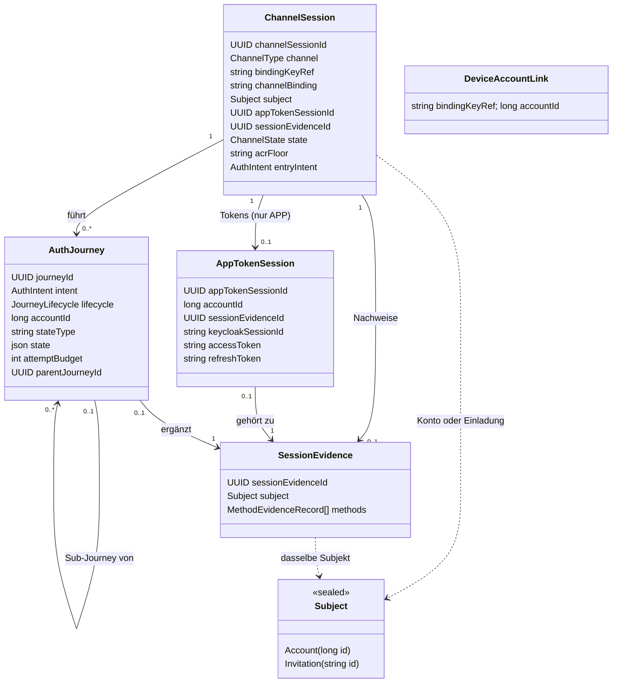
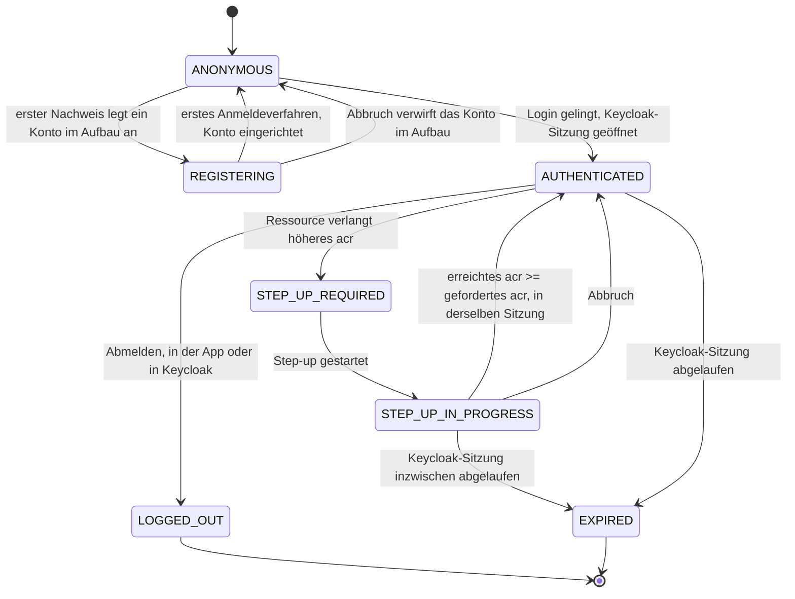
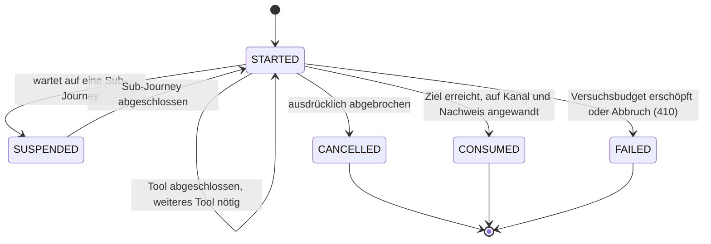
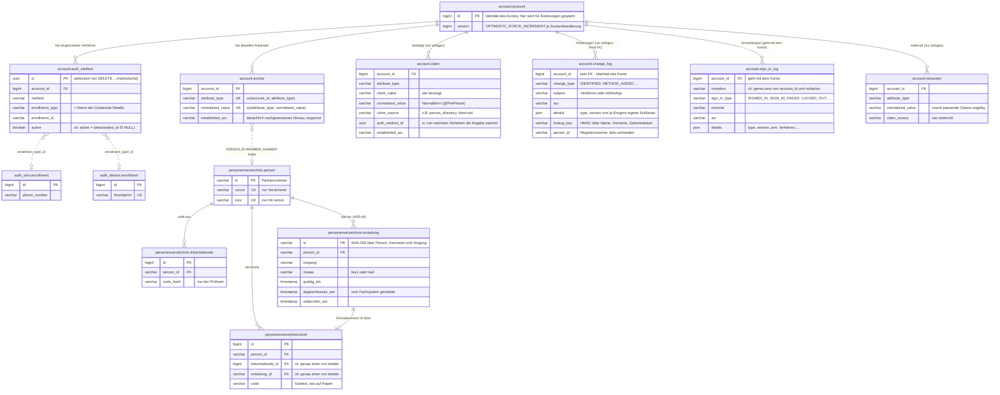
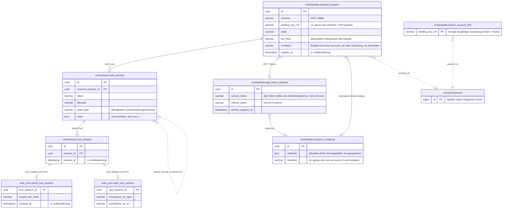

# Domänenmodell

Die Entitäten des Zielmodells, ihre Zustände und die Regeln, nach denen sie gespeichert werden.
Wie die Tools darauf aufsetzen, beschreibt [03-tool-architektur.md](03-tool-architektur.md).

---

## 1) Klassenmodell

`DeviceAccountLink`, die **Geräteverknüpfung**, hängt bewusst **nicht** an `ChannelSession`. Es ist
die einzige langlebige Zuordnung von Gerät zu Konto (`bindingKeyRef -> accountId`), zählt nicht als
Anmeldung (keine Gerätebindung im Sinne des externen Glossars) und hängt an keiner
einzelnen `ChannelSession`; Details in [DPoP-Bindung](09-dpop.md) Abschnitt 3. Es gibt sie **nur im
App-Kanal**: Im Web-Kanal bleibt `bindingKeyRef` `null`.

**Kanalbindung, je Zugang verschieden.** `APP` nutzt `bindingKeyRef`, also den Geräteschlüssel, den
der DPoP-Proof belegt. `WEB` nutzt `channelBinding`: Das ist immer der eigene
`channelSessionId`-Wert **dieses** Login-Durchlaufs, mitgeschickt in der Peer-Auth-Assertion. Es ist
bewusst nicht Keycloaks langlebiges `UserSessionModel`; sonst würden sich zwei **gleichzeitige**
Login-Durchläufe derselben SSO-Sitzung dieselbe Bindung teilen. `ChannelAccessGuard`
([05-api.md](05-api.md) Abschnitt 3) hat für jede der beiden Formen der Bindung eine eigene
Implementierung; die Ressource dahinter (`ChannelSession`) ist in beiden Fällen dieselbe.

---

## 2) Zustand statt Vererbung

- `AuthJourney` ist eine flache Entity ohne Unterklassen. Was sich je Intent unterscheidet, steckt
  im `JourneyState`, einer abgeschlossenen Menge von Zuständen **je Intent**
  ([Orchestrierung](04-orchestrierung.md)). Das Verhalten dazu steht in einer eigenen
  `IntentStrategy` je Intent. Es braucht nämlich Services (`AuthPolicy`, `AccountService`,
  Tool-Katalog), die eine JPA-Entity nicht halten darf.
- Gespeichert wird der Zustand als `stateType` (ein Unterscheidungsmerkmal, nach dem sich
  abfragen lässt) plus `state` (die Attribute als JSON).
- Bewusst **nicht** auf der `AuthJourney` liegt die laufende Challenge. Das gewählte Tool steht als
  `ToolRef` im `JourneyState`; die Challenge selbst kennt ausschließlich das jeweilige
  Tool-Modul (strikte Regel in [Tool-Architektur](03-tool-architektur.md)).
- Ebenfalls **nicht** vorhanden sind gespeicherte `next*`-Felder. `next` ergibt sich allein aus dem
  Zustand.

---

## 3) Zustandsdiagramme

### Zustände der ChannelSession

**`REGISTERING` ist abgeleitet.** Gespeichert wird nur `ANONYMOUS`. Der Kanal zeigt `REGISTERING`,
solange er mit einem Konto im Aufbau arbeitet, also einem Konto ohne Anmeldeverfahren
([ADR-46](adr/ADR-046-konto-im-aufbau.md)). Ein solches Konto finden weder eine Anmeldung noch die
Keycloak-Suche, und ein Abbruch verwirft es ganz. Mit dem ersten Verfahren ist es eingerichtet und
anmeldefähig, auch wenn die Registrierung noch Pflichten offen hat, etwa bei „Erst
Anmeldeverfahren einrichten“ die Identifizierung. Zurück in den Aufbau führt kein Weg: Ein Verfahren
wird deaktiviert, nie gelöscht (I-28).

**Subjekt: Konto oder Einladung.** Ein angemeldeter Kanal gehört meist einem Konto. Nach einem
Einmalkennwort gehört er stattdessen einer Einladung des Personenverzeichnisses (`invitation`,
[ADR-48](adr/ADR-048-vorgangszugang-mit-einmalkennwort.md)): eine Person für einen Vorgang, ohne
Konto. Nie beides zugleich, und die Evidenz gehört demselben Subjekt wie der Kanal. Im Code ist das
ein Sealed-Typ (`ChannelSession.subject`, `SessionEvidenceRecord.subject`: `Subject.Account` oder
`Subject.Invitation`); die Datenbank hält es in zwei Spalten, von denen eine Prüfregel höchstens eine
zulässt.

**Lebensdauer.** Bis zur Anmeldung gilt eine feste Frist (App 24 Stunden, Web ein
Anmeldedurchlauf von 30 Minuten). Mit `AUTHENTICATED` öffnet der Kanal genau eine Keycloak-Sitzung
(im Standardprofil die simulierte), und ab dann ist `expiresAt` das Sitzungsfenster, das Keycloak
meldet: Der Kanal überlebt seine Sitzung nie, und eine zweite Sitzung gibt es für ihn nicht
([ADR-43](adr/ADR-043-kanal-lebt-nicht-laenger-als-die-keycloak-sitzung.md)). Lehnt Keycloak die
Sitzung ab, bleibt der Kanal im Zustand davor.

### Lebenszyklus der AuthJourney

Der Lebenszyklus sagt nur, **ob** die Journey noch läuft. Wo sie gerade steht, sagt der
`JourneyState` des jeweiligen Intents ([Orchestrierung](04-orchestrierung.md)); die Schritte
innerhalb eines Tools verwaltet das Modul des Tools selbst.

`SUCCEEDED` und `EXPIRED` stehen noch im Enum, werden aber nie gesetzt: Eine erfolgreiche Journey
wechselt direkt auf `CONSUMED`, und ob sie abgelaufen ist, wird nur über `expiresAt` geprüft
([Lebenszyklus](journeys/lebenszyklus-unabhaengig-vom-intent.md)).

---

## 4) Aufzählungstypen

- `ChannelType`: `APP`, `WEB` – über welchen Zugang der Kanal geöffnet wurde; das bleibt für
  seine ganze Lebenszeit fest ([05-api.md](05-api.md) Abschnitt 3).
- `ChannelState`: `ANONYMOUS`, `REGISTERING`, `AUTHENTICATED`, `STEP_UP_REQUIRED`,
  `STEP_UP_IN_PROGRESS`, `LOGGED_OUT`, `EXPIRED`
- `AuthIntent`: `FAST_ACCESS`, `REGISTER`, `LOOKUP_LOGIN`, `WEB_SELECT_METHOD`, `STEP_UP`,
  `MANAGE_AUTH_METHODS`, `CONFIRM_PEER_LOGIN`, `DELETE_ACCOUNT`, `LOGOUT`, `RE_IDENTIFY` – was
  der Nutzer erreichen will, *und* der Weg dorthin ([Orchestrierung](04-orchestrierung.md)
  Abschnitt 1). `DELETE_ACCOUNT` und `MANAGE_AUTH_METHODS` setzen einen Kanal voraus, der schon
  `AUTHENTICATED` ist. `DELETE_ACCOUNT` verlangt zuerst in jedem Fall die Ja/Nein-Bestätigung
  (`Prompt`, [API](05-api.md) Abschnitt "Das `Prompt`-Objekt"). Danach muss die Sitzung die Schwelle `selfServiceAcrFloor` erreichen
  (loa2, für ein nie identifiziertes Konto nur loa1), und ein aktiver Faktor muss frisch
  nachgewiesen sein.
- `JourneyLifecycle`: `STARTED`, `SUSPENDED`, `SUCCEEDED`, `FAILED`, `CANCELLED`, `EXPIRED`,
  `CONSUMED`
- `ToolRole`: `IDENTIFICATION`, `CORRELATION`, `ENROLLMENT`, `KNOWN_ACCOUNT_AUTH`,
  `ACCOUNT_LOOKUP_AUTH`, `PEER_APPROVAL`, `ATTESTATION` – das Modul gibt sie selbst an. `PEER_APPROVAL`
  bestätigt eine Anfrage auf einem anderen Kanal und trägt nichts zum Nachweis des eigenen Kanals
  bei. `ATTESTATION` bestätigt ein Attribut, das dem Konto gehört (etwa die E-Mail-Adresse), und
  trägt ebenfalls nichts zum Niveau bei ([Tool-Architektur](03-tool-architektur.md)).
- `FactorType`: `KNOWLEDGE`, `POSSESSION`, `INHERENCE` – gibt das Modul ebenfalls selbst an; darauf
  beruht die Prüfung, ob verschiedene Faktortypen vorliegen ([Orchestrierung](04-orchestrierung.md)).

---

## 5) Regeln fürs Speichern

- `ChannelSession.channelSessionId` ist stabil und nach außen bedeutungslos; App und Web kennen nur
  diese technische Referenz.
- Das Routing wird **nicht** gespeichert: `next` folgt aus dem `JourneyState`
  ([Orchestrierung](04-orchestrierung.md) Abschnitt 4). `stepData` baut der jeweilige Handler aus
  dem Zustand seines Verfahrens auf.
- `accountId` hat an zwei Stellen klar getrennte Aufgaben: `AuthJourney.accountId` wird ermittelt,
  während die Journey läuft. `ChannelSession.accountId` wird erst nach erfolgreichem Abschluss von
  dort übernommen und gilt nur für diesen Kanal. Die langlebige Zuordnung von Gerät zu Konto liegt
  in `DeviceAccountLink` ([DPoP-Bindung](09-dpop.md) Abschnitt 3).
- `ChannelSession` ist kurzlebig (Aufbewahrung: [Betrieb](07-betrieb.md)). Sie wird **nie** über
  `bindingKeyRef` gesucht oder wiederverwendet. Um fortzusetzen, braucht es die `channelSessionId`,
  die sich der Client gemerkt hat (`GET`); ein Einstieg ohne bekannte ID legt immer eine neue
  `ChannelSession` an. Ein registriertes Gerät kommt über `DeviceAccountLink` trotzdem direkt auf
  den passenden Weg zur Anmeldung.
- Der Nachweis einer Sitzung liegt in `SessionEvidence`, nicht in der `AppTokenSession`; die verwaltet nur die
  Tokens des App-Kanals und die Id seiner einen Keycloak-Sitzung (`keycloakSessionId`, einmal
  gesetzt, nie ersetzt, [ADR-43](adr/ADR-043-kanal-lebt-nicht-laenger-als-die-keycloak-sitzung.md)).
  Je Verfahren hält ein Eintrag in `methods` den Namen (`method`), das Niveau und die Faktortypen
  fest. `currentAmr` und `currentFactorTypes` sind Sichten darauf. Die Faktortypen
  stehen im Eintrag selbst, statt aus dem `amr`-Namen abgeleitet zu werden, denn `amr`-Werte
  benennen Verfahren, nicht Faktortypen. Das aktuelle Niveau wird nie gespeichert, sondern bei
  Bedarf aus dem Nachweis berechnet.
- Zwei Ebenen: `ChannelSession.acrFloor` ist die **dauerhafte Untergrenze** des Kanals und
  überlebt einzelne Journeys. `StepUpState.targetAcr` ist das **Ziel des jeweiligen Laufs** und
  kann höher liegen. Geprüft wird gegen das höhere der beiden Niveaus.
- Ein vom Client genanntes `requiredAcr` ist immer eine Untergrenze, nie eine Erlaubnis: Das
  Backend setzt `max(Policy-Anforderung, Client-Wunsch)`.

---

## 6) Konto-Identität: Claims, Anker, Konsolidierung

- `Account` ist nur die Identität des Kontos und die Zeile, über die Änderungen am Konto gesperrt
  werden (`id`, `createdAt`, `version`). Der aktuelle Zustand steht in eigenen Zeilen je Konto
  (`AccountAnchor`, `AccountAuthMethod`). Jede Änderung daran lädt die Kontozeile mit
  `OPTIMISTIC_FORCE_INCREMENT`; schreiben zwei Vorgänge gleichzeitig, bekommt der zweite
  `409 CONCURRENT_MODIFICATION`. Die Historie (`AccountClaim`, `ChangeLogEntry` (IDENTIFIED)) wird nur
  ergänzt und erhöht die Version nie.
- `AccountProfile` ist die typisierte Sicht zum Lesen. `personId` (die Partnernummer, optional,
  [12-entscheidungen.md](12-entscheidungen.md) ADR-10/ADR-34) und `email`/`emailConfirmedAt`
  kommen aus den Ankern, nicht aus eigenen Spalten. `AnchorRule.allowsReplacement` legt fest, was
  sich ändern darf: `email` ja, `personId` nach der ersten Bindung nicht mehr. Daran hängen zwei
  Regeln, die jeweils an genau einer Stelle einen Namen haben, statt als Bedingung an mehreren
  Stellen zu stehen:
  - `isUnidentified`: Das Konto hat keine PersonId und darf deshalb eine Identität annehmen; das
    ist zugleich die Rolle Interessent (ADR-34).
  - `isDisposable` (verwerfbar): Außerdem wurde nie ein Anmeldeverfahren eingerichtet (deaktivierte
    zählen mit).
    Ein solches Konto darf gelöscht oder mit einem anderen zusammengeführt werden (ADR-20).
- **Kennungen einer Person** im Personenverzeichnis (ADR-34):
  - **Partnernummer**: `P` und neun Ziffern, zufällig vergeben, unveränderlich; im Konto der Anker
    `PERSON_ID`.
  - **Mitgliedsnummer** (auch Versicherungsnummer genannt): acht Ziffern, nur für Versicherte,
    änderbar und entfernbar; im Konto der Anker `MEMBER_NUMBER`.
  - **KVNR**: nur zusammen mit einer Mitgliedsnummer, änderbar, darf zeitweise fehlen; im Konto
    ein Claim, der jüngste gilt. Fachlich bleibt der unveränderbare Teil einer KVNR ein Leben lang
    gleich. Änderbar ist sie trotzdem, weil es Klärungsfälle gibt, in denen eine KVNR doppelt
    vergeben wurde.

  Außerdem hält das Verzeichnis je Person E-Mail-Adresse und Mobilnummer. Das Konto hat davon
  getrennt eigene Werte: die Claims EMAIL und PHONE_NUMBER, die erst durch Bestätigen per Code bzw.
  TAN entstehen. Beide Angaben haben verschiedene Herkunft und können abweichen; das Verzeichnis meldet
  eine Änderung deshalb nicht. Die Demo füllt mit seinen Werten nur die Formulare vor (Auswahl
  „Testperson übernehmen“).
- **Drei Rollen** ergeben sich aus den Ankern, ohne eigenes Statusfeld (ADR-34):
  - **Versicherter**: Das Konto gehört zu einer Person mit Mitgliedsnummer (`MEMBER_NUMBER`-Anker).
  - **Partner**: Eine Person ist zugeordnet (`PERSON_ID`, die Partnernummer), aber ohne
    Mitgliedsnummer.
  - **Interessent**: Es ist keine Person zugeordnet.

  Die App leitet die angezeigte Rolle aus den ID-Claims `personId` und `versnr` ab, die live aus
  dem Personenverzeichnis kommen. Das Personenverzeichnis sichert die Grundlage im Schema ab: Eine
  KVNR gibt es nur zusammen mit einer Mitgliedsnummer (`ck_person_kvnr_nur_versichert`), und
  jede Mitgliedsnummer gibt es nur einmal (`ux_person_versnr`). Die Anwendung fragt das
  Personenverzeichnis über den Port `PersonDirectory` ab (`findPersonIdByKvnr`,
  `findPersonIdByPartnerNumber`, `memberNumberOf`, `matchesMasterData`, `matchesPersonalDetails`, `hasNamesake`,
  `displayName`).
- `AccountAuthMethod` ist ein eingerichtetes Verfahren eines Kontos (`method`,
  `active`/`deactivatedAt`, `enrolledUnderAcr`, `label`, `details`). Die `EnrollmentRef` steht darin
  als echte Spalten (`enrollment_type`, `enrollment_id`); das ist die einzige Stelle, an der Konto
  und Credential verknüpft sind. Die Zeile mit dem Credential gehört dem Tool-Modul;
  deaktivierte Einträge bleiben stehen. Das Verfahren `email` hat kein eigenes Credential im Modul:
  Ihre Referenz ist der EMAIL-Anker (`EMAIL_ANCHOR_ENROLLMENT`).
- Das Änderungsprotokoll (`account.change_log`, [ADR-39](adr/ADR-039-was-eine-kontoloeschung-ueberlebt.md))
  hält jede Identifizierung fest (Ereignis `IDENTIFIED`): Verfahren, erreichtes LoA, Rolle, Zeitpunkt
  und die Referenz beim Anbieter ([06-ablaeufe.md](06-ablaeufe.md) Abschnitt 1) – dazu Widerrufe,
  Anmeldeverfahren und Löschung. Für Entscheidungen wird es nie gelesen; es überlebt das Konto.
- `AccountRetraction` (`account.retraction`) macht einen Wert ungültig. Jede Widerrufszeile nennt,
  wer widerruft (`RetractionSource`: `ACCOUNT_MANAGEMENT`, `PERSON_DIRECTORY`, `OPERATOR`), den
  Grund und den Zeitpunkt ([12-entscheidungen.md](12-entscheidungen.md) ADR-12). „Aktuell gültig"
  heißt: alle Angaben abzüglich der Widerrufe. Maßgeblich ist die Zeit: Ein Widerruf entkräftet nur
  Angaben, die vor ihm liegen; ein danach neu bestätigter Wert gilt wieder. Es gibt vier Auslöser:
  - Wird ein Verfahren entfernt, nimmt das über `auth_method_id` dessen Angaben zurück (nur die mit
    `AttributeAuthority.MethodModule`).
  - Wird ein Anker durch einen neuen Wert ersetzt, wird der alte widerrufen
    (`ACCOUNT_MANAGEMENT`, Grund „anker-ersetzt"), damit Protokoll und Anker übereinstimmen.
  - Ein Attribut lässt sich **direkt** zurücknehmen (ADR-24, `AccountService.retractAttribute`,
    Grund „attribute withdrawn"); dabei wird auch die Zeile des Ankers gelöscht.
  - Meldet das Personenverzeichnis per `PersonChanged` eine neue oder entfernte KVNR bzw.
    Mitgliedsnummer, widerruft `AccountService.applyDirectoryChange` den alten Wert
    (`PERSON_DIRECTORY`) und schreibt den neuen, falls es einen gibt (ADR-34).

  Eine bestätigte E-Mail-Adresse lässt sich nur über den direkten Widerruf verlieren: `confirm-email`
  schreibt seine Angabe als ATTESTATION, also ganz ohne `auth_method_id`, und die E-Mail-Adresse
  gehört ohnehin dem Konto selbst. Kein Widerruf eines Verfahrens erreicht sie.
- `AccountClaim` protokolliert die Herkunft jeder *Änderung* einer Angabe (`AttributeType`, Wert,
  Quelle – Spalte `claim_source`, im Code `ClaimSource` –, `AcrLevel`). Es wird nur ergänzt, nie
  geändert. Protokolliert werden Änderungen, nicht Durchläufe: Eine Angabe, die genau so schon gilt
  (gleicher Typ, Wert, Quelle und Verfahren), wird nicht noch einmal geschrieben. Ein eID-Lauf mit
  unveränderter Karte erzeugt also keine sieben neuen Zeilen. Die Spalte `normalized_value`
  (`@PrePersist`/`@PreUpdate`) hält die Regel zur Normalisierung an genau einer Stelle fest. Im
  Sinne des [externen Glossars](glossar/externes-glossar.md) sind diese Claims **bescheinigte Attribute**, sobald ein
  Identifizierungsverfahren oder das Personenverzeichnis für sie einsteht; was nur der Nutzer selbst
  angibt (`SELF_REPORTED`), bleibt unbescheinigt.

  Die Quelle sagt, wer für einen Wert einsteht: das Personenverzeichnis (`PERSON_DIRECTORY`, in der
  Datenbank `person_directory`), ein Verfahren selbst (`ClaimSource(toolId.value)`, z. B. `ident-eid`),
  oder der Nutzer (`SELF_REPORTED`). Daraus folgt die **Stufe** der Angabe (`ClaimTrust`), in dieser
  Rangfolge: *belegt* (`AUTHORITATIVE`, Stammdaten), *nachgewiesen* (`PROVEN`, von einem Verfahren
  geprüft) und *behauptet* (`SELF_REPORTED`). Gibt es für ein Attribut mehr als einen Wert,
  entscheidet zuerst die Stufe, dann die Zeit.
- Wem ein Attribut gehört, steht deklariert im Code: `AttributeType.authority`
  (`tool_api/claims/AttributeType.kt`) kennt drei Fälle:
  - `Local` (`PERSON_ID`, `MEMBER_NUMBER`, `EID_RESTRICTED_ID`, `NECT_RESTRICTED_ID`, `EMAIL`): Der Wert liegt im Konto in
    `account.anchor`; dieser Fall bringt die Regeln für Anker gleich mit.
  - `PersonDirectory` (`KVNR`, `FAMILY_NAME`, `GIVEN_NAMES`, `BIRTH_DATE`, `STREET_ADDRESS` (Straße mit
    Hausnummer), `POSTAL_CODE`, `LOCALITY`): Der Wert wird live über `PersonDirectory` gelesen; im Konto steht
    nur die Historie der Claims.
  - `MethodModule` (`PHONE_NUMBER`, `PASSWORD_EXISTS`): Der Wert steht in der Enrollment-Zeile des
    Tool-Moduls.

  `AnchorRule.bindingStrength` sagt zusätzlich, wie stark ein Treffer auf einem Anker eine
  Identität bindet.
- Einen Anker zu schreiben **verlangt** ein Mindestniveau: `AnchorRule.acrFloor` legt je
  Attributtyp fest, welches Niveau die *erste Bindung* (`establish`) und welches das *Ersetzen*
  (`replace`) mindestens voraussetzt. `EMAIL` lässt sich schon bei `loa1` binden, aber erst ab
  `loa2` ersetzen. `PERSON_ID` verlangt schon für die erste Bindung `loa2`; daneben gilt vorrangig
  `allowsReplacement = false`. `MEMBER_NUMBER` und die beiden Kartenpseudonyme lassen sich ab `loa2` binden und
  ersetzen (eine neue Mitgliedsnummer, eine neue Karte). Das Pseudonym des Online-Ausweises ist je
  Diensteanbieter verschieden (§ 18 PAuswG): Liest `ident-eid` die Karte, entsteht unseres
  (`EID_RESTRICTED_ID`); liest Nect sie, entsteht Nects (`NECT_RESTRICTED_ID`). Deshalb sind es zwei
  Anker, und keiner überschreibt den anderen. Geprüft wird an der einzigen Stelle,
  die Anker schreibt (`AnchorRegistry.bind`, Regel in `AnchorDecision`); liegt die Sitzung darunter, wird der
  Schreibversuch abgewiesen (`409`).
- `account.anchor.established_acr` ist das Gegenstück zu `account.auth_method.enrolled_under_acr`:
  das **tatsächlich nachgewiesene** Niveau, begrenzt nach ADR-5.
- `AccountAnchor` ordnet die lokal geführten Attribute (`AttributeAuthority.Local`: `PERSON_ID`,
  `MEMBER_NUMBER`, `EID_RESTRICTED_ID`, `NECT_RESTRICTED_ID`, `EMAIL`) einem Konto zu, hält sie eindeutig und ist zugleich ihr
  einziger Speicherort. `UNIQUE(attribute_type, normalized_value)` macht `resolveByAnchor` zu einem
  einfachen Nachschlagen; `UNIQUE(account_id, attribute_type)` erzwingt höchstens einen aktuellen
  Wert je Konto und Attributtyp. KVNR und Partnernummer werden ausschließlich live über
  `personenverzeichnis` (`findPersonIdByKvnr`/`findPersonIdByPartnerNumber`) zur PersonId und damit
  zum lokalen PersonId-Anker aufgelöst. Ein Anker, der schon einem anderen Konto gehört, wird
  abgewiesen ([12-entscheidungen.md](12-entscheidungen.md) ADR-11). Ändert das
  Personenverzeichnis KVNR oder Mitgliedsnummer, zieht das Konto den Claim bzw. den
  `MEMBER_NUMBER`-Anker per Event nach (ADR-34).
- `IdentityMatchingService.resolve` beantwortet die Frage „Gehört diese bestätigte Identität zu
  einem bestehenden Konto?" **ausschließlich über Anker** (ADR-19). `resolveByAnchor` prüft die
  Anker-Claims in der Reihenfolge ihrer `AnchorRule.bindingStrength`; ohne Treffer bleibt nur
  `Unresolved`. Über Kombinationen von Attributen aus der Claim-Historie wird nicht
  aufgelöst. Name, Vorname und Geburtsdatum dienen nur dem Abgleich mit
  `personenverzeichnis`: in `ident-fsc` selbst (`matchesPersonalDetails`) und vor dem Anker einer
  Zuordnung (`attestedIdentityMatches`).
- Bewusst getrennt bleiben einige ähnlich klingende Namen, weil an ihren Unterschieden Regeln
  hängen: `personId` ist die Partnernummer, nicht `accountId`. `Claim`, `ClaimDeclaration` und
  `ClaimRequirement` sind ein Ergebnis, eine zugesicherte Fähigkeit eines Tools und eine
  Voraussetzung. `AcrLevel`, `EvidenceAxis`, `FactorType`, `acrFloor` und `targetAcr` tragen
  verschiedene Sicherheitsregeln. `ClaimSource` (die Quelle einer Angabe) und `AmrSource` (woher
  ein Nachweis der Sitzung kommt) haben unterschiedliche Werte.
- Entscheidungen: [12-entscheidungen.md](12-entscheidungen.md) ADR-10/ADR-11/ADR-12/ADR-19 und `db/migration/KONVENTIONEN.md`; Begriffe im
  [Glossar](glossar/glossar.md).
  Das Zusammenführen von Konten ist eine zurückgestellte Verbesserung
  ([12-entscheidungen.md](12-entscheidungen.md)).

---

## 7) Tabellenmodell

Das Schema steht in `src/main/resources/db/migration/<modul>/`, ein Verzeichnis je Modul; die
Konventionen dazu in [07-betrieb.md](07-betrieb.md) Abschnitt 6 und
[12-entscheidungen.md](12-entscheidungen.md) ADR-14/ADR-16. Die Diagramme zeigen die tragenden
Tabellen mit ihren identifizierenden Spalten, nicht jede Spalte. Jedes Modul hat ein eigenes
Datenbankschema; der qualifizierte Name nennt das Modul, dem die Tabelle gehört
([12-entscheidungen.md](12-entscheidungen.md) ADR-16).

**Linienarten:** Eine durchgezogene Linie ist ein echter Fremdschlüssel. Solche gibt es
ausschließlich **innerhalb** eines Schemas. Eine gestrichelte Linie ist ein Bezug über
Schemagrenzen hinweg: eine indizierte Spalte ohne Constraint. Aufgeräumt wird sie über die API des
Moduls, dem die Daten gehören (`EnrollmentCleanup`, `AccountDeletionService`), nie per Kaskade.

### Konto

Die Tabelle `account.account` selbst trägt keine Fakten: Partnernummer (`PERSON_ID`),
Mitgliedsnummer (`MEMBER_NUMBER`), die Kartenpseudonyme und die E-Mail-Adresse stehen als Anker in
`account.anchor`, die Liste der Verfahren in `account.auth_method`
(Abschnitt 6). Die Credential-Tabellen der Tool-Module (hier beispielhaft
`auth_sms.enrollment` und `auth_device.enrollment`) haben bewusst **keine** `account_id`: Sie
entstehen im Tool-Handler, bevor die Orchestrierung das Konto kennt. Die einzige Verknüpfung ist
`account.auth_method.enrollment_type/enrollment_id`. Aus demselben Grund hat `auth_email` keine
eigene Credential-Tabelle: Das Credential *ist* der EMAIL-Anker.

### Orchestrierung und Arbeitsdaten der Tools

`orchestrator.session_evidence` und `orchestrator.app_token_session` sind getrennt. Nachweise hat jeder
Kanal (der Web-Kanal legt nie eine `AppTokenSession` an), und sie sind die Wahrheit, mit der die
Policy rechnet. Das Token ist nur eine daraus ausgestellte Kopie, die man verwerfen kann
([12-entscheidungen.md](12-entscheidungen.md) ADR-15).

Die `*_tool_session`-Tabellen liegen im Schema ihres Moduls, obwohl ihr Lebenszyklus an
`orchestrator.tool_session` hängt. Ihr Primärschlüssel *ist* die `tool_session_id`; ein
Fremdschlüssel darauf würde also über eine Schemagrenze gehen. `auth_sms.enroll_tool_session` ist
der Teil derselben `orchestrator.tool_session`, der im Modul liegt, keine vierte Sitzungsebene.
Jedes Tool-Modul ist gleich aufgebaut: ein langlebiges `<modul>.enrollment` und für jedes Tool
eine kurzlebige `<modul>.<tool-rolle>_tool_session`. Die Tabellen eines Moduls stehen in seiner
eigenen Migration unter `db/migration/<modul>/`.

Nicht im Diagramm, weil ohne Beziehungen: `orchestrator.journey_trace` (die Sitzungs-IDs dort sind historische Werte, keine Verweise; die
Aufzeichnung überlebt die Sitzungen), `orchestrator.rate_limit`,
`orchestrator.dpop_proof_replay`, `orchestrator.tool_availability`, `orchestrator.feature_flag`,
`orchestrator.node_signing_key` und `orchestrator.event_publication`
(die Event-Publication-Registry von Spring Modulith, ADR-29).
