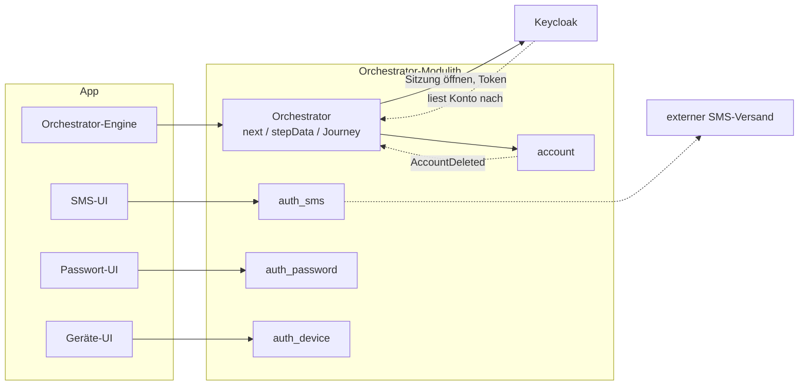
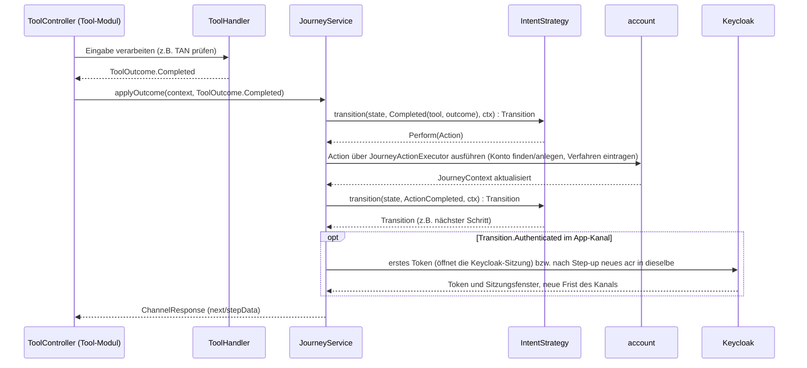

# Tool-Architektur

Ein *Tool* ist ein konkreter, abgeschlossener Arbeitsschritt, den ein Nutzer durchläuft. Mit einem
Tool identifiziert sich jemand, richtet ein Anmeldeverfahren ein oder meldet sich an. Beispiele sind
`ident-fsc` (Identifizierung mit Freischaltcode), `enroll-sms` (SMS einrichten) und `auth-sms` (mit
SMS anmelden). Dieses Dokument beschreibt zwei Dinge: wie Tools sich selbst beschreiben und was sie
aus ihrem Modul heraus an den Orchestrator melden. Der **Orchestrator** ist der Server dieses
Projekts. Er entscheidet, welche Schritte ein Nutzer durchläuft, und bindet die Tools über eine feste
Schnittstelle ein. Unbekannte Begriffe erklärt das [Glossar](glossar/glossar.md).

Was der Orchestrator mit den Meldungen der Tools macht, steht in
[04-orchestrierung.md](04-orchestrierung.md). Ein durchgehendes Beispiel, das ein neues Verfahren
von Anfang bis Ende anbindet, finden Sie hier:

- [15-beispiel-neues-verfahren-backend.md](15-beispiel-neues-verfahren-backend.md) für Server und
  Web-Kanal,
- [17-beispiel-neues-verfahren-app.md](17-beispiel-neues-verfahren-app.md) für die App.

Was ein einzelnes Verfahren im Besonderen tut, steht auf seiner Seite unter
[verfahren/](verfahren/README.md). Die HTTP-Schnittstelle eines Tools beschreibt
[05-api.md](05-api.md) Abschnitt 2.

---

## Einstieg: Zusammenspiel an einem Schritt

Der Orchestrator ist ein **Modulith**: eine einzige Anwendung, die intern in Module mit klaren
Grenzen geteilt ist. Jedes Verfahren hat sein eigenes Tool-Modul. Einzelne Module geben einen Teil
ihrer Arbeit an externe Dienste weiter, etwa an einen SMS-Versand. Das erste Bild zeigt diesen
Aufbau aus Sicht des Backends:



Das zweite Bild zeigt, wie der Orchestrator und ein Tool-Modul wie `auth_sms` bei einem konkreten
Schritt zusammenarbeiten. Der Nutzer gibt zum Beispiel eine TAN ein. Das Tool prüft sie und meldet
sein Ergebnis (`ToolOutcome`). Die Strategie des Intents (`IntentStrategy`) entscheidet dann, wie es
weitergeht. Ein **Intent** ist das Anliegen des Nutzers, etwa sich anzumelden. Eine **Journey** ist
der geführte Ablauf zu diesem Intent.



**Keycloak** ist das Produkt, das die Anmeldung auf der Website führt und die Tokens ausstellt. In
einem Schritt kommt Keycloak nur vor, wenn dieser Schritt die Anmeldung eines App-Kanals abschließt.
Ein **Kanal** ist die Verbindung eines Nutzers zum Orchestrator, über die App oder über die Website.
Wechselt der App-Kanal in den Zustand `AUTHENTICATED`, öffnet der Orchestrator dabei die
Keycloak-Sitzung ([ADR-43](adr/ADR-043-kanal-lebt-nicht-laenger-als-die-keycloak-sitzung.md)).

Keycloak hält keine Kopie der Konten. Es liest ein Konto bei Bedarf selbst beim Orchestrator nach
([ADR-38](adr/ADR-038-keycloak-liest-konten.md)). Das Modul `account` spricht nie selbst mit
Keycloak. Nur wenn ein Konto gelöscht wird, meldet es das Ereignis `AccountDeleted`. Nach dem Commit
löscht der Orchestrator (`KeycloakAccountRemovalListener`) dann die Daten, die Keycloak selbst zu
diesem Konto speichert, etwa Sitzungen ([05-api.md](05-api.md) Abschnitt 3b, „Keycloak liest die
Konten – keine Spiegelung“).

Was der `ToolHandler` intern tut, um zu seinem `ToolOutcome` zu kommen, zeigt das Bild bewusst
nicht. Der Handler arbeitet mit eigener Fachlogik auf einem eigenen Datenbankschema (`ToolDB`). Auf
dieses Schema greift nichts außerhalb des Moduls zu.

Für Sie als Backend-Entwickler heißt das:

- **Ihr Modul bleibt Ihr Modul.** Ein Tool-Modul wie `auth_sms` hat sein eigenes Schema
  (`ToolDB`), auf das nichts von außen zugreift. Sie können dort die Fachlogik ändern, ohne die
  Journey oder andere Module überhaupt lesen zu müssen.
- **Der Vertrag ist klein und stabil.** Ihr `ToolHandler` liefert nur ein `ToolOutcome`. Was das
  für die Journey, ihren Zustand und den nächsten Schritt bedeutet, entscheidet allein die
  `IntentStrategy`. Beim Schreiben eines Tools müssen Sie also nie die ganze Zustandsmaschine im
  Kopf haben.
- **App- und Web-Kanal sind für Sie gleich.** Journey, Tool und `next` funktionieren für beide
  Zugänge gleich ([05-api.md](05-api.md)); Sie schreiben keine Sonderfälle für einen einzelnen
  Kanal in Ihr Modul.
- **Den Ablauf zum Ausstellen der Tokens müssen Sie nicht bauen.** Der übliche Ablauf nach OIDC,
  dem Standard für Anmeldung und Tokens, ist mit Keycloak auf dem Server einmal umgesetzt. Ihr Modul
  liefert nur das Ergebnis eines Verfahrens, nie selbst ein Token.

---


## 1) Begriffe: Tool, Verfahren, Rolle, `ToolSession`

Dieser Abschnitt klärt vier Grundbegriffe, die im ganzen Kapitel vorkommen.

Ein **Verfahren** (im Code Methode, `method`) ist ein Weg, etwas nachzuweisen, etwa `sms` oder
`kobil`. Jedes Verfahren gehört genau einem Modul, das es einmal deklariert (Abschnitt 2). Ein
**Tool** ist eine Rolle dieses Verfahrens. Beim Verfahren `sms` gibt es zum Beispiel drei Tools:

- `enroll-sms` richtet das Verfahren ein,
- `auth-sms` meldet mit dem Verfahren an,
- `auth-sms-lookup` meldet ebenfalls an, findet das Konto aber über die E-Mail-Adresse.

Welche Tools es gibt, zeigt der Katalog in Abschnitt 8. Jedes Verfahren hat dort einen Link auf
seine eigene Seite unter [verfahren/](verfahren/README.md).

Die `toolId` (z. B. `ident-fsc`, `enroll-sms`, `auth-sms`) nennt in einem einzigen Namen die Art
des Tools und das Verfahren. Die `toolId` wird nicht gespeichert. Der Orchestrator leitet sie aus
der Route der Anfrage ab und wählt über sie Handler und Datenklasse des Moduls aus.

Die `ToolSession` ist die dritte und kurzlebigste Ebene der Sitzungen (`ChannelSession` →
`AuthJourney` → `ToolSession`). Sie steht für genau einen Durchlauf eines Tools. Sie enthält Daten
zum Lebenszyklus dieses Durchlaufs und die Arbeitsdaten des Tools selbst. Die Arbeitsdaten hält das
Tool als einfache Datenklasse, bei `auth-sms` etwa `AuthSmsToolSession` mit Enrollment, TAN-Hash und
Ablaufzeit. Das Tool speichert sie über `ToolSessionData`. Der Orchestrator legt sie als JSON in der
Zeile der `ToolSession` ab, liest sie aber nie
([ADR-49](adr/ADR-049-arbeitsdaten-der-tools-am-orchestrator.md)). Ein Modul braucht dafür also
weder eine eigene Tabelle noch eigenes Aufräumen.

Der Tool-Katalog ist **keine zentral gepflegte Tabelle**. Er entsteht aus den Angaben, die die
Module über sich selbst machen (`ToolModule` mit seinen Tools, Abschnitt 2). Das
[externe Glossar](glossar/externes-glossar.md) verwendet andere Begriffe: Dort sind Tools der Rolle
`IDENTIFICATION` Identifizierungsmittel. Die Tools der Rollen `ENROLLMENT` und
`KNOWN_ACCOUNT_AUTH`/`ACCOUNT_LOOKUP_AUTH` gehören dort zu Anmeldeverfahren
([Abgleich mit dem externen Glossar](glossar/abgleich-externes-glossar.md)).

Die **Rolle** (`ToolRole`) sagt, was ein Tool fachlich tut. Drei Rollen erklären sich fast von
selbst:

- `IDENTIFICATION` stellt fest, wer jemand ist,
- `ENROLLMENT` richtet ein Anmeldeverfahren ein,
- `KNOWN_ACCOUNT_AUTH` meldet ein Konto an, das der Kanal schon kennt.

Die übrigen vier Rollen brauchen eine Erklärung:

- `role=ATTESTATION` (`confirm-email`) kennzeichnet den Nachweis, dass jemand ein Attribut des
  Kontos kontrolliert, etwa eine E-Mail-Adresse. Dabei entsteht kein Credential, also nichts, womit
  man sich später anmelden kann. Es wird auch keine Identität festgestellt. Wann ein Tool diese
  Rolle hat, steht in Abschnitt 4.
- `role=ACCOUNT_LOOKUP_AUTH` kennzeichnet Anmeldungen, die ihr **Subjekt** selbst aus der Eingabe
  ermitteln statt über den Kanal. Das Subjekt ist, wem ein angemeldeter Kanal gehört: einem Konto
  oder einer Einladung. Die `-lookup`-Varianten haben dieselbe `method` wie ihr Gegenstück mit
  `KNOWN_ACCOUNT_AUTH`. Sie finden das Konto über eine eingegebene E-Mail-Adresse. Ohne diese
  Unterscheidung wäre nicht eindeutig, welche Tools zur Auswahl stehen. `auth-invite-lookup` hat
  kein Gegenstück. Es findet über eine Nummer und ein Einmalkennwort eine Einladung statt eines
  Kontos ([Verfahren `invite`](verfahren/invite.md)).
- `role=CORRELATION` (`ident-kvnr`) kennzeichnet einen Schritt, der nur zuordnet. Für sich beweist
  er nichts: Eine eingetippte KVNR oder Partnernummer ist kein Nachweis. Ein solches Tool wird nie
  für eine (erneute) Identifizierung angeboten, denn `forIdentification` und `reIdentCandidates`
  nehmen nur Tools der Rolle `IDENTIFICATION`. Starten lässt es sich erst, wenn die Identität
  bereits bestätigt ist (`requires`, ADR-18). `factorTypes = {}` folgt aus dieser Rolle, definiert
  sie aber nicht.
- `approve-qr` hat die Rolle `ToolRole.PEER_APPROVAL`. Keine der übrigen Rollen passt auf den Fall
  „bestätigt, was jemand anderes tut“. Was diese Rolle zum Niveau beiträgt, steht in Abschnitt 4.

---

## 2) Ein Verfahren deklarieren: `ToolModule`

Damit der Orchestrator ein Verfahren anbieten kann, muss er wissen, was es kann. Dafür beschreibt
jedes Modul sein Verfahren selbst, und zwar genau einmal, in der Datei `<Modul>ToolModule.kt` (z. B.
`tools/auth_kobil/KobilToolModule.kt`). Die Deklaration ist eine reine Selbstbeschreibung ohne
Abhängigkeiten. Sie ist getrennt von der Fachlogik, die im Paket `internal` liegt. Dieselbe Datei
enthält auch die Angaben für Spring Modulith (`@ApplicationModule` an der gleichnamigen Klasse
`KobilToolModule`) und stellt das `ToolModule` als Bean bereit. Der Orchestrator sammelt die Module
beim Start ein und bildet daraus den Katalog aus Abschnitt 8 (`ToolHandlerRegistry`).

Die Deklaration hat zwei Teile. Was das Verfahren ist, beschreibt `toolModule(…)`. Danach folgt
jedes Tool des Verfahrens als eigener Wert, der am Modul registriert wird:

```kotlin
internal const val ENROLL_KOBIL_TOOL_ID = "enroll-kobil"
internal const val AUTH_KOBIL_TOOL_ID = "auth-kobil"

internal val KobilModule = toolModule(
    method = "kobil",
    name = Text("KOBIL"),
    proves = factors(POSSESSION, KNOWLEDGE, INHERENCE, upTo = AcrLevel.LOA2),
    demoOnly = "Die KOBIL-Gegenstelle ist simuliert (kobil); …",
    onePerDevice = true,
    stepData = KobilStepData,                  // in api/v1/KobilStepData.kt, neben den Formen
)

internal val EnrollKobil = KobilModule.enroll(ENROLL_KOBIL_TOOL_ID, versions = setOf(1), hint = Text("An das Gerät gebunden …"), startStep = "activate")
internal val AuthKobil = KobilModule.login(AUTH_KOBIL_TOOL_ID, versions = setOf(1), hint = Text("An das Gerät gebunden …"), startStep = "unlock")
```

Die `toolId` steht als Konstante genau einmal im Modul. Die Deklaration nennt sie, und der
Controller des Tools verwendet dieselbe Konstante für seine Pfade.

`versions` nennt die Fassungen des Tools, die der Server anbietet. Einen Vorgabewert gibt es nicht.
Je Fassung gibt es einen Controller unter `/tools/api/<toolId>/v<N>`
([ADR-51](adr/ADR-051-versionen-als-pfadsegment.md)). Wann ein Tool eine neue Fassung braucht,
steht in [API](05-api.md) Abschnitt 2.

Der Controller verweist über `ToolController.tool` auf sein Tool (`override val tool = AuthKobil`).
Seine Kontext-Parameter (`ActivationToolContext`, `AuthorizedToolContext`, `ToolContext`) werden für
dieses Tool aufgelöst. Der Test `ToolControllerMappingTest` prüft zweierlei: dass Pfad und Tool
übereinstimmen und dass jede deklarierte Fassung genau einen Controller hat.

Was das **Modul** angibt, gilt für alle seine Tools:

| Angabe | Bedeutung |
|---|---|
| `method` | z. B. `"sms"`. Der Name des Verfahrens verbindet seine Tools, hier `enroll-sms`, `auth-sms` und `auth-sms-lookup`. |
| `name` | wie Nutzer das Verfahren nennen, z. B. `Text("SMS")`. Nur hier steht dieser Name; App und Login-Seite lesen ihn aus `GET /tools/catalog`. |
| `proves` | welche Faktortypen und welches Niveau ein Nachweis mit diesem Verfahren höchstens erbringt (`factorTypes`, `maxAcr`) |
| `onePerDevice` | ein Eintrag je Gerät, gebunden an den Schlüssel des Geräts (Abschnitt 5) |
| `demoOnly` | gesetzt, wenn das Verfahren nur für die Demo geeignet ist (ADR-36) |
| `stepData` | die Formen von `stepData`, mit denen die Tools antworten. Das ist eine Map vom `kind` auf die Form mit Beschreibung und Beispielen, deklariert neben den Klassen. |

Ein **Faktortyp** ist die Art eines Beweises: etwas, das man weiß (`KNOWLEDGE`), etwas, das man hat
(`POSSESSION`), oder etwas, das man ist (`INHERENCE`). Das **Niveau** (`acr`, Werte `loa1` bis
`loa3`) sagt, wie sehr einer Anmeldung vertraut wird.

Jedes **Tool** entsteht über die Fabrik seiner Rolle. Eine Fabrik ist eine Funktion am Modul. Sie
legt die Rolle fest, nimmt die `toolId` und nur die Angaben, die zu dieser Rolle passen, und
registriert das Tool sofort. Jede Fabrik verlangt außerdem `hint`: ein paar Worte dazu, was das
Tool tut, etwa „Code an die hinterlegte Telefonnummer“. Optional nimmt sie `name` an. Das ist ein
eigener Name statt des Modulnamens, für ein Tool, das nach seinem Zweck heißt, etwa „Mit App
anmelden“ für `auth-qr-lookup`.

| Fabrik | Rolle | `toolId` | Eigene Angaben |
|---|---|---|---|
| `identify(…)` | `IDENTIFICATION` | `ident-<m>` | `also` (Name, Vornamen und Geburtsdatum sind immer dabei), `vouchedBy`, `requires`, `startStep` |
| `correlate(…)` | `CORRELATION` | `ident-<m>` | `claims`, `vouchedBy`, `requires`, `startStep` |
| `confirm(…)` | `ATTESTATION` | `confirm-<m>` | `claims`, `startStep`; erbringt keinen Faktor |
| `enroll(…)` | `ENROLLMENT` | `enroll-<m>` | `claims`, `requires`, `startStep`, `withoutUserStep` (`enroll-email`), `optInOnly` (`enroll-qr`, erbringt keinen Faktor), `changeable` (`enroll-sms`, `enroll-password`: ein neuer Lauf ändert den Eintrag, [`MANAGE_AUTH_METHODS`](journeys/manage-auth-methods.md)) |
| `login(…)` | `KNOWN_ACCOUNT_AUTH` | `auth-<m>` | `startStep` |
| `lookupLogin(…)` | `ACCOUNT_LOOKUP_AUTH` | `auth-<m>-lookup` | `startStep` |
| `approve(…)` | `PEER_APPROVAL` | `approve-<m>` | `startStep`; erbringt keinen Faktor |

`withoutUserStep` kennzeichnet ein Tool, das ohne Schritt des Nutzers auskommt. `enroll-email`
zum Beispiel macht die schon bestätigte Adresse beim Start sofort zum Anmeldeverfahren. Der
Orchestrator startet ein solches Tool nie von selbst, auch dann nicht, wenn es der einzige Kandidat
ist. Er zeigt stattdessen die Auswahl mit dem `hint`-Text, der sagt, was die Wahl bewirkt.

Daraus ergeben sich die Felder eines `Tool`:

- `toolId`, `role`, `name`, `hint`,
- `startStep` (fehlt er, gilt `role.defaultStartStep`),
- `claims` (Claims, die das Tool selbst schreibt, nennen das Tool als Quelle),
- `requires`, `withoutUserStep`,
- und vom Modul übernommen: `method`, `factorTypes`, `maxAcr`, `demoOnly`.

Die Entscheidungen dahinter:

- Jedes Modul deklariert sein Verfahren einmal (Methode, Faktortypen, Niveau) und darunter je Rolle
  ein Tool. Einen zentral zu pflegenden Katalog gibt es nicht. Alle Tools einer Methode haben damit
  dasselbe Niveau und dieselbe Bindung an einen Schlüssel. Das Niveau eines eingerichteten
  Verfahrens ist also gleich, egal welches seiner Tools man fragt.
- Die `toolId` steht ausgeschrieben in der Deklaration. So liest man sie dort genauso wie in der
  URL, auf der Admin-Seite und in der Doku. Frei wählbar ist sie trotzdem nicht. Sie muss zu
  Methode und Rolle passen (`ToolRole.toolIdFor`). Erlaubt sind diese Muster:
  - `ident-<m>` (Identifizierung und Korrelation),
  - `confirm-<m>`,
  - `enroll-<m>`,
  - `auth-<m>`,
  - `auth-<m>-lookup`,
  - `approve-<m>`.

  Umgekehrt liest der Orchestrator die Methode nie aus der `toolId`. `enroll-sms` und `auth-sms`
  gehören zum Modul `sms`. Über diese Methode findet ein Tool zum Anmelden die passende Zeile in
  `account.auth_method`.
- `factorTypes` ist eine **Menge**, weil ein Verfahren mehrere Faktoren zugleich erbringen kann.
  `enroll-device`/`auth-device` und `enroll-kobil`/`auth-kobil` deklarieren bis zu drei
  Faktortypen. Je Durchlauf erbringen sie zwei davon mit `loa2`: ein an das Gerät gebundenes
  Credential plus System-PIN oder Biometrie.
- `maxAcr` und `factorTypes` dienen der Vorauswahl. Sie beantworten die Frage: Kann dieses Tool die
  Lücke zum geforderten Niveau überhaupt schließen? Was ein konkreter Durchlauf tatsächlich
  erreicht hat, meldet `Completed`. Das ist nie mehr, als das Tool zulässt (Abschnitt 3).
- Zentral bleibt nur, was ein Modul nicht wissen *kann*: welches Niveau sich aus einer
  **Kombination** von Nachweisen ergibt und welches Niveau eine Ressource verlangt. Das entscheidet
  die Richtlinie für Sicherheitsniveaus (`AuthPolicy`, [Orchestrierung](04-orchestrierung.md)).

**Was beim Registrieren geprüft wird.** Manche Fehler kann es durch diesen Aufbau gar nicht geben:

- verschiedene Niveaus, Faktoren oder Schlüsselbindungen innerhalb einer Methode,
- ein Tool über dem Niveau seines Moduls,
- Angaben, die nicht zur Rolle passen,
- eine Identifizierung ohne Name, Vornamen und Geburtsdatum (ADR-39).

Andere Fehler prüft der Orchestrator ausdrücklich. Beim Registrieren eines Tools prüft er:

- dass seine `toolId` zu Methode und Rolle passt,
- dass keine Rolle doppelt vorkommt. Identifizierung und Korrelation teilen sich `ident-<m>` und
  schließen sich deshalb gegenseitig aus.
- dass für eine KVNR nur das Personenverzeichnis als Quelle eingetragen ist, die die Richtigkeit
  bestätigt.

Beim Start prüft er, dass jede Methode nur ein Modul hat. Sobald der Katalog ein Modul eingesammelt
hat, nimmt das Modul keine Tools mehr an. Sonst würde ein später registriertes Tool im Katalog
fehlen, ohne dass es jemand bemerkt. Deshalb stehen alle Tools eines Moduls in seiner Datei, gleich
unter `toolModule(…)`.

**Jedes Identifizierungsverfahren liefert Name, Vorname und Geburtsdatum.** Anhand dieser Angaben
lässt sich eine Person im Änderungsprotokoll wiederfinden, auch nach der Löschung ihres Kontos
(ADR-39). `ToolHandlerRegistry` verweigert den Start der Anwendung, wenn ein Verfahren der Rolle
`IDENTIFICATION` eine dieser drei Angaben nicht deklariert.

---

## 3) Was ein Tool meldet: `ToolOutcome`

Ein Tool-Modul gibt nach außen nur eine Art von Ergebnis weiter: ein `ToolOutcome`. Es sagt, ob das
Verfahren noch läuft, abgeschlossen ist oder fehlgeschlagen ist. Jede Variante hat eine feste
Bedeutung:

| Variante | Bedeutung |
|---|---|
| `InProgress(nextStep, stepData, demo)` | Das Verfahren läuft weiter. `stepData` ist für den Client bestimmt und wird unverändert weitergegeben. `demo` enthält nur Werte für die Demo (ADR-28). |
| `Failed.*(reason, …)` | Der Versuch ist fehlgeschlagen. Es gibt eine Variante je Rolle (siehe unten). Wie es mit weiteren Versuchen weitergeht, steht in [Orchestrierung](04-orchestrierung.md). |
| `Completed.Identified(claims, ...)` | Die Identität ist festgestellt. Das Ergebnis enthält höchstens einen `PERSON_ID`-Claim (eine Partnernummer). Verfahren, die nur bezeugen, was sie aus einem Dokument lesen (`ident-eid`, `ident-nect`), liefern keinen. |
| `Completed.Attested(claims)` | Ein Attribut ist bestätigt. Es gibt kein `enrollmentRef`, `amr` ist leer, und es gibt kein eigenes Niveau (Abschnitt 4). |
| `Completed.Enrolled(enrollmentRef, ...)` | Das Verfahren ist eingerichtet. |
| `Completed.Authenticated(subject?, ...)` | Der Nachweis ist erbracht. `subject` setzen nur die `ACCOUNT_LOOKUP_AUTH`-Tools: auf das Konto (`Subject.Account`) oder, bei `auth-invite-lookup`, auf die Einladung (`Subject.Invitation`). |
| `Completed.Approved(...)` | Ein `PEER_APPROVAL`-Tool (`approve-qr`) hat eine fremde Anfrage bestätigt. |

- `InProgress.stepData` ist **für den Client bestimmt** (z. B. `missingFields`). `Completed` und
  `Failed` sind dagegen **für den Orchestrator bestimmt**. Sie werden nie direkt an den Client
  weitergegeben.
- `Completed.Authenticated.subject` setzen nur die Tools der Rolle `ACCOUNT_LOOKUP_AUTH`, weil sie
  ihr Subjekt selbst finden. Die gewöhnlichen `auth-*`-Tools kennen das Konto schon über den Kanal.

**Fehlschläge.** Die Variante eines Fehlschlags sagt, gegen wen der Versuch lief. Davon hängt ab,
welche **Sperre** nach zu vielen Fehlversuchen gilt. Eine Sperre blockiert ein Konto oder eine
Person nach zu vielen falschen Versuchen für eine Weile. Das Subjekt ist ein Pflichtfeld. Ist
niemand betroffen, steht dort ausdrücklich `null`. So lässt sich „niemand“ nicht mit einem
vergessenen Standardwert verwechseln. Die Varianten:

- **`KnownAccountAuth(reason)`** (`KNOWN_ACCOUNT_AUTH`): Der Versuch lief gegen das Konto, das der
  Kanal schon kennt.
- **`AccountLookupAuth(reason, attempted)`** (`ACCOUNT_LOOKUP_AUTH`): Der Versuch lief gegen das
  Konto, das die Eingabe ergab (`Attempted.Account`), oder gegen niemanden (`null`). Ein
  Einmalkennwort gehört einer Person. Deshalb nennt `auth-invite-lookup` stattdessen
  `Attempted.Person`, und es zählt die Mengenbegrenzung für Personen, wie beim Freischaltcode.
- **`Identification(reason, attemptedPersonId)`** (`IDENTIFICATION`, `CORRELATION`): Der Versuch
  lief gegen die Person, die die Eingabe ergab, oder gegen niemanden (`null`).
- **`NothingGuessed(reason)`** (`ENROLLMENT`, `ATTESTATION`, `PEER_APPROVAL`): Es wurde kein
  Geheimnis eines bestehenden Kontos geraten. Deshalb zählt keine Sperre.

Meldet ein Tool eine Variante, die nicht zu seiner Rolle passt, weist der Orchestrator sie als
Vertragsfehler des Moduls ab. Das geschieht, bevor er irgendetwas bucht, und gilt für `Failed` wie
für `Completed`.

Jeden gemeldeten Claim prüft der Orchestrator vor der Verarbeitung (`Claim.validateValue`):

- Er darf nicht leer sein.
- Ein `PERSON_ID` muss eine Partnernummer sein (`tool_api.values.PartnerNumber`, `P` und neun
  Ziffern).
- Ein Geburtsdatum muss ein ISO-Datum sein.

**`amr`, `achievedAcr` und `factorTypes`.** Jede `Completed`-Variante enthält außerdem drei Werte:

- `amr`: die nachgewiesenen Verfahren, für `SessionEvidence.amr`,
- `achievedAcr`: das erreichte Niveau,
- `factorTypes`: die erbrachten Faktortypen.

Gesetzt werden diese Werte aber **nur, wo der Durchlauf von der Deklaration abweicht**. `null`
heißt „wie deklariert“. `amr` und `achievedAcr` liefert jedes Tool selbst, weil dasselbe Verfahren
je nach Durchlauf unterschiedliche Niveaus erreichen kann. Der Orchestrator liest die Werte über
das Tool (`Tool.amrOf`, `levelOf`, `factorsOf`). Ist nichts gemeldet, gilt: `amr` ist die Methode
(leer bei einem Tool ohne eigenen Nachweis), das Niveau ist `maxAcr`, die Faktoren sind die des
Tools. Ausdrücklich gemeldet werden nur echte Abweichungen:

- das Gerät und KOBIL: Faktoren und `amr` hängen davon ab, wie entsperrt wurde,
- Nect: `amr` und Niveau hängen vom Dokument ab,
- die Einladung: ihr Niveau,
- `enroll-email`: kein `amr`.

Die Variante muss zur Rolle des Tools passen. Sie legt fest, was der Orchestrator tut.

---

## 4) Welche Rolle für ein neues Tool?

Wer ein neues Tool baut, muss ihm eine Rolle geben. Welche Rolle passt, hängt davon ab, was der
Nachweis des Tools beweist:

- **`IDENTIFICATION`**: Der Nachweis beweist, wer die Person ist. Er zählt auf der Achse IDENTITY
  und hebt das IAL. Das **IAL** ist der Teil des Niveaus, der die Frage „Wer ist diese Person
  wirklich?“ beantwortet (siehe „AAL und IAL“ im [Glossar](glossar/glossar.md)). Name, Vorname und
  Geburtsdatum sind Pflicht (Abschnitt 2). Das gilt unabhängig davon, wer die Richtigkeit der Werte
  bestätigt: das Personenverzeichnis (`ident-fsc`) oder das Verfahren selbst (`ident-eid` und
  `ident-nect` lesen das Dokument). `CORRELATION` (`ident-kvnr`) ordnet dagegen nur zu und beweist
  nichts (ADR-18).
- **`ATTESTATION`**: Der Nachweis beweist, dass der Inhaber ein Attribut kontrolliert. Dieses
  Attribut gehört dem Konto als Anker (`AttributeAuthority.Local`). Es wird auch unabhängig vom
  eigenen Verfahren gebraucht. Ein Beispiel ist die E-Mail-Adresse: Die Lookup-Tools finden das
  Konto über sie, und `enroll-password` und `enroll-email` setzen sie voraus.
- **`ENROLLMENT`**: Das Attribut gehört dem Verfahren (`AttributeAuthority.MethodModule`). Es
  entsteht mit dem Verfahren und verschwindet mit ihm. Ein Beispiel ist die Mobilnummer:
  `enroll-sms` beweist die Kontrolle über die Nummer mit derselben TAN, mit der es das Verfahren
  einrichtet. Nichts anderes braucht die Nummer. Deshalb gibt es kein `confirm-phone`. Sobald ein
  Lookup oder ein anderes Verfahren die Nummer braucht, wird sie wie die E-Mail-Adresse ein Anker
  (ADR-17).

### `ATTESTATION`: ein Attribut bestätigen ist weder Identifizierung noch Anmeldung

`confirm-email` weist nach, dass jemand eine Adresse **kontrolliert**: An diese Adresse wird ein
Code geschickt, und der Nutzer gibt ihn ein. Das passt zu keiner der anderen Rollen:

- Es ist keine Identifizierung, also nicht „Wer bist du?“ (`IDENTIFICATION`).
- Es ist keine Anmeldung, also nicht „Weise ein Mittel nach“ (`KNOWN_ACCOUNT_AUTH`).
- Es richtet nichts ein, also nicht „Richte ein Mittel ein“ (`ENROLLMENT`).

Deshalb gibt es die eigene Rolle `ToolRole.ATTESTATION` mit dem Ergebnis
`ToolOutcome.Completed.Attested`. Dieses Ergebnis enthält Claims, aber kein `enrollmentRef`. `amr`
ist leer, und es gibt kein eigenes Niveau. Der Anker wird unter dem Niveau geschrieben, das die
Sitzung schon nachgewiesen hat. Eine bestätigte Adresse hebt das Niveau des Kanals also nie an.

`ATTESTATION` als `IDENTIFICATION` einzuordnen, wäre aus zwei Gründen falsch:

- `CandidateTools.forIdentification` und `DefaultAuthPolicy.reIdentCandidates` würden das Tool dann
  als Identifizierung anbieten.
- Über `enrolledUnderAcr` würde die Obergrenze der danach eingerichteten Verfahren steigen (ADR-5).

Welche Variante zu welcher Rolle passt, prüft der Orchestrator bei jedem Ergebnis
(`Completed.fits`, `Failed.fits`).

Die Kontaktdaten im Personenverzeichnis (E-Mail-Adresse, Mobilnummer) sind **kein** Attribut des
Kontos. Der Port `PersonDirectory` gibt sie nicht heraus. Nur die Vorbelegung für die Demo liest sie
(`DemoPersonDirectory`). Die E-Mail-Adresse des Kontos stammt allein aus `confirm-email`
([Verfahren `email`](verfahren/email.md)). Welche dieser Werte in Tokens stehen, beschreibt
[API](05-api.md) Abschnitt 3a, „ID-Token-Claims“.

Über die KVNR lässt sich keine Kontrolle nachweisen, nur dass sie zu einer Person gehört. Sie gehört
also zur Rolle `CORRELATION`. Ein `attest-kvnr` gibt es nicht.

### `PEER_APPROVAL`: bestätigen, was jemand anderes tut

Ein Tool der Rolle `PEER_APPROVAL` bestätigt eine Anfrage auf einem anderen Kanal. Beim QR-Login
etwa gibt die App eine Anmeldung im Browser frei. Für solche Tools gelten drei Regeln:

- Sie zählen nicht zu Niveau (ACR) und Verfahren (AMR) des *eigenen* Kanals. `evidenceAxis` ist für
  sie `null`.
- Sie werden nie als Kandidat angeboten, um eine Lücke zum geforderten Niveau zu schließen.
- Sie werden nur ausdrücklich per `intent` gestartet.

`ToolRole` ist ein abgeschlossenes `enum`, und `evidenceAxis` behandelt jede Rolle ausdrücklich.
Deshalb muss eine neue Rolle angeben, was sie zum Niveau beiträgt. Lehnt jemand eine fremde Anfrage
ab, braucht das **kein** eigenes `ToolOutcome`. `Failed(reason = "Vom Nutzer abgelehnt")` genügt.

---

## 5) Angebot: Voraussetzungen, Verfügbarkeit, Reihenfolge, Bindung an ein Gerät

Eine Journey bietet dem Nutzer an bestimmten Stellen Tools zur Auswahl an, etwa „SMS oder
Passwort“. Welche Tools dabei angeboten werden, hängt zuerst von Rolle und Niveau ab. Zusätzlich
gelten die folgenden allgemeinen Regeln.

#### Voraussetzungen (`requires`)

- Ein Tool kann Voraussetzungen haben (`requires`). Der Orchestrator prüft sie gegen die
  zusammengeführten Claims des Kontos (`AccountProfile.establishedClaims`). Das sind alle Angaben
  abzüglich der Widerrufe (ADR-12). Die Prüfung läuft zweimal: bei der Auswahl der Kandidaten und
  noch einmal beim Start des Tools (`ToolJourneyService.validatePreconditions`). Ohne die zweite
  Prüfung ließe sich die Kandidatenliste durch einen direkten Aufruf umgehen. Drei Tools nutzen
  `requires` heute:
  - `enroll-password` und `enroll-email` verlangen `ClaimRequirement(EMAIL, PROVEN)`, also eine
    geprüfte E-Mail-Adresse.
  - `ident-kvnr` verlangt die bestätigten Identitätsattribute `FAMILY_NAME`, `GIVEN_NAMES` und
    `BIRTH_DATE` (ADR-18).
- `requires` entscheidet **nicht nur über das Angebot, sondern gilt dauerhaft** (ADR-24). Was ein
  Credential brauchte, um zu entstehen, braucht es auch, um weiter zu bestehen. Fällt die Angabe
  weg, fällt auch das Credential weg, und mit ihm alles, was von ihm abhängt. Der Orchestrator
  ermittelt das aus denselben Deklarationen (`CredentialRules.dependentsOfLostClaims`). Eine
  Abhängigkeit zwischen zwei Verfahren braucht deshalb keine eigenen Begriffe: Ein Modul schreibt
  beim Einrichten einen Claim, ein anderes verlangt ihn, und das Protokoll der Claims erledigt den
  Rest. `enroll-password` schreibt dafür den Claim `PASSWORD_EXISTS`. Heute fragt niemand diesen
  Claim ab, aber so ließe sich eine solche Abhängigkeit ausdrücken.

#### Verfügbarkeit und Reihenfolge

- Die **Verfügbarkeit** eines Tools wird auf zwei unabhängigen Ebenen bestimmt. Beide sind Mengen
  von `toolId`s:
  - Der Client gibt beim Anlegen des Kanals an, welche Tools er darstellen kann. Er nennt jedes Tool
    in der einen Fassung, die er beherrscht (`availableTools` als `enroll-sms@1`). Diese Angabe gilt
    fest für den ganzen Kanal ([ADR-51](adr/ADR-051-versionen-als-pfadsegment.md)). Für das Angebot
    zählt nur die `toolId`. Die Fassung bestimmt den Pfad der Aufrufe.
  - Der Betreiber kann zusätzlich jede Fassung eines Tools **je Kanaltyp** (App oder Web) zur
    Laufzeit sperren (`ToolAvailabilityService`, ADR-32). Gesperrt ist die Fassung dann für jeden
    Kanal, der genau diese Fassung deklariert hat.

  Bei jeder Anfrage zählt nur, was in beiden Mengen steht (`JourneyRouting.availableToolsOf`). Das
  prüft der Orchestrator an drei Stellen. Bleibt kein Tool übrig, bricht die Journey ab
  (`exhausted`/Cancel), genauso als hätte der Nutzer alle Kandidaten abgelehnt.
- Auch die **Reihenfolge** legt der Betreiber je Kanaltyp fest. Er bestimmt eine Rangfolge der
  Tools, die jede Auswahl in diesem Kanal übernimmt. Die Rangfolge wirkt nur innerhalb einer Rolle
  (`ToolRole`), denn jede Auswahl zeigt nur Tools einer Rolle. Die Admin-Seite gruppiert die Tools
  deshalb nach Rolle. Tools ohne Rang stehen hinten, sortiert nach Rolle und Verfahren. Sortiert
  wird erst, wenn der Orchestrator die Auswahl ausliefert (`JourneyRouting.stepFor`), nicht im
  gespeicherten Angebot der Journey. Eine geänderte Reihenfolge gilt deshalb schon für den nächsten
  Bildschirm einer laufenden Journey (ADR-32).

#### Bindung an ein Gerät (`onePerDevice`)

- `onePerDevice` gilt für die Verfahren `device` und `kobil`. Bei ihnen liegt das Credential als
  Schlüssel auf genau einem Gerät, und dieser Schlüssel lässt sich nicht exportieren. Mehrere aktive
  Einträge desselben Verfahrens dürfen nebeneinander bestehen, einer je Gerät. Bei allen anderen
  Verfahren ersetzt ein neues Einrichten den alten Eintrag. Daraus folgen Regeln für Speichern,
  Angebot und Widerruf:
  - Die Zeile in `account.auth_method` speichert selbst, ob sie neben anderen bestehen darf
    (`allows_multiple_instances`).
  - `AuthPolicy.authCandidates` bietet nur den Eintrag an, der auf dem Schlüssel des anfragenden
    Geräts liegt (`AuthMethodView.boundKeyRef`).
  - `usableByCaller` prüft zusätzlich, dass das Gerät laut Geräteverknüpfung (`DeviceAccountLink`)
    noch mit diesem Konto verknüpft ist.
  - Wird das Gerät neu verknüpft, widerruft `JourneyActionExecutor` genau die Credentials, die auf
    diesem Schlüssel liegen.
- Was über einen Eintrag auf diesem Schlüssel **angezeigt** werden darf, meldet das Modul beim
  Einrichten selbst (`Completed.Enrolled.reference`). Beim Gerät ist das der Kanalschlüssel, bei
  KOBIL die Gerätekennung von KOBIL. So kann der Orchestrator anzeigen, wodurch dieses Gerät sonst
  noch bekannt ist (`device-link.boundCredentials`), ohne die Daten des Moduls zu kennen.
- Mehrere Einträge zu erlauben und an ein Gerät zu binden, ist **ein einziger** Schalter. Der Grund:
  Heute ist jedes Verfahren mit mehreren Einträgen auch an einen Schlüssel gebunden. Ein künftiges
  Verfahren, das nur mehrere Einträge nebeneinander erlaubt, bräuchte einen eigenen Schalter.

---

## 6) Modulinterner Aufbau: das `Flow`-Muster (optional)

Ein Tool-Modul darf sich intern frei organisieren. Nach außen gibt es nur das `ToolOutcome` weiter,
nie einen internen Zustand. Ein mögliches, aber nicht vorgeschriebenes Muster ist ein reiner `Flow`
(z. B. `AuthSmsFlow`). „Rein“ heißt: Der `Flow` hat keine Nebenwirkungen. Er kennt nur seinen
eigenen Zustand (`State`) und leitet aus Zustand und Eingabe (`(State, Input)`) eine Entscheidung
ab (`Decision`, z. B. `AuthSmsDecision.WrongTan`). Danach erledigt der Handler drei Dinge: Er führt
die Nebenwirkungen aus (z. B. „TAN senden“), speichert den Zustand und übersetzt die `Decision` in
ein `ToolOutcome`.

---

## 7) Wo der Controller lebt: `tool_api` als Modulgrenze

Jedes Tool hat einen eigenen Controller. Er ruft seinen Handler direkt und typisiert auf, nicht
über eine allgemeine `Map<String, Any?>`. Der Orchestrator verteilt Anfragen also nicht zur Laufzeit
anhand der `toolId` ([Projektrahmen](08-projektrahmen.md) A11: „Lesbarkeit hat Vorrang vor einer
maximal generischen API-Anbindung“). Der Controller löst die `EnrollmentRef` auf und prüft sie,
bevor er den Handler aufruft. Der Handler bekommt deshalb nie einen Parameter, der `null` sein
könnte.

Der `@RestController` eines Tools liegt **im selben Modul wie sein Handler** (z. B.
`ident_fsc.api.v1.IdentFscToolController`, `auth_sms.api.v1.AuthSmsToolController`), nicht im
`orchestrator`. Der Orchestrator kennt kein Tool-Modul beim Namen. Seine Moduldatei
`orchestrator/OrchestratorModule.kt` deklariert
`allowedDependencies = ["tool_api", "account", "texts", "demo_mode"]`, also kein einziges
Tool-Modul (`ident_*`, `auth_*`).

Möglich macht das das gemeinsame Modul `tool_api` (`allowedDependencies = ["texts"]`). Beide
Seiten, Orchestrator und Tool-Module, dürfen dieses Modul kennen. Die Typen für die
Selbstbeschreibung eines Tools (Abschnitt 2) liegen in der Wurzel von `tool_api`. Die **Ports** liegen in Unterpaketen nach Thema
([Projektrahmen](08-projektrahmen.md) M8). Ein Port ist eine fest vereinbarte Schnittstelle, über
die ein Modul ein anderes Modul oder ein Fremdsystem anspricht, ohne es direkt zu kennen.
`tool_api` enthält diese Bausteine:

- **`ToolJourney`**: die Journey, so weit ein Tool-Controller sie sieht. Über diesen Port kann ein
  Controller ein Tool starten, den Kontext laden, ein Ergebnis anwenden und die Journey abbrechen.
  Implementiert wird er von `ToolJourneyService` im `orchestrator`. Der Controller bekommt ihn per
  Konstruktor übergeben.
- **`Lockouts`**: die Sperren des Orchestrators nach Rateversuchen (`isLockedOut`,
  `isIdentLockedOut`). Tools, die ihr Subjekt selbst ermitteln, können sie lesen. Das sind die
  Lookup- und die Identifizierungs-Tools. Schreiben darf die Sperren nur der Orchestrator, und zwar
  anhand des `Failed`-Ergebnisses eines Tools. Implementiert von `LockoutsService`.
- **`AccountDirectory`**, **`PersonDirectory`** und **`DeviceProofs`**: schmale Schnittstellen, um
  Daten zu Konto, Person und Geräte-Proof zu lesen und zu prüfen. Ein **Geräte-Proof** ist der
  Beleg, mit dem die App zeigt, dass sie den Schlüssel des Geräts besitzt. Über diese Ports findet
  zum Beispiel `auth-sms-lookup` ein Konto anhand der E-Mail-Adresse. Implementiert werden sie von
  `AccountService` (`account`), `Personenverzeichnis` (`personenverzeichnis`) und
  `DeviceProofValidator` (`orchestrator`). Jeweils implementiert der Domänenservice den Port
  direkt, ohne eigene Adapterklasse.

  Den Freischaltcode prüft `ident_fsc` ebenfalls über einen Port: `ActivationCodes` (`digest`,
  `isValid`), implementiert von `Freischaltcodes` (ADR-31, Nachtrag). Das Personenverzeichnis ist
  damit nur über Ports erreichbar. An diesen Ports wechselt die Sprache: Das Register verwendet
  deutsche Namen, unser Code englische.

  `PersonDirectory` bietet diese Funktionen:
  - eine KVNR (`findPersonIdByKvnr`) oder eine Partnernummer (`findPersonIdByPartnerNumber`) zur
    PersonId auflösen,
  - Personalien abgleichen (`matchesMasterData`, `matchesPersonalDetails`),
  - die Mitgliedsnummer (`memberNumberOf`) und den Anzeigenamen (`displayName`) herausgeben.

  Die übrigen Stammdaten gibt der Port nie heraus.
- **`IdentityResolver`**: beantwortet, ob bestätigte Claims zu einem bestehenden Konto gehören
  (`resolve`, `attestedIdentityMatches`). Implementiert von `IdentityMatchingService` (`account`).
- **`PasswordCredentialPort`**: prüft oder ersetzt das Passwort hinter einer `EnrollmentRef`. Er ist
  für Aufrufer gedacht, die keine eigene Tool-Sitzung von `auth_password` haben. Das ist das
  Entsperren per Passwort in `auth_kobil`. Implementiert in `auth_password`.
- **`RateLimit`** und **`RateLimits`**: das Zählwerk des Orchestrators, das die Module mitbenutzen
  ([ADR-44](adr/ADR-044-zaehlwerk-im-orchestrator-regeln-in-den-modulen.md)). Eine
  **Mengenbegrenzung** legt fest, wie oft etwas in einem Zeitraum passieren darf. Ein Modul leitet je
  Mengenbegrenzung eine Klasse von `RateLimit` ab und legt dort Grenze und Zeitfenster fest. Welchen
  Schlüssel es zählt und wann es den Zähler zurücksetzt, entscheidet sein Handler. So begrenzen
  `auth_sms` (`SmsSendLimit`) und `auth_email` (`EmailSendLimit`) selbst, wie viele Codes sie an
  eine Nummer oder Adresse schicken. Der Namensraum einer Mengenbegrenzung ergibt sich aus Modul und
  Klasse. Ein Modul kann also nur in seinem eigenen Namensraum zählen. Eine Mengenbegrenzung ist
  keine Sperre: Sie begrenzt den Versand, nicht das Raten ([Betrieb](07-betrieb.md) Abschnitt 4).
  `RateLimits` wird von `ModuleRateLimits` (`orchestrator`) implementiert und speichert den
  Schlüssel nur als HMAC. Lehnt ein Modul selbst etwas ab, wirft es dafür
  `TooManyRequestsException` (`tool_api`, `429`). Das darf es aber nur, wo die Ablehnung nichts
  verrät.
- **`PersonChanged`**: kein Port, sondern ein Event. Mit ihm meldet das Personenverzeichnis eine
  Änderung: Partnernummer, geänderte Attributarten, neue KVNR und Mitgliedsnummer. Das Event liegt
  in `tool_api`, damit `personenverzeichnis` es veröffentlichen und `account` darauf reagieren kann
  (`PersonChangeListener`). So müssen die beiden Module einander nicht kennen (ADR-34).
- **`EnrollmentCleanup`**: die umgekehrte Richtung. Über diese Schnittstelle schreibt der
  Orchestrator in ein Tool-Modul, wenn ein Konto gelöscht wird ([API](05-api.md) Abschnitt 3a,
  „Konto löschen“). Jedes Modul mit eigener, langlebiger Credential-Tabelle bringt dafür eine
  `@Component`-Implementierung mit. Diese Tabellen sind `auth_sms.enrollment`,
  `auth_password.enrollment`, `auth_device.enrollment`, `auth_qr.enrollment` und
  `auth_kobil.enrollment`; der Tabellenname ist jeweils `EnrollmentRef.type`. Angesprochen wird die
  Implementierung über `enrollmentType`. `auth_email` braucht keine, weil die bestätigte
  E-Mail-Adresse dem Modul `account` gehört ([Verfahren `email`](verfahren/email.md)).
  `AccountDeletionService` (`orchestrator`) sammelt alle `EnrollmentCleanup`-Beans ein, so wie
  `ToolHandlerRegistry` die `ToolModule`-Beans einsammelt. Weder `orchestrator` noch `account`
  müssen dafür ein Tool-Modul beim Namen kennen.
- **Envelope-DTOs** (`ChannelResponse`, `ChannelBlock`, `ActiveMethodView`, `Next`, `DemoInfo`): das
  gemeinsame Antwortformat, das jeder Tool-Controller zurückgibt.
- **`LeaveToolController`**: der einzige allgemeine Tool-Controller. Die `toolId` kommt darin nur als
  Pfadparameter vor. Logik für ein bestimmtes Tool enthält er nicht. Er verlässt ein Tool, entweder
  als Ablehnen (`DELETE`) oder als Zurück zur Auswahl (`POST …/back`). Ein anderes Tool startet er
  nie; das aktiviert der Client danach selbst. Der Controller liegt im Orchestrator
  (`orchestrator.api.v1.tool`), also weder in einem Tool-Modul noch in `tool_api`. Der Grund: Was
  nach dem Verlassen kommt, entscheidet der Zustand der Journey. Und `tool_api` ist der Vertrag
  zwischen den Modulen, keine Web-Schicht.

Beide Seiten verweisen auf dieselbe Schnittstelle, nie direkt aufeinander. Ein Tool-Modul ruft
Methoden von `ToolJourney` auf, ohne `ToolJourneyService` oder den `orchestrator` zu kennen. Der
`orchestrator` liest nie einen Handler eines Tool-Moduls. Die HTTP-Pfade
(`/tools/api/<toolId>/v<N>/...`) hängen nicht davon ab, in welchem Modul ein Controller liegt. Denn
Spring ordnet Anfragen nach `@RequestMapping` zu, nicht nach dem Kotlin-Package. Details zur
Modulliste und zur Richtung der Abhängigkeiten stehen in [Projektrahmen](08-projektrahmen.md)
Abschnitt 3.

---

## 8) Die Verfahren

Die folgende Tabelle zeigt den Katalog, wie ihn die Module heute deklarieren. Jedes Verfahren hat
eine eigene Seite mit Ablauf, Datenmodell, Aufrufen und Fehlerfällen. Die Übersicht steht in
[verfahren/README.md](verfahren/README.md).

| toolId | role | method | factorTypes | maxAcr | allowsMultipleInstances |
|---|---|---|---|---|---|
| `ident-fsc` | `IDENTIFICATION` | [`fsc`](verfahren/fsc.md) | `{possession}` | `loa2` | — |
| `ident-eid` | `IDENTIFICATION` | [`eid`](verfahren/eid.md) | `{possession,knowledge}` | `loa3` | — |
| `ident-nect` | `IDENTIFICATION` | [`nect`](verfahren/nect.md) | `{possession,knowledge,inherence}` | `loa3` | — |
| `ident-kvnr` | `CORRELATION` | [`kvnr`](verfahren/kvnr.md) | `{}` | `loa2` | — |
| `confirm-email` | `ATTESTATION` | [`email`](verfahren/email.md) | `{}` | `loa1` | — |
| `enroll-sms` / `auth-sms` | `ENROLLMENT` / `KNOWN_ACCOUNT_AUTH` | [`sms`](verfahren/sms.md) | `{possession}` | `loa1` | `false` |
| `enroll-password` / `auth-password` | `ENROLLMENT` / `KNOWN_ACCOUNT_AUTH` | [`password`](verfahren/password.md) | `{knowledge}` | `loa1` | `false` |
| `enroll-email` / `auth-email` | `ENROLLMENT` / `KNOWN_ACCOUNT_AUTH` | [`email`](verfahren/email.md) | `{knowledge}` | `loa1` | `false` |
| `auth-sms-lookup` / `auth-password-lookup` / `auth-email-lookup` | `ACCOUNT_LOOKUP_AUTH` | `sms`/`password`/`email` | wie das Gegenstück ohne `-lookup` | `loa1` | `false` |
| `enroll-device` / `auth-device` | `ENROLLMENT` / `KNOWN_ACCOUNT_AUTH` | [`device`](verfahren/device.md) | `{possession,knowledge,inherence}` | `loa2` | `true` |
| `enroll-kobil` / `auth-kobil` | `ENROLLMENT` / `KNOWN_ACCOUNT_AUTH` | [`kobil`](verfahren/kobil.md) | `{possession,knowledge,inherence}` | `loa2` | `true` |
| `enroll-qr` / `auth-qr` / `auth-qr-lookup` | `ENROLLMENT` / `KNOWN_ACCOUNT_AUTH` / `ACCOUNT_LOOKUP_AUTH` | [`qr`](verfahren/qr.md) | `{}` / `{possession,knowledge}` / `{possession,knowledge}` | `loa2` | `false` |
| `approve-qr` | `PEER_APPROVAL` | [`qr`](verfahren/qr.md) | `{}` | `loa2` | — |
| `auth-invite-lookup` | `ACCOUNT_LOOKUP_AUTH` | [`invite`](verfahren/invite.md) | `{possession}` | `loa2` (je Einladung `loa1` oder `loa2`) | — |
