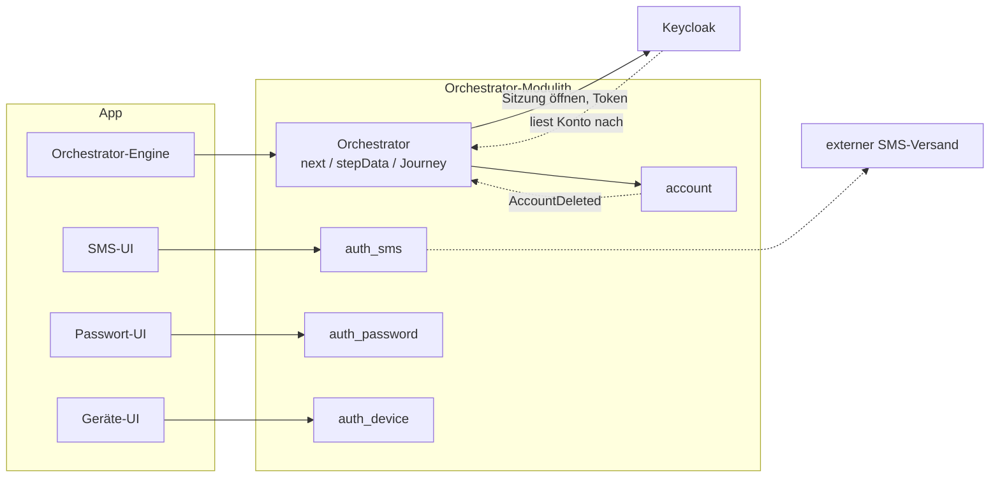
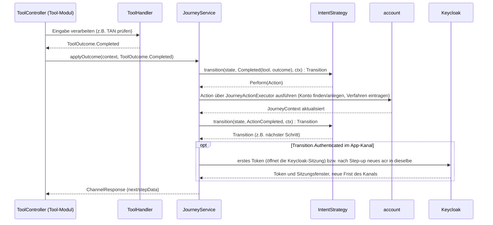

# Tool-Architektur

Ein *Tool* ist ein konkretes Verfahren, um jemanden zu identifizieren, ein Anmeldeverfahren
einzurichten oder sich anzumelden (`ident-fsc`, `enroll-sms`, `auth-sms`). Dieses Dokument
beschreibt, wie Tools sich selbst beschreiben und was sie über die Grenze ihres Moduls melden.

Was der Orchestrator mit diesen Meldungen macht, steht in [04-orchestrierung.md](04-orchestrierung.md).
Ein durchgehendes Beispiel, das ein neues Verfahren von Anfang bis Ende anbindet, steht in
[15-beispiel-neues-verfahren-backend.md](15-beispiel-neues-verfahren-backend.md) (Server und Web-Kanal)
und [17-beispiel-neues-verfahren-app.md](17-beispiel-neues-verfahren-app.md) (App). Was ein
einzelnes Verfahren im Besonderen tut, steht auf seiner Seite unter
[verfahren/](verfahren/README.md); die HTTP-Seite eines Tools in [05-api.md](05-api.md) Abschnitt 2.

---

## Einstieg: Zusammenspiel an einem Schritt

Aus Sicht des Backends ist der Orchestrator ein Modulith mit eigenen Tool-Modulen; einzelne Module
geben Arbeit ihrerseits an externe Dienste ab:



So arbeiten der Orchestrator und ein Tool-Modul wie `auth_sms` bei einem konkreten Schritt
zusammen:



Keycloak kommt in einem Schritt nur vor, wenn er die Anmeldung eines App-Kanals abschließt: Dann
öffnet der Übergang nach `AUTHENTICATED` die Keycloak-Sitzung
([ADR-43](adr/ADR-043-kanal-lebt-nicht-laenger-als-die-keycloak-sitzung.md)). Konten spiegelt
Keycloak nicht, es liest ein Konto
bei Bedarf selbst beim Orchestrator nach ([ADR-38](adr/ADR-038-keycloak-liest-konten.md)). Das Modul
`account` spricht nie selbst mit Keycloak. Nur wenn ein Konto gelöscht wird, meldet es
`AccountDeleted`, und nach dem Commit räumt der Orchestrator (`KeycloakAccountRemovalListener`) die
Daten ab, die Keycloak selbst zu diesem Konto hält, etwa Sitzungen
([05-api.md](05-api.md) Abschnitt 3b, „Keycloak liest die Konten – keine Spiegelung“).

Was der `ToolHandler` intern tut, um zu diesem `ToolOutcome` zu kommen, gehört bewusst nicht zu
diesem Bild. Er arbeitet mit eigener Fachlogik auf einem eigenen Schema (`ToolDB`), auf das nichts
außerhalb des Moduls zugreift.

Für Sie als Backend-Entwickler heißt das:

- **Ihr Modul bleibt Ihr Modul.** Ein Tool-Modul wie `auth_sms` hat sein eigenes Schema
  (`ToolDB`), auf das nichts von außen zugreift. Sie können dort die Fachlogik ändern, ohne die
  Journey oder andere Module überhaupt lesen zu müssen.
- **Der Vertrag ist klein und stabil.** Ihr `ToolHandler` liefert nur ein `ToolOutcome`. Was das
  für die Journey, ihren Zustand und den nächsten Schritt bedeutet, entscheidet allein die
  `IntentStrategy`. Beim Schreiben eines Tools müssen Sie also nie die ganze Zustandsmaschine im
  Kopf haben.
- **App- und Web-Kanal sind für Sie gleich.** Journey, Tool und `next` funktionieren für beide
  Zugänge gleich ([05-api.md](05-api.md)); Sie schreiben keine Sonderfälle für einen einzelnen
  Kanal in Ihr Modul.
- **Den Ablauf zum Ausstellen der Tokens müssen Sie nicht bauen.** Das übliche OIDC mit Keycloak
  ist auf dem Server einmal umgesetzt. Ihr Modul liefert nur das Ergebnis eines Verfahrens, nie
  selbst ein Token.

---


## 1) Begriffe: Tool, Verfahren, Rolle, `ToolSession`

Ein **Verfahren** (Methode, `method`) ist ein Weg, etwas nachzuweisen, etwa `sms` oder `kobil`. Es
gehört genau einem Modul, das es einmal deklariert (Abschnitt 2). Ein **Tool** ist eine Rolle
dieses Verfahrens: `enroll-sms` richtet es ein, `auth-sms` meldet damit an, `auth-sms-lookup` meldet
über die E-Mail-Adresse an. Welche Tools es gibt, zeigt der Katalog in Abschnitt 8; jedes Verfahren
hat dort seine eigene Seite unter [verfahren/](verfahren/README.md).

`toolId` (z. B. `ident-fsc`, `enroll-sms`, `auth-sms`) bezeichnet Art und Verfahren in einem
einzigen Namen. Die `toolId` wird nicht gespeichert, sondern aus der Route abgeleitet; über sie
werden Handler und Datenklasse des Moduls ausgewählt.

`ToolSession` ist die dritte und kurzlebigste Ebene (`ChannelSession` → `AuthJourney` →
`ToolSession`). Sie steht für genau einen Durchlauf eines Tools: Daten zu dessen Lebenszyklus und
die Arbeitsdaten des Tools selbst. Diese hält das Tool als einfache Datenklasse
(`AuthSmsToolSession`: Enrollment, TAN-Hash, Ablaufzeit) und speichert sie über `ToolSessionData`;
der Orchestrator legt sie als JSON an die Zeile, liest sie aber nie
([ADR-49](adr/ADR-049-arbeitsdaten-der-tools-am-orchestrator.md)). Ein Modul braucht dafür weder
Tabelle noch Aufräumen.

Der Tool-Katalog ist **keine zentral gepflegte Tabelle**. Er entsteht aus den Angaben, die die Module
über sich selbst machen (`ToolModule` mit seinen Tools, Abschnitt 2). In den Begriffen des
[externen Glossars](glossar/externes-glossar.md): Tools der Rolle `IDENTIFICATION` sind Identifizierungsmittel, die
Tools der Rollen `ENROLLMENT` und `KNOWN_ACCOUNT_AUTH`/`ACCOUNT_LOOKUP_AUTH` gehören zu
Anmeldeverfahren ([Abgleich mit dem externen Glossar](glossar/abgleich-externes-glossar.md)).

Die **Rolle** (`ToolRole`) sagt, was ein Tool tut. Neben `IDENTIFICATION`, `ENROLLMENT` und
`KNOWN_ACCOUNT_AUTH` gibt es vier Rollen, die eine Erklärung brauchen:

- `role=ATTESTATION` (`confirm-email`) kennzeichnet den Nachweis, ein Attribut des Kontos zu
  kontrollieren: kein Credential, keine Identität. Wann ein Tool diese Rolle hat, steht in
  Abschnitt 4.
- `role=ACCOUNT_LOOKUP_AUTH` kennzeichnet Anmeldungen, die ihr Subjekt aus der Eingabe selbst finden statt
  über den Kanal. Die `-lookup`-Varianten haben dieselbe `method` wie ihr Gegenstück mit
  `KNOWN_ACCOUNT_AUTH` und finden das Konto über eine eingegebene E-Mail-Adresse; ohne diese
  Unterscheidung wäre die Auswahl der Kandidaten mehrdeutig. `auth-invite-lookup` hat kein Gegenstück und
  findet über Nummer und Einmalkennwort eine Einladung statt eines Kontos
  ([Verfahren `invite`](verfahren/invite.md)).
- `role=CORRELATION` (`ident-kvnr`) kennzeichnet einen Schritt, der nur zuordnet. Für sich beweist
  er nichts: Eine eingetippte KVNR oder Partnernummer ist kein Nachweis. Er ist nie Kandidat einer
  (erneuten) Identifizierung, denn `forIdentification` und `reIdentCandidates` nehmen nur Tools
  der Rolle `IDENTIFICATION`. Starten lässt er sich erst, wenn die Identität bereits bestätigt ist
  (`requires`, ADR-18). `factorTypes = {}` folgt aus dieser Rolle, definiert sie aber nicht.
- `approve-qr` hat die Rolle `ToolRole.PEER_APPROVAL`, denn
  keine der übrigen Rollen passt auf „bestätigt, was jemand anderes tut". Was diese Rolle zum Niveau
  beiträgt, steht in Abschnitt 4.

---

## 2) Ein Verfahren deklarieren: `ToolModule`

Jedes Modul deklariert sein Verfahren genau einmal, in `<Modul>ToolModule.kt` (z. B.
`tools/auth_kobil/KobilToolModule.kt`). Die Deklaration ist eine reine Selbstbeschreibung ohne
Abhängigkeiten, getrennt von der Fachlogik in `internal`. Dieselbe Datei trägt die Angaben für
Spring Modulith (`@ApplicationModule` an der gleichnamigen Klasse `KobilToolModule`) und gibt das
`ToolModule` als Bean heraus. Der Orchestrator sammelt die Module beim Start ein und bildet daraus
den Katalog aus Abschnitt 8 (`ToolHandlerRegistry`). Die Deklaration hat zwei Teile: Was das
Verfahren ist, beschreibt `toolModule(…)`; jedes seiner Tools ist danach ein eigener Wert, am Modul
registriert:

```kotlin
internal const val ENROLL_KOBIL_TOOL_ID = "enroll-kobil"
internal const val AUTH_KOBIL_TOOL_ID = "auth-kobil"

internal val KobilModule = toolModule(
    method = "kobil",
    name = Text("KOBIL"),
    proves = factors(POSSESSION, KNOWLEDGE, INHERENCE, upTo = AcrLevel.LOA2),
    demoOnly = "Die KOBIL-Gegenstelle ist simuliert (kobil); …",
    onePerDevice = true,
    stepData = KobilStepData,                  // in api/v1/KobilStepData.kt, neben den Formen
)

internal val EnrollKobil = KobilModule.enroll(ENROLL_KOBIL_TOOL_ID, versions = setOf(1), hint = Text("An das Gerät gebunden …"), startStep = "activate")
internal val AuthKobil = KobilModule.login(AUTH_KOBIL_TOOL_ID, versions = setOf(1), hint = Text("An das Gerät gebunden …"), startStep = "unlock")
```

Die `toolId` steht als Konstante genau einmal im Modul: Die Deklaration nennt sie, und der
Controller des Tools nimmt dieselbe Konstante für seine Pfade. `versions` nennt die Fassungen, die
der Server führt, ohne Vorgabewert; je Fassung gibt es einen Controller unter
`/tools/api/<toolId>/v<N>` ([ADR-51](adr/ADR-051-versionen-als-pfadsegment.md); wann ein Tool eine
neue Fassung braucht: [API](05-api.md) Abschnitt 2). Auf das Tool selbst zeigt der
Controller über `ToolController.tool` (`override val tool = AuthKobil`); seine Kontext-Parameter
(`ActivationToolContext`, `AuthorizedToolContext`, `ToolContext`) werden für dieses Tool aufgelöst. Dass Pfad und Tool übereinstimmen und
jede deklarierte Fassung genau einen Controller hat, prüft `ToolControllerMappingTest`.

Was das **Modul** angibt, gilt für alle seine Tools:

| Angabe | Bedeutung |
|---|---|
| `method` | z. B. `"sms"` – verbindet `enroll-sms`, `auth-sms` und `auth-sms-lookup` |
| `name` | wie Nutzer das Verfahren nennen, z. B. `Text("SMS")`: die einzige Stelle; App und Login-Seite lesen ihn aus `GET /tools/catalog` |
| `proves` | Faktortypen und Niveau, die ein Nachweis des Verfahrens höchstens erbringt (`factorTypes`, `maxAcr`) |
| `onePerDevice` | ein Eintrag je Gerät, an dessen Schlüssel gebunden (Abschnitt 5) |
| `demoOnly` | gesetzt, wenn das Verfahren nur in der Demo taugt (ADR-36) |
| `stepData` | die Formen von `stepData`, mit denen die Tools antworten: eine Map vom `kind` auf die Form mit Beschreibung und Beispielen, deklariert neben den Klassen |

Jedes **Tool** entsteht über die Fabrik seiner Rolle, eine Funktion am Modul. Die Fabrik legt die
Rolle fest, nimmt die `toolId` und nur die Angaben, die diese Rolle machen darf, und registriert das
Tool sofort. Jede Fabrik verlangt außerdem `hint`, ein paar Worte dazu, was das Tool tut
(„Code an die hinterlegte Telefonnummer“), und nimmt optional `name`: ein eigener Name statt des
Modulnamens, für ein Tool, das nach seinem Zweck heißt („Mit App anmelden“ für `auth-qr-lookup`).

| Fabrik | Rolle | `toolId` | Eigene Angaben |
|---|---|---|---|
| `identify(…)` | `IDENTIFICATION` | `ident-<m>` | `also` (Name, Vornamen und Geburtsdatum sind immer dabei), `vouchedBy`, `requires`, `startStep` |
| `correlate(…)` | `CORRELATION` | `ident-<m>` | `claims`, `vouchedBy`, `requires`, `startStep` |
| `confirm(…)` | `ATTESTATION` | `confirm-<m>` | `claims`, `startStep`; erbringt keinen Faktor |
| `enroll(…)` | `ENROLLMENT` | `enroll-<m>` | `claims`, `requires`, `startStep`, `withoutUserStep` (`enroll-email`), `optInOnly` (`enroll-qr`, erbringt keinen Faktor), `changeable` (`enroll-sms`, `enroll-password`: ein neuer Lauf ändert den Eintrag, [`MANAGE_AUTH_METHODS`](journeys/manage-auth-methods.md)) |
| `login(…)` | `KNOWN_ACCOUNT_AUTH` | `auth-<m>` | `startStep` |
| `lookupLogin(…)` | `ACCOUNT_LOOKUP_AUTH` | `auth-<m>-lookup` | `startStep` |
| `approve(…)` | `PEER_APPROVAL` | `approve-<m>` | `startStep`; erbringt keinen Faktor |

`withoutUserStep` kennzeichnet ein Tool, das ohne Schritt des Nutzers auskommt: `enroll-email`
macht die schon bestätigte Adresse beim Start sofort zum Anmeldeverfahren. Der Orchestrator startet
ein solches Tool nie von selbst, auch nicht als einzigen Kandidaten, sondern zeigt die Auswahl mit
diesem Text, der sagt, was die Wahl bewirkt.

Daraus ergeben sich die Felder eines `Tool`: `toolId`, `role`, `name`, `hint`, `startStep` (sonst
`role.defaultStartStep`), `claims` (eigene Claims nennen das Tool als Quelle), `requires`,
`withoutUserStep`, und durchgereicht `method`, `factorTypes`, `maxAcr`, `demoOnly`.

Die Entscheidungen dahinter:

- Jedes Modul deklariert sein Verfahren einmal (Methode, Faktortypen, Niveau) und darunter je Rolle
  ein Tool; es gibt keinen zentral zu pflegenden Katalog. Alle Tools einer Methode haben damit
  dasselbe Niveau und dieselbe Schlüsselbindung, und das Niveau eines eingerichteten Verfahrens
  hängt nicht davon ab, welches seiner Tools man fragt.
- Die `toolId` steht ausgeschrieben in der Deklaration, damit man sie dort liest wie in URL,
  Admin-Seite und Doku. Frei wählbar ist sie trotzdem nicht: Sie muss zu Methode und Rolle passen
  (`ToolRole.toolIdFor`): `ident-<m>` (Identifizierung und Korrelation), `confirm-<m>`,
  `enroll-<m>`, `auth-<m>`, `auth-<m>-lookup`, `approve-<m>`. Umgekehrt wird die Methode nie aus der `toolId` gelesen: `enroll-sms` und
  `auth-sms` gehören zum Modul `sms`, darüber findet ein Tool zum Anmelden die passende Zeile in
  `account.auth_method`.
- `factorTypes` ist eine **Menge**, weil ein Verfahren mehrere Faktoren zugleich erbringen kann:
  `enroll-device`/`auth-device` und `enroll-kobil`/`auth-kobil` deklarieren bis zu drei
  Faktortypen und erbringen je Durchlauf zwei davon mit `loa2` (ein an das Gerät gebundenes
  Credential plus System-PIN oder Biometrie).
- `maxAcr` und `factorTypes` dienen der Vorauswahl: Kann dieses Tool eine Lücke überhaupt schließen?
  Was ein konkreter Durchlauf tatsächlich erreicht hat, meldet `Completed` – nie mehr, als das Tool
  zulässt (Abschnitt 3).
- Zentral bleibt nur, was ein Modul nicht wissen *kann*: welches Niveau sich aus einer
  **Kombination** von Nachweisen ergibt und welches Niveau eine Ressource verlangt. Das ist Sache der
  `AuthPolicy` ([Orchestrierung](04-orchestrierung.md)).

**Was beim Registrieren geprüft wird.** Durch diesen Aufbau sind ausgeschlossen: verschiedene
Niveaus, Faktoren oder Schlüsselbindungen innerhalb einer Methode, ein Tool über dem Niveau seines
Moduls, Angaben, die zur Rolle nicht passen, und eine Identifizierung ohne Name, Vornamen und
Geburtsdatum (ADR-39). Beim Registrieren eines Tools geprüft wird, dass seine `toolId` zu Methode und
Rolle passt, dass keine Rolle doppelt vorkommt (Identifizierung und Korrelation teilen sich
`ident-<m>`, schließen sich also aus) und dass nur das Personenverzeichnis für eine KVNR einsteht;
beim Start, dass jede Methode nur ein Modul hat. Sobald der Katalog ein Modul eingesammelt hat,
nimmt es keine Tools mehr an: Ein später registriertes Tool fehlte sonst still im Katalog. Deshalb
stehen alle Tools eines Moduls in seiner Datei, gleich unter `toolModule(…)`.

**Jedes Identifizierungsverfahren liefert Name, Vorname und Geburtsdatum.** Danach wird eine Person
im Änderungsprotokoll wiedergefunden, auch nach der Löschung ihres Kontos (ADR-39).
`ToolHandlerRegistry` verweigert den Start, wenn ein Verfahren der Rolle `IDENTIFICATION` eines der
drei nicht deklariert.

---

## 3) Was ein Tool meldet: `ToolOutcome`

Über die Grenze eines Moduls geht nur ein `ToolOutcome`: Das Verfahren läuft noch, ist
abgeschlossen oder ist fehlgeschlagen.

| Variante | Bedeutung |
|---|---|
| `InProgress(nextStep, stepData, demo)` | läuft weiter; `stepData` ist für den Client bestimmt und wird unverändert weitergegeben, `demo` enthält nur Demo-Werte (ADR-28) |
| `Failed.*(reason, …)` | Versuch fehlgeschlagen, eine Variante je Rolle (siehe unten); wie es mit weiteren Versuchen weitergeht, steht in [Orchestrierung](04-orchestrierung.md) |
| `Completed.Identified(claims, ...)` | Identität festgestellt; höchstens ein `PERSON_ID`-Claim (eine Partnernummer). Verfahren, die nur bezeugen, was sie lesen (`ident-eid`, `ident-nect`), liefern keinen |
| `Completed.Attested(claims)` | Attribut bestätigt; kein `enrollmentRef`, `amr` leer, kein eigenes Niveau (Abschnitt 4) |
| `Completed.Enrolled(enrollmentRef, ...)` | Verfahren eingerichtet |
| `Completed.Authenticated(subject?, ...)` | Nachweis erbracht; `subject` setzen nur die `ACCOUNT_LOOKUP_AUTH`-Tools: das Konto (`Subject.Account`) oder, bei `auth-invite-lookup`, die Einladung (`Subject.Invitation`) |
| `Completed.Approved(...)` | Ein `PEER_APPROVAL`-Tool (`approve-qr`) hat eine fremde Anfrage bestätigt |

- `InProgress.stepData` ist **für den Client bestimmt** (z. B. `missingFields`); `Completed` und
  `Failed` sind **für den Orchestrator bestimmt** und werden nie direkt an den Client
  weitergegeben.
- `Completed.Authenticated.subject` setzen nur die Tools der Rolle `ACCOUNT_LOOKUP_AUTH`, die ihr
  Subjekt selbst finden. Die gewöhnlichen `auth-*`-Tools kennen das Konto schon über den Kanal.

Ein Fehlschlag nennt über seine Variante, gegen wen der Versuch lief – davon hängt ab, welche
Sperre nach zu vielen Versuchen greift. Das Subjekt ist ein Pflichtfeld; „niemand“ ist ein
ausdrückliches `null`, kein vergessener Standardwert:

- **`KnownAccountAuth(reason)`** (`KNOWN_ACCOUNT_AUTH`): gegen das Konto, das der Kanal schon kennt.
- **`AccountLookupAuth(reason, attempted)`** (`ACCOUNT_LOOKUP_AUTH`): gegen das Konto (`Attempted.Account`), das
  die Eingabe ergab, oder `null`. Ein Einmalkennwort gehört einer Person: `auth-invite-lookup` nennt
  `Attempted.Person`, und es zählt die Personen-Mengenbegrenzung wie beim Freischaltcode.
- **`Identification(reason, attemptedPersonId)`** (`IDENTIFICATION`, `CORRELATION`): gegen die
  Person, die die Eingabe ergab, oder `null`.
- **`NothingGuessed(reason)`** (`ENROLLMENT`, `ATTESTATION`, `PEER_APPROVAL`): Kein Geheimnis eines
  bestehenden Kontos wurde geraten; es zählt keine Sperre.

Eine Variante, die nicht zur Rolle des Tools passt, weist der Orchestrator als Vertragsfehler
des Moduls ab, bevor er etwas bucht; das gilt für `Failed` wie für `Completed`.

Jeder gemeldete Claim wird vor der Verarbeitung geprüft (`Claim.validateValue`): Er darf nicht leer
sein, ein `PERSON_ID` muss eine Partnernummer sein (`tool_api.values.PartnerNumber`, `P` und neun Ziffern) und
ein Geburtsdatum ein ISO-Datum.

**`amr`, `achievedAcr` und `factorTypes`.** Jede `Completed`-Variante trägt außerdem `amr` (die
nachgewiesenen Verfahren, für `SessionEvidence.amr`), `achievedAcr` und `factorTypes`, aber **nur,
wo der Durchlauf von der Deklaration abweicht**: `null` heißt „wie deklariert“. `amr` und
`achievedAcr` liefert jedes Tool selbst, weil dasselbe Verfahren je nach Durchlauf unterschiedliche
Niveaus erreichen kann. Der Orchestrator liest die Werte über das
Tool (`Tool.amrOf`, `levelOf`, `factorsOf`): `amr` ist dann die Methode (leer bei einem Tool ohne
eigenen Nachweis), das Niveau `maxAcr`, die Faktoren die des Tools. Ausdrücklich gemeldet werden
nur echte Abweichungen: das Gerät und KOBIL (Faktoren und `amr` je nach Entsperren), Nect (`amr`
und Niveau je Dokument), die Einladung (ihr Niveau) und `enroll-email` (kein `amr`). Die Variante
muss zur Rolle des Tools passen und legt fest, was der Orchestrator tut.

---

## 4) Welche Rolle für ein neues Tool?

Es entscheidet, was der Nachweis beweist:

- **`IDENTIFICATION`**: wer die Person ist. Der Nachweis zählt auf der Achse IDENTITY und hebt das IAL;
  Name, Vorname und Geburtsdatum sind Pflicht (Abschnitt 2). Gleich, ob das Personenverzeichnis für
  die Werte einsteht (`ident-fsc`) oder das Verfahren selbst (`ident-eid`, `ident-nect` lesen das
  Dokument). `CORRELATION` (`ident-kvnr`) ordnet nur zu und beweist nichts (ADR-18).
- **`ATTESTATION`**: der Inhaber kontrolliert ein Attribut, das dem Konto als Anker gehört
  (`AttributeAuthority.Local`) und das auch ohne das eigene Verfahren gebraucht wird: Die
  Lookup-Tools finden das Konto über die E-Mail-Adresse, `enroll-password` und `enroll-email`
  setzen sie voraus.
- **`ENROLLMENT`**: das Attribut gehört dem Verfahren (`AttributeAuthority.MethodModule`) und entsteht
  und vergeht mit ihm. So die Mobilnummer: `enroll-sms` beweist die Kontrolle mit derselben TAN,
  mit der es das Verfahren einrichtet, und nichts anderes hängt an der Nummer. Deshalb gibt es kein
  `confirm-phone`. Sobald ein Lookup oder ein anderes Verfahren die Nummer braucht, wird sie wie die
  E-Mail-Adresse ein Anker (ADR-17).

### `ATTESTATION`: ein Attribut bestätigen ist weder Identifizierung noch Anmeldung

`confirm-email` weist nach, dass jemand eine Adresse **kontrolliert**: Dort kommt ein Code an. Das
ist weder „wer bist du" (`IDENTIFICATION`) noch „weise ein Mittel nach" (`KNOWN_ACCOUNT_AUTH`)
noch „richte ein Mittel ein" (`ENROLLMENT`). Deshalb gibt es die Rolle `ToolRole.ATTESTATION` mit dem Ergebnis
`ToolOutcome.Completed.Attested`: Claims ja, `enrollmentRef` nein, `amr` leer und kein eigenes
Niveau. Der Anker wird unter dem Niveau geschrieben, das die Sitzung schon nachgewiesen hat; eine
bestätigte Adresse hebt das Niveau des Kanals nie an.

`ATTESTATION` als `IDENTIFICATION` einzuordnen, wäre falsch: `CandidateTools.forIdentification` und
`DefaultAuthPolicy.reIdentCandidates` böten das Tool dann als Identifizierung an, und über
`enrolledUnderAcr` stiege die Obergrenze der danach eingerichteten Verfahren (ADR-5). Welche
Variante zu welcher Rolle passt, prüft der Orchestrator bei jedem Ergebnis (`Completed.fits`,
`Failed.fits`).

Die Kontaktdaten des Personenverzeichnisses (E-Mail-Adresse, Mobilnummer) sind **kein** Attribut
des Kontos: Der Port `PersonDirectory` gibt sie nicht heraus, nur die Demo-Vorbelegung liest sie
(`DemoPersonDirectory`). Die E-Mail-Adresse des Kontos stammt allein aus `confirm-email`
([Verfahren `email`](verfahren/email.md)). Was davon in Tokens steht: [API](05-api.md) Abschnitt 3a,
„ID-Token-Claims".

Über die KVNR lässt sich keine Kontrolle nachweisen, nur die Zugehörigkeit zur Person. Sie gehört
also zu `CORRELATION`; ein `attest-kvnr` gibt es nicht.

### `PEER_APPROVAL`: bestätigen, was jemand anderes tut

Tools der Rolle `PEER_APPROVAL` tragen nichts zu ACR und AMR des *eigenen* Kanals bei
(`evidenceAxis` ist für sie `null`), werden nie als Kandidat angeboten, um eine Lücke zu schließen,
und nur ausdrücklich per `intent` gestartet. Weil `ToolRole` ein abgeschlossenes `enum` ist und
`evidenceAxis` jede Rolle ausdrücklich behandelt, muss eine neue Rolle angeben, was sie zum Niveau
beiträgt. Lehnt jemand eine fremde Anfrage ab, braucht das **kein**
eigenes `ToolOutcome`; `Failed(reason = "Vom Nutzer abgelehnt")` genügt.

---

## 5) Angebot: Voraussetzungen, Verfügbarkeit, Reihenfolge, Bindung an ein Gerät

Welche Tools eine Journey anbietet, bestimmen neben Rolle und Niveau diese allgemeinen Regeln:

- `requires` wird gegen die zusammengeführten Claims des Kontos geprüft
  (`AccountProfile.establishedClaims`, also Angaben abzüglich der Widerrufe, ADR-12). Die Prüfung
  läuft zweimal: bei der Auswahl der Kandidaten und noch einmal beim Start des Tools
  (`ToolJourneyService.validatePreconditions`). Sonst ließe sich die Kandidatenliste durch
  einen direkten Aufruf umgehen. Drei Tools nutzen `requires` heute: `enroll-password` und
  `enroll-email` verlangen `ClaimRequirement(EMAIL, PROVEN)`, `ident-kvnr` die bestätigten
  Identitätsattribute `FAMILY_NAME`, `GIVEN_NAMES` und `BIRTH_DATE` (ADR-18).
- `requires` entscheidet **nicht nur über das Angebot, sondern gilt dauerhaft** (ADR-24): Was ein
  Credential brauchte, um zu entstehen, braucht es auch, um weiter zu bestehen. Fällt die Angabe
  weg, fällt das Credential mit – und mit ihm alles, was daran hängt. Das wird aus denselben
  Deklarationen ermittelt (`CredentialRules.dependentsOfLostClaims`). Eine Abhängigkeit
  zwischen zwei Verfahren braucht deshalb keine eigenen Begriffe: Ein Modul schreibt beim
  Einrichten einen Claim, ein anderes verlangt ihn, und das Protokoll der Claims erledigt den
  Rest. `enroll-password` schreibt dafür `PASSWORD_EXISTS`. Heute fragt das niemand ab, aber so
  ließe sich eine solche Abhängigkeit ausdrücken.
- Die **Verfügbarkeit** wird auf zwei unabhängigen Ebenen bestimmt, beide als Mengen von
  `toolId`s. Der Client gibt beim Anlegen des Kanals an, welche Tools er darstellen kann, jedes in
  der einen Fassung, die er spricht (`availableTools` als `enroll-sms@1`, fest für den ganzen Kanal,
  [ADR-51](adr/ADR-051-versionen-als-pfadsegment.md)); für das Angebot zählt nur die `toolId`,
  die Fassung bestimmt den Pfad der Aufrufe. Der Betreiber kann zusätzlich jede Fassung eines
  Tools **je Kanaltyp** (App oder Web) zur Laufzeit sperren (`ToolAvailabilityService`, ADR-32);
  gesperrt ist dann jeder Kanal, der genau diese Fassung deklariert hat. Bei jeder
  Anfrage zählt nur, was in beiden Mengen steht (`JourneyRouting.availableToolsOf`); das wird an
  drei Stellen geprüft. Bleibt nichts übrig, bricht die Journey genauso ab
  (`exhausted`/Cancel), als hätte der Nutzer alle Kandidaten abgelehnt.
- Auch die **Reihenfolge** legt der Betreiber je Kanaltyp fest: eine Rangfolge der Tools, die jede
  Auswahl in diesem Kanal übernimmt. Sie wirkt nur innerhalb einer Rolle (`ToolRole`), denn
  jede Auswahl zeigt nur Tools einer Rolle; die Admin-Seite gruppiert entsprechend. Tools ohne
  Rang stehen dahinter, sortiert nach Rolle und Verfahren. Sortiert wird erst beim Ausliefern der
  Auswahl (`JourneyRouting.stepFor`), nicht im gespeicherten Angebot der Journey. Eine geänderte
  Reihenfolge gilt so schon für den nächsten Bildschirm einer laufenden Journey (ADR-32).
- `onePerDevice` (`device`, `kobil`): Das Credential liegt als nicht exportierbarer Schlüssel auf
  genau einem Gerät, und mehrere aktive Einträge desselben Verfahrens dürfen nebeneinander bestehen,
  einer je Gerät. Sonst ersetzt ein neues Einrichten den alten Eintrag. Daraus folgen die **Regeln
  für Speichern, Angebot und Widerruf**: Die Zeile in `account.auth_method` trägt selbst, ob sie
  neben anderen bestehen darf (`allows_multiple_instances`). `AuthPolicy.authCandidates` bietet nur
  den Eintrag an, der auf dem Schlüssel des anfragenden Geräts liegt (`AuthMethodView.boundKeyRef`).
  `usableByCaller` prüft zusätzlich, dass das Gerät laut `DeviceAccountLink` noch mit diesem Konto
  verknüpft ist. Und wird das Gerät neu verknüpft, widerruft `JourneyActionExecutor` genau die
  Credentials, die auf diesem Schlüssel liegen.
- Was über einen Eintrag auf diesem Schlüssel **angezeigt** werden darf, meldet das Modul beim
  Einrichten selbst (`Completed.Enrolled.reference`, beim Gerät der Kanalschlüssel, bei KOBIL die
  Gerätekennung von KOBIL). So kann der Orchestrator sagen, wodurch dieses Gerät sonst noch bekannt
  ist (`device-link.boundCredentials`), ohne die Daten des Moduls zu kennen.
- Mehrere Einträge und die Bindung an ein Gerät sind **ein** Schalter, weil heute jedes Verfahren
  mit mehreren Einträgen auch an einen Schlüssel gebunden ist. Ein künftiges Verfahren, das nur
  mehrere Einträge nebeneinander erlaubt, bräuchte einen eigenen Schalter.

---

## 6) Modulinterner Aufbau: das `Flow`-Muster (optional)

Ein Tool-Modul darf sich intern frei organisieren. Nur das `ToolOutcome` verlässt das Modul, nie
ein interner Zustand. Ein mögliches, aber nicht vorgeschriebenes Muster ist ein reiner `Flow` (z. B. `AuthSmsFlow`): Er
kennt nur seinen eigenen `State` und leitet aus `(State, Input)` eine `Decision` ab (z. B.
`AuthSmsDecision.WrongTan`). Der Handler führt danach die Effekte aus (z. B. „TAN senden"),
speichert den Zustand und übersetzt die `Decision` in ein `ToolOutcome`.

---

## 7) Wo der Controller lebt: `tool_api` als Modulgrenze

Jedes Tool hat einen eigenen Controller, der seinen Handler direkt und typisiert aufruft, statt
über eine allgemeine `Map<String, Any?>`. Es gibt keine Verteilung anhand der `toolId` zur
Laufzeit ([Projektrahmen](08-projektrahmen.md) A11: „Lesbarkeit hat Vorrang vor einer maximal
generischen API-Anbindung"). Die `EnrollmentRef` wird im Controller aufgelöst und geprüft, bevor
der Handler aufgerufen wird; der Handler bekommt also nie einen Parameter, der `null` sein könnte.

Der `@RestController` eines Tools liegt **im selben Modul wie sein Handler** (z. B.
`ident_fsc.api.v1.IdentFscToolController`, `auth_sms.api.v1.AuthSmsToolController`), nicht im
`orchestrator`. Der Orchestrator kennt kein Tool-Modul beim Namen: `orchestrator/OrchestratorModule.kt`
deklariert `allowedDependencies = ["tool_api", "account", "texts", "demo_mode"]`,
also kein einziges Tool-Modul (`ident_*`, `auth_*`).

Möglich macht das das gemeinsame Modul `tool_api` (`allowedDependencies = ["texts"]`), das beide
Seiten kennen dürfen. Die Selbstbeschreibung eines Tools (Abschnitt 2) liegt in seiner Wurzel, die
Ports liegen in Unterpaketen nach Thema ([Projektrahmen](08-projektrahmen.md) M8):

- **`ToolJourney`** – die Journey, so weit ein Tool-Controller sie sieht: Tool starten, Kontext
  laden, Ergebnis anwenden, Journey abbrechen. Implementiert von `ToolJourneyService` im
  `orchestrator` und per Konstruktor übergeben.
- **`Lockouts`** – die Sperren des Orchestrators nach Rateversuchen (`isLockedOut`,
  `isIdentLockedOut`), zum Lesen für Tools, die ihr Subjekt selbst auflösen (Lookup- und
  Identifizierungs-Tools). Geschrieben werden sie nur vom Orchestrator, aus dem `Failed`-Ergebnis des Tools.
  Implementiert von `LockoutsService`.
- **`AccountDirectory`** / **`PersonDirectory`** / **`DeviceProofs`** – schmale Schnittstellen zum
  Lesen und Prüfen von Daten zu Konto, Person und Geräte-Proof (z. B. findet `auth-sms-lookup`
  darüber ein Konto anhand der E-Mail-Adresse). Implementiert von `AccountService` (`account`),
  `Personenverzeichnis` (`personenverzeichnis`) bzw. `DeviceProofValidator` (`orchestrator`),
  jeweils direkt im Domänenservice, ohne eigene Adapterklasse. Den Freischaltcode prüft `ident_fsc`
  ebenfalls über einen Port, `ActivationCodes` (`digest`, `isValid`), den `Freischaltcodes`
  implementiert (ADR-31, Nachtrag). Das Personenverzeichnis ist damit nur über Ports erreichbar; an
  ihnen wechselt die Sprache vom Deutsch des Registers ins Englische unseres Codes.
  `PersonDirectory` löst eine KVNR (`findPersonIdByKvnr`) oder eine Partnernummer
  (`findPersonIdByPartnerNumber`) zur PersonId auf, gleicht Personalien ab (`matchesMasterData`,
  `matchesPersonalDetails`) und gibt die Mitgliedsnummer (`memberNumberOf`) und den
  Anzeigenamen (`displayName`) heraus – nie die übrigen Stammdaten.
- **`IdentityResolver`** – beantwortet, ob bestätigte Claims zu einem bestehenden Konto gehören
  (`resolve`, `attestedIdentityMatches`). Implementiert von `IdentityMatchingService` (`account`).
- **`KeycloakToolCalls`** – Tool-Aufrufe, die Keycloak für ein Konto macht, das es schon kennt,
  ohne Kanal und Journey: sein eigenes Passwortformular (`MgmtPasswordController` in
  `auth_password`, [Verfahren `password`](verfahren/password.md)). Der Port prüft, dass die
  Peer-Auth-Assertion genau dieses Konto nennt, und
  bucht das Ergebnis wie in einer Journey: einen Nachweis auf die Kontosperre, ein Einrichten als
  Claims und Verfahrensinstanz. Implementiert von `KeycloakToolCallsService` (`orchestrator`). Ein
  Modul, das eine Anfrage wegen des Kontozustands ablehnt, wirft `InvalidStateException` (`409`).
- **`PasswordCredentialPort`** – prüft oder ersetzt das Passwort hinter einer `EnrollmentRef` für
  Aufrufer ohne Kanal und Tool-Sitzung: das Entsperren per Passwort in `auth_kobil` und die Prüfung
  im Passwortformular von Keycloak (`MgmtPasswordController`); implementiert in `auth_password`.
- **`RateLimit`** / **`RateLimits`** – das Zählwerk des Orchestrators, geliehen an die
  Module ([ADR-44](adr/ADR-044-zaehlwerk-im-orchestrator-regeln-in-den-modulen.md)). Ein Modul
  leitet je Mengenbegrenzung eine Klasse von `RateLimit` ab und legt dort Grenze und Zeitfenster fest;
  welchen Schlüssel es zählt und wann es zurücksetzt, entscheidet sein Handler. So begrenzen
  `auth_sms` (`SmsSendLimit`) und `auth_email` (`EmailSendLimit`) selbst, wie viele Codes sie an
  eine Nummer oder Adresse schicken. Der Namensraum einer Mengenbegrenzung folgt aus Modul und Klasse, ein
  Modul kann also nur in seinem eigenen zählen. Eine Mengenbegrenzung ist keine Sperre: Sie begrenzt den
  Versand, nicht das Raten ([Betrieb](07-betrieb.md) Abschnitt 4). `RateLimits` implementiert
  `ModuleRateLimits` (`orchestrator`); es speichert den Schlüssel nur als HMAC. Ein Modul, das
  selbst etwas ablehnt, wirft dafür `TooManyRequestsException` (`tool_api`, `429`), aber nur, wo
  die Ablehnung nichts verrät.
- **`PersonChanged`** – kein Port, sondern ein Event: die Änderungsmeldung des
  Personenverzeichnisses (Partnernummer, geänderte Attributarten, neue KVNR und
  Mitgliedsnummer). Es liegt hier, damit `personenverzeichnis` es veröffentlichen und
  `account` darauf reagieren kann (`PersonChangeListener`), ohne dass die beiden Module einander
  kennen (ADR-34).
- **`EnrollmentCleanup`** – die umgekehrte Richtung: eine Schnittstelle, über die in einem
  Tool-Modul geschrieben wird, wenn ein Konto gelöscht wird ([API](05-api.md) Abschnitt 3a, „Konto
  löschen"). Jedes Modul mit eigener, langlebiger Credential-Tabelle (`auth_sms.enrollment`,
  `auth_password.enrollment`, `auth_device.enrollment`, `auth_qr.enrollment`,
  `auth_kobil.enrollment`; der Tabellenname ist `EnrollmentRef.type`) bringt dafür eine
  `@Component`-Implementierung mit, die über `enrollmentType` angesprochen wird. `auth_email`
  braucht keine, weil die bestätigte E-Mail-Adresse dem Modul `account` gehört
  ([Verfahren `email`](verfahren/email.md)).
  `AccountDeletionService` (`orchestrator`) sammelt alle `EnrollmentCleanup`-Beans ein, so wie
  `ToolHandlerRegistry` die `ToolModule`-Beans. Weder `orchestrator` noch `account` müssen dafür
  ein Tool-Modul beim Namen kennen.
- **Envelope-DTOs** (`ChannelResponse`, `ChannelBlock`, `ActiveMethodView`, `Next`, `DemoInfo`) –
  das gemeinsame Antwortformat, das jeder Tool-Controller zurückgibt.
- **`LeaveToolController`** – der einzige allgemeine Tool-Controller. Die `toolId` steht nur als
  Pfadparameter darin, eine Logik eines bestimmten Tools hat er nicht: Er verlässt ein Tool, als
  Ablehnen (`DELETE`) oder als Zurück zur Auswahl (`POST …/back`). Ein anderes Tool startet er nie;
  das aktiviert der Client danach selbst. Er liegt im Orchestrator
  (`orchestrator.api.v1.tool`), weder in einem Tool-Modul noch in `tool_api`: Was danach kommt,
  entscheidet der Zustand der Journey, und `tool_api` ist der Vertrag zwischen den Modulen, keine
  Web-Schicht.

Beide Seiten zeigen auf dieselbe Schnittstelle, nie direkt aufeinander: Ein Tool-Modul ruft
Methoden von `ToolJourney` auf, ohne `ToolJourneyService` oder den `orchestrator` zu kennen; der
`orchestrator` liest nie einen Handler eines Tool-Moduls. Die HTTP-Pfade
(`/tools/api/<toolId>/v<N>/...`) hängen nicht davon ab, in welchem Modul ein Controller liegt, denn Spring ordnet Anfragen nach
`@RequestMapping` zu, nicht nach dem Kotlin-Package. Details zur Modulliste und zur Richtung der
Abhängigkeiten: [Projektrahmen](08-projektrahmen.md) Abschnitt 3.

---

## 8) Die Verfahren

Der Katalog, wie ihn die Module heute deklarieren. Jedes Verfahren hat eine eigene Seite mit Ablauf,
Datenmodell, Aufrufen und Fehlerfällen; die Übersicht steht in [verfahren/README.md](verfahren/README.md).

| toolId | role | method | factorTypes | maxAcr | allowsMultipleInstances |
|---|---|---|---|---|---|
| `ident-fsc` | `IDENTIFICATION` | [`fsc`](verfahren/fsc.md) | `{possession}` | `loa2` | — |
| `ident-eid` | `IDENTIFICATION` | [`eid`](verfahren/eid.md) | `{possession,knowledge}` | `loa3` | — |
| `ident-nect` | `IDENTIFICATION` | [`nect`](verfahren/nect.md) | `{possession,knowledge,inherence}` | `loa3` | — |
| `ident-kvnr` | `CORRELATION` | [`kvnr`](verfahren/kvnr.md) | `{}` | `loa2` | — |
| `confirm-email` | `ATTESTATION` | [`email`](verfahren/email.md) | `{}` | `loa1` | — |
| `enroll-sms` / `auth-sms` | `ENROLLMENT` / `KNOWN_ACCOUNT_AUTH` | [`sms`](verfahren/sms.md) | `{possession}` | `loa1` | `false` |
| `enroll-password` / `auth-password` | `ENROLLMENT` / `KNOWN_ACCOUNT_AUTH` | [`password`](verfahren/password.md) | `{knowledge}` | `loa1` | `false` |
| `enroll-email` / `auth-email` | `ENROLLMENT` / `KNOWN_ACCOUNT_AUTH` | [`email`](verfahren/email.md) | `{knowledge}` | `loa1` | `false` |
| `auth-sms-lookup` / `auth-password-lookup` / `auth-email-lookup` | `ACCOUNT_LOOKUP_AUTH` | `sms`/`password`/`email` | wie das Gegenstück ohne `-lookup` | `loa1` | `false` |
| `enroll-device` / `auth-device` | `ENROLLMENT` / `KNOWN_ACCOUNT_AUTH` | [`device`](verfahren/device.md) | `{possession,knowledge,inherence}` | `loa2` | `true` |
| `enroll-kobil` / `auth-kobil` | `ENROLLMENT` / `KNOWN_ACCOUNT_AUTH` | [`kobil`](verfahren/kobil.md) | `{possession,knowledge,inherence}` | `loa2` | `true` |
| `enroll-qr` / `auth-qr` / `auth-qr-lookup` | `ENROLLMENT` / `KNOWN_ACCOUNT_AUTH` / `ACCOUNT_LOOKUP_AUTH` | [`qr`](verfahren/qr.md) | `{}` / `{possession,knowledge}` / `{possession,knowledge}` | `loa2` | `false` |
| `approve-qr` | `PEER_APPROVAL` | [`qr`](verfahren/qr.md) | `{}` | `loa2` | — |
| `auth-invite-lookup` | `ACCOUNT_LOOKUP_AUTH` | [`invite`](verfahren/invite.md) | `{possession}` | `loa2` (je Einladung `loa1` oder `loa2`) | — |
