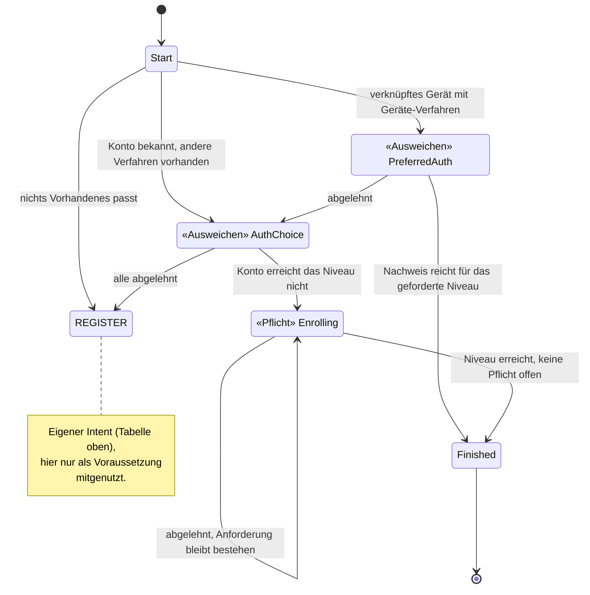
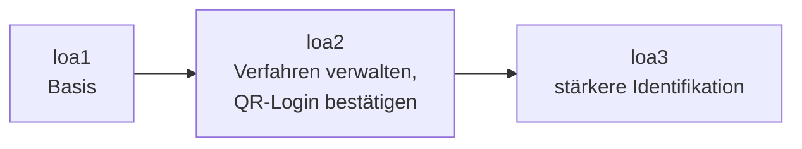

# Orchestrierung und Policy

Dieses Kapitel beschreibt, wie der Orchestrator einen Nutzer zu seinem Ziel führt. Es erklärt auch,
wer entscheidet, welches Tool wann angeboten wird. Ein **Tool** ist dabei ein einzelner, in sich
abgeschlossener Schritt, etwa „SMS-Code eingeben“ oder „mit dem Online-Ausweis identifizieren“.

Das Kapitel setzt den Vertrag über `ToolOutcome` voraus, also die Art, wie ein Tool sein Ergebnis
meldet. Er steht in [03-tool-architektur.md](03-tool-architektur.md).

---

## Einstieg für Fachexperten

Jeder Ablauf, den ein Nutzer durchläuft, ist nach seinem *Ziel* benannt und nicht nach seinem
technischen Ablauf. Im System heißt ein solches Ziel **Intent**. Die folgende Tabelle ordnet jedem
fachlichen Ziel seinen Namen im System zu:

| Ziel aus fachlicher Sicht | Heißt im System |
|---|---|
| Möglichst reibungslos anmelden, mit Ausweichmöglichkeiten | `FAST_ACCESS` |
| Sich bewusst neu identifizieren, auch auf einem bekannten Gerät | `REGISTER` |
| Klassisch anmelden, ohne das Gerät mit dem Konto zu verknüpfen | `LOOKUP_LOGIN` |
| Auf der Website anmelden oder das Niveau anheben, mit Auswahl aus allen dort nutzbaren Verfahren | `WEB_SELECT_METHOD` |
| Das Sicherheitsniveau anheben (z. B. für eine heikle Aktion) | `STEP_UP` |
| Anmeldeverfahren hinzufügen oder entfernen | `MANAGE_AUTH_METHODS` |
| Das Konto unwiderruflich löschen | `DELETE_ACCOUNT` |
| Eine QR-Anmeldung auf einem anderen Gerät bestätigen | `CONFIRM_PEER_LOGIN` |
| Sich abmelden, nach einer Rückfrage | `LOGOUT` |
| Sich erneut identifizieren, wenn nichts anderes mehr hilft | `RE_IDENTIFY` |

Angenommen, jemand hat eine fachliche Frage, etwa: „Darf man X löschen, ohne sich frisch
auszuweisen?“ Die Antwort steht dann in genau *einem* dieser Bausteine (Abschnitt 3). Sie ist nicht
über mehrere Schichten des Codes verstreut.

Für jeden Intent gibt es ein vollständiges Zustandsdiagramm. Darin sind jeder Zustand, jeder
Übergang und jede Bedingung zu sehen. Hier ein Ausschnitt aus `FAST_ACCESS`:

Für die fachliche Prüfung ist eines besonders wichtig: Das System unterscheidet zwei Sorten von
Zuständen. Diese Unterscheidung ist erzwungen und nicht freiwillig. Im Bild oben lässt sie sich
direkt an den Markierungen «Ausweichen» und «Pflicht» ablesen:

- **Ausweichen**: Wer ablehnt, bekommt den nächsten, aufwendigeren Weg angeboten. Ein Beispiel: Der
  Nutzer lehnt die Anmeldung per Gerät ab, also bietet das System ein anderes Verfahren an. Das ist
  eine Bequemlichkeit für den Nutzer. Sie gilt aber nur, solange am Ende trotzdem das geforderte
  Sicherheitsniveau erreicht wird.
- **Pflicht**: Ablehnen führt nicht weiter. Die Anforderung bleibt bestehen, bis sie erfüllt ist.
  Das gilt für alles, was nicht verhandelbar ist, zum Beispiel das geforderte Sicherheitsniveau.

Angenommen, ein Fachexperte findet einen Fehler wie „Das sollte doch Pflicht sein, nicht
Ausweichen“. Das lässt sich dann an *diesem* Bild klären, ohne dass Entwickler dazukommen müssen.

Manche Anforderungen kommen in mehreren Intents vor. „Erneut identifizieren, wenn nichts anderes
mehr hilft“ gehört zum Beispiel zu `FAST_ACCESS` und ebenso zu anderen Abläufen. Im Diagramm oben
ist sogar ein ganzer eigener Intent (`REGISTER`) nur die Voraussetzung für einen anderen.

Beides ist im System als eigenständige **Sub-Journey** gebaut, also als untergeordneter Ablauf, den
ein anderer Ablauf aufruft (`RE_IDENTIFY`, `REGISTER`, siehe Abschnitt 7). Mehrere Intents können
eine Sub-Journey anstoßen, beschrieben ist sie aber nur einmal. Ändert sich die fachliche Regel für
die erneute Identifizierung oder die Registrierung, ändert sie sich deshalb an *einer* Stelle, und
zwar für alle Abläufe, die sie nutzen.

Außerdem verlangt jede Aktion ein bestimmtes **Sicherheitsniveau**, kurz **Niveau**. Es gibt die
Stufen `loa1`, `loa2` und `loa3` (Abschnitt 4). Je heikler die Aktion, desto höher das geforderte
Niveau:

Um Verfahren zu verwalten oder das Konto zu löschen, braucht man `loa2`. Für ein Konto, das nie
identifiziert wurde, reicht `loa1` (`selfServiceAcrFloor`). Beide Aktionen verlangen zusätzlich
einen frischen Nachweis, der höchstens fünf Minuten alt ist (Abschnitt 4). `loa3` verlangen sie
nicht.

Festgelegt ist das genau an der Stelle im Modell, an der der jeweilige Intent beschrieben ist. Eine
fachliche Entscheidung wie „Die QR-Bestätigung braucht künftig einen frischen Nachweis, kein altes
Niveau“ ist damit eine gezielte und nachvollziehbare Änderung an der Beschreibung dieses einen
Intents.

Schließlich protokolliert das System jeden Schritt, den ein Nutzer durchläuft. Das Protokoll heißt
**Journey-Trace** und ist einsehbar. Es zeigt, welches Verfahren wann angeboten, angenommen oder
abgelehnt wurde und welches Niveau am Ende erreicht war. Für eine fachliche Frage oder eine Frage
der Revision („Warum konnte dieser Nutzer sein Konto ohne erneute Prüfung löschen?“) muss man also
nichts aus verteilten Systemlogs zusammensuchen.

Ein konkretes Beispiel, das eine Person durch mehrere dieser Intents führt, steht in
[11-beispiel-story.md](11-beispiel-story.md). Insgesamt folgt aus diesem Aufbau:

- **Fachliche Regeln stehen an einer Stelle, nicht verstreut im Code.** Jeder Intent hat sein
  eigenes, vollständiges Zustandsdiagramm. Man kann es prüfen, ohne die Implementierung zu kennen.
- **Ausnahmen sind sichtbar, nicht versteckt.** Das Modell zeigt ausdrücklich, ob ein Zustand
  ausweicht oder eine Pflicht ist, welches Niveau eine Aktion verlangt und welche Wege zu einer
  erneuten Identifizierung führen.
- **Wiederverwendete Abläufe gibt es fachlich nur einmal.** Ändert man eine Regel in einer
  Sub-Journey, wirkt das überall, wo sie eingebunden ist. Es entstehen keine Varianten, die sich
  unbemerkt voneinander unterscheiden.
- **A/B-Tests werden möglich.** Ein Intent wie `FAST_ACCESS` ist ein eigenständiges, in sich
  geschlossenes Modell. Deshalb lässt sich für denselben Intent eine zweite Variante der Journey
  danebenstellen und im laufenden Betrieb ausspielen.

---

## 1) Begriffe

Das [Glossar](glossar/glossar.md) erklärt die Begriffe dieses Kapitels: Intent, Journey, Zustand,
Tool, Anmeldeverfahren, Schritt und Niveau. Wie sie den Wörtern des
[externen Glossars](glossar/externes-glossar.md) entsprechen, zeigt der
[Abgleich](glossar/abgleich-externes-glossar.md).

**Tool** und **Anmeldeverfahren** sind zwei verschiedene Dinge. Ein Anmeldeverfahren (kurz
Verfahren) ist etwas, das im Konto eingerichtet ist und mit dem sich der Nutzer später anmelden
kann, etwa `sms`. Ein Tool ist ein einzelner Ablauf, der mit einem Verfahren arbeitet. So sind
`enroll-sms` (SMS einrichten) und `auth-sms` (mit SMS anmelden) zwei Tools für *ein* Verfahren
(`sms`). Ein Konto hat also Anmeldeverfahren. Angeboten und gestartet werden dagegen Tools.

Drei weitere Wörter klingen ähnlich, meinen aber verschiedene Dinge:

- **Kandidaten** sind die Tools, die grundsätzlich in Frage kommen. Sie kommen aus dem Katalog bzw.
  aus der Policy.
- Aus den Kandidaten wird das **Angebot**, das ein Zustand festhält. Das Angebot sind die
  Kandidaten ohne die abgelehnten und ohne die nicht verfügbaren Tools (`activatable()`, siehe
  [Tool-Architektur](03-tool-architektur.md) Abschnitt 5, Verfügbarkeit).
- Eine **Auswahlseite** zeigt der Client nur, wenn das Angebot mehr als einen Eintrag hat.

Bleibt im Angebot nichts übrig, geht es genauso weiter, als hätte der Nutzer alle Kandidaten
abgelehnt. Die Journey geht dann zurück zur Identifizierung oder bricht ab (über
`exhausted`/Cancel). Einen eigenen Fehlerzustand für nicht verfügbare Tools gibt es nicht.

---

## 2) Die Intents

### Was ein Intent ist

Ein **Intent** ist das Ziel des Nutzers *zusammen mit* der Strategie, die ihn dorthin führt. Er
beantwortet drei Fragen, und zwar für jeden Intent anders:

- Welche Tools dürfen hier überhaupt angeboten werden, und in welcher Reihenfolge?
- Was bedeutet es in diesem Zusammenhang, wenn ein Tool abgeschlossen ist?
- Wann ist das Ziel erreicht?

Ein Intent beschreibt ausdrücklich **nicht**, was am Ende herauskam. Ob ein Durchlauf eine
Registrierung oder eine Anmeldung war, erkennt man erst an dem Weg, der tatsächlich gegangen wurde.

### Die Intents im Überblick

Ein **Kanal** ist die Verbindung eines Nutzers zum Orchestrator. Es gibt den `APP`-Kanal (die
Smartphone-App) und den `WEB`-Kanal (die Website, angebunden über Keycloak). Die Intents lassen sich
danach ordnen, wie sie beginnen:

- Vier **Einstiegs-Intents** starten eine neue Sitzung im `APP`-Kanal.
- `WEB_SELECT_METHOD` ist der Einstieg des Web-Kanals für die Anmeldung und den Step-up, also das
  Anheben des Niveaus. `REGISTER` ist zusätzlich über den Web-Kanal erreichbar (siehe unten).
- Fünf weitere Intents laufen innerhalb einer bestehenden Sitzung.
- `CONFIRM_PEER_LOGIN` ist die Ausnahme: Er ist **beides zugleich** (eigener Abschnitt unten).

| `AuthIntent` | Zweck | Einstieg |
|---|---|---|
| `FAST_ACCESS` | So schnell wie möglich auf diesem Gerät angemeldet sein, und zwar so, dass es auch künftig klappt | `POST /app/channels` (Standard) |
| `REGISTER` | Sich bewusst frisch identifizieren, auch auf einem schon verknüpften Gerät | `POST /app/channels` mit `intent=register` (App) bzw. `PATCH /kc/channels/{id}` mit `intent=register` (Web, siehe unten) |
| `LOOKUP_LOGIN` | Ein bestehendes Konto anmelden, ohne das Gerät zu verknüpfen (klassische Anmeldung wie im Web) | `POST /app/channels` mit `intent=lookup_login` |
| `WEB_SELECT_METHOD` | Alle im Web-Kanal nutzbaren Tools in einem Auswahlschritt (`selectMethod`) anbieten. Um das Ausweichen auf andere Verfahren kümmert sich Keycloak selbst. Gibt es beim Step-up kein passendes Verfahren, bietet die Journey die erneute Identifizierung an (`RE_IDENTIFY`) | Standard-Einstieg des `WEB`-Kanals ([05-api.md](05-api.md) Abschnitt 3b) |
| `STEP_UP` | Das Niveau anheben | nur auf einem Kanal, der `AUTHENTICATED` (angemeldet) ist |
| `MANAGE_AUTH_METHODS` | Verfahren hinzufügen oder entfernen | nur auf einem Kanal, der `AUTHENTICATED` ist |
| `CONFIRM_PEER_LOGIN` | Eine wartende Anmeldung im Web per `auth-qr`/`auth-qr-lookup` bestätigen oder ablehnen | `POST /app/channels` mit `intent=confirm_peer_login` **oder** `POST /channels/{id}/peer-logins` auf einem Kanal, der `AUTHENTICATED` ist. Beide Wege prüfen dasselbe |
| `DELETE_ACCOUNT` | Das Konto unwiderruflich löschen | nur auf einem Kanal, der `AUTHENTICATED` ist |
| `LOGOUT` | Abmelden nach einer Rückfrage | nur auf einem Kanal, der `AUTHENTICATED` ist |
| `RE_IDENTIFY` | Erneute Identifizierung als gemeinsam genutzte Sub-Journey | nie direkt, nur über `RequireSubJourney` |

**`CONFIRM_PEER_LOGIN` ohne bestehende Sitzung.** Startet `CONFIRM_PEER_LOGIN` ohne bestehende
Sitzung, bietet er nie eine Identifizierung oder Registrierung an. Ist über die
Geräteverknüpfung (`DeviceAccountLink`) kein Konto bekannt, bricht die Journey sofort ab (410). Ist
ein Konto bekannt, gilt eine feste Schwelle von `loa2`. Der Nutzer muss sie per `STEP_UP` erreichen.
Anders als bei `MANAGE_AUTH_METHODS` gibt es dabei keinen Ausweg über eine erneute Identifizierung
(`allowReIdentification = false`). Reichte das Niveau schon *vor* diesem Durchlauf, verlangt
`CONFIRM_PEER_LOGIN` zusätzlich einen frischen Nachweis, so wie `DELETE_ACCOUNT` (eigener Abschnitt
unten).

**`REGISTER`** ist ein eigener Intent mit eigener Journey (`RegisterState`). Er schlägt nicht in der
Geräteverknüpfung (`DeviceAccountLink`) nach und bietet nie eine schon bestehende
Geräteverknüpfung an. Auch `FAST_ACCESS` nutzt diese Journey: Muss sich jemand beim schnellen
Anmelden erst identifizieren, startet `REGISTER` als vorgeschalteter Schritt
(`Transition.RequireSubJourney`). Das folgt demselben Muster wie `RE_IDENTIFY`.

`REGISTER` erzwingt **kein** zweites Konto. Dieselbe Person findet dasselbe Konto wieder; erkannt
wird sie über die KVNR oder die Partnernummer. Umgekehrt entsteht ein zweites Konto auf einem
verknüpften Gerät nur über `intent=register`. Als vorgeschalteter Schritt des schnellen Anmeldens
kennt der Kanal nämlich schon das Konto des Geräts. Eine fremde Person ohne Konto wird dort
abgewiesen und bekommt nicht still ein neues Konto ([register.md](journeys/register.md)).

**Welches Konto gilt.** Mit welchem Konto der Kanal gerade arbeitet, sagt allein
`ChannelSession.accountId`. `AuthJourney.accountId` hält nur fest, für welches Konto eine Journey
lief. Es dient als Nachweis und wird für keine Entscheidung gelesen.

**Fortsetzen und Abbrechen.** Der gewählte Intent wird in der `ChannelSession` gespeichert, also in
den Daten des Kanals. Fortsetzen und Abbrechen starten denselben Intent erneut. Eine abgebrochene
Anmeldung über die E-Mail-Adresse (`LOOKUP_LOGIN`) beginnt also wieder als Anmeldung über die
E-Mail-Adresse. Solange der Kanal nicht angemeldet ist, zeigt die App danach trotzdem ihre
Startseite ([Frontend](10-frontend.md) FE-16).

---

## 3) Die Journeys

### Was eine Journey ist

Eine **Journey** (im Code `AuthJourney`) ist ein laufender Durchlauf zu einem Intent, also ein
geführter Ablauf mit mehreren Schritten. Sie gehört zu genau einem Kanal (`ChannelSession`) und
lebt kürzer als dieser. Je Kanal ist immer höchstens eine Journey aktiv.

Beginnt eine neue Journey auf oberster Ebene, bricht `JourneyService.start` die noch laufende
Journey ab, samt den Eltern-Journeys, die für sie pausiert wurden. Nur eine Sub-Journey läuft neben
ihrer pausierten Eltern-Journey ([Invarianten](invarianten.md) I-3).

Die Journey hält fest, was für den ganzen Weg gilt: den Intent, das Konto, das Versuchsbudget und
den Lebenszyklus. Sie hält aber nicht fest, wo der Nutzer gerade steht. Das steht im Zustand
(`JourneyState`).

Intent und Journey verhalten sich zueinander wie `Tool` und `ToolSession`: Das eine benennt die
*Art*, das andere ist *ein Durchlauf* davon. Ein Kanal kann nacheinander mehrere Journeys desselben
Intents durchlaufen.

Wie die Sitzungsebenen zusammenhängen (Kanal, Journey, Zustand, Tool-Durchlauf), zeigt
[02-domaenenmodell.md](02-domaenenmodell.md) Abschnitt 1.

### Zustand (`JourneyState`)

Der **Zustand** (`JourneyState`) sagt, wo die Journey gerade steht. Er enthält die Angaben, die genau
an dieser Stelle gelten. Das ist etwa, *welche* Tools angeboten und *welche* schon verworfen wurden
oder *welche* `ToolSession` gerade laufen darf.

Jeder Intent hat seine eigene, abgeschlossene Menge von Zuständen. Die Zustände von
`MANAGE_AUTH_METHODS` lassen sich zum Beispiel für `LOOKUP_LOGIN` gar nicht ausdrücken.

Der Zustand ist außerdem die einzige Quelle für zwei Fragen: „Welches Tool darf der Client jetzt
starten?“ und „Wohin schicke ich ihn als Nächstes?“. Beide Fragen beantwortet dieselbe Funktion
(Abschnitt 6).

#### Zwei Sorten von Übergang

Ein **Übergang** ist der Wechsel von einem Zustand zum nächsten. Einen erfolgreichen Nachweis
behandeln alle Zustände gleich: Er bringt die Journey weiter. Verschieden ist nur, was
**Ablehnen** bewirkt:

- In einem **Ausweichzustand** führt Ablehnen weiter, und zwar zum nächsten, aufwendigeren Weg.
  Mehrere solche Zustände hintereinander bilden eine **Ausweichkette** vom bequemsten zum
  aufwendigsten Weg. So ist `FAST_ACCESS` aufgebaut. Gibt es nichts Aufwendigeres mehr, endet die
  Journey.
- In einem **Pflichtzustand** führt Ablehnen nicht weiter. Die Pflicht bleibt bestehen, und das
  volle Angebot kommt zurück, auch das gerade verworfene Tool. Nur wer die Pflicht erfüllt, kommt
  weiter.

Beide Sorten kommen in derselben Menge von Zuständen vor, etwa in `FAST_ACCESS`. Welche Sorte ein
Zustand ist, muss im Code sichtbar sein.

### Tool

Ein **Tool** ist ein einzelner Ablauf, zum Beispiel `ident-fsc`, `enroll-sms` oder `auth-device`.
Es weiß nichts über Journeys, Intents oder Reihenfolgen. Es meldet nur sein Ergebnis als
`ToolOutcome` ([Tool-Architektur](03-tool-architektur.md)). Was dieses Ergebnis bedeutet,
entscheidet der Intent.

### Die Journeys im Einzelnen

Für alle Diagramme gelten diese Lesehilfen:

- Ein Pfeil ist ein Übergang. Ausgelöst wird er durch ein Ereignis (`JourneyEvent`), etwa „Tool
  abgeschlossen“, „Tool abgebrochen“ oder „untergeordnete Journey fertig“.
- „abgelehnt“ heißt: Das Tool ist gescheitert oder der Nutzer hat es verworfen, und in diesem
  Zustand ist nichts mehr übrig.
- Endzustände (`Finished`) sind eingezeichnet, werden aber **nicht** als Zustand gespeichert. Das
  Ende einer Journey ist ein Übergang: `Authenticated` im Erfolgsfall, sonst `Logout`, `Cancel`
  oder `Abort`.

Jede Journey hat eine eigene Datei unter [`journeys/`](journeys/). So lässt sich eine einzelne
Journey nachschlagen, ohne alle zu laden.

| Journey | Datei |
|---|---|
| `FAST_ACCESS` | [fast-access.md](journeys/fast-access.md) |
| `REGISTER` | [register.md](journeys/register.md) |
| `LOOKUP_LOGIN` | [lookup-login.md](journeys/lookup-login.md) |
| `WEB_SELECT_METHOD` | [web-select-method.md](journeys/web-select-method.md) |
| `STEP_UP` | [step-up.md](journeys/step-up.md) |
| `RE_IDENTIFY` | [re-identify.md](journeys/re-identify.md) |
| `MANAGE_AUTH_METHODS` | [manage-auth-methods.md](journeys/manage-auth-methods.md) |
| `CONFIRM_PEER_LOGIN` | [confirm-peer-login.md](journeys/confirm-peer-login.md) |
| `DELETE_ACCOUNT` | [delete-account.md](journeys/delete-account.md) |
| `LOGOUT` | [logout.md](journeys/logout.md) |
| `REGISTER`, Experiment „Erst Anmeldeverfahren einrichten“ | [register-enroll-first.md](journeys/register-enroll-first.md) |
| Lebenszyklus, unabhängig vom Intent | [02-domaenenmodell.md](02-domaenenmodell.md) Abschnitt 3, „Lebenszyklus der AuthJourney“ |

---

## 4) Niveaus und AuthPolicy

Die Strategien entscheiden nicht selbst, was genug ist. Sie fragen dafür die **`AuthPolicy`**, also
die Regeln, nach denen der Orchestrator aus den Nachweisen einer Sitzung das Niveau berechnet. Die
`AuthPolicy` beantwortet diese Fragen:

- Reichen die vorhandenen Nachweise (`isSatisfied`)?
- Welches Niveau ergibt sich aus ihnen (`resolveAcr`)?
- Welche Tools kommen als Nachweis, zur erneuten Identifizierung oder zum Einrichten in Frage?
- Kann ein Konto ein Niveau grundsätzlich erreichen, unabhängig vom aktuellen Nachweis
  (`reachability`)?

Zwei Begriffe aus dem Standard OpenID Connect tauchen dabei immer wieder auf. **`acr`** ist das
erreichte Niveau einer Anmeldung, hier `loa1`, `loa2` oder `loa3`. **`amr`** ist die Liste der
Verfahren, mit denen sich der Nutzer angemeldet hat (siehe [Glossar](glossar/glossar.md)).

Damit ein Niveau erreicht ist, müssen zwei Bedingungen zusammen erfüllt sein:

1. **Niveau**: `resolveAcr(evidence) >= requiredAcr`. Das aus den Nachweisen berechnete Niveau muss
   also mindestens so hoch sein wie das geforderte. Welche `amr`-Kombination welchen `acr`-Wert
   ergibt, ist fachlich und regulatorisch offen. RFC 8176 legt zwar ein IANA-Verzeichnis für
   `amr`-Werte fest (`pwd`, `otp`, `hwk`/`swk`, `user`, `face`, `fpt`, `mfa`, …). Es legt aber
   nicht fest, welche Kombination welches Niveau ergibt. Die `amr`-Werte dieses Projekts folgen
   einer eigenen Konvention: `sms`, `password`, `email`, `fsc`, `eid`, `kvnr`,
   `nect-<verfahren>`, `device`, `kobil`, `qr`, `invite`, dazu `pin`/`biometric` aus der Prüfung
   am Gerät.
2. **Verschiedene Faktortypen**: Ein **Faktortyp** ist die Art eines Beweises: etwas, das man weiß
   (Wissen), etwas, das man hat (Besitz), oder etwas, das man ist (Inhärenz, etwa ein
   Fingerabdruck). Für die Niveaus ab `loa2` braucht es mindestens zwei **verschiedene**
   Faktortypen. Gezählt werden alle `factorTypes` aller abgeschlossenen Tools zusammen, nie die
   Anzahl der Tools. Ein Tool, das selbst zwei Faktortypen meldet (z. B. ein Passkey mit Prüfung
   am Gerät), ist allein schon ein Anmeldeverfahren mit zwei Faktoren. Das ist MFA im engeren Sinn.

Eine wichtige Einschränkung gilt dabei: Ein Tool darf nur Faktoren melden, die es dem Server
gegenüber tatsächlich **nachweisen** kann. Eine App-PIN zum Beispiel wird nur lokal auf dem Gerät
geprüft. Für sie gehört deshalb nur `{possession}` in den Descriptor, die Selbstbeschreibung des
Tools.

**Davon gibt es zwei benannte Ausnahmen: `device` und `kobil`.** Beide melden zusätzlich `knowledge`
bzw. `inherence`. Das leiten sie aus dem Weg ab, auf dem der Nutzer das Credential entsperrt hat,
also seinen Schlüssel auf dem Gerät. Wie er das getan hat, kann der Server nicht sehen. Er kann nur
lesen, was der Client angibt (`tool_api.DeviceProofs`, `UserVerification`).

Das ist hier bewusst als **eine Ausnahme** notiert, nicht als zwei Einzelfälle. Der Grund: Würde
derselbe Weg zum Entsperren in zwei Verfahren verschieden bewertet, würde dieselbe Handlung je Tool
unterschiedlich viel zählen, ohne dass der Nutzer den Grund sieht (ADR-21). Bei `kobil` ist dafür
die andere Hälfte, der Besitz, stärker belegt als anderswo. Er beruht auf einer Bestätigung, die
das Backend selbst beim Anbieter einlöst, und nicht auf einer Signatur des Clients.

### Ein Nachweis über loa1 altert

Ein **Nachweis** ist das, was ein Nutzer in seiner laufenden Sitzung bewiesen hat, etwa „Passwort
richtig vor zehn Minuten“. Jeder Nachweis enthält den Zeitpunkt, zu dem er erbracht wurde
(`MethodEvidence.provenAt`).

Für ein Niveau über `loa1` zählen nur Nachweise, die jünger sind als
`identity.policy.loa2-max-age`. Das sind 30 Minuten, gleich dem `loa-max-age` des LoA-2-Subflows in
Keycloak. Ältere Nachweise zählen nur noch als `loa1`.

Die Regel steht in der `AuthPolicy` und gilt deshalb für beide Kanäle. Nach 30 Minuten meldet der
Kanal also `loa1`. Ein Ziel ab `loa2` verlangt dann einen neuen Nachweis. Dabei wird auch das schon
benutzte Verfahren wieder angeboten.

Wiederhergestellte Nachweise (`RestoreData`, ein von Keycloak aufbewahrter Stand früherer
Nachweise) behalten ihren Zeitpunkt. Ein Nachweis ohne Zeitpunkt gilt als beliebig alt. Ohne diese
Regel würde der Weg über `RestoreData` ein einmal erreichtes `loa2` über jeden neuen Durchlauf bis
zum Ende der Sitzung festhalten.

### Ein frischer Nachweis für Verwaltung, Löschen und QR-Bestätigung

Neben dem Niveau gibt es eine zweite, kürzere Frist. `AuthPolicy.hasFreshProof` sagt, ob der
jüngste Nachweis der Sitzung jünger ist als `identity.policy.self-service-max-age` (5 Minuten). Das
Niveau des Nachweises spielt dabei keine Rolle. Ein Nachweis ohne Zeitpunkt ist nie frisch.

Folgende Abläufe handeln nur mit einem frischen Nachweis und verlangen sonst eine erneute
Bestätigung:

- `DELETE_ACCOUNT` ([`DELETE_ACCOUNT`](journeys/delete-account.md)),
- jeder Wunsch von `MANAGE_AUTH_METHODS`, also hinzufügen, ändern, entfernen und Attribut
  zurücknehmen ([`MANAGE_AUTH_METHODS`](journeys/manage-auth-methods.md)),
- `CONFIRM_PEER_LOGIN` ([`CONFIRM_PEER_LOGIN`](journeys/confirm-peer-login.md)).

Wiederhergestellte Nachweise behalten ihren Zeitpunkt. Deshalb macht ein neuer Durchlauf im Web
einen alten Nachweis nicht wieder frisch.

**Das `acr` im Token altert nicht.** Es hat die Bedeutung, die Keycloak ihm gibt: Es beschreibt die
Anmeldung, nicht das laufend aktuelle Niveau. Keycloak schreibt beim Erneuern eines Tokens dasselbe
`acr` wieder hinein. `loa-max-age` wirkt erst beim nächsten Anmeldedurchlauf. Ein Token kann deshalb
noch `loa2` enthalten, während der Kanal schon `loa1` meldet. Eine Anwendung, die ein frisches `loa2`
braucht, fragt deshalb mit `acr_values=2` neu an (dann gilt die Frist) oder prüft `auth_time`.

### IAL und AAL: zwei Fragen, ein `acr`-Wert

`resolveAcr` beantwortet zwei voneinander unabhängige Fragen. Die Richtlinie NIST 800-63 nennt sie
IAL und AAL. Erst am Ende fasst `resolveAcr` beide zu dem einen `acr`-Wert zusammen, der nach außen
sichtbar ist:

- **IAL** (`identityAssuranceLevel`, „Wer ist das?“): das höchste `loa`, das ein Verfahren mit der
  Rolle IDENTIFICATION (`ident-fsc`, `ident-eid`, `ident-nect`) **in dieser Sitzung** erbracht hat.
  Es wird bewusst NICHT aus dem Protokoll `account.change_log` (IDENTIFIED) einer früheren Sitzung
  nachgeladen. Denn die `SessionEvidence`, also die Nachweise der Sitzung, gibt es „einmal je Kanal,
  gelöscht beim Abmelden“ (`orchestrator.session.SessionEvidenceRecord`).
- **AAL** (`authenticatorAssuranceLevel`, „Wie stark ist der Nachweis bei DIESER Anmeldung?“): die
  Regel für die Kombination mehrerer Faktoren aus Punkt 2 oben. Sie wird aber ausschließlich über
  Nachweise aus dem Einrichten und dem Anmelden gerechnet.

Es gilt `resolveAcr = max(IAL, AAL)`. Damit das geht, enthält jede Zeile
`MethodEvidence`/`MethodEvidenceRecord` eine `axis`, also die Angabe, zu welcher der beiden Fragen
sie gehört (`EvidenceAxis.IDENTITY` oder `AUTHENTICATOR`, `DefaultAuthPolicy`/`Tool.evidenceAxis()`).
Sie wird aus der `role` des Tools abgeleitet. Ein Schritt mit der Rolle `CORRELATION` wie
`ident-kvnr` hebt keine der beiden Nachweisarten.

Der Grund für die Trennung: Eine Identifizierung darf ihr eigenes `loa` direkt beisteuern. Ein
einzelnes `ident-fsc` erreicht zum Beispiel `loa2`. Sie darf sich aber **nicht** mit einem einzelnen
Anmeldefaktor anderer Art zu einer mehrstufigen Authentifizierung verbinden. Sonst würde ein
gestohlenes Passwort so gelten, als wäre es durch einen weiteren, bei der Anmeldung geprüften
Faktor abgesichert.

**`loa2` ist damit die projekteigene Bezeichnung für AAL2 nach NIST 800-63B.** Es gibt drei
gleichwertige Wege dorthin:

1. ein einzelnes Tool mit zwei eigenen Faktortypen (`device`: Besitz plus Wissen oder Inhärenz),
2. zwei kombinierte Anmelde-Tools mit je einem Faktor unterschiedlicher Art (SMS plus Passwort).
   Im Sinne des [externen Glossars](glossar/externes-glossar.md) ist das eine **mehrstufige
   Authentifizierung** und keine MFA im engeren Sinn, denn jedes der beiden Mittel liefert nur einen
   Faktor. NIST SP 800-63B stellt sie für AAL2 der MFA gleich (mehrere Authenticators, die zusammen
   zwei Faktortypen abdecken). Deshalb zählt sie hier gleich viel wie Weg 1. Die Regel bleibt
   dieselbe, nur der Name ist genau,
3. eine Identifizierung (`ident-fsc`/`ident-eid`/`ident-nect`) allein über ihr eigenes IAL.

Weil Weg 3 gleichwertig ist, bietet die Anmeldung die erneute Identifizierung
(`CandidateTools.forReIdentification`) standardmäßig als Ausweichweg an. Das geschieht, sobald die
vorhandenen Anmeldeverfahren nicht reichen (`StepUpState.forSubJourney`, standardmäßig
`allowReIdentification=true`). `loa3` bzw. AAL3 ist bewusst nicht ausgearbeitet.

### Nachweis der Sitzung ist nicht dasselbe wie Fähigkeit des Kontos

Je nach Art des Zustands stellt die Journey eine andere Frage:

- In einem Zustand zum Anmelden lautet sie: „Reicht das *jetzt*?“ (`isSatisfied`).
- In einem Zustand zum Einrichten lautet sie: „Kann sich der Nutzer damit *künftig wieder anmelden*?“
  (`reachability`).

Eine Identifizierung ist kein dauerhaftes Verfahren. `ident-fsc` zählt zwar für die
`SessionEvidence.factorTypes` dieser Sitzung. Es wird aber im Protokoll `account.change_log`
(IDENTIFIED) gespeichert und nicht in der Liste der Verfahren `account.auth_method`.

Daraus folgt eine Kette von Obergrenzen:

- Die Identifizierung in der Sitzung, in der ein Verfahren eingerichtet wird, begrenzt, welches
  Niveau dabei erreicht werden kann.
- `account.auth_method.enrolled_under_acr` begrenzt, was ein einzelnes Verfahren später liefern
  darf.
- `Completed.achievedAcr` meldet, was der jeweilige Durchlauf tatsächlich erreicht hat.

Ein Kanal, der `loa3` verlangt, braucht also ein Identifizierungsverfahren, das `loa3` erreicht.
Nach einer Identifizierung mit `loa2` bleiben alle danach eingerichteten Verfahren auf `loa2`
begrenzt. Deshalb lässt sich die Untergrenze schon beim Anlegen des Kanals setzen ([API](05-api.md)).

### Untergrenze des Kanals und Ziel eines Durchlaufs

Es gibt zwei Größen, die man leicht für dasselbe Feld hält. Deshalb heißen sie bewusst verschieden:

- **`ChannelSession.acrFloor`** ist die *dauerhafte Untergrenze* des Kanals („auf diesem Kanal nie
  unter `loa3`“). Sie überlebt einzelne Journeys und gilt für jede Journey auf dem Kanal. Sie
  verhindert auch, dass sich jemand beim Entfernen eines Verfahrens selbst aussperrt.
- **`StepUpState.targetAcr`** ist das *Ziel dieses einen Durchlaufs*. Nur `STEP_UP` hat ein solches
  Ziel.

`targetAcr` kann höher liegen als die Untergrenze. Gerechnet wird immer mit dem höheren der beiden
Werte. Nennt der Client ein Niveau (`requiredAcr`), ist das immer eine Untergrenze und nie eine
Erlaubnis. Das Backend setzt `max(Policy-Anforderung, Client-Wunsch)`.

---

## 5) Pflichten sind Zustände

Keycloak kennt „Required Actions“ wie `VERIFY_EMAIL`, also Aufgaben, die ein Nutzer vor dem
Abschluss der Anmeldung erledigen muss. Hier sind sie kein eigenes Konzept, sondern Pflichtzustände:

- „Ein ausreichendes Anmeldeverfahren ist eingerichtet“ *ist* der Zustand `Enrolling`.
- „Die E-Mail-Adresse ist bestätigt“ *ist* der Zustand `ConfirmingEmail`.

Die Reihenfolge der Pflichten ist die Reihenfolge der Zustände: zuerst die bestätigte
E-Mail-Adresse, dann ein ausreichendes Anmeldeverfahren. Die Bestätigung ist kein Anmeldeverfahren,
sondern eine Grundlage des Kontos. Drei Tools finden das Konto über die E-Mail-Adresse, und
`enroll-password` setzt sie voraus. Käme die Bestätigung später, könnte `enroll-password` im ersten
Angebot von `Enrolling` nicht auftauchen. Dieselbe Reihenfolge gilt im Experiment „Erst
Anmeldeverfahren einrichten“ (`EnrollFirstAttestingEmail`,
[register-enroll-first.md](journeys/register-enroll-first.md)).

Ist kein Tool zum Bestätigen verfügbar, weil der Betreiber es gesperrt hat, wird der Schritt
übersprungen. Die Pflicht bleibt dann offen. Sie wird in der Kette der Einrichtungsschritte
(`AuthEnrollCore.afterEnrollment`) erneut angeboten. Dafür hält `Enrolling.emailObligation` den
Vermerk fest.

Für wen eine Pflicht gilt, hängt davon ab, auf welchem Weg der Zustand erreicht wurde. Die Pflicht
zur E-Mail-Bestätigung gilt nur für einen Durchlauf, der über `Identifying` kam, also ein Konto
angelegt oder übernommen hat. Das hält das Attribut `Enrolling.emailObligation` fest. Wer sich
lediglich anmeldet, wird nie nachträglich verpflichtet, eine fehlende E-Mail-Adresse zu bestätigen.
Die Bestätigung wird deshalb erst *nach* dem Zweig `AuthChoice` angeboten, nicht davor.

Beide Pflichten werden aus dem vorhandenen Stand **abgeleitet** (`authenticationMethods`,
`emailConfirmedAt`). Sie stehen nicht in einem eigenen Feld des Kontos.

**Was das kostet, ausdrücklich benannt:** Angenommen, es kommt künftig eine dritte Pflicht dazu, die
*mehrere* Intents betrifft. Dann müsste derselbe Zustand in mehreren Hierarchien geführt werden.
Bei zwei Pflichten ist das die bessere Abwägung. Kommt eine dritte dazu, die mehrere Intents betrifft,
muss die Entscheidung neu geprüft werden.

### Eine dritte Pflicht, auf einen Intent begrenzt

`SecondFactorKindObligation` (`RegisterStrategy`) ist die oben angekündigte dritte Pflicht: die
Pflicht, ein Verfahren einer zweiten Faktorart einzurichten. Sie ist aber enger zugeschnitten, als
der Absatz darüber befürchtet. Sie betrifft **keinen zweiten Intent**, sondern nur `REGISTER` und
nie `FAST_ACCESS`.

Die Bestätigung der E-Mail-Adresse ist kein Einrichtungsschritt
([ADR-17](adr/ADR-017-adresse-bestaetigen-und-e-mail-login-einrichten-sind.md)). Deshalb gilt
die Pflicht in **beiden** Kanälen und auch im Experiment „Erst Anmeldeverfahren einrichten“
(`EnrollFirstSecondFactorKindObligation`). `RegisterStrategy` setzt dafür am Ergebnis von
`AuthEnrollCore.afterEnrollment` an. Anders als `AuthChoice` und `Enrolling` gehört dieser Zustand
allein zu `RegisterState`.

**Wozu sie da ist:** Wer seine eigenen Verfahren verwalten will, braucht `loa2`
([05-api.md](05-api.md)). Endet eine Registrierung darunter, kommt der Nutzer an seine Verfahren
nicht mehr heran. `loa2` verlangt zwei Faktorarten (Abschnitt 4, „IAL und AAL“). Also braucht es
ein Verfahren anderer Art.

**Wann sie gilt:** Der Zustand wird nur eingeschoben, wenn alle diese Bedingungen zusammenkommen:

- Das Ergebnis wäre `Transition.Authenticated`, die Journey wäre also erfolgreich fertig.
- Das Konto könnte `loa2` sonst nicht erreichen.
- Die aktiven Verfahren decken weniger als zwei Faktorarten ab. Welche sie abdecken, sagen die
  `factorTypes` ihrer Einrichtungs-Tools im Katalog.
- Es gibt mindestens ein Tool, das sich anbieten lässt.

**Was angeboten wird:** jedes Einrichtungs-Tool (`role == ENROLLMENT`), dessen Verfahren eine noch
fehlende Faktorart beiträgt. Die Reihenfolge folgt dem Katalog, und das Angebot wird mit
`availableTools` abgeglichen, nie über eine fest eingetragene `toolId`. Nach einem SMS-Verfahren
sind das in der App Passwort, Gerätebindung und KOBIL, im Web nur das Passwort. Ein Gerät
(`enroll-device`) deckt Besitz, Wissen und Biometrie zugleich ab. Wer es schon hat, bekommt die
Pflicht deshalb nie.

Zwei Einschränkungen gelten zusätzlich:

- **Nur, was der Kanal auch nachweisen kann.** Ein Verfahren wird nur angeboten, wenn in diesem
  Kanal ein Anmelde-Tool (`KNOWN_ACCOUNT_AUTH`) dafür verfügbar ist. Sonst hebt das neue Verfahren
  das erreichbare Niveau hier nicht an. Das betrifft heute die Anmeldung per E-Mail-Code:
  `enroll-email` ist verfügbar, `auth-email` ist dagegen in beiden Kanälen abgeschaltet.
- **Nur, was sich einrichten lässt.** Die Kandidaten laufen durch dieselbe Abfrage wie in
  `Enrolling` (`requires`, Einzel-Instanz-Verfahren). `enroll-password` setzt eine bestätigte
  E-Mail-Adresse voraus (`ClaimRequirement(EMAIL, PROVEN)`, [Tool-Architektur](03-tool-architektur.md)
  Abschnitt 5). Die Kette lautet deshalb `ConfirmingEmail → Enrolling → SecondFactorKindObligation`.

**Sie endet sicher:** Jedes angebotene Tool fügt eine fehlende Faktorart hinzu. Die Zahl der
abgedeckten Arten steigt also mit jedem Schritt. Spätestens bei zwei Arten ist die Pflicht
erfüllt, auch wenn `loa2` wegen `enrolledUnderAcr`
([ADR-5](adr/ADR-005-drei-obergrenzen-fuer-das-sicherheitsniveau.md)) noch nicht erreichbar ist. Im Experiment ohne Identifizierung ist das immer so.

**Für wen sie gilt, ist wie bei der E-Mail-Pflicht begrenzt:** Läuft der Nachweis über
`AuthChoice`/`afterProof` statt über `afterEnrollment`, gilt die Pflicht nicht. Ein Konto, das
sich nur anmeldet, wird also nie nachträglich blockiert.

---

## 6) `next` folgt aus dem Zustand

In jeder Antwort sagt der Orchestrator dem Client mit **`next`**, welcher Schritt als Nächstes
kommt. Dieser Abschnitt erklärt, wie `next` aus dem Zustand entsteht.

Alle Zustände erfüllen einen gemeinsamen Vertrag. Jeder Zustand weiß drei Dinge:

- welche `toolId`s hier gestartet werden dürfen (keine bei End- und Wartezuständen),
- ob und welches Tool gerade läuft,
- welche eigene Seite des Orchestrators (`next.context`/`next.step`) er anzeigt.

Daraus folgt **eine** Tabelle, aus der sich `next` ergibt:

| `active` | `activatable()` | `next` |
|---|---|---|
| gesetzt | – | `type="tool"`, Schritt der laufenden `ToolSession` |
| null | genau ein Eintrag | `type="tool"`, `startStep` des Descriptors |
| null | mehrere | `type="orchestrator"`, Auswahlseite |
| null | leer | `type="orchestrator"`, eigene Seite des Orchestrators (Bestätigung, Abschluss) |

Die Prüfung „Darf dieses Tool jetzt gestartet werden?“ nutzt dieselbe Funktion: Das Tool muss in
`activatable()` stehen. Ein Zustand, der ein Tool nicht anbietet, kann es also auch nicht zulassen.
`next.type` (`"tool"` oder `"orchestrator"`) sagt, wem der nächste Bildschirm gehört und welchen
Endpunkt der Client aufruft.

---

## 7) Sub-Journey und Versuchsbudget

### Sub-Journey

Eine **Sub-Journey** ist eine untergeordnete Journey, die eine andere Journey als Voraussetzung
startet. Der Übergang `Transition.RequireSubJourney` legt dafür eine eigene `AuthJourney` mit
`parentJourneyId` an, also mit einem Verweis auf die übergeordnete Journey. Ist die Sub-Journey
fertig, setzt das System die übergeordnete Journey beim Zustand `resumeWith` fort.

Dabei gilt immer: Je Kanal ist genau **eine** Journey aktiv. Die untergeordnete Journey läuft, die
übergeordnete ist pausiert (`SUSPENDED`). Beide laufen nie gleichzeitig. Ein Step-up als
Sub-Journey behält eigene Werte für `startingAcr` und `achievedAcr` und ein eigenes Protokoll.

### Versuchsbudget

Das **Versuchsbudget** (`attemptBudget`) legt fest, wie viele Fehlversuche eine Journey erlaubt. Es
liegt an der `AuthJourney`, nicht an der `ToolSession`. Jedes `Failed` verringert das Budget um
einen Versuch, egal in welchem Zustand und in welchem Tool. Bei `0` endet die **ganze Journey**
(`410`), auch wenn noch Zustände übrig wären.

Das ist eine Sicherheitsanforderung. Ein Zähler je Tool würde es leichter machen, die Kette der
Tools der Reihe nach durchzuprobieren.

Für weitere Versuche gilt diese Regel: Ein fehlgeschlagener Versuch mit verbleibendem Budget ist
**kein** HTTP-Fehler. Er wird behandelt wie eine fehlende Eingabe: `200` plus Navigation, der Grund
steht in `stepData.error`. Erst ein erschöpftes Budget beendet die Journey (`410`). HTTP-Fehlercodes
zeigen gestörte Abläufe an, nicht erwartbare Eingabefehler ([API](05-api.md)).

Über die Journey hinaus gibt es einen zweiten Schutz für das ganze Konto.
`ToolJourneyService.chargeRateLimits` bucht zwei Arten von Versuchen:

- Jeden abgeschlossenen Anmeldeversuch bucht er auf das Konto (`AccountLockoutService`). Bei der
  Anmeldung über die E-Mail-Adresse geschieht das über `Attempted.Account`.
- Jeden Identifizierungsversuch und jedes falsche Einmalkennwort bucht er auf die Person
  (`PersonLockoutService`). Beim Einmalkennwort geschieht das über `Attempted.Person`.

Das Versuchsbudget oben gilt nur für die eine Journey. Die Sperre des Kontos gilt dagegen über alle
Journeys und Kanäle hinweg. Welche Arten von Versuchen bewusst nicht zählen und warum, steht in
[Betrieb](07-betrieb.md) Abschnitt 4.

---

## 8) Technik: SPI, Phasen, RestoreData, Tool-Controller

Dieser Abschnitt richtet sich an Entwickler. Er beschreibt, wie die Strategien im Code aufgebaut
sind und wie der gemeinsame Mechanismus ihre Entscheidungen ausführt.

### `IntentStrategy` – die SPI

Eine **SPI** (Service Provider Interface) ist eine Schnittstelle, die verschiedene Bausteine nach
demselben Muster umsetzen. `IntentStrategy` ist das Gegenstück zu `Tool` in `tool_api`: Dort
beschreiben sich die Tools selbst, hier die Intents.

Jede Strategie ist ein Moore-Automat für ihren eigenen Zustandstyp, also ein Zustandsautomat, der
aus Zustand und Ereignis den nächsten Schritt bestimmt. Sie hat die Methode
`transition(state, event, ctx)` und dazu `initialState(ctx)`. `initialState` sagt, wo eine direkt
gestartete Journey beginnt.

**Wohin der Kanal bei einem Abbruch zurückfällt,** entscheidet keine Strategie. Der Kanal kehrt zu
dem Anmeldestand zurück, den er vor der Journey hatte. War er angemeldet (`ChannelState.isLoggedIn`,
also `AUTHENTICATED` oder ein darauf laufender Step-up), bleibt er das. Sonst fällt er nach
`ANONYMOUS` zurück. Ein Konto im Aufbau, also ein Konto ohne Anmeldeverfahren, geht dabei ganz
verloren, mit Identität und Adresse ([ADR-46](adr/ADR-046-konto-im-aufbau.md)). Eine feste Annahme
„läuft nur auf angemeldeten Kanälen“ wäre falsch gewesen. Sie stimmte nicht für die
Bestätigung einer Web-Anmeldung aus einem noch nicht angemeldeten Kanal und nicht für einen
Step-up vor der Anmeldung.

Eine Sub-Journey mit vorgegebenem Zielniveau beginnt nicht über die SPI. Sie beginnt über die
Fabrikmethode im Companion ihres Zustands (`StepUpState.forSubJourney(...)`,
`ReIdentifyState.forSubJourney(...)`, `RegisterState.forSubJourney()`). Als Sub-Journey laufen
`STEP_UP`, `RE_IDENTIFY` und `REGISTER`.

`transition()` ist die einzige Methode, die überhaupt etwas entscheidet.

Ein **Ereignis** (`JourneyEvent`) ist das, was der Journey gerade passiert ist:

| Event | Bedeutung |
|---|---|
| `Started` | Die Journey wurde gerade angelegt und braucht ihr erstes Angebot |
| `Completed(tool, outcome)` | Ein Tool wurde erfolgreich abgeschlossen. Was das bedeutet, entscheidet hier die Strategie |
| `Abandoned(tool)` | „Zurück“ oder „Wechseln“: Der Nutzer hat das gestartete Tool ohne Abschluss verworfen |
| `ActionCompleted` | Die `Action` eines `Perform`-Übergangs (unten) ist ausgeführt. Der `JourneyContext` ist neu aufgebaut |
| `EvidenceReported` | Ein Nachweis kam außerhalb eines Tools an (eigene Verfahren von Keycloak). Die `SessionEvidence` ist bereits aktualisiert |
| `SubJourneyFinished(intent, achievedAcr)` | Eine untergeordnete Journey, die als Voraussetzung gestartet wurde, ist fertig |
| `SubJourneyCancelled(intent)` | Die untergeordnete Journey wurde abgelehnt oder aufgegeben, ohne Ergebnis |
| `Answered(answer)` | Eine ausdrückliche Antwort auf einen `AnswerableState` (einen Zustand mit Ja/Nein-Frage) statt eines Tools. `answer` ist ein String, kein `Boolean` |

Ein **Übergang** (`Transition`) ist das, was als Nächstes passieren soll:

- **`To(state)`** — weiter zu diesem Zustand. Er bringt sein Angebot selbst mit.
- **`RequireSubJourney(intent, seedWith, resumeWith)`** — zuerst `intent` laufen lassen, beginnend
  bei `seedWith`, und danach hier bei `resumeWith` weitermachen. `seedWith` baut die anfordernde
  Strategie über die Fabrikmethode des Zielzustands, z. B. `StepUpState.forSubJourney(...)`.
- **`Authenticated`** — Ziel erreicht. Die Journey ist damit abgeschlossen und wird nicht weiter
  verwendet.
- **`Cancel`** — Der Nutzer gibt auf. Das ist wie ein ausdrücklicher Abbruch und kein Fehler.
- **`Perform(action, resumeState)`** — die `Action` ausführen und die Journey danach bei
  `resumeState` mit `ActionCompleted` fortsetzen.
- **`Logout`** — den Kanal endgültig beenden (`LOGGED_OUT`, Endzustand).
- **`Abort(reason)`** — Es geht gar nicht weiter (410). Das bedeutet nie bloß „keine Kandidaten
  mehr“.

**`Perform` trennt die Entscheidung von der Wirkung.** Die Strategie entscheidet nur, was passieren
soll. `JourneyService` führt die `action` aus und baut den `JourneyContext` danach neu auf. Dann ruft
er `transition(resumeState, ActionCompleted, frischerCtx)` erneut auf. Das wiederholt er so lange,
bis eine Strategie nicht wieder `Perform` liefert. Auf dieser Wiederholung beruhen alle besonderen
Wege:

- Ein abgeschlossenes Tool: `is Completed -> Perform(actionFürOutcome, resumeState = state)`,
  gefolgt von `is ActionCompleted -> <weitere Logik>` im selben Zustand. Diese zweistufige Form
  gilt für jeden Intent, der Tools anbietet.
- `Action.LinkDevice`, `Action.RevokeAuthMethod` und `Action.DeleteAccount`: Die Strategie liefert
  `Perform`, statt selbst zu verknüpfen oder zu löschen (`LookupLoginState.OfferBinding`,
  `ManageAuthMethodsState.RemoveRequested`, `DeleteAccountState.ConfirmationRequired`).
- RestoreData ([05-api.md](05-api.md) Abschnitt 3b): Das ist kein `JourneyEvent`, sondern der erste
  Übergang des Automaten. Mehr dazu unten.

Eine **`Action`** beschreibt, was ein Übergang an Daten ändern will. Es gibt diese Varianten:

- **`RecordIdentification(tool, outcome)`** — Eine Identifizierung (`ident-fsc`/`ident-eid`/`ident-nect`) oder eine Zuordnung (`ident-kvnr`) hat eine Identität festgestellt. Für beide Fälle gibt es **einen** Handler. Ob schon ein Konto gebunden ist, liest er zur Laufzeit aus Journey und Kanal. Die Strategie legt das nicht über die Variante fest.
- **`AdoptCredential(tool, outcome)`** — Ein neues Verfahren wurde eingerichtet.
- **`AcceptProof(tool, outcome)`** — Ein Nachweis wurde erbracht. Ob das Tool sein Subjekt (das Konto, um das es geht) selbst *nennen* darf, leitet der Executor aus `ToolRole.ACCOUNT_LOOKUP_AUTH` und der aktuellen Zuordnung ab. Widerspricht ein genanntes Konto einem schon gebundenen, gibt es `409`. Nennt das Tool eine Einladung (`Subject.Invitation`, `auth-invite-lookup`), bindet der Executor sie statt eines Kontos als Subjekt des Kanals. Das geschieht nur im Web-Kanal und nur auf einem Kanal ohne Subjekt ([ADR-48](adr/ADR-048-vorgangszugang-mit-einmalkennwort.md)).
- **`AdoptAttestation(tool, outcome)`** — Ein Attribut des Kontos wurde bestätigt (z. B. die E-Mail-Adresse). Das allein darf nie zu einem *anderen* Konto wechseln. Dafür braucht es eine echte Identifizierung in derselben Sitzung.
- **`ApplyRestoredEvidence(source, methods)`** — siehe „RestoreData als erster Übergang“ unten.
- **`RecordApproval(tool, outcome)`** — Ein `PEER_APPROVAL`-Tool hat über die Anfrage eines anderen Kanals entschieden (`CONFIRM_PEER_LOGIN`). Das wird nur verbucht und ändert keinen eigenen Nachweis.
- **`RevokeAuthMethod(methodInstanceId)`** — **Ein Anmeldeverfahren** widerrufen, also das Credential selbst und nicht nur einen Schalter. Wer sich damit aussperren würde, wird vom Automaten abgewiesen, nicht von der Strategie. Der Name sagt, was die Action zerstört. Daneben steht `DeleteAccount`, das das ganze Konto zerstört.
- **`RetractAttribute(attributeType)`** — Ein Attribut des Kontos zurücknehmen, heute die bestätigte E-Mail-Adresse. Was davon abhing (`requires`), entfällt ebenfalls.
- **`LinkDevice`** — Das aktuelle Gerät mit dem Konto **dieser Sitzung** verknüpfen. Nur auf diesem Weg darf ein Gerät auch *neu* verknüpft werden, weil ihm eine Zustimmung vorausgeht.
- **`DeleteAccount`** — **Das ganze Konto** dieser Sitzung unwiderruflich löschen. Unmittelbar vor der Ausführung prüft der Executor `requiredAcr(account)` noch einmal gegen die aktuellen Nachweise.

**Sicherheitsprüfungen gehören nie in die Strategie.** Angenommen, die *Prüfung* liegt im einzelnen
Handler einer Action, die *Wahl* des Handlers (oder eines Schalters darauf) aber bei der Strategie.
Dann lassen sich fremde Konten übernehmen, denn eine Strategie wählt leicht den Handler, der nicht
prüft. Deshalb ist Folgendes fest im Aufbau verankert:

- Drei Dinge sind aus **genau einer** Klasse erreichbar (`JourneyActionExecutor`): die Identität
  feststellen (`IdentityResolver`), ein verwerfbares Konto übernehmen (`absorbDisposableAccount`)
  und ein Gerät verknüpfen (`linkDeviceToAccount`). Das erzwingt eine ArchUnit-Regel, also ein
  automatischer Architekturtest, und nicht ein Review.
- Jeder Wechsel zu einem *anderen* Konto als dem bisherigen läuft durch dieselbe Funktion
  (`accountOf`), egal welche Strategie ihn ausgelöst hat.
- Für das Verknüpfen eines Geräts gibt es **eine** Implementierung (`linkDeviceTo`). Sie widerruft
  immer auch die Geräte-Credentials des vorher verknüpften Kontos. Eine Variante ohne Widerruf gibt
  es nicht, also kann auch keine Strategie sie wählen.

Die ersten vier Varianten von `Action` enthalten `tool` und `outcome` selbst. Sie enthalten nur, was
sich je Intent **unterscheidet**. Alles Mechanische, also `personId`, `enrollmentRef`, `amr` und
`achievedAcr`, liest der gemeinsame Mechanismus direkt aus dem mitgegebenen `outcome`.

### Ein Angebot darf veralten, die Ausführung muss aktuell prüfen

Das ist die Regel hinter allen Punkten oben. Nach ihr entscheidet sich auch jeder künftige
Zweifelsfall. Sie unterscheidet zwei Arten von festgehaltenen Werten:

- Ein festgehaltener Wert ist **richtig**, wenn er eine Vergangenheit festhält, die sich später
  nicht mehr feststellen lässt. Beispiele sind `ConfirmPeerLoginState.startedAuthenticated`,
  `StepUpState.startingAcr`, `MethodEvidence` als Nachweis und die Felder im Protokoll.
- Er ist **falsch**, wenn er einen aktuellen Stand festschreibt, der bei der Ausführung neu gelesen
  werden müsste. Schwellen und `accountId`-Felder, die die Strategie in Zustände schreibt, gehören
  ausnahmslos in diese zweite Gruppe.

Angebote (`OfferingState.offered`) gehören bewusst in die erste Gruppe. `activatable()` gleicht sie
beim Anzeigen nur mit `availableTools` ab, also mit dem, was der Client kann, und mit den Sperren
des Betreibers. Es gleicht sie **nicht** mit der aktuellen Lage des Kontos ab. So bleibt `next` eine
reine Funktion des Zustands und braucht keine Datenbank.

Ein Verfahren, das inzwischen weggefallen ist, kann deshalb noch angeboten werden. Das führt zu
einem Fehlschlag, ist aber kein Sicherheitsproblem. Denn geprüft wird erst, wenn das Verfahren
**ausgeführt** wird, und dort immer mit aktuellen Daten:

- Anmelden: `performAcceptProof` liest `findActiveMethod(accountId, method)` neu und begrenzt auf
  `min(achievedAcr, enrolledUnderAcr)`. Fehlt das Verfahren, schlägt der Durchlauf fehl.
- Einrichten: `performAdoptCredential` berechnet `enrolledUnderAcr` aus den Nachweisen von
  **jetzt**, nie aus der Lage, in der das Angebot entstand (ADR-5).

`AuthPolicy` und `CandidateTools` haben dafür keinen eigenen Zustand. Beide rechnen nur mit dem
übergebenen `JourneyContext`. Diesen baut `JourneyService.advance` bei **jedem** Übergang neu auf,
auch nach jeder Action, über den wiederholten Durchlauf mit `ActionCompleted`.

**Die Geräteverknüpfung ist an keine Action gebunden.** In [09-dpop.md](09-dpop.md) Abschnitt 3,
„Geräteverknüpfung“, steht, ob ein Ablauf das Gerät verknüpft, ob es dort überhaupt ein Gerät gibt
und warum nur der ausdrückliche Weg ein Gerät neu verknüpfen darf.

Zentral und für Strategien unerreichbar bleiben drei Dinge: den Nachweis in die `SessionEvidence`
übernehmen, das Änderungsprotokoll des Kontos und den Journey-Trace schreiben, und die Begrenzung
`min(achievedAcr, enrolledUnderAcr)`.

Die Entscheidungen hinter diesem Aufbau:

- **Ein Übergang statt fünf.** „Erstes Angebot“, „abgeschlossenes Tool“, „Abbruch“, „Rückkehr aus
  einer Sub-Journey“ und „eigene Aktion fertig“ sind dieselbe Frage, nur mit einem anderen Event.
- **Die Strategie liefert eine `Transition`, kein `Next`.** Sonst müsste jeder Intent selbst die
  Regel nachbauen, dass ein einzelner Kandidat die Auswahlseite überspringt. So macht der gemeinsame
  Mechanismus daraus Zustand und `next`.
- **`Abort` ist eine Entscheidung der Strategie.** Es passiert nicht von selbst, wenn die
  Kandidaten ermittelt werden. Eine leere Liste von Kandidaten muss „nächster Zustand“ bedeuten
  dürfen. Sonst ließe sich keine Ausweichkette bauen.
- **Die Strategie bekommt nie Services**, nur einen `JourneyContext` zum Lesen. Er enthält das
  Konto, die Nachweise, die Untergrenze, den Bezug zum Gerät und Abfragen im Katalog. Die Strategie
  entscheidet nur, sie führt nichts aus. Ausgeführt wird ausschließlich außerhalb
  (`JourneyActionExecutor`, siehe unten).

Welche Tools für ein Angebot in Frage kommen, beantwortet `CandidateTools`. Die Antwort wird aus den
Descriptors der Module abgeleitet. Dort steht keine einzige `toolId`: Ein Tool wird Teil eines
Angebots, indem es seine Rolle deklariert.

### Die vier Phasen eines Übergangs

Die Trennung zwischen entscheidendem Teil (`IntentStrategy`) und ausführendem Teil setzt sich im
ausführenden Teil fort. Jeder Übergang durchläuft vier Phasen, und für jede Phase ist genau eine
Klasse zuständig. `JourneyService` bleibt der **Treiber**, nicht der Ausführende.

| Phase | Klasse | Aufgabe |
|---|---|---|
| lesen | `JourneyContextFactory` | baut den `JourneyContext` zum Lesen aus den dauerhaft gespeicherten Daten (Konto, Nachweise, Geräteverknüpfung, Feature-Flags) |
| entscheiden | `IntentStrategy` | macht aus Zustand, Event und Kontext eine `Transition` – nur Werte, keine Wirkung |
| wirken | `JourneyActionExecutor` | führt die `Action` eines `Perform` aus (Konto anlegen, Claims und Credentials schreiben, Gerät verknüpfen, widerrufen) |
| weiterleiten | `JourneyRouting` | leitet `next` und `Step` aus dem neuen Zustand ab |

Bei `JourneyService` bleibt, was keine der vier Klassen allein besitzen kann:

- der Lebenszyklus der Journey (`start`, Pausieren, Fortsetzen, `cancel`),
- die Schleife, die die Phasen nacheinander aufruft,
- das Versuchsbudget,
- die Folgen eines Abbruchs.

Die Abhängigkeit geht bewusst nur in eine Richtung: `JourneyActionExecutor` schreibt und kehrt
zurück. Er bringt keine Journey weiter, leitet nicht weiter und startet keine Sub-Journey. Nur so
bleibt die Wiederholung in `JourneyService.applyTransition` die einzige im ganzen Ablauf.
`OrchestratorArchitectureTest` prüft das.

Keycloak wird in keiner Phase aufgerufen. Keycloak hält keine Kopie der Konten, sondern liest ein
Konto bei Bedarf selbst beim Orchestrator nach. Nur eine Löschung erreicht Keycloak
([05-api.md](05-api.md) Abschnitt 3b, „Keycloak liest die Konten – keine Spiegelung“).

Die Regeln, nach denen die wirkende Phase entscheidet, stehen nicht im `JourneyActionExecutor`.
Sie stehen als reine Funktionen im Fachkern ([ADR-40](adr/ADR-040-fachkern-im-paket-domain.md)):

- `domain/journey/AccountRules.kt` regelt, welches Konto eine Aktion beschreibt, wann zwei Konten
  zusammengehen und wann eine Korrelation oder ein bestätigtes Attribut die Sitzung zu einem
  anderen Konto wechseln lassen darf.
- `domain/journey/CredentialRules.kt` regelt, unter welchem Niveau geschrieben wird, wie viel ein
  Nachweis zählt, wann ein Gerät verknüpft wird und was mit einem Verfahren wegfällt.

Der Executor liest, fragt die Regel und schreibt.

### RestoreData als erster Übergang

Manchmal liefert der Aufrufer schon beim Start einen Nachweis mit. Das ist zum einen RestoreData
im Web-Kanal ([05-api.md](05-api.md) Abschnitt 3b): ein von Keycloak aufbewahrter Stand früherer
Nachweise. Zum anderen sind es die Verfahren, die Keycloaks eigene Formulare im laufenden Durchlauf
schon nachgewiesen haben (`amr`), wenn der Aufruf den Kanal erst anlegt. Beides kommt nie zusammen.

Ein solcher Nachweis ist keine fachliche Entscheidung einer Strategie, sondern nur eine Information
des Aufrufers. Er läuft deshalb als **erster Übergang** des Automaten. In Statecharts ist das der
Übergang vom Startpunkt zum ersten Zustand. Er läuft mechanisch, ohne Bedingung und gehört zu
keinem Zustand.

Genau dafür gibt es den Parameter `seedAction` von `JourneyService.start()`.
`Action.ApplyRestoredEvidence` läuft, BEVOR `IntentStrategy.initialState()` aufgerufen wird. Das ist
kein `JourneyEvent`, sondern ein protokollierter Übergang namens `"Entry"`, den `JourneyService`
selbst ausführt.

Weil der Nachweis also schon vor dem ersten Angebot vorliegen kann, darf `Started` das erste Angebot
nicht einfach bauen. Eine Strategie wie `WebSelectMethodStrategy` prüft bei `Started` genauso wie
bei jedem anderen Nachweis, ob das Vorhandene schon reicht. Lägen die Nachweise im ersten Übergang
noch nicht vor, würde sie einen Ausweg anbieten, den sie gar nicht braucht, beim Step-up etwa die
erneute Identifizierung.

### Was Tool-Controller sehen

Ein Tool-Controller ist der Teil eines Tools, der die HTTP-Anfragen des Clients annimmt.
Tool-Controller greifen ausschließlich über `ToolJourneyService` auf `JourneyService` zu. Ihnen
stehen diese Methoden zur Verfügung: `activate` (prüft und übernimmt eine `ToolSession`),
`applyOutcome`, `back`, `abandon` und `nextOf`, dazu zum Lesen `isCurrent` und `findActive`.

Das ist ihre **einzige** Verbindung zum Journey-Modell. Sie setzen keine Routing-Felder,
unterscheiden nicht nach dem Intent und entscheiden nicht, welches Tool laufen darf. Ein `Step` ist
`next` plus die Daten, die der Schritt zum Anzeigen braucht.

Drei Aktionen muss der Client sauber auseinanderhalten:

- `back` verlässt das laufende **Tool** und zeigt die Auswahl des Zustands wieder, ohne etwas
  abzulehnen (`POST /tools/api/{toolId}/v{N}/{toolSessionId}/back`).
- `abandon` lehnt das Tool im aktuellen **Zustand** ab und führt die Journey weiter
  (`DELETE /tools/api/{toolId}/v{N}/{toolSessionId}`).
- `cancel` gibt die **Journey** auf und startet den Einstiegs-Intent neu (`DELETE .../journey`,
  über `ChannelService`, nicht über einen Tool-Controller).
