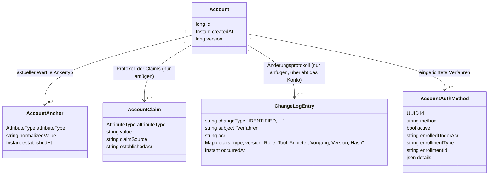

# Verfahren: Datenmodell und Übersicht

Wie die Tools die Bausteine aus [03-tool-architektur.md](03-tool-architektur.md) und
[04-orchestrierung.md](04-orchestrierung.md) konkret nutzen. Dieses Kapitel beschreibt das
Datenmodell, das allen Verfahren gemeinsam ist, und die Entscheidungen dahinter. Ablauf, Aufrufe und
Fehlerfälle jedes einzelnen Verfahrens stehen auf seiner eigenen Seite (Abschnitt 2). Ein
durchgehendes Beispiel mit allen Aufrufen steht in [05-api.md](05-api.md) Abschnitt 2.

---

## 1) Datenmodell der Verfahren

`AccountAuthMethod` verweist über die `EnrollmentRef` (`enrollmentType`, `enrollmentId`) auf das
Credential im Schema des Moduls, etwa `auth_sms.enrollment` ([Verfahren `sms`](verfahren/sms.md)).

Entscheidungen, die an diesem Modell hängen:

- **`enrolledUnderAcr` ist ein eigenes Feld, nicht nur ein Eintrag fürs Protokoll.** Das
  tatsächlich erreichte `achievedAcr` eines `auth-*`-Tools wird durch das `enrolledUnderAcr` des
  verwendeten Verfahrens begrenzt ([Orchestrierung](04-orchestrierung.md) Abschnitt 8). Ohne diese
  Regel käme man schleichend nach oben: Ein in einer schwach gesicherten Sitzung eingerichtetes
  Verfahren würde dauerhaft ein höheres Niveau erzeugen, als je nachgewiesen wurde. Den Wert kennt
  nur der Orchestrator, nie das Modul.
- **Die `EnrollmentRef` steht in echten Spalten, nicht irgendwo in `details`.**
  `account.auth_method.enrollment_type`/`enrollment_id` ist die einzige Verknüpfung zwischen Konto
  und Credential; sie ist indiziert und in beide Richtungen abfragbar (beim Löschen und beim
  Widerruf). Die Credential-Tabellen der Module haben bewusst keine `account_id`: Sie entstehen im
  Tool-Handler, bevor der Orchestrator das Konto kennt.
- **Eine Zeile je eingerichtetem Verfahren statt einer JSON-Liste im Konto.** Lesen schreibt nie.
  Änderungen sperren nur die Kontozeile, indem sie deren Version erhöhen. Deaktivierte Einträge
  tragen `deactivated_at`; ein CHECK-Constraint hält `active` und `deactivated_at` stimmig.
- **Welche Nachweise beim Einrichten vorlagen, steht nur im Änderungsprotokoll.** Das Ereignis
  `METHOD_ADDED` trägt in `details` die Nachweise der Sitzung (`amr`), den Kanal (`channel`) und
  das einrichtende Tool in der Fassung, die der Client sprach (`tool`: `enroll-sms@1`, ADR-51),
  denn nur dort überdauern sie Deaktivierung und Kontolöschung (ADR-39). Auf die Auswahl der
  Kandidaten und die Berechnung des ACR wirken sie nicht; maßgeblich ist allein
  `enrolledUnderAcr`. `details` enthält nur, was das zuständige Modul selbst wieder liest
  (Schlüssel-Referenz, KOBIL-Gerätekennung).
- **Die bestätigte E-Mail-Adresse ist der EMAIL-Anker** – keine Spalte im `Account` und kein
  Credential eines Moduls. Es gibt höchstens eine je Konto, genau wie bei `personId`. Bestätigt
  wird sie per `confirm-email`. Danach dient dieselbe Adresse sowohl als Anmeldeverfahren
  (`enroll-email`/`auth-email`, `EnrollmentRef` = `EMAIL_ANCHOR_ENROLLMENT`) als auch zum Finden
  des Kontos bei der Anmeldung über die E-Mail-Adresse. `UNIQUE(attribute_type, normalized_value)`
  verhindert, dass dieselbe Adresse in irgendeiner Schreibweise zweimal vergeben wird
  ([Verfahren `email`](verfahren/email.md)).
- **Der Orchestrator liest keine Moduldaten.** Die Arbeitsdaten eines Tools (bei SMS Nummer, TAN-Hash
  und Ablaufzeit) legt er zwar als JSON an seiner Tool-Sitzung ab (`orchestrator.tool_session.data`,
  [ADR-49](adr/ADR-049-arbeitsdaten-der-tools-am-orchestrator.md)), aber nur das Modul kennt ihre Form
  und liest sie.

Regel für das Identifizierungs-Ereignis im Änderungsprotokoll (`account.change_log`, `IDENTIFIED`,
[ADR-39](adr/ADR-039-was-eine-kontoloeschung-ueberlebt.md)): Es belegt, **dass und wie** geprüft
wurde, nicht **was** geprüft wurde. Hinein gehören Rolle, die Belege der Prüfung (`provider`,
`providerTxId`), die Version des Verfahrens und ein Hash über die geprüften Merkmale – nur diese
Felder, per Namen übernommen (`JourneyRecorder`). Nicht hinein gehören KVNR, Name, eine Dokument-
oder Ausweisnummer (§ 20 PAuswG) oder Geheimnisse.

Ein Durchlauf kann **zwei** Zeilen hinterlassen, weil ADR-18 die Identifizierung in zwei Schritte
teilt: bestätigen (`ident-eid`) und zuordnen (`ident-kvnr`). Beide werden protokolliert, die
Zuordnung sogar besonders, denn in diesem Moment entsteht der `PERSON_ID`-Anker. Welcher Schritt
eine Zeile war, steht als `role` in `details` (`IDENTIFICATION` oder `CORRELATION`) und wird nicht
aus dem Namen des Verfahrens erraten. Ein zuordnender Schritt trägt nämlich das Niveau der
Bestätigung, auf der er aufbaut; eine Zeile „kvnr / loa2" ohne weiteren Hinweis sähe aus wie ein
Verfahren, das dieses Niveau allein erreicht hat. Zeilen desselben Durchlaufs haben dieselbe
`journeyId`.

---

## 2) Die Verfahren

Je Verfahren eine Seite, mit Tools, Ablauf, Datenmodell, Aufrufen und Fehlerfällen
([Übersicht](verfahren/README.md)):

- **Identifizieren und zuordnen:** [`fsc`](verfahren/fsc.md) (Freischaltcode),
  [`eid`](verfahren/eid.md) (Online-Ausweis), [`nect`](verfahren/nect.md) (Identifizierungsdienst
  Nect), [`kvnr`](verfahren/kvnr.md) (Zuordnung über KVNR oder Partnernummer).
- **Anmelden mit Wissen oder Code:** [`sms`](verfahren/sms.md), [`password`](verfahren/password.md),
  [`email`](verfahren/email.md) (auch die bestätigte Adresse selbst).
- **Anmelden mit einem Gerät:** [`device`](verfahren/device.md) (Geräteschlüssel),
  [`kobil`](verfahren/kobil.md) (Gerätebindung über KOBIL), [`qr`](verfahren/qr.md) (Web-Login,
  im Handy bestätigt).
- **Vorgangszugang:** [`invite`](verfahren/invite.md) (Einmalkennwort aus einer Einladung).
