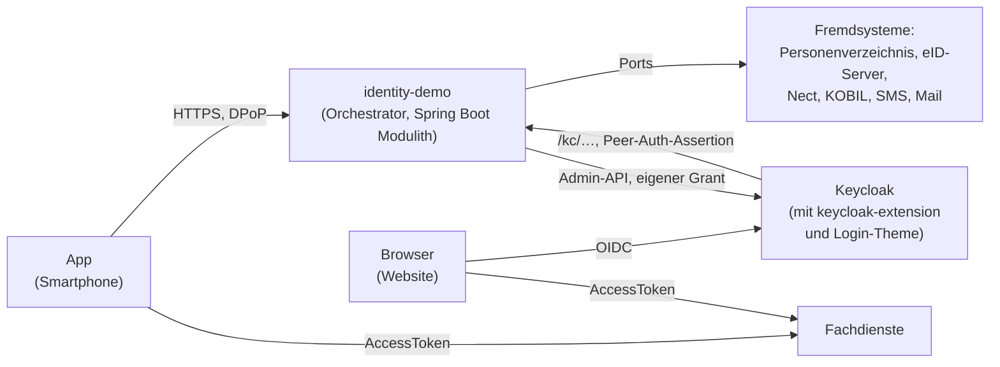
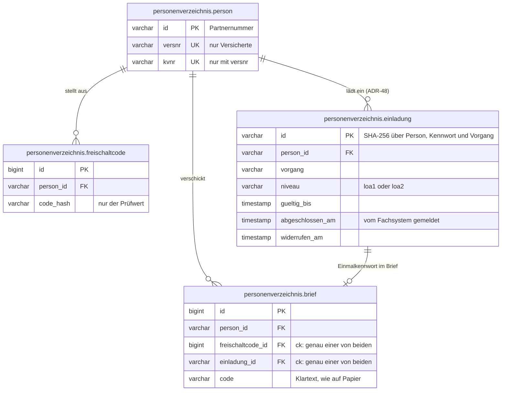

# Projektrahmen

Dieses Kapitel beschreibt die Aufgabenstellung, die Aufteilung der Anwendung in Module und die
technischen Rahmenbedingungen. Es richtet sich vor allem an Entwickler, die sich im Code
zurechtfinden wollen. Den Einstieg in das Projekt gibt der [Überblick](01-ueberblick.md). Begriffe wie
Journey, Tool oder Port erklärt das [Glossar](glossar/glossar.md).

---

## 1) Aufgabenstellung

Gebaut wird eine lauffähige Anwendung mit **Spring Boot Modulith**. Spring Modulith ist eine
Erweiterung von Spring Boot, mit der eine Anwendung in klar getrennte Module aufgeteilt und diese
Trennung automatisch geprüft wird. Die Anwendung zeigt, wie Registrierung und Anmeldung mit DPoP
abgesichert werden. DPoP bindet eine Sitzung an einen Schlüssel, den nur der Client besitzt
([DPoP-Bindung](09-dpop.md)).

Das System besteht aus:

- einem Frontend in React und TypeScript. Es erzeugt die DPoP-Proofs, also die signierten
  Nachweise, dass es den Schlüssel besitzt, und spricht mit dem Backend.
- einem `orchestrator`. Er verwaltet den Zustand von Sitzungen und Journeys und setzt die
  fachlichen Regeln durch: die Richtlinie für Sicherheitsniveaus, die Regeln für Wiederholungen und
  die DPoP-Bindung. Eine Journey ist ein geführter Ablauf mit mehreren Schritten, etwa eine
  Registrierung. Die Tool-Module kennt der Orchestrator dabei nicht.
- mehreren fachlichen Modulen, den Tool-Modulen. Jedes enthält die Tools eines Verfahrens, zum
  Beispiel alles zur Anmeldung per SMS. Die Module sind `ident_fsc`, `ident_eid`, `ident_nect`,
  `ident_kvnr`, `auth_sms`, `auth_password`, `auth_email`, `auth_device`, `auth_qr`, `auth_kobil`
  und `auth_invite`. Sie bringen ihre eigenen Tool-Endpunkte mit und erreichen den Orchestrator
  ausschließlich über `tool_api` ([Tool-Architektur](03-tool-architektur.md) Abschnitt 7).
- zwei Datenmodulen, `account` und `personenverzeichnis`. Sie halten Konto- bzw. Personendaten und
  implementieren ebenfalls Teile von `tool_api`.
- einer H2-Datenbank, deren Schema Flyway-Migrationen aufbauen.

Welche Komponenten das Zielbild hat und wie sie zusammenspielen, beschreibt der
[Überblick](01-ueberblick.md) in Abschnitt 2. Dieses Kapitel beschreibt, wie die Anwendung innerhalb
dieses Zielbilds gebaut ist.

### Qualitätsziele

| Priorität | Ziel | Beschreibung |
|-----------|------|--------------|
| 1 | Sicherheit | Jede Sicherheitszusage des Backend-Kerns gilt, ohne dass sie eine unausgesprochene Annahme über die Umgebung braucht. Invarianten, also Regeln, die immer gelten müssen, sind durch einen Typ, einen Datenbank-Constraint oder einen Test erzwungen ([ADR-35](adr/ADR-035-betriebsanspruch-backend-kern-produktionsreif.md), [invarianten.md](invarianten.md)) |
| 2 | Nachvollziehbarkeit | Jede fachliche Regel steht an genau einer Stelle. Jeder Schritt einer Journey steht im Journey-Trace (dem Ablaufprotokoll), jede Identifizierung im Änderungsprotokoll des Kontos ([04-orchestrierung.md](04-orchestrierung.md), [ADR-39](adr/ADR-039-was-eine-kontoloeschung-ueberlebt.md)) |
| 3 | Modularität | Klare fachliche Module mit festgelegten Abhängigkeiten |
| 4 | Verifizierbarkeit | Architektur und Modulstruktur lassen sich automatisch prüfen |
| 5 | Aktualität | Aktuelle Versionen des Spring-Ökosystems werden verwendet |
| 6 | Entwicklerfreundlichkeit | Die Anwendung lässt sich über den Gradle Wrapper sofort ausführen |

---

## 2) Kontextabgrenzung (C4 System Context)

Das folgende Bild zeigt, mit welchen Systemen die Anwendung `identity-demo` spricht. Die App spricht
direkt mit dem Orchestrator. Der Browser meldet sich über Keycloak an, und Keycloak fragt seinerseits
den Orchestrator.



- **Name**: `identity-demo`
- **Typ**: Spring Boot Webanwendung
- **Schnittstelle nach außen**: HTTP/REST (Tomcat auf Port 8080). Health und Kennzahlen liegen auf
  einem eigenen Management-Port ([07-betrieb.md](07-betrieb.md) Abschnitt 7).
- **Keycloak** läuft als eigener Dienst. Die Keycloak-Erweiterung wird als Jar in Keycloak geladen
  (Abschnitt 3, „Außerhalb der Anwendung“).
- **Fremdsysteme** erreicht die Anwendung nur über Ports. Ein Port ist eine fest vereinbarte
  Schnittstelle, hinter der das eigentliche System ausgetauscht werden kann. In dieser Instanz sind
  die Fremdsysteme als Module der Gruppe `simulation` nachgebildet (Abschnitt 3).
- Die Fachdienste ruft die Anwendung nicht auf. Sie bekommen nur die AccessTokens von App und
  Browser.

## 3) Module

Die Module liegen unter `com.example.identity` und sind nach ihrer Rolle in Gruppen geordnet. Eine
Gruppe ist nur ein Ordner, kein Modul.

**Wie Spring Modulith ein Modul erkennt.** Ein Modul hat in seinem Wurzelpaket eine Klasse mit der
Annotation `@ApplicationModule`. Diese Klasse ist nach dem Modul benannt, zum Beispiel
`AccountModule`, `KobilToolModule` oder `NectSimulationModule`
(`spring.modulith.detection-strategy: explicitly-annotated`).

**Die Modul-ID.** Die ID eines Moduls ist das letzte Segment seines Pakets. Dieselbe ID dient
gleichzeitig als:

- Name des Datenbankschemas,
- Flyway-Ordner `db/migration/<id>/`,
- OpenAPI-Datei `api/modules/<id>.yaml`,
- bei den Simulationen auch als Name des Text-Bundles.

Im Code liefert `ModuleId` (`tool_api`) die ID eines Moduls. `ModulithStructureTest` prüft Gruppe
und Namen.

```
com.example.identity
├── core/         orchestrator, account
├── contract/     tool_api, texts
├── tools/        ident_fsc, ident_eid, ident_kvnr, ident_nect,
│                 auth_sms, auth_email, auth_password, auth_qr, auth_device, auth_kobil,
│                 auth_invite
├── simulation/   personenverzeichnis, kobil, nect, sms, mail
└── demo/         demo_mode, demo_seed
```

### Kern (`core`)

- **M1** `orchestrator` — Verwaltet den Zustand von Sitzungen und Journeys, die Regeln und die
  Wiederholungen. Stellt die REST-API der Kanäle bereit, also die Schnittstelle für App und Website.
  Implementiert die `tool_api`-Ports `ToolJourney`, `Lockouts`, `DeviceProofs` und `RateLimits`.
- **M1a** `orchestrator.domain` — Kein eigenes Modulith-Modul, sondern das unterste Paket
  **innerhalb** von `orchestrator`. Es enthält:
  - die gemeinsamen Begriffe (`AuthIntent`, `AmrSource`, `AcrLevels`, `OrchestratorException`,
    `FeatureFlagProvider`, `ToolCatalog`),
  - den fachlichen Kern: die Zustände der Journeys, `IntentStrategy` mit `Transition`/`Action`,
    `AuthPolicy` und `SessionEvidence`.

  Alle anderen Pakete des Orchestrators dürfen von diesem Paket abhängen, es selbst aber von keinem.
  Dadurch bleiben die Pakete des Orchestrators frei von zyklischen Abhängigkeiten. Ein Beispiel:
  `AmrSource` gibt an, woher ein Nachweis stammt. Das ist eine Frage der Richtlinie. Deshalb liegt
  `AmrSource` hier und nicht neben der JPA-Entität, die den Nachweis speichert. Regel, Inhalt und
  empfohlene Lesereihenfolge stehen unter [Fachkern und Technik](#fachkern-und-technik).
- **M4** `account` — Konten, Identifizierungen und Anmeldeverfahren. Implementiert die
  `tool_api`-Ports `AccountDirectory` und `IdentityResolver`.

### Verträge (`contract`)

- **M8** `tool_api` — Der Vertrag zwischen Orchestrator und Tool-Modulen. Seine einzige Abhängigkeit
  ist `texts`. Als Modulith-Modul ist es `OPEN`, das heißt, alle seine Pakete sind für andere Module
  sichtbar.
  - In der Wurzel liegt der Lebenszyklus eines Tools: die Selbstbeschreibung (`ToolModule` mit seinen
    `Tool`s, `ToolOutcome`, `StepData`) und die Journey aus Sicht des Tools (`ToolJourney`,
    `Lockouts`).
  - Darunter liegen Unterpakete nach Thema:
    - `claims`: Claims (bestätigte Angaben zur Person), `AcrLevel` und Regeln für Anker,
    - `values`: E-Mail, Mobilnummer, KVNR, Mitgliedsnummer, Partnernummer,
    - `directory`: Ports zu Konto und Person,
    - `credentials`: Ports, die ein Tool-Modul anbietet,
    - `device`: Geräte-Proof,
    - `envelope`: die Antwortformen `ChannelResponse` und `Next`,
    - `ratelimit` und `retention`: Zählwerk und Aufbewahrung des Orchestrators,
    - `kms`: der Port zum Schlüsseldienst (ADR-54).
  - `tool_api` enthält keine Bean und keinen Controller. Es ist ein Vertrag, keine Web-Schicht
    ([Tool-Architektur](03-tool-architektur.md) Abschnitt 7).
- **M18** `texts` — Bibliothek für mehrsprachige Nutzertexte (ADR-33). Sie enthält `Text` (die
  deutsche Vorlage steht im Code und wird als Referenz ausgeliefert) und `TextBundle` (die
  Sprachdateien, ausgeliefert mit ETag). `allowedDependencies = []`. Jedes Modul mit Nutzertexten
  deklariert eine Abhängigkeit auf `texts`, auch die simulierten Fremdsysteme.

### Verfahren (`tools`)

Jedes dieser Module hat eigene Tool-Endpunkte und erreicht den Orchestrator nur über `tool_api`.
Ein Tool ist ein einzelner Schritt in einer Journey, zum Beispiel „SMS-Code prüfen“.

- **M2** `ident_fsc` — Identifizierung per Freischaltcode (Tool `ident-fsc`). Eigener
  `@RestController`. Prüft den Freischaltcode beim Personenverzeichnis über den Port
  `ActivationCodes` (ADR-31, Nachtrag).
- **M10** `ident_eid` — Zweite Identifizierung (Tool `ident-eid`, Mock der Online-Ausweisfunktion).
  Bestätigt nur die Daten der Ausweiskarte und ordnet sie keiner Person zu (ADR-18). Eigener
  `@RestController`.
- **M10a** `ident_kvnr` — Ordnet eine bestätigte Identität ihrer Person im Personenverzeichnis zu,
  per KVNR, sonst per Partnernummer (Tool `ident-kvnr`, ADR-18). Eigener `@RestController`.
- **M16** `ident_nect` — Identifizierung über den Dienst Nect (Tool `ident-nect`). Der Nutzer wechselt
  auf die Seite von Nect und kommt mit einer Vorgangsnummer zurück. Das Ergebnis holt das Backend
  selbst bei Nect ab. Wie `ident_eid` bestätigt es nur die Daten des Dokuments (ADR-18). Der
  `amr`-Wert (die Angabe, womit sich jemand ausgewiesen hat) ist je Verfahren
  `nect-eid`/`nect-epass`/`nect-eudi`. Erlaubte Abhängigkeit zum Fremdsystem: `nect`.
- **M3** `auth_sms` — SMS-Verfahren (Tools `enroll-sms`, `auth-sms`, `auth-sms-lookup`). Eigene
  `@RestController`.
- **M7** `auth_email` — E-Mail-Verfahren (Tools `confirm-email`, `enroll-email`, `auth-email`,
  `auth-email-lookup`) mit eigenem `EmailCodeGenerator`. Hängt nur von `tool_api` ab: Es liest
  Account-IDs und Ankerwerte über `AccountDirectory` und liefert `EMAIL`-Claims. Auf `account`
  greift es nicht direkt zu.
- **M6** `auth_password` — Passwort-Verfahren (Tools `enroll-password`, `auth-password`,
  `auth-password-lookup`). Über `requires` am Einrichten setzt es eine bestätigte E-Mail-Adresse
  voraus (`ClaimRequirement(EMAIL, PROVEN)`) ([Tool-Architektur](03-tool-architektur.md)).
- **M11** `auth_qr` — Anmeldung per QR-Code auf der Website, bestätigt in der App (Tools `enroll-qr`,
  `auth-qr`, `auth-qr-lookup`, `approve-qr`, [`CONFIRM_PEER_LOGIN`](journeys/confirm-peer-login.md)).
  Speichert `QrLoginRequest` selbst und greift nicht auf `account` zu. Eigene `@RestController`.
- **M23** `auth_invite` — Anmeldung mit Einmalkennwort für einen Vorgang (Tool `auth-invite-lookup`,
  [ADR-48](adr/ADR-048-vorgangszugang-mit-einmalkennwort.md)). Der Nutzer gibt KVNR oder
  Partnernummer und das Kennwort aus dem Brief ein. Das Modul fragt die Einladungen des
  Personenverzeichnisses über den Port `Invitations` ab. Als Subjekt meldet es die Einladung, nie ein
  Konto. Eigener `@RestController`, Abhängigkeiten nur `tool_api` und `texts`.
- **M12** `auth_device` — Geräteschlüssel als eigenes Anmeldeverfahren (Tools `enroll-device`,
  `auth-device`). Eigene `@RestController`, keine Abhängigkeit von `account`.
- **M14** `auth_kobil` — Gerätebindung über den externen Dienstleister KOBIL (Tools `enroll-kobil`,
  `auth-kobil`, [Verfahren `kobil`](verfahren/kobil.md)). Die PIN wird im Backend verwahrt
  (ADR-21/ADR-22). Die Freigabe per PIN ist eine eigene Unterressource. Eigene `@RestController`,
  keine Abhängigkeit von `account`. Es hat aber eine ausdrücklich erlaubte Abhängigkeit zum
  Fremdsystem `kobil` (wie `ident_nect` zu `nect`).

### Simulierte Fremdsysteme (`simulation`)

Diese Module stehen für Systeme, die es im echten Betrieb außerhalb der Anwendung gäbe (ADR-35). Ein
Verfahren darf sie nur über eine ausdrücklich benannte Abhängigkeit erreichen, das
Personenverzeichnis nur über Ports. `SimulationBoundaryArchitectureTest` prüft das.

- **M5** `personenverzeichnis` — Simuliertes **Personenverzeichnis** (Fremdsystem).
  - Es verwaltet `Person`-Entitäten mit Anschrift, E-Mail-Adresse und Mobilnummer. Der Schlüssel
    einer Person ist die Partnernummer: `P` und neun Ziffern, zufällig vergeben. Eine
    Mitgliedsnummer haben nur Versicherte. Eine KVNR gibt es nur zusammen mit einer
    Mitgliedsnummer. Beide lassen sich ändern.
  - Es stellt Freischaltcodes (ADR-31) und Einladungen mit Einmalkennwort (ADR-48) aus.
  - Es meldet Änderungen als `PersonChanged` (ADR-34) und beendete Einladungen als
    `InvitationEnded`.
  - Schnittstellen:
    - die `tool_api`-Ports `PersonDirectory`, `PersonMasterData` (Stammdaten für die Token-Claims in
      Keycloak), `ActivationCodes` (Klasse `Freischaltcodes`, für `ident_fsc`) und `Invitations`
      (Klasse `Einladungen`, für `auth_invite`),
    - die HTTP-Schnittstelle `/mock-personenverzeichnis/*` für die Seite `/personenverzeichnis/`.

    Die Demo-Personen liest der Orchestrator über einen eigenen Port, `DemoPersonDirectory`.
- **M15** `kobil` — Simuliertes **Fremdsystem**, kein Tool-Modul. Seine einzigen Abhängigkeiten sind
  `texts` und `demo_mode`. Es kennt weder `tool_api` noch die Journey und hat ein eigenes Schema. Es
  hat zwei Schnittstellen: die HTTP-Schnittstelle `/mock-kobil/*` für die App (das Gegenstück zum
  MC SDK von KOBIL) und `KobilSsms` für unser Backend. Es unterliegt nicht unseren
  Aufbewahrungsregeln.
- **M17** `nect` — Simulierter **Identifizierungsdienst** Nect, kein Tool-Modul. Seine einzigen
  Abhängigkeiten sind `texts` und `demo_mode`, und es hat ein eigenes Schema. Es hat zwei
  Schnittstellen: `NectIdent` für unser Backend und die HTTP-Schnittstelle `/mock-nect/*` für die
  Sprungseite `/nect/` (eID, Reisepass, EUDI-Wallet). Es unterliegt nicht unseren
  Aufbewahrungsregeln.
- **M19** `sms` — Simulierter **SMS-Anbieter** mit Postausgang (`SmsGateway`) für `auth_sms`. Im
  Demomodus liest die Seite `/briefkasten/` den Postausgang über `/mock-sms/outbox`. Einzige
  Abhängigkeit ist `demo_mode`. Kein eigenes Schema.
- **M20** `mail` — Simulierter **Mailserver** mit Postausgang (`MailServer`) für `auth_email`. Im
  Demomodus liest die Seite `/briefkasten/` den Postausgang über `/mock-mail/outbox`. Einzige
  Abhängigkeit ist `demo_mode`. Kein eigenes Schema.
- **M24** `kms` — Simulierter **Schlüsseldienst** ([ADR-54](adr/ADR-054-schluesseldienst-simuliert.md)),
  kein Tool-Modul. Abhängigkeiten sind `tool_api` und `demo_mode`, eigenes Schema `kms`. Es
  implementiert den Port `tool_api.kms.KeyService` (einpacken, auspacken, signieren) in
  `KmsTransit` und bietet `/mock-kms/*` für den Tester im Demomodus (rotieren, zurückziehen).
  `account` und `orchestrator` erreichen es nur über den Port. Es unterliegt nicht unseren
  Aufbewahrungsregeln.

#### Die Tabellen des simulierten Personenverzeichnisses

Das Modul `personenverzeichnis` hat eine `Person`-Entität mit diesen Feldern:

- `id` (die Partnernummer),
- `versnr` (eindeutig, nur bei Versicherten),
- `kvnr` (eindeutig, nur zusammen mit `versnr`),
- `name`, `vorname`, `strasse`, `hausnummer`, `plz`, `ort`, `geburtsdatum`.

Dazu kommen drei weitere Tabellen:

- `freischaltcode`: nur der Hash des Codes, dazu Ablauf und Widerruf,
- `einladung` (ADR-48),
- `brief`: der simulierte Brief mit dem Code im Klartext (ADR-31).



Wie das Konto auf eine Person verweist, zeigt [02-domaenenmodell.md](02-domaenenmodell.md) in
Abschnitt 7.

Für das Personenverzeichnis gelten diese Anforderungen:

- **P-3** — Auf Personen wird über Spring Data JPA zugegriffen.
  - *Kriterium:* `PersonRepository extends JpaRepository`
- **P-4** — Die Adresse einer Person ist in einzelne Attribute aufgeteilt.
  - *Kriterium:* Die Entität enthält `strasse`, `hausnummer`, `plz`, `ort`. Bestätigt wird die
    Straße dagegen als **eine** Zeile mit Hausnummer (`AttributeType.STREET_ADDRESS`), so wie eID
    und PID sie liefern. Das Personenverzeichnis setzt `strassenzeile` an seiner Schnittstelle
    zusammen.

### Nur für die Demo (`demo`)

- **M21** `demo_mode` — Der eine Schalter `demo.mode` (ADR-36). Er steht als Bean `DemoMode` zur
  Verfügung, als Bedingungen `OnlyInDemoMode`/`OutsideDemoMode` und als Markierung `DemoSurface` für
  die Oberflächen der simulierten Fremdsysteme, die keine Anmeldung verlangen. Nur dieses Modul liest
  die Property (`DemoModeSwitchTest`). Deshalb gibt es eine einzige Voreinstellung für alle.
- **M13** `demo_seed` — Nur für die Demo und nur Daten: die Testpersonen mit ihren Freischaltcodes
  und Briefen (`db/migration/demo_seed/V16__testdata.sql`). Außerhalb des Demomodus werden sie nicht
  migriert. Konten legt das Modul nicht an. Eine Testperson registriert sich wie jeder andere, in der
  App oder auf der Website. Erst danach hat sie ein Konto. Das Modul hat keinen Code und keine
  Abhängigkeiten. `DemoSeedModule` legt nur die Grenze des Moduls fest.

Für die Demo-Daten gelten diese Anforderungen:

- **P-5** — Testdaten werden beim Start eingespielt.
  - *Kriterium:* Im Demomodus spielt beim Start eine Flyway-Migration die Testpersonen ein
    (`demo_seed`).
- **P-6** — Freischaltcodes zum Testen stehen beim Start zur Verfügung.
  - *Kriterium:* Eine Flyway-Migration legt gültige Freischaltcodes für die Testpersonen an.

### Außerhalb der Anwendung

- **M22** `kcmigrate` — Migrationen für das Keycloak-Realm im Gradle-Projekt `keycloak-migrations`
  (Paket `com.example.identity.kcmigrate`). Das Realm ist der Bereich in Keycloak, in dem Nutzer,
  Clients und Einstellungen dieser Anwendung liegen. `kcmigrate` ist eine Bibliothek, kein
  Modulith-Modul: Es hat keine `@ApplicationModule`. Seine Grenze sichert
  `OrchestratorArchitectureTest`: Nur `core.orchestrator.keycloak` und `ActiveSessions` benutzen es.
- `keycloak-extension` (Paket `com.example.identity.kcext`) — Die Keycloak-Erweiterung. Sie wird als
  eigenes Jar in Keycloak geladen und ist keine Abhängigkeit der Anwendung.

### Modulabhängigkeiten (C4 Component View)

Das Bild zeigt, wie die Module voneinander abhängen. Alle Verbindungen zwischen Orchestrator und
Tool-Modulen laufen über den Vertrag `tool_api`.

```
         ┌─────────────┐
         │   Browser   │
         └──────┬──────┘
                │ HTTP / REST (ein Port: /orchestrator/api/v1/..., /tools/api/<toolId>/v<N>/...)
                ▼
┌────────────────────────────────────────────────────────────────────────┐
│  @RestController - verteilt über mehrere Module, URLs unverändert      │
│                                                                        │
│   core/orchestrator      tools/ident_fsc / ident_eid / ident_nect /    │
│   (Channel-Endpunkte,    ident_kvnr / auth_sms / auth_password /       │
│    Journey/Policy)       auth_email / auth_device / auth_qr /          │
│                          auth_kobil / auth_invite (eigene Endpunkte)   │
│                                                                        │
│         orchestrator.api.v1.tool.LeaveToolController (generisch)       │
└───────────────────────────────┬────────────────────────────────────────┘
                                │ implementiert / ruft auf
                                ▼
                  ┌───────────────────────────────────┐
                  │         contract/tool_api         │
                  │ ToolModule, Tool, ToolOutcome,    │
                  │ ToolJourney, Lockouts, directory/ │
                  │ device/ envelope/ claims/ values/ │
                  └────────────────▲──────────────────┘
                                   │ implementieren die Ports
              ┌────────────────────┼─────────────────────┐
              │                    │                     │
     ┌─────────────────┐   ┌──────────────┐   ┌──────────────────────────┐
     │core/orchestrator│   │ core/account │   │simulation/               │
     │ (ToolJourney,   │   │(AccountDir-  │   │ personenverzeichnis      │
     │  DeviceProofs)  │   │  ectory)     │   │ (PersonDirectory)        │
     └─────────────────┘   └──────────────┘   └──────────────────────────┘
```

- Kein Tool-Modul verweist auf den `orchestrator`, und der Orchestrator verweist auf kein Tool-Modul
  (`core/orchestrator/OrchestratorModule.kt`:
  `allowedDependencies = ["tool_api", "account", "texts", "demo_mode"]`). Ihre einzige gemeinsame
  Abhängigkeit ist `tool_api`. Ein Tool-Modul kennt nur die Interfaces aus `tool_api`, nie eine
  konkrete Klasse des Orchestrators.
- Die HTTP-Pfade (`/tools/api/<toolId>/v<N>/...`) sind unabhängig davon, in welchem Kotlin-Paket der
  jeweilige `@RestController` liegt (`ident_fsc.api.v1`, `ident_eid.api.v1`, `ident_kvnr.api.v1`,
  `auth_sms.api.v1`, `auth_password.api.v1`, `auth_email.api.v1`, `auth_device.api.v1`,
  `auth_qr.api.v1`, `auth_kobil.api.v1`, `auth_invite.api.v1`, `ident_nect.api.v1`). Spring ordnet
  eine Anfrage nach `@RequestMapping` zu, nicht nach Paket.

  Ausnahmen sind `kobil.api.v1`, `nect.api.v1`, `personenverzeichnis.api.v1`, `sms.api.v1` und
  `mail.api.v1`. Sie liegen bewusst NICHT unter `/orchestrator/api`, sondern unter `/mock-kobil`,
  `/mock-nect`, `/mock-personenverzeichnis`, `/mock-sms` bzw. `/mock-mail`. Denn sie stellen die
  Fremdsysteme dar, nicht diese Anwendung.
- Die Tool-Module sind voneinander und von `account` entkoppelt, auch `auth_email`.
  - Abhängigkeiten zu simulierten Fremdsystemen sind ausdrücklich erlaubt, nicht nur geduldet:
    `auth_kobil → kobil` und `ident_nect → nect` (nur `NectIdent`). Das Personenverzeichnis
    erreichen die Tool-Module nur über Ports (ADR-31, Nachtrag).
  - Konten schlagen die Tool-Module über `tool_api.AccountDirectory` nach.
  - Schreiben können sie nur indirekt: Sie liefern Claims im `ToolOutcome`, und die Journey
    übernimmt sie.
  - Hilfsfunktionen, die ein Konto über die E-Mail-Adresse suchen, sind Kotlin-Erweiterungsfunktionen
    des Ports.
- `auth_sms` verbirgt seine internen Datenbank-IDs hinter einer undurchsichtigen `EnrollmentRef`
  ([06-ablaeufe.md](06-ablaeufe.md) Abschnitt 1).
- Die erlaubten Abhängigkeiten legt jedes Modul mit `@ApplicationModule(allowedDependencies = ...)`
  fest. `ModulithStructureTest` prüft sie („each module depends only on what it declares“). Eine
  unerlaubte Abhängigkeit lässt den Build scheitern. Kotlin kennt keine Annotationen an Paketen.
  Deshalb steht die Deklaration je Modul an einer nach ihm benannten Klasse (`@ApplicationModule` ist
  `@Target({PACKAGE, TYPE})`). Ein `package-info.java` ist nicht nötig.
- Das Frontend spricht ausschließlich über HTTP mit der Anwendung als Ganzes. Welches Modul einen
  Endpunkt implementiert, sieht es nicht.

### Anforderungen an die Modulstruktur

- **M-1** — Jedes Modul hat ein eigenes Paket in einer der Gruppen `core`, `contract`, `tools`,
  `simulation`, `demo`. Seine ID ist das letzte Paketsegment.
  - *Kriterium:* Paketstruktur `com.example.identity.<gruppe>.<modul>`,
    `@ApplicationModule(id = "<modul>")`. Geprüft in `ModulithStructureTest`.
- **M-2** — Jedes Modul mit Logik zur Laufzeit stellt sie als Spring-Bean bereit.
  - *Kriterium:* `@Service`/`@Component`/`@RestController` im Modul. `texts` und `tool_api` sind
    reine Verträge ohne Bean (`ToolApiArchitectureTest`).
- **M-3** — Tool-Module und Orchestrator sind nur über die gemeinsame Schnittstelle (SPI) `tool_api`
  verbunden, nie direkt.
  - *Kriterium:* Konstruktor-Injection nur mit `tool_api`-Interfaces (`ToolJourney`, `Lockouts`,
    `AccountDirectory`, `PersonDirectory`, `ActivationCodes`, `Invitations`,
    `DeviceProofs`, `RateLimits`). Kein Tool-Modul importiert `orchestrator`, und der Orchestrator
    importiert kein Tool-Modul. Es gibt benannte Ausnahmen, jeweils zu einem simulierten
    Fremdsystem: `auth_kobil → kobil`, `ident_nect → nect`, `auth_sms → sms`, `auth_email → mail`
    (die letzten beiden sind der simulierte SMS-Anbieter und der Mailserver mit Postausgang).
- **M-4** — Die Modulstruktur lässt sich prüfen.
  - *Kriterium:* `ApplicationModules.verify()` in Tests
- **M-5** — In `orchestrator` und `account` liegen die fachlichen Regeln im Paket `domain`, frei von
  Framework und Technik.
  - *Kriterium:* `OrchestratorArchitectureTest` und `AccountArchitectureTest` (Abschnitt
    [Fachkern und Technik](#fachkern-und-technik))

### Fachkern und Technik

In den beiden Modulen mit den meisten Regeln, `orchestrator` und `account`, ist der Code in zwei
Teile getrennt: in das, was entschieden wird, und in das, was dafür gelesen und geschrieben wird.
So kann man die fachlichen Regeln lesen, ohne sich durch Datenbank- und Framework-Code arbeiten zu
müssen. Die Begründung steht in [ADR-40](adr/ADR-040-fachkern-im-paket-domain.md).

**Die Regel.** Alles, was ein Entwickler lesen muss, um die fachlichen Regeln zu verstehen, liegt im
Paket `domain` des Moduls. Für dieses Paket gilt:

- Es benutzt kein Framework: kein Spring, kein JPA/Hibernate, kein Jackson, kein Logging.
- Es hängt von nichts anderem im eigenen Modul ab. Alles andere im Modul darf `domain` benutzen, aber
  nie umgekehrt.

Verträge anderer Module darf `domain` benutzen (`tool_api`, `texts`, im Orchestrator auch die
Lesesicht `account.AccountProfile`). Beide Regeln prüft ArchUnit, ein Werkzeug für Architekturtests:
`OrchestratorArchitectureTest` für `orchestrator.domain` und `AccountArchitectureTest` für
`account.domain`. Ein Verstoß lässt den Build scheitern.

**Was im Orchestrator wo liegt.**

- `orchestrator.domain` (M1a): die Grundbegriffe – `AuthIntent`, `AcrLevels`, `AmrSource`,
  `ChannelType`, `ErrorCode`, `OrchestratorException`, `ToolCatalog`.
- `orchestrator.domain.journey`: `IntentStrategy`, `JourneyContext`, `JourneyEvent`, `Transition`,
  `Action`. Darunter liegen `state` (die Zustände je Intent) und `strategy` (eine Strategie je
  Intent). Ein Intent ist das Ziel einer Journey, etwa „registrieren“ oder „anmelden“. Dazu kommen die
  Regeln für das Ausführen von Aktionen:
  - `AccountRules.kt`: welches Konto eine Aktion betrifft (ADR-18/20). So arbeitet eine Sitzung nie
    mit einem Konto, das sie nicht nachgewiesen hat.
  - `CredentialRules.kt`: auf welchem Sicherheitsniveau ein Nachweis zählt (ADR-5), wann ein Gerät
    ohne Rückfrage mit dem Konto verknüpft wird und welche Verfahren wegfallen, wenn ein anderes
    eingerichtet wird.
- `orchestrator.domain.policy`: `AuthPolicy`, `DefaultAuthPolicy`, `SessionEvidence`,
  `ClaimRequirements`.
- Die Technik liegt außerhalb von `domain`, ebenfalls nach Thema geordnet: `journey`
  (`JourneyService`, `JourneyActionExecutor`, `JourneyContextFactory`, `JourneyRouting`, die Entität
  `AuthJourney`, `JourneyStateCodec`) und daneben unter anderem `session`, `channel`, `api.v1`,
  `keycloak`, `dpop`, `retention`.
- `DomainBeans` im Wurzelpaket legt die Strategien und `DefaultAuthPolicy` als Spring-Beans an. Es ist
  die einzige Stelle, die aufzählt, welche Strategien es gibt. Es ist auch die einzige Klasse
  außerhalb von `domain.policy`, die `DefaultAuthPolicy` kennt. Alle anderen benutzen `AuthPolicy`.
- Fachlich heißt der Kanal für die Website **Web** (`ChannelType.WEB`, `WEB_SELECT_METHOD`,
  „Web-Kanal“), als Gegenstück zur App. Die Technik, die diesen Kanal bedient, heißt **Keycloak**:
  Klassen `Keycloak…`, Paket `keycloak`, Konfiguration `keycloak.peer-auth`. Das gilt in beide
  Richtungen, also wenn Keycloak uns aufruft (Keycloak-Fassade) und wenn wir Keycloak aufrufen.
  Die Abkürzung `kc` steht nur noch dort, wo sie nach außen festgelegt ist: in den Pfaden `/kc/…`, in
  Feldern wie `kcSessionId` des veröffentlichten Vertrags, im `amr`-Wert `kc` und in der
  Keycloak-Erweiterung (Paket `kcext`).

**Was im Konto-Modul wo liegt.**

- `account.domain`:
  - `AnchorDecision`: wann ein Anker gebunden, ersetzt oder abgelehnt wird (ADR-11/19). Ein Anker
    ist ein eindeutiges Merkmal, über das ein Konto einer Person zugeordnet ist.
  - `normalizeClaimValue` und `ClaimKey` (`ClaimValues.kt`),
  - die Schreibweise, in der Namen verglichen werden, nämlich so, wie der Chip im Pass sie schreibt
    (`PassportForm.kt`).
- `account.application`: die Dienste, die diese Regeln anwenden – `AnchorRegistry`, `ClaimLedger`,
  `ChangeLog`, `IdentityMatchingService`, `PersonChangeListener`, `PersonLookupKey`.
- `account.infrastructure`: Entitäten und Repositories (`Account`, `AccountAnchor`, `AccountClaim`,
  `AccountAuthMethod`, `AccountRetraction`, `ChangeLogEntry`, `SignInLogEntry`) und
  `AttributeTypeConverter`.
- Wurzelpaket: `AccountService` implementiert den Port `AccountDirectory` und ist der Eingang für die
  anderen Module. Dazu kommen Lesesichten wie `AccountProfile`.

**Die Technik liest, fragt die Regel und schreibt.** Nach diesem Muster arbeitet die Technik in beiden
Modulen:

- Im Orchestrator führt `JourneyService` jeden Übergang durch vier Phasen
  ([Orchestrierung](04-orchestrierung.md) Abschnitt 8, „Die vier Phasen eines Übergangs“):
  1. lesen (`JourneyContextFactory`),
  2. entscheiden (`IntentStrategy`),
  3. ausführen (`JourneyActionExecutor`),
  4. `next` ableiten, also festlegen, was der Client als Nächstes tun soll (`JourneyRouting`).

  Eine Strategie bekommt nur den lesenden `JourneyContext` und gibt eine `Transition` zurück. Sie
  ändert selbst nie etwas. `JourneyActionExecutor` liest Konto und Kanal, fragt `AccountRules.kt` und
  `CredentialRules.kt` (etwa `IdentificationTarget.forUnresolved`, `proofLevel`,
  `levelToWriteUnder`) und schreibt das Ergebnis.
- Im Konto-Modul nimmt `AccountService` den Auftrag an und gibt ihn an `account.application` weiter.
  Dort liest `AnchorRegistry` die vorhandenen Anker, fragt `AnchorDecision.decide` und schreibt.
  `ClaimLedger` und `IdentityMatchingService` vergleichen Werte über `normalizeClaimValue`.

Die Regel bekommt jede Tatsache als Wert übergeben. Ist das Nachschlagen teuer und wird es nur in
einem Zweig gebraucht, bekommt sie stattdessen eine Funktion. Deshalb lässt sich jede Regel ohne
Datenbank und ohne Spring testen.

**Die Uhr ist eine Tatsache wie jede andere.** Die Anwendung liest die Zeit nur aus einer einzigen
`java.time.Clock`-Bean (`ClockConfig` im Wurzelpaket `com.example.identity`). `ClockConfig` gehört zu
keinem Modul. Der Typ kommt aus dem JDK, deshalb entsteht keine Abhängigkeit zwischen Modulen.
Dienste bekommen die Uhr über den Konstruktor. Entitäten und Regeln bekommen den Zeitpunkt vom
Aufrufer (`isExpiredAt(now)`, `touch(now)`, `createdAt` im Konstruktor). So lassen sich Ablauf,
Proof-Fenster, Zählfenster und Aufbewahrung mit einer gestellten Uhr prüfen, ohne dass der Test
warten muss.

**Ids und Werte sind Wertklassen.** Eine Wertklasse ist ein eigener Typ für einen einzelnen Wert.
So kann der Compiler etwa eine Konto-Id nicht mit einer Sitzungs-Id verwechseln.

- Jede eindeutige Id hat einen eigenen Typ: `AccountId`, `ChannelSessionId`, `ToolSessionId`,
  `InvitationId` in `tool_api.ids`, `JourneyId` und `SessionEvidenceId` im Fachkern des
  Orchestrators. Die Id einer Person ist die `PartnerNumber`.
- Ebenso hat jeder Wert mit eigenem Format einen eigenen Typ: `Email`, `PhoneNumber`, `Kvnr`,
  `MemberNumber`, `AcrLevel`.

Diese Typen gelten überall, auch in Entitäten, Repositories, DTOs und Controller-Parametern. Im JSON
und in der Datenbank steht nur der nackte Wert.

Eine Wertklasse entsteht auf genau zwei Wegen:

- Der Konstruktor nimmt einen Wert, der schon in Normalform ist, und prüft ihn im `init`-Block.
- `parse(raw)` nimmt Text von außen, bringt ihn in Normalform und liefert `null`, wenn er nicht
  passt. `parse` gibt es nur dort, wo Nutzereingaben ankommen.

Ausgepackt (`.value`) wird eine Wertklasse nur an einer Grenze: im Repository, wo JPA den nackten
Wert braucht (Primärschlüssel `Long` des Kontos, Id-Listen), und dort, wo ein Fremdsystem oder ein
Zähler einen `String` erwartet.

Kotlin löst Wertklassen auf der JVM in ihren nackten Wert auf. Deshalb brauchen sie an einigen
Stellen eine Hilfe. Jede dieser Hilfen steht an genau einer Stelle und ist dort begründet:

- **JPA.** UUID- und String-Ids speichert Hibernate direkt, `AccountId` über `AccountIdConverter`.
  Deshalb nimmt eine Repository-Methode `AccountId?`, und Id-Listen gehen ausgepackt an die Abfrage
  (ein offenes Problem bei Spring Data: spring-data-commons#2868). Der Id-Typ eines Repositorys
  bleibt primitiv. Gesucht wird über eine abgeleitete Methode wie `findByToolSessionId`.
- **OpenAPI.** Kotlin hängt an Methodennamen mit Wertklassen einen Hash an (`activate-Ab3dE_f`).
  `ValueClassOpenApiConfig` entfernt diesen Hash und gibt Pfadparametern das Schema ihres Werts.
  swagger-core braucht dafür das Jackson-2-Kotlin-Modul.
- **Architekturtests.** Eine Regel über Methodennamen vergleicht den Namen ohne diesen Hash. Sonst
  passt sie auf keine Methode mehr.
- **MockK.** `any()` erzeugt Wertklassen über ihren Konstruktor. Für die Klassen mit Formatprüfung
  registriert `ProjectConfig` deshalb einen gültigen Platzhalter.

**Wo man zu lesen anfängt.**

1. Eine Strategie unter `orchestrator/domain/journey/strategy`, etwa `StepUpStrategy.kt`, mit ihren
   Zuständen unter `domain/journey/state` (`StepUpState.kt`). Das Zustandsdiagramm dazu steht in
   [journeys/step-up.md](journeys/step-up.md).
2. `AccountRules.kt` und `CredentialRules.kt` unter `domain/journey`: was beim Ausführen einer
   Aktion gilt.
3. `DefaultAuthPolicy` unter `domain/policy`: welches Sicherheitsniveau sich aus einer Sammlung von
   Nachweisen ergibt.
4. Für das Konto-Modul `AnchorDecision.kt` und `ClaimValues.kt` unter `account/domain`.
5. Erst danach die Technik: `JourneyService`, `JourneyActionExecutor`, `AnchorRegistry`.

---

## 4) Persistenz

- Als Datenbank dient **H2**. Im Betrieb liegt sie als Datei unter `./data/identitydb`, im
  Testprofil **im Arbeitsspeicher**.
- Das Schema bauen **Flyway**-Migrationen auf. Der Zugriff läuft über **Spring Data JPA**.
- **Ein Datenbankschema je Modul** (`account`, `orchestrator`, `auth_sms`, …): Jede Tabelle liegt im
  Schema ihres Moduls. Fremdschlüssel gibt es nur innerhalb eines Schemas
  ([12-entscheidungen.md](12-entscheidungen.md) ADR-16). Der Verlauf der Flyway-Migrationen bleibt
  im Schema `PUBLIC`. Die Regeln für Schema und Migrationen stehen in
  [`db/migration/KONVENTIONEN.md`](../src/main/resources/db/migration/KONVENTIONEN.md).
- Auch `kobil` hat ein eigenes Schema, obwohl es kein Modul dieser Anwendung ist, sondern ein
  simuliertes Fremdsystem. Gerade deshalb ist die Trennung wichtig: Läge es im Schema von
  `auth_kobil`, könnte das Tool die Daten direkt lesen, statt die Schnittstelle zu benutzen. Dann
  würde die Demo den echten Ablauf nicht mehr zeigen.

Weitere Informationen:

- Die Entitäten für Sitzungen und Tools beschreibt [02-domaenenmodell.md](02-domaenenmodell.md), das
  Tabellenmodell steht dort in Abschnitt 7.
- Die Tabellen des simulierten Personenverzeichnisses stehen oben in Abschnitt 3.
- Aufbewahrung und Löschung beschreibt [07-betrieb.md](07-betrieb.md).
- Wie man mit der H2-Konsole in die Datenbank sieht, steht in [13-ausfuehren.md](13-ausfuehren.md)
  Abschnitt 3.

Für die Persistenz gelten diese Anforderungen:

- **P-1** — H2 läuft im Betrieb als Datei und in Tests im Arbeitsspeicher.
  - *Kriterium:* `application.yml` und `application-test.yml` sind entsprechend konfiguriert.
- **P-2** — Flyway baut das Schema auf, mit einem Migrationsordner je Modul.
  - *Kriterium:* `src/main/resources/db/migration/<modul>/`. `ModuleMigrationLocations` findet die
    Ordner selbst.

P-3 und P-4 betreffen das simulierte Personenverzeichnis, P-5 und P-6 die Demo-Daten. Sie stehen in
Abschnitt 3 bei den jeweiligen Modulen.

---

## 5) Architekturbeschränkungen

Diese Vorgaben sind für das Projekt fest gesetzt.

| ID | Beschränkung | Begründung |
|----|--------------|------------|
| A1 | Build-Tool: Gradle mit Kotlin-DSL | Einheitliche, typsichere Build-Konfiguration |
| A2 | Der Gradle Wrapper muss enthalten sein | Der Build lässt sich ohne lokale Gradle-Installation wiederholen |
| A3 | JVM-Version 21 (Ziel des Bytecodes), Kotlin (Version in `gradle/libs.versions.toml`) | Voraussetzung für Spring Boot 4.x; Kotlin ist die Sprache der Implementierung |
| A4 | Aktuelle Spring Boot-Version verwenden | Sicherheit und Aktualität |
| A5 | Versionen zentral in `gradle/libs.versions.toml` pflegen | Versionen an einer Stelle, Abhängigkeiten passen zueinander |
| A6 | Der Build des Frontends ist in den Gradle-Build eingebunden | Ein gemeinsamer Build für Backend und Frontend |
| A7 | Das gebaute Frontend wird nach `src/main/resources/static` geschrieben | Spring Boot liefert das Frontend als statische Ressource aus |
| A8 | Datenbank: H2 (als Datei im Betrieb, im Arbeitsspeicher in Tests) | Einfache lokale Entwicklung und schnelle Tests |
| A9 | Schemaverwaltung mit Flyway | Der Aufbau der Datenbank ist versioniert und wiederholbar |
| A10 | Datenzugriff mit Spring Data JPA | Standardisierte Persistenzschicht |
| A11 | Lesbarkeit hat Vorrang vor einer möglichst allgemeinen API-Anbindung | Endpunkte, DTOs und Handler bleiben je Tool ausdrücklich ausgeschrieben (`ident-fsc`, `enroll-sms`, `auth-sms`) |

---

## 6) Lösungsstrategie und Versionen

- **Framework**: Spring Boot mit eingebettetem Tomcat
- **Sprache**: Kotlin für die Implementierung des Backends
- **Modularisierung**: Spring Modulith, um die Architektur zu prüfen
- **Build**: Gradle mit Kotlin-DSL (`build.gradle.kts`, `settings.gradle.kts`)
- **Versionsverwaltung**: Gradle Version Catalog in `gradle/libs.versions.toml`
- **Persistenz**: H2 + Spring Data JPA + Flyway
- **Frontend**: React + TypeScript mit Vite
- **Einbindung des Frontends**: Der Vite-Build schreibt nach `src/main/resources/static`. Gradle führt
  `npm install` und `npm run build` aus.
- **Test**: Kotest auf der JUnit-Plattform mit Spring Boot Test, MockK und dem Test-Starter von
  Spring Modulith

Jede Version steht an genau einer Stelle und wird dort gepflegt (A5):

- Backend, Plugins und Bibliotheken in [`gradle/libs.versions.toml`](../gradle/libs.versions.toml),
- Gradle selbst in
  [`gradle/wrapper/gradle-wrapper.properties`](../gradle/wrapper/gradle-wrapper.properties),
- das Frontend in [`frontend/package.json`](../frontend/package.json).

Die Versionen von H2 und Flyway verwaltet Spring Boot. Das Ziel des Bytecodes ist JVM 21.

---

## 7) Build und Verifikation

Der Build prüft neben den fachlichen Tests auch automatisch, ob die Architektur eingehalten wird.

- `./gradlew build` baut Backend und Frontend und führt alle Tests aus.
- `./gradlew bootRun` startet die Anwendung auf Port 8080. Der Befehl läuft, bis man ihn beendet. Zum
  Prüfen eignen sich Integrationstests deshalb besser.
- Integrationstests starten den eingebetteten Server auf einem zufälligen Port und prüfen den Ablauf
  einer DPoP-gesicherten Sitzung.
- `ApplicationModules.verify()` prüft, ob die erlaubten Abhängigkeiten **zwischen** den Modulen
  eingehalten werden.
- `OrchestratorArchitectureTest` prüft die Schichtung innerhalb von `orchestrator`, die Modulith
  nicht sieht:
  - Die Teilpakete dürfen keine zyklischen Abhängigkeiten haben (`slices().beFreeOfCycles()`). Dafür
    liegen die gemeinsamen Begriffe im untersten Paket `domain` (M1a und
    [ADR-27](adr/ADR-027-gemeinsame-typen-im-kernel-paket.md)).
  - `orchestrator.domain` benutzt kein Framework und hängt von nichts anderem im Orchestrator ab
    (Abschnitt 3, [Fachkern und Technik](#fachkern-und-technik)). Dasselbe prüft
    `AccountArchitectureTest` für `account.domain`.
  - Aus einer offenen Transaktion darf kein Aufruf an Keycloak gehen. Sonst hält die Transaktion
    Zeilensperren so lange, wie der fremde Dienst zum Antworten braucht. Einzige Ausnahme ist
    `KeycloakTokenProvider`, denn dort ist das Token selbst die Antwort.
  - Nichts außerhalb von `api` hängt von `api.v1` ab. In `api.v1` stehen nur Routen, Request-DTOs,
    Parameterbindung und die OpenAPI-Beschreibung. Die Kanal-Services, die Zugriffsprüfungen
    (`ChannelAccessGuard`), `DemoDisclosure` und die Antwortformen liegen eine Ebene tiefer in
    `orchestrator/channel`. Die Antwortformen haben wie `ChannelResponse` in `tool_api` keine
    Version. Denn der Server bietet genau eine Version des Orchestrators an, und eine neue Version
    ist ein Pflichtupdate ([ADR-51](adr/ADR-051-versionen-als-pfadsegment.md)).
  - Nur `DemoDisclosure` erzeugt ein `DemoInfo`. Deshalb entfernt `demo.mode=false` die TANs im
    Klartext aus jeder Antwort an einer einzigen Stelle. Sie müssen nicht an mehreren Stellen
    herausgefiltert werden ([ADR-28](adr/ADR-028-demo-werte-abschaltbar.md)).
- `ClockArchitectureTest` prüft, dass außer `ClockConfig` keine Klasse der Anwendung die Systemuhr
  selbst liest (`Instant.now()`, `LocalDate.now()`, `System.currentTimeMillis()`, `Clock.system*()`,
  `Date()`). Siehe Abschnitt 3, [Fachkern und Technik](#fachkern-und-technik).
- `ToolSessionCoverageTest` prüft gegen das tatsächliche Schema, dass es als Tabelle für
  Tool-Sitzungen nur `orchestrator.tool_session` gibt. Kein Modul darf eine eigene
  `*_tool_session`-Tabelle mitbringen, denn die würde niemand aufräumen
  ([Betrieb](07-betrieb.md) Abschnitt 3).
- `EventPublicationRegistryTest` prüft, dass ein fehlschlagender `@ApplicationModuleListener` eine
  offene Zeile hinterlässt ([Betrieb](07-betrieb.md) Abschnitt 3a).
- `checkOpenApiSnapshot` und `generateFrontendApiTypes` sorgen dafür, dass der API-Vertrag und die
  daraus erzeugten Typen des Frontends übereinstimmen ([API](05-api.md) Abschnitt 4).
- `checkPublishedApiCompatibility` vergleicht den Umschlag (die gemeinsame Form aller Antworten) und
  die Tools je Fassung mit ihrem veröffentlichten Stand unter `api/published/`. Bei einer
  inkompatiblen Änderung schlägt die Prüfung fehl (ADR-50, ADR-51). `ContractScopeTest`,
  `StepDataExamplesTest` und `DiscriminatorMappingTest` prüfen Umfang, Beispiele und
  Diskriminatoren des Vertrags ([API](05-api.md) Abschnitt 4).
- Die CI führt zusätzlich `tsc -b` aus, denn vitest prüft keine Typen. Dazu kommen `oxlint`,
  `npm audit` und die Playwright-Tests. Ein eigener Workflow prüft den Code mit CodeQL.

### Vorbedingungen in Integrationstests

Viele Tests brauchen ein fertig registriertes Konto als Ausgangspunkt. Die Registrierung
(Identifizierung → E-Mail-Bestätigung → Anmeldeverfahren einrichten) wird aber nur dort Schritt für
Schritt per HTTP durchlaufen, wo sie selbst geprüft wird:

- `RegistrationFlowIntegrationTest`,
- `RequiredActionIntegrationTest` (Reihenfolge der Pflichten),
- `JourneyTraceIntegrationTest` (das Journey-Trace entsteht nur durch einen echten Durchlauf).

Alle anderen Testklassen brauchen nur das *Ergebnis* der Registrierung, zum Beispiel „ein Konto mit
SMS und Passwort, mit diesem Gerät verknüpft“. Das stellt `AccountFixtures` (im Testcode) über die
Dienste der Fachmodule her, nicht über SQL. So gelten dieselben Regeln wie im echten Betrieb:
Mindestniveaus der Anker, das Ersetzen eines vorhandenen Verfahrens und die Herkunft der Claims.

Einstiegspunkte in `IntegrationTestSupport`:

| Hilfsfunktion | Vorbedingung |
| --- | --- |
| `seedRegisteredAccount()` | Ein Konto existiert (SMS + Passwort, bestätigte Adresse, Gerät verknüpft), aber kein Kanal |
| `loginAsSeededAccount()` | Zusätzlich ein angemeldeter Kanal auf Niveau loa2 (`amr = [sms, password]`) |
| `registerAndAuthenticate()` | Eine echte Registrierung, dadurch zusätzlich mit einem eigenen `fsc`-Nachweis |

Die letzten beiden unterscheiden sich fachlich: Ein Kanal, der nur angemeldet ist, hat keinen eigenen
Nachweis einer Identifizierung. Manche Tests brauchen einen solchen Nachweis, etwa das Entfernen
eines Verfahrens, das sonst der Nachweis der aktuellen Anmeldung wäre. Diese Tests müssen
`registerAndAuthenticate()` verwenden.
