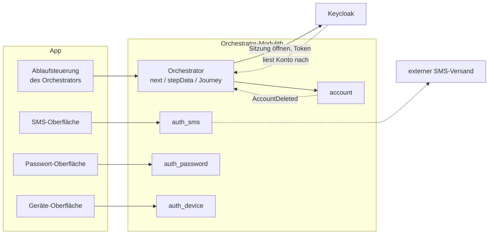

# Frontend

Dieses Kapitel beschreibt die Anforderungen an die Oberfläche und die Regel, nach der sie von
Schritt zu Schritt wechselt. Im Mittelpunkt stehen die beiden **Kanäle**, also die zwei Wege, auf
denen ein Nutzer mit dem Orchestrator (dem Server dieses Projekts) verbunden ist:

- der Client des App-Kanals (`/app/`), der für eine Smartphone-App steht,
- die Website im Web-Kanal (`/web/`).

Für diese beiden gelten die Regeln der Abschnitte 1 bis 4. Ein echter Client müsste sie genauso
erfüllen. Wie das Frontend gebaut und ausgeliefert wird, steht in Abschnitt 5. Was es nur für die
Demo gibt, steht gesammelt in Abschnitt 6: Startseite, Admin-Seite, simulierte Fremdsysteme,
Demo-Spalte und Testpersonen.

Die API, auf der das Frontend aufbaut, beschreibt [05-api.md](05-api.md). Wie die Schlüssel
erzeugt werden, beschreibt [09-dpop.md](09-dpop.md).

---

## Einstieg: Wie `next` die App steuert

In jeder Antwort sagt der Orchestrator dem Client in einem Feld `next`, welcher Schritt als
Nächstes kommt. Die App folgt dieser Angabe und entscheidet den Ablauf nicht selbst. Das Bild zeigt,
wie die Teile zusammenspielen:



Jedes Anmeldeverfahren (etwa SMS, Passwort oder Gerät) besteht auf beiden Seiten aus einer eigenen
kleinen Einheit mit demselben Namen:

- Im Backend ist es ein **Tool-Modul**. Es bringt seine Beschreibung und seinen Ablauf selbst mit.
  Ein **Tool** ist dabei ein abgeschlossener Arbeitsschritt, etwa „SMS einrichten“ oder „mit
  Passwort anmelden“ ([Glossar](glossar/glossar.md)).
- In der App ist es eine eigene Komponente für die Oberfläche.

Was die App **nicht** selbst enthält, ist die Entscheidung, *wann* welches Verfahren an der Reihe
ist. Das entscheidet allein das Backend über `next`. Die Ablaufsteuerung in der App startet ein Tool
nur auf diesem Weg und übergibt dann an die Komponente des Tools.

Ein Tool wird nur angeboten, wenn **beide** Seiten es erlauben:

- Die App muss es überhaupt anzeigen können. Das meldet sie beim Einstieg in den Kanal in der Liste
  `availableTools`.
- Das Backend darf es nicht gesperrt haben.

In der Liste `availableTools` nennt die App jedes Tool mit genau der einen Fassung, die sie
beherrscht, zum Beispiel `enroll-sms@1` ([ADR-51](adr/ADR-051-versionen-als-pfadsegment.md)). Führt
der Server diese Fassung nicht, fällt das Tool weg, genau wie ein unbekanntes Tool. So bleiben alte
Versionen der App funktionsfähig: Ein Tool, das eine App nicht kennt, bekommt sie nie angeboten. Es
löst also keinen Fehler aus.

Zwei Ergänzungen aus der Praxis:

- Sobald ein Tool gestartet ist, spricht seine Oberfläche direkt mit dem gleichnamigen Tool im
  Backend und nicht mehr mit der allgemeinen Ablaufsteuerung. Jedes Tool bringt dafür seine eigenen
  Endpunkte mit. Manche Tools brauchen aus technischen Gründen ohnehin ein eigenes Protokoll statt
  des üblichen Wechsels von Anfrage und Antwort, etwa WebAuthn oder die Weiterleitung beim
  eID-Verfahren. Das bleibt aber auf die Komponente dieses einen Tools beschränkt.
- Den Austausch der Tokens mit Keycloak nach dem Standard OIDC führt für die App allein der
  Orchestrator. Keycloak ist das Produkt, das die Tokens ausstellt. Die App hat keinen eigenen,
  direkten Weg zu Keycloak. Im Backend legt ein eigenes Modul `account` die Konten an. Keycloak
  hält keine Kopie davon, sondern fragt sie bei Bedarf beim Orchestrator ab. Auch das bleibt
  vollständig hinter dem Orchestrator verborgen.

Daraus folgt für Sie als Frontend-Entwickler:

- **Abläufe ändern sich, ohne dass die App angepasst werden muss.** Welche Schritte eine
  **Journey** verlangt und in welcher Reihenfolge, steht nur im Backend. Eine Journey ist ein
  laufender Ablauf mit mehreren Schritten, etwa eine Registrierung.
- **Neue Tools lassen sich leicht einbinden.** Ein neues Modul im Backend bringt seine Beschreibung
  mit. Die App braucht dafür nur eine neue Komponente in einem eigenen Ordner `tools/<name>/`. Das
  Verzeichnis der Tools im Client (die Registry) findet sie selbst. Ein Tabelleneintrag oder eine
  neue Ablaufsteuerung ist nicht nötig.
- **Die App hält fast keinen eigenen Zustand.** Sie merkt sich nur zwei Kennungen: die
  `channelSessionId` (dauerhaft) und, solange ein Tool läuft, die `toolSessionId`, die aus `next`
  kommt. Jeder Ablauf führt denselben Kanal durch dasselbe kleine Zustandsmodell (`ANONYMOUS` →
  `AUTHENTICATED` → …). Das gilt für Anmelden, Registrieren, Niveau erhöhen, Verfahren verwalten und
  Konto löschen. Im Frontend gibt es keinen eigenen Zustandsautomaten je Ablauf.

---

## 1) Die beiden Kanäle

- **App-Kanal** (`/app/`): Das ist der Ablauf des Orchestrators, der an DPoP gebunden ist. DPoP
  heißt: Jede Anfrage ist mit einem Schlüssel signiert, der auf dem Gerät liegt
  ([09-dpop.md](09-dpop.md)). Der App-Kanal hat keine Reiter und steht für eine App auf dem
  Smartphone. Welche Verfahren er darstellen kann, gibt der Client selbst an. Der Betreiber kann sie
  je Kanal auf der Admin-Seite sperren und ordnen.
- **Web-Kanal** (`/web/`): Das ist der echte Ablauf mit Keycloak im Browser, ebenfalls ohne Reiter.
  Es gibt ihn nur mit dem Spring-Profil `keycloak`. Ohne dieses Profil zeigt `/web/` einen Hinweis
  statt einer Anmeldung, und die Kachel auf der Startseite ist ausgeschaltet. Beides entscheidet das
  Frontend anhand von `server-info.keycloak`; ohne Profil ist dieser Wert `null`.

  Derselbe Block sagt dem Browser auch, wo Keycloak zu finden ist: die öffentliche Adresse, den
  Realm (einen abgeschlossenen Bereich in Keycloak) und die Client-ID. Diese Werte stammen aus dem
  Parametersatz der Keycloak-Einrichtung (`keycloak-setup`). `webOidc.ts` hat dafür keine eigenen
  Konstanten. Einen simulierten Keycloak gibt es nicht.

  Die Kachel „Vorgang mit Einmalkennwort“ meldet eine Person ohne Konto für einen bestimmten Vorgang
  an ([ADR-48](adr/ADR-048-vorgangszugang-mit-einmalkennwort.md)). Enthält das Access Token den
  Claim `process` (ein Claim ist eine Angabe im Token), zeigt die Seite nur die Vorgangsansicht:
  Name, Nummern, Niveau sowie die Knöpfe „Vorgang beenden“ und „Abmelden“.

  „Vorgang beenden“ übernimmt die Rolle des Fachsystems: Es meldet den Vorgang beim
  Personenverzeichnis ab (`POST /mock-personenverzeichnis/einladungen/{id}/abschluss`). Die Id
  stammt aus dem Claim `invitation`. Keycloak erfährt kurz danach vom Ende des Vorgangs, und zwar
  über ein Ereignis des Verzeichnisses. Die Seite erneuert das Token deshalb bis zu fünfmal im
  Abstand von einer Sekunde, bis Keycloak die Erneuerung ablehnt. Dann zeigt sie die beendete
  Sitzung.

Die Kanäle zeigen nur, was ein Nutzer dieses Kanals sehen würde. Alles, was die ganze Instanz
betrifft, liegt auf der Admin-Seite (Abschnitt 6), und zwar über alle Konten, Geräte und Kanäle
hinweg. Dazu gehört der Journey-Trace, das Protokoll aller Schritte der Journeys. Was neben dem
Smartphone oder neben der Website nur der Demo dient, steht in einer eigenen Demo-Spalte
(Abschnitt 6).

---

## 2) Navigation ausschließlich über `next`

Das Frontend nutzt eine **feste Zuordnung im Client**. Sie besteht aus zwei Teilen: einer
Routing-Tabelle für die Bildschirme des Orchestrators und einer Tool-Registry für die Schritte der
Tools. Welche Oberfläche das Frontend zeigt, entscheidet es ausschließlich anhand von `next`. Es
entscheidet nie anhand von URLs, Namen von Aktionen oder eigenen Schlüssen aus dem Zustand der
Sitzung.

- **Das Backend liefert** in `next` diese Angaben:
  - `next.type`: entweder `tool` oder `orchestrator`. Das sagt, wem der nächste Bildschirm gehört
    und welchen Endpunkt der Client aufruft.
  - `next.toolId` (bei einem Tool) bzw. `next.context` (beim Orchestrator) sowie `next.step`.

  Mögliche Auswahlen stehen in `stepData.options`, noch fehlende Eingaben in
  `stepData.missingFields`. `stepData` sind die Daten, die der Bildschirm für den aktuellen Schritt
  braucht.
- **Das Frontend entscheidet** so:
  - Über die Bildschirme des Orchestrators entscheidet die Tabelle in `routing.ts` (Schlüssel
    `(context, step)`).
  - Über die Schritte der Tools entscheidet `tools/registry.ts`. Jedes Tool bringt in
    `tools/<name>/index.tsx` eine Funktion `render(ctx)` für jeden `step` mit. Die Registry findet
    sie über `import.meta.glob`.

  Ein Muster in der URL spielt nie eine Rolle.
- **Jedes Tool-Modul nennt seine Fassung** (`version`). Die Registry meldet die Tools in
  `availableTools` als `<toolId>@<version>`. Die App ruft ein Tool unter
  `/tools/api/<toolId>/v<version>` auf ([ADR-51](adr/ADR-051-versionen-als-pfadsegment.md)). Im
  Web-Kanal meldet die Keycloak-Erweiterung die Fassung ihrer Renderer.
- Der Client baut eine `toolId` **nie** selbst zusammen. Sie kommt entweder aus `next.toolId` oder
  ist der gewählte Eintrag aus `stepData.options`.

Die Bildschirme des Orchestrators (`routing.ts`, vollständig):

```
registration   / selectIdentificationMethod -> select-method
enrollment     / selectMethod               -> select-method
auth           / selectMethod               -> select-method
authentication / authenticated              -> authentication-completed
prompt         / confirm                    -> prompt
```

Beispiel für den Schritt eines Tools: `tools/fsc/index.tsx` zeigt für `ident-fsc` bei
`step = input` das Formular `IdentFscForm`.

**Auswahlseiten.** Auf einer Auswahlseite (`selectMethod`) füllt das Frontend die Auswahl aus
`stepData.options`. Die Einträge sind vollständige `toolId`-Werte. `SelectMethodView` macht daraus
Auswahlkarten. Die Angaben dafür holt es aus zwei Quellen:

- das Symbol über `metaFor` aus dem `meta` des Tool-Moduls im Frontend,
- Kurzname und Erklärung aus dem Tool-Katalog des Backends (`GET /tools/catalog`, `toolCatalog.ts`).

Der Katalog wird wie die Texte geladen, bevor der Code der App startet (`main.tsx`). Name und Hinweis
stehen nur in der Moduldeklaration im Backend. Die gewählte `toolId` reicht das Frontend unverändert
weiter.

**Schritt und Bildschirm sind nicht dasselbe.** Ein `next.step` benennt eine fachliche Phase, keinen
Bildschirm. Wie viele Bildschirme ein Tool daraus macht, entscheidet das Frontend. Es richtet sich
dabei nach `stepData.missingFields` und schickt `PATCH`-Anfragen mit einem Teil der Felder. Ein
zusätzlicher Bildschirm, der dieselben Daten braucht, erfordert deshalb keine Änderung im Backend.
Beispiel `ident-fsc`: Es hat einen Schritt `input`, im Frontend aber zwei Bildschirme, erst die
Personendaten, dann den Freischaltcode. `ident-eid` hält es genauso: ein Schritt `input`, zwei
Bildschirme, erst die Karte, dann die PIN.

**Die Folgen:** Alle URLs des Backends bleiben ein Detail der Umsetzung. Ein neues Tool braucht nur
einen eigenen Ordner `tools/<name>/`. Die Registry findet es selbst, ein Tabelleneintrag ist nicht
nötig. Auch die eigenen Endpunkte eines Tools ([API](05-api.md), Bereich der Tools) findet der
Client über `(toolId, step)`.

Zwei Ausnahmen verletzen diese Regel **nicht**. Sie lösen nur eine Aktion aus und entscheiden nie,
welche Komponente angezeigt wird:

- Der Wechsel zwischen den Apps (Abschnitt 5) ist echte Browser-Navigation.
- Der URL-Parameter `intent` beim Einstieg in den App-Kanal (FE-18, Abschnitt 6) wird einmal in
  einen Aufruf von `handleStart` übersetzt. Ein Intent ist das Anliegen, mit dem der Nutzer kommt,
  etwa sich registrieren oder sich anmelden.

---

## 3) Bildschirme und Abläufe in den Kanälen

### Aufbau eines Bildschirms im Smartphone

Jeder Bildschirm hat dieselben Bereiche an denselben Stellen. So muss man nicht auf jedem
Bildschirm neu suchen.

1. **Oben die Knöpfe zum Verlassen**, in einer unauffälligen Zeile über dem Inhalt: links „Zurück“
   mit Winkel, rechts „Abbrechen“ bzw. „Registrierung verwerfen“ (FE-16). Ein Formular oder eine
   Ansicht schreibt diese Knöpfe in `<StepNav>`. Ein React-Portal zeigt sie dann an dieser Stelle
   an. Die Unterseiten nach der Anmeldung nutzen dieselbe Zeile für ihr „Zurück“. Die Zeile scrollt
   nicht mit.

   „Zurück“ geht einen Bildschirm zurück. Manche Tools haben mehrere eigene Bildschirme, etwa
   „E-Mail bestätigen“ (erst die Adresse, dann der Code) oder „SMS einrichten“ (erst die Nummer,
   dann der Code). Ein solches Tool meldet seinen vorigen Bildschirm über `useInnerBack` an.
   „Zurück“ wechselt dann nur den Bildschirm innerhalb des Tools, ohne den Server aufzurufen. Erst
   auf dem ersten Bildschirm eines Tools führt „Zurück“ zur Auswahl zurück.

   Die Website macht es ebenso: `tool-email-lookup` wechselt mit `addressAgain` im Code-Schritt
   innerhalb der Seite zur Eingabe der Adresse. `tool-sms-enroll` wechselt immer zur Eingabe der
   Nummer, beides über den Zustand der Komponente im Login-Theme.
2. **Titel und ein kurzer Satz**, was hier zu tun ist. Sagt die Journey, warum der Schritt gerade
   kommt („Bitte bestätigen Sie noch Ihre E-Mail-Adresse“), steht das als einfache Zeile darüber,
   nicht als eigener Kasten.
3. **Der Inhalt**: Felder, eine Liste oder ein Code. Ein Code, den man abliest und anderswo eingibt
   (Bestätigungscode, Pairing-Code), steht groß und gruppiert in einem eigenen Feld
   (`CodeDisplay`). Kleine Aktionen, die zum Inhalt gehören („Angaben ändern“, „Ich habe keine
   Versichertennummer“), sind Textknöpfe im Inhalt.
4. **Unten die Leiste** mit der Hauptaktion in voller Breite. Darüber steht höchstens eine zweite
   Aktion als unauffälliger Textknopf, etwa „Stattdessen PIN verwenden“ oder „Ablehnen“. So steht
   die Hauptaktion immer an derselben Stelle. Die Knöpfe schreibt ein Formular in `<StepActions>`,
   und ein Portal zeigt sie in der Leiste an. Genauso zeigt `<Demo>` die Demo-Hilfen in der
   Demo-Spalte an. Weil ein Absenden-Knopf in der Leiste außerhalb seines `<form>` steht, nennt er
   sein Formular über das Attribut `form`. Die Leiste scrollt nicht mit. Die Hauptaktion bleibt
   also sichtbar, auch wenn der Schritt länger ist als der Bildschirm.

Ohne diesen Rahmen, etwa in Komponententests, bleiben die Knöpfe dort, wo sie im Formular stehen.

Es gibt genau **einen Kasten**: gelb, mit Rand links (`.hint`). Er ist nur für eine echte Warnung
oder einen Fehler da, etwa „Geben Sie diesen Code niemals weiter“. Erklärungen sind normaler Text.
Die Rückfrage vor „Registrierung verwerfen“ nimmt für die Dauer der Frage den Platz der Leiste ein,
mit den Knöpfen „Weitermachen“ und „Verwerfen“. So steht sie nicht neben den Knöpfen des Schritts.

### Auswahl der Verfahren

Die Auswahl beim Einrichten eines Verfahrens (`enrollment / selectMethod`) behält ihre Reihenfolge
innerhalb einer Sitzung. Ein Verfahren, das inzwischen eingerichtet ist, bleibt an seiner Stelle
stehen: grau, mit Haken und „Bereits eingerichtet“, und nicht wählbar. So rücken die Zeilen darunter
nicht nach oben an die Stelle, auf die der Nutzer gerade tippen will.

Welche Verfahren eingerichtet sind, liest die App aus `activeMethods` des Kontos. Das
Geräte-Verfahren bietet das Backend weiter an, weil ein Konto mehrere Geräte haben kann. Die App
markiert es als eingerichtet, wenn es auf **diesem** Gerät schon eingerichtet ist
(`deviceLink.boundCredentials`). Welches Verfahren ein Tool einrichtet, sagt der Tool-Katalog des
Backends (Rolle `ENROLLMENT` und `method`, `enrollmentToolFor`).

### Nach der Anmeldung: Profil und Sicherheit

Die Startseite nach der Anmeldung führt über Zeilen mit Winkel zu den Unterseiten:

- **„Sicherheit“** ist eine Übersicht. Sie zeigt das Sicherheitsniveau, eine Zeile
  „Anmeldeverfahren“ mit der Anzahl und eine Zeile „Konto löschen“. Diese Zeile beginnt die
  Löschung; die Rückfrage stellt das Backend.
- **„Anmeldeverfahren“** listet alle Verfahren des Kontos auf (FE-17). In der Leiste steht
  „Weiteres Verfahren hinzufügen“.
- **Ein einzelnes Verfahren** öffnet eine eigene Seite mit „Deaktivieren“. Meldet das Backend das
  Verfahren als änderbar (`ActiveMethodView.changeable`), gibt es dort auch „Ändern“
  (`POST .../methods/{id}/changes`).

Beim Ändern läuft das Formular des Tools, das dieses Verfahren einrichtet. Aus `stepData.replaces`
weiß es, dass es ein bestehendes Verfahren ersetzt, und wählt den passenden Titel, etwa „Passwort
ändern“ oder „Telefonnummer ändern“. Danach zeigt die App die Liste mit der Meldung
„Anmeldeverfahren geändert“. Der Eintrag hat dann eine neue Id.

Die Werte, die nur die Demo braucht, stehen in der Demo-Spalte: `amr` dieser Sitzung (die Liste der
Verfahren, mit denen sich der Nutzer in dieser Sitzung angemeldet hat) und die Verfahren mit
Sicherheitsniveau und Art.

### Anmeldeverfahren verwalten und Step-up (`AuthIntent.MANAGE_AUTH_METHODS`)

Nach erfolgreicher Anmeldung gibt es zwei getrennte Wege:

- „Sicherheitsniveau erhöhen“ im Profil (FE-15),
- „Weiteres Verfahren hinzufügen“ unter „Sicherheit“ → „Anmeldeverfahren“ (FE-17,
  `AuthIntent.MANAGE_AUTH_METHODS`, [`MANAGE_AUTH_METHODS`](journeys/manage-auth-methods.md)).

Muss dafür das Niveau steigen, führen beide Wege in denselben **Step-up** und dieselbe
Tool-Navigation. Ein Step-up heißt: Ein schon angemeldeter Nutzer weist noch etwas nach, um ein
höheres Niveau zu erreichen. Die beiden Wege unterscheiden sich nur darin, was den Step-up auslöst:

- entweder direkt `POST .../step-ups`,
- oder `POST .../enrollments`. Dessen Antwort enthält einen Step-up-Schritt, solange die Sitzung
  das Mindestniveau `selfServiceAcrFloor` nicht erreicht ([API](05-api.md), „Verfahren
  verwalten“).

### Anmelden ohne gekoppeltes Gerät

Ohne aktiven Kanal bietet der Startbildschirm zwei Wege an:

- „Mit E-Mail-Adresse anmelden“ (`intent="lookup_login"`),
- „Neues Konto anlegen“ bzw. auf einem verknüpften Gerät „Anderes Konto benutzen“
  (`intent="register"`).

Mitten in einem Ablauf führt „Zurück“ bzw. „Abbrechen“ zur Startseite (FE-16). Für die Anmeldung
über die E-Mail-Adresse gibt es je Verfahren ein eigenes Formular (SMS, Passwort, E-Mail). Die
Eingabe der TAN bzw. des Codes nutzt dasselbe Formular wie die Anmeldung bei einem bekannten Konto,
weil beide denselben `next.step` verwenden.

### Anmeldung im Browser per QR-Code bestätigen (`AuthIntent.CONFIRM_PEER_LOGIN`)

Bei diesem Ablauf meldet sich ein Nutzer auf der Website an, indem er die Anmeldung in der App
bestätigt. Die App erreicht `CONFIRM_PEER_LOGIN` auf zwei Wegen, deshalb gibt es zwei gleichwertige
Einstiege ([Orchestrierung](04-orchestrierung.md) Abschnitt 2):

- **Startbildschirm** mit einem übernommenen Pairing-Code (der kurzen Zeichenfolge, die der Browser
  neben dem QR-Code zeigt), Titel „Web-Login bestätigen“: Hier gibt es den Knopf „Anmeldung
  bestätigen“. Er setzt ein Konto voraus, das auf diesem Gerät schon bekannt ist. Ist das Gerät mit
  keinem Konto verknüpft, zeigt die App nur einen Hinweis und den Weg zurück. Ohne
  `DeviceAccountLink` (die Verknüpfung von Gerät und Konto) bräche die Journey sonst sofort ab.
- **Ansicht nach der Anmeldung** (`AuthenticationCompletedView`): Hier gibt es die Zeile
  „Anmeldung im Browser bestätigen“, die `POST /channels/{id}/peer-logins` auslöst. Sie ist für den
  Fall gedacht, dass die App schon offen und angemeldet ist, wenn der QR-Code gescannt wird.

Beide Wege führen zum selben `next` ([`CONFIRM_PEER_LOGIN`](journeys/confirm-peer-login.md)):

- Ist das Niveau `loa2` noch nicht erreicht, folgt die normale Anmeldung oder ein Step-up auf
  `loa2`.
- Ist `loa2` bereits erreicht, aber nicht in diesem Durchlauf, muss der Nutzer zusätzlich mit einem
  beliebigen aktiven Verfahren erneut nachweisen, dass er es ist. Die App bestätigt nie
  automatisch, nur weil schon Nachweise vorhanden sind.

In der Demo gelangt der Pairing-Code über den Demo-Link der Web-Seite in die App (Abschnitt 6).

---

## 4) Anforderungen an die Kanäle

Diese Anforderungen gelten für die Oberfläche des App-Kanals und, soweit sie passen, auch für die
Website. Ein echter Client müsste sie genauso erfüllen. Die Anforderungen, die nur der Demo dienen,
stehen in Abschnitt 6, die an Bau und Auslieferung in Abschnitt 5. Die Nummern sind fest, weil Code
und andere Kapitel sie zitieren.

- **FE-8** — Der aktuelle Stand und der nächste Schritt werden angezeigt.
  - *Kriterium:* Die Anzeige stammt aus `next` und `stepData`
- **FE-9** — Telefonnummern werden schon im Client geprüft.
  - *Kriterium:* Der Client prüft das Format vor dem Absenden. Das Backend lehnt ungültige Nummern mit `400` ab
- **FE-12** — Das Frontend merkt sich die `channelSessionId` dauerhaft und getrennt vom DPoP-Schlüssel, tut damit aber nichts von selbst.
  - *Kriterium:* Beim Start lädt oder erzeugt die App **nur** den DPoP-Schlüssel. Ohne aktiven Kanal wählt der Nutzer ausdrücklich einen Einstieg. Jeder Einstieg ist ein `POST` mit dem passenden `intent`:
    - „Mit diesem Gerät anmelden“ (nur auf einem verknüpften Gerät, `fast_access`),
    - „Mit E-Mail-Adresse anmelden“ (`lookup_login`),
    - „Neues Konto anlegen“ bzw. „Anderes Konto benutzen“ (`register`),
    - mit einem übernommenen Pairing-Code „Anmeldung bestätigen“ (`confirm_peer_login`).

    „Sitzung fortsetzen“ (`GET`) steht in der Demo-Spalte
- **FE-15** — Ein angemeldeter Kanal lässt sich gezielt auf ein höheres Sicherheitsniveau bringen (Step-up).
  - *Kriterium:* Der Knopf „Sicherheitsniveau 2 anfordern“ im Profil ruft `POST /channels/{channelSessionId}/step-ups` auf ([API](05-api.md)). Er erscheint nur, solange `loa2` fehlt. Die API kann auch ein höheres Ziel anfordern. Das vorhandene Tool, das `loa3` erreicht, ist `ident-eid`
- **FE-16** — Solange ein Tool Eingaben erwartet oder der Nutzer zwischen mehreren Tools wählt, bleibt nur eine naheliegende Aktion übrig.
  - *Kriterium:* Nur „Abbrechen“ bleibt sichtbar. „Abmelden“ und die Links, mit denen man woandershin wechselt, stehen gesammelt auf der Karte mit dem Sitzungsstatus. „Abmelden“ erscheint dort zusätzlich nur bei `AUTHENTICATED`
  - *Kriterium:* Ist der Kanal nicht angemeldet, zeigt das Telefon auf jedem Bildschirm einen Weg zur Startseite, auch bei einer Rückfrage. Welcher Knopf das ist, hängt vom Stand ab: „Zurück“, solange weder ein Tool läuft noch etwas nachgewiesen ist (`hasProvenFactor`), sonst „Abbrechen“. Nach einem Nachweis in der Registrierung heißt er „Registrierung verwerfen“ und fragt vorher nach. Ein Abbruch allein würde nur denselben Einstieg neu beginnen ([Orchestrierung](04-orchestrierung.md)); einen Neubeginn bietet die Demo-Spalte. Im angemeldeten Kanal führt „Abbrechen“ zur Übersicht, von dort „Abmelden“ zur Startseite
- **FE-17** — Die Liste „Anmeldeverfahren“ unter „Sicherheit“ zeigt alle Verfahren des Kontos, nicht nur die, die diese Sitzung selbst nachgewiesen hat.
  - *Kriterium:* Die Liste kommt aus `activeMethods` ([API](05-api.md)), nicht aus `currentAmr`. Sonst wäre ein aktives Verfahren, das in dieser Sitzung nicht geprüft wurde, weder sichtbar noch zu verwalten. Jede Zeile nennt neben dem Namen auch das **Verfahren** selbst (`kobil`, `device`, …). Ein selbst vergebener Gerätename wie „Mein Handy“ sagt sonst nicht, um welches Verfahren es geht. Und es gibt zwei Verfahren, die an ein Gerät gebunden sind (`device`, `kobil`)
- **FE-19** — Beim KOBIL-Verfahren sieht der Nutzer die PIN nie, und der Schritt zum Entsperren sagt, warum.
  - *Kriterium:* KOBIL ist ein externer Anbieter eines Anmeldeverfahrens. Das Verfahren hat einen eigenen Ordner `src/tools/kobil/` mit diesen Komponenten:
    - `KobilEnrollForm` fragt nach einem Namen und dann „Biometrie erlauben?“. Es ruft `kobilSdk.activate` auf und legt das Entsperrgeheimnis **nur bei Zustimmung** lokal ab. Ohne Zustimmung bleibt auf beiden Seiten nichts zurück.
    - `KobilUnlockGate` zeigt beide Wege zum Entsperren: den mit Passwort immer, den mit Biometrie nur nach Zustimmung. Ohne Zustimmung ist dieser Knopf ausgeschaltet.
    - `KobilOtpStep` startet von selbst. Es hält den freigegebenen PIN nur für die Dauer eines SDK-Aufrufs in einer lokalen Variable, nie im Zustand der App oder im Speicher des Browsers.
    - `KobilAuthStep` enthält die einzige Entscheidung, die der Client selbst trifft: „Diese Freigabe nützt mir nichts mehr, ich entsperre erneut.“
- **FE-20** — Verliert dieses Gerät seine KOBIL-Bindung, verschwinden auch die lokalen Daten dazu.
  - *Kriterium:* Wenn die App `device-link` neu lädt, reicht sie `boundCredentials` an `tools/kobil/localData.ts` weiter. Die Regel gehört dem Modul. Der Rahmen der App weiß nur, dass sich Bindungen geändert haben. Das ist nötig, weil das lokale Gerätegeheimnis anders als der `device`-Schlüssel ein **Geheimnis** ist: Auf dem Server wird es wertlos, im Browser bliebe es aber liegen ([09-dpop.md](09-dpop.md) Abschnitt 3)

---

## 5) Aufbau und Technik des Frontends

Das Frontend ist **keine** einzelne Single-Page-App. Es besteht aus sieben eigenen React-Apps, jede
mit eigener HTML-Einstiegsseite und eigener URL:

- die beiden Kanäle (`/app/`, `/web/`, Abschnitt 1),
- fünf Seiten der Demo (`/`, `/admin/`, `/personenverzeichnis/`, `/briefkasten/`, `/nect/`,
  Abschnitt 6).

Gemeinsam nutzen sie nur Code wie eine Bibliothek (Komponenten, Tools, `api.ts`, …). Jede App hat
ein eigenes Farbschema (`index.css`). So sieht man ohne zu lesen, in welcher App man ist.

Zwischen den Apps navigiert man mit **echter Browser-Navigation**, nicht über Routing im Client. Vor
und Zurück im Browser funktionieren deshalb ohne eigenen Code. Die Links der Willkommensseite zu den
Kanälen öffnen einen **benannten** Tab (`target="identity-demo-app-kanal"` bzw.
`target="identity-demo-web-kanal"`) statt `_blank`. So wird ein bereits offener Tab derselben
Herkunft wiederverwendet. Das Attribut `rel="noopener"` fehlt bewusst, denn es würde die
Wiederverwendung verhindern.

Anforderungen an alle Apps:

- **FE-1** — Das Frontend basiert auf React (aktuelle Version) und TypeScript.
  - *Kriterium:* siehe Versionstabelle in [08-projektrahmen.md](08-projektrahmen.md)
- **FE-2** — Das Frontend kann allein betrieben werden.
  - *Kriterium:* `npm run dev` startet den Entwicklungsserver von Vite. Alle sieben Einstiegsseiten sind erreichbar (`/`, `/app/`, `/web/`, `/admin/`, `/personenverzeichnis/`, `/nect/`, `/briefkasten/`)
- **FE-3** — Das Frontend kann über Spring Boot ausgeliefert werden.
  - *Kriterium:* Ein Vite-Build mit sieben HTML-Einstiegsseiten wird nach `src/main/resources/static` geschrieben, und `./gradlew bootRun` liefert es aus. Die Pfade `/app/`, `/web/`, `/admin/`, `/personenverzeichnis/`, `/nect/` und `/briefkasten/` werden über ausdrückliche Weiterleitungen in einem `WebMvcConfigurer` ([WebConfig.kt](../src/main/kotlin/com/example/identity/core/orchestrator/api/v1/WebConfig.kt)) auf ihre `index.html` aufgelöst. Die Standardauslieferung von Spring löst nur die Startseite auf
- **FE-4** — Im Entwicklungsmodus werden Anfragen an die API weitergeleitet.
  - *Kriterium:* Der Entwicklungsserver von Vite leitet `/orchestrator`, `/tools/api`, `/mock-personenverzeichnis`, `/mock-nect`, `/mock-kobil`, `/mock-sms` und `/mock-mail` an `http://localhost:8080` weiter, für alle Apps gleich
- **FE-5** — Das Frontend spricht ausschließlich mit dem `orchestrator`.
  - *Kriterium:* Es gibt keine direkten Aufrufe an fachliche Module. **Es gibt eine benannte Ausnahme:** `src/kobilSdk.ts` ruft den Fremddienst KOBIL (`/mock-kobil/*`) direkt auf. Auf einem echten Telefon wäre das Code des nativen SDK. Liefe der Aufruf über unser Backend, würde aus dem Fremddienst unbemerkt ein interner Aufruf. Genau diese Trennung macht das Verfahren aber aus ([KOBIL](verfahren/kobil.md)). Dasselbe gilt für die Seiten `/personenverzeichnis/`, `/nect/` und `/briefkasten/`. Sie sprechen die simulierten Fremdsysteme (`/mock-personenverzeichnis/*`, `/mock-nect/*`, `/mock-sms/*`, `/mock-mail/*`) direkt an (ADR-31)
- **FE-6** — Übersichtliches Layout mit Karten, einheitlichem Farbschema und dunkler Darstellung.
  - *Kriterium:* Gestaltung als Karten

---

## 6) Was es nur für die Demo gibt

### Die Seiten der Demo

Fünf der sieben Apps dienen der Demo oder simulieren Fremdsysteme, also Systeme außerhalb des
Orchestrators:

- **Willkommen** (`/`): Diese Seite hat keinen Kanal und keinen DPoP-Schlüssel. Sie hat drei Reiter:
  - *Loslegen* lädt zum Ausprobieren ein. Oben steht ein großer Knopf „In der App registrieren“
    (`/app/?intent=register`, FE-18). Darunter folgen eine kurze Liste von Aufgaben, je mit einem
    Knopf, der den passenden Tab öffnet, dann die Kacheln zu allen anderen Apps und zugeklappt „Was
    ist echt, was simuliert?“.

    Am Ende steht „Demo zurücksetzen“. Dafür braucht man keine Admin-Anmeldung
    (`POST /orchestrator/demo/reset`). Der Knopf setzt aber noch nicht zurück. Er lädt erst die
    aktiven Sitzungen (`GET /orchestrator/demo/sessions`) und fragt direkt auf der Seite nach, nicht
    per Browser-Dialog. Sind Sitzungen aktiv, warnt er, dass das Zurücksetzen sie beendet, und
    listet sie auf. Erst „Jetzt zurücksetzen“ löscht. Danach steht das Ergebnis in einer Zeile.
  - *Begriffe* erklärt mit je einem Satz die Wörter, die die Oberfläche benutzt. Der Reiter
    verlinkt den Quellcode, den Einstieg in die Doku ([01-ueberblick.md](01-ueberblick.md)) und die
    [Beispiel-Story](11-beispiel-story.md).
  - *Server-Status* liest nur das öffentliche `GET /orchestrator/demo/server-info`. Er zeigt das
    Keycloak-Profil, die Reihenfolge der Registrierung und die gesperrten Tools. Im Demomodus kommen
    Zustand und Kennzahlen dazu. Darunter stehen die Werkzeuge für Entwickler: die Swagger-UI (nur
    im Demomodus) und die H2-Konsole.
- **Admin** (`/admin/`): Das ist die Sicht des Betreibers. Sie liegt hinter der Admin-Anmeldung
  (HTTP Basic auf `/orchestrator/admin/**`, `AdminSecurityConfig`). Sie hat diese Reiter:
  - *Einstellungen*: Oben steht der Block „Allgemein“ mit je einer Zeile und zwei Wahlknöpfen für die
    Reihenfolge der Registrierung und die erste Anmeldeseite der Website (`SettingRow`). Darunter
    steht eine Tabelle „Verfahren“ je Zugang (App oder Website): eine Gruppenzeile je Auswahlliste,
    eine Zeile je Fassung mit einem An/Aus-Schalter. Beim Ausschalten fragt die Zeile nach dem Grund.
    „Reihenfolge ändern“ öffnet einen Entwurf, der erst mit „Speichern“ gilt.
  - *Journey-Trace* über alle Konten und Geräte, mit laufender Aktualisierung.
  - *Sitzungen* zeigt die aktiven Sitzungen. Die Seite liest sie beim Öffnen und bei
    „Aktualisieren“. Sie zeigt je Kanal die Anzahl und die zehn neuesten Sitzungen des
    Orchestrators. Mit Keycloak zeigt sie außerdem dessen offene Sitzungen, getrennt nach Website
    und App, jeweils mit der Sitzung des Orchestrators, zu der sie gehören. Dieselbe Ansicht
    (`ActiveSessionsView`) zeigt die Startseite vor dem Zurücksetzen.
  - *Konten*: Konten löschen, Demo zurücksetzen.
- **Personenverzeichnis** (`/personenverzeichnis/`): das simulierte **Fremdsystem** (ADR-31) mit
  Personen, Freischaltcodes und Einladungen mit Einmalkennwort. Einladungen kann man dort
  ausstellen, den Vorgang abschließen oder sie widerrufen. Fachlich spricht die Seite nur
  `/mock-personenverzeichnis/*` an. Vom `/orchestrator` lädt sie nur die Texte der gemeinsamen
  Komponenten. Unter der Kopfleiste sagt ein gestreiftes Band „Simuliert“ (`SimBand`), dass hier ein
  fremdes System spielt. Die Personen stehen in einer durchsuchbaren Tabelle. Freischaltcodes und
  Einladungen zeigen links den Bestand der gewählten Person und rechts das Formular für einen neuen Brief.
- **Briefkasten** (`/briefkasten/`): die simulierte Seite der Empfänger. Briefe, SMS und E-Mails an
  Testpersonen stehen als Karten untereinander, die neuesten zuerst, mit dem Code im Klartext und
  einem Knopf „Kopieren“. Ein Filter zeigt nur SMS, E-Mails oder Briefe. Bei einem Brief mit
  Einmalkennwort nennt die Zeile unter dem Empfänger den Vorgang. Die Seite liest die
  Postausgänge der Simulationen (`/mock-personenverzeichnis/briefe`, `/mock-sms/outbox`,
  `/mock-mail/outbox`). Diese gibt es nur im Demomodus. Die Seite lädt alle drei Sekunden neu.
- **Nect-Sprungseite** (`/nect/`): der simulierte Identifizierungsdienst Nect (Online-Ausweis,
  Reisepass, EUDI-Wallet), zu dem `ident-nect` weiterleitet. Fachlich spricht die Seite nur
  `/mock-nect/*` an.

### Die Demo-Spalte neben dem Smartphone

Die Spalte rechts vom Smartphone (`DemoArea`) zeigt nur, was es allein für die Demo gibt. Sie ist
nach den Fragen geordnet, die ein Besucher hat:

1. **Sitzung**: eine Zeile, wer angemeldet ist und mit welchem Niveau (`SessionSummary`).
2. **Zu diesem Schritt**: welche Journey läuft und in einem Satz, warum der Schritt an der Reihe
   ist. Darunter stehen die Demo-Hilfen des Schritts (Testperson, vorbelegter Code, Token).
   Zugeklappt darunter steht, was der Schritt tut und wer an der Reihe ist. Die Hilfen schreibt
   jedes Formular selbst in `<Demo>`.
3. **Aktionen der Demo**: je eine Zeile mit Satz und Knopf, etwa „Sitzung fortsetzen“, „Sitzung
   vergessen“, „Journey neu starten“ oder „Gerätekennung neu erzeugen“.
4. **Hintergrund**, alles zugeklappt:
   - die Einführung („Dieser Tab ist Ihr Smartphone“). Sie ist nur beim ersten Besuch in diesem
     Browser aufgeklappt; das merkt sich die Seite im `localStorage`.
   - die Abläufe hinter den Knöpfen (`<Demo background>`),
   - die Angaben zu diesem Gerät,
   - die Einstellungen für den nächsten Start,
   - der Aufbau aus Channel, Journey und Tool,
   - das Protokoll der Anfragen.

Die Spalte hat eine feste Gestaltung:

- eine Kartenart, ohne Karten in Karten,
- zwei Schriftgrößen (Titel und Text) und Fett als einzige Hervorhebung, keine gesperrten
  Großbuchstaben,
- ein Element zum Aufklappen mit demselben Winkel wie die Listen im Smartphone,
- ein Info-Symbol für Diagramme (`DiagramTrigger`),
- eine Knopfart.

Festbreitenschrift steht nur für echte Kennungen. Die Web-Seite nutzt dieselbe Spalte.

Was nur den Client des App-Kanals betrifft (Startniveau, unterstützte Verfahren), steht dort im
Hintergrund unter „Einstellungen für den nächsten Start“.

Im Web-Kanal wählt man in der Demo-Spalte, womit die Anmeldung beginnt: entweder gleich alle
Verfahren zur Wahl (Standard) oder erst das Passwort
([ADR-42](adr/ADR-042-loa1-anmeldung-umschalten.md)). Anfangs gibt es keine Konten. Eine
Testperson registriert sich über „Registrieren“ auf der Anmeldeseite, wie in der App. Bei einem
Vorgang (Abschnitt 1) zeigt die Demo-Spalte unter den Token-Details die Vorgangs-Marker. Mit Konto
zeigt die Ansicht „Vorgang“, dass das Token keinen solchen Marker enthält.

### Demo-Hilfen in den Kanälen

- **FE-7** — Formulare sind mit Testdaten vorausgefüllt.
  - *Kriterium:* Jede Seite, die Angaben einer Person abfragt (Name, Geburtsdatum, Anschrift, KVNR oder Partnernummer, Freischaltcode, E-Mail-Adresse, Mobilnummer), bietet die Auswahl „Testperson übernehmen“ an. Die erste Person ist beim Öffnen vorbelegt. Die Personen kommen live aus dem Personenverzeichnis über `demo.persons`; den Freischaltcode liest die Seite aus dem Briefkasten. Was nicht zur Person gehört (TAN, Code, Demo-Passwort), kommt einzeln über das Objekt `demo` ([API](05-api.md)). Ohne Demo-Werte (ADR-28) bleiben die Felder leer. Fest im Client steht nur die simulierte eID-PIN
- **FE-10** — Die Identität des Geräts und der Kanal lassen sich unabhängig voneinander zurücksetzen.
  - *Kriterium:* Dafür gibt es drei Knöpfe mit verschiedener Wirkung:
    - „Geräte-Kennung neu erzeugen“ (Demo-Spalte, „Aktionen der Demo“, ohne aktiven Kanal) tauscht den DPoP-Schlüssel aus und vergisst dabei die gemerkte `channelSessionId`. Einen Kanal startet der Knopf nicht.
    - „Sitzung vergessen“ (ebenda) vergisst nur die lokal gemerkte `channelSessionId`, ohne das Backend aufzurufen.
    - „Abmelden“ beendet den Kanal auf dem Server ([API](05-api.md), Abmelden) und legt **keinen** neuen Kanal automatisch an. Der Knopf ist nur sichtbar, wenn der Kanal `AUTHENTICATED` ist.
- **FE-11** — Nach erfolgreicher Anmeldung werden `accountId` und `personId` angezeigt.
  - *Kriterium:* Die Werte stammen aus dem Objekt `demo` der Antwort
- **FE-13** — Beim Anlegen eines Kanals lässt sich `requiredAcr` wählen, also das Niveau, das der Kanal erreichen soll.
  - *Kriterium:* Sonst wäre `enroll-password` in der Demo kaum erreichbar: Die Registrierung endet von selbst, sobald ein einzelnes `loa1`-Verfahren die voreingestellte Untergrenze erfüllt
- **FE-14** — Die Identität des Geräts (JWK-Thumbprint, der Fingerabdruck des DPoP-Schlüssels) ist sichtbar und lässt sich unabhängig vom Kanal neu erzeugen.
  - *Kriterium:* Es gibt einen eigenen Abschnitt „Diese App auf diesem Gerät“ im Hintergrund der Demo-Spalte. Er ist immer vorhanden, auch ohne aktiven Kanal. Darunter steht eine Zeile je weiterer Bindung dieses Geräts, allgemein aus `deviceLink.boundCredentials` erzeugt. Jedes Verfahren entscheidet selbst, was es dort zeigt; die Karte gibt es nur aus. Ein neues Verfahren, das an den Schlüssel gebunden ist, braucht hier keine Änderung
- **FE-18** — Über einen URL-Parameter `intent` steigt der App-Kanal direkt in einen bestimmten Ablauf ein, auf Wunsch mit `pairingCode`. `intent` hat dieselben Werte wie das Feld `intent` von `createChannel`. Der Zurück-Knopf des Browsers verlässt einen laufenden Vorgang und führt zur Startauswahl.
  - *Kriterium:* `AppChannelApp.tsx` liest `intent` und `pairingCode` einmal aus der URL und entfernt sie dann. `intent` startet den passenden Aufruf von `handleStart`. Ist ein Kanal aktiv, ruft ein `popstate`-Listener `handleClearChannel()` auf, nur lokal und ohne Backend. Ein schrittweises Rückgängigmachen gibt es nicht, weil der Server den Ablauf bestimmt (Modell mit `next`)

### Demo-Link zur QR-Bestätigung

Der Demo-Link der Web-Seite zur QR-Bestätigung (Abschnitt 3) zeigt auf
`/app/?intent=confirm_peer_login&pairingCode=...`, also direkt auf den App-Kanal. `intent` hat
dieselben Werte wie das Feld `intent` von `createChannel` (`AuthIntent.fromRequest`; Groß- und
Kleinschreibung spielen keine Rolle). Beide Parameter werden beim Laden aus der URL gelesen und
sofort entfernt (FE-18).

`intent=confirm_peer_login` startet denselben Ablauf wie der Knopf „Anmeldung bestätigen“. Ist ein
Kanal bekannt, lädt die App ihn dabei zuerst. Ist er `AUTHENTICATED`, läuft die Bestätigung über
diesen Kanal. Den `pairingCode` merkt sich die App lokal (`pendingPairingCode`). So kann der Schritt
`input` von `approve-qr` ihn vorausfüllen.

Der QR-Code bzw. Demo-Link verwendet denselben Tab-Namen `identity-demo-app-kanal` wie die
Willkommensseite (Abschnitt 5). **In der Praxis wird der Tab dort aber nicht wiederverwendet.** Der
Klick kommt dann von `https://localhost:8543` (echtes Keycloak). Das ist eine andere Herkunft als
die des Tabs mit dem App-Kanal (`http://localhost:8080/app/`), und Chrome öffnet (so getestet) einen
neuen Tab. Beim Testen am Desktop ist das etwas unbequem, es schränkt aber nichts ein.
