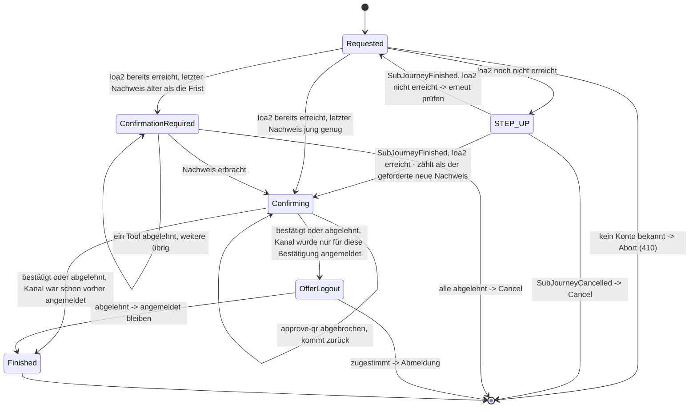

> Eine Journey aus dem Katalog. Wie die Diagramme zu lesen sind, erklärt
> [../04-orchestrierung.md](../04-orchestrierung.md), Abschnitt 3.

# `CONFIRM_PEER_LOGIN`

Mit dieser Journey bestätigt die App eine Anmeldung auf der Website oder lehnt sie ab. Das ist der
QR-Login, also „mit dem Handy anmelden“: Die Website zeigt einen QR-Code, und der Nutzer gibt die
Anmeldung in der App frei.

**Zwei Kanäle, keine Sonderregel.** Ein Kanal ist die Verbindung eines Nutzers zum Orchestrator,
hier einmal die Website (Web-Kanal) und einmal die App. Im Web-Kanal stoßen `auth-qr` oder
`auth-qr-lookup` den Vorgang an. Am Vertrag der Journeys ändert das nichts. Das Ergebnis
(`ToolOutcome`) des App-Tools `approve-qr` wirkt nur auf die **eigene** `AuthJourney`
(`Action.RecordApproval`). Die Verbindung zwischen den beiden Kanälen liegt im Modul `auth_qr`. Dort
gibt es eine gemeinsame `QrLoginRequest`-Zeile, die beide Seiten lesen und schreiben. Deshalb
braucht die SPI der Journeys, also ihre gemeinsame Schnittstelle, keinen Sonderfall für Abläufe
über zwei Kanäle.

**Zwei Wege hinein.** `CONFIRM_PEER_LOGIN` ist **zweierlei**: ein Einstieg für eine neue Journey und
ein zusätzlicher Schritt in einer bereits angemeldeten Sitzung (Orchestrierung, Abschnitt 2). Beide
Wege führen in denselben Zustand `Requested`.

**Keine zusätzliche Rückfrage.** Vor den folgenden Sicherheitsprüfungen gibt es bewusst **keine**
eigene Frage „Möchten Sie bestätigen?“. Fehlt `loa2`, startet ohnehin ein Step-up, der das
Sicherheitsniveau anhebt. Dieser Step-up erklärt selbst, warum gefragt wird, und bietet
„Abbrechen“ als Ausweg an. Den Text dafür liefert `reason` in `StepUpState.forSubJourney`
(`StepUpState.Reason.PEER_LOGIN`).

Je nach Zustand des Kanals beginnt die Journey an einer von drei Stellen (Punkte 1 bis 3). Danach
laufen immer dieselben Schritte (Punkte 4 bis 6):

1. **Der Kanal ist noch nicht angemeldet.** Angeboten wird nur die Anmeldung am Konto des
   gekoppelten Geräts. Ist eine Geräteverknüpfung (`DeviceAccountLink`) bekannt, läuft derselbe
   Step-up auf `loa2` wie in Punkt 2, mit den Anmelde-Tools dieses Kontos. Das ist der
   `STEP_UP`-Zweig im Diagramm. Identifizierung und Registrierung werden **nicht** angeboten. Ohne
   `DeviceAccountLink` endet die Journey sofort mit `Abort`, ohne etwas anzubieten.
2. **Der Kanal ist angemeldet, aber unter `loa2`.** Dann läuft ein Step-up mit dem festen Ziel
   `loa2`. Anders als bei `MANAGE_AUTH_METHODS` gibt es keinen Ausweg über eine erneute
   Identifizierung (`allowReIdentification = false`). Auch für Konten, die nie identifiziert wurden,
   wird die Schwelle nicht gesenkt. Der Nachweis aus dem Step-up zählt bereits als der neue
   Nachweis, den Punkt 3 verlangt. Im Diagramm ist das der Pfeil `STEP_UP --> Confirming`. Geprüft
   wird das über `SubJourneyFinished.achievedAcr`.
3. **Der Kanal steht bereits auf `loa2` oder höher** (unabhängig von dieser Journey). Dann gilt
   dieselbe Frist wie bei `DELETE_ACCOUNT` und `MANAGE_AUTH_METHODS`. Ist der jüngste Nachweis der
   Sitzung höchstens fünf Minuten alt (`AuthPolicy.hasFreshProof`), geht es direkt weiter. Sonst
   weist der Nutzer neu nach, dass er es ist. Dafür reicht jedes aktive Verfahren, egal welches
   Niveau es erreicht (`CandidateTools.forReconfirmation`). Erst danach wird `approve-qr` angeboten
   (`ConfirmationRequired`). Dieser Nachweis wird nicht als dauerhafter Nachweis der Sitzung
   (`MethodEvidence`) gespeichert. Er erlaubt nur diese eine Bestätigung.
4. Danach wird `approve-qr` gestartet (`Confirming`). Es ist der einzige Kandidat. Geht der Nutzer
   dort zurück (`Abandoned`), lehnt er die Anfrage damit nicht ab. Er kommt nur wieder zum selben
   Kandidaten.
5. `approve-qr` hat nach der Freigabe einen dritten Schritt `showCode`. Die App zeigt dort den
   Bestätigungscode, den der Nutzer in den wartenden Browser tippt. Erst damit ist der Browser
   angemeldet ([Verfahren `qr`](../verfahren/qr.md), Abschnitt „Sicherheit des Pairing-Codes“).
   `done` schließt das Tool ab.
6. Das Ziel ist erreicht, sobald das Tool `Completed` oder `Failed` meldet. Die Kandidatenliste wird
   danach nicht noch einmal angeboten. Die Journey endet mit diesem einen Tool. War der Kanal vorher
   nicht angemeldet, fragt `OfferLogout`, ob er angemeldet bleiben soll. `OfferLogout` ist ein
   `AnswerableState`, also ein Zustand mit einer Ja/Nein-Frage.

**Der Pairing-Code.** Der Pairing-Code ist die kurze Zeichenfolge, die der Browser neben dem
QR-Code zeigt. Er wird **nicht** beim Anlegen des Kanals übergeben. Er ist ein Eingabefeld im ersten
Schritt von `approve-qr`. Der QR-Code (in der Demo der Link) enthält einen Deep-Link, also einen
Link, der direkt eine bestimmte Stelle in der App öffnet. Er setzt in der App
`intent=confirm_peer_login` und gibt den `pairingCode` mit, sodass das Feld schon ausgefüllt ist
([Frontend](../10-frontend.md)).

Dass der Deep-Link den Pairing-Code vorbelegt, ist unkritisch. Die Freigabe allein meldet keinen
Browser an. Dafür muss der Bestätigungscode erst zurück in den Browser.
