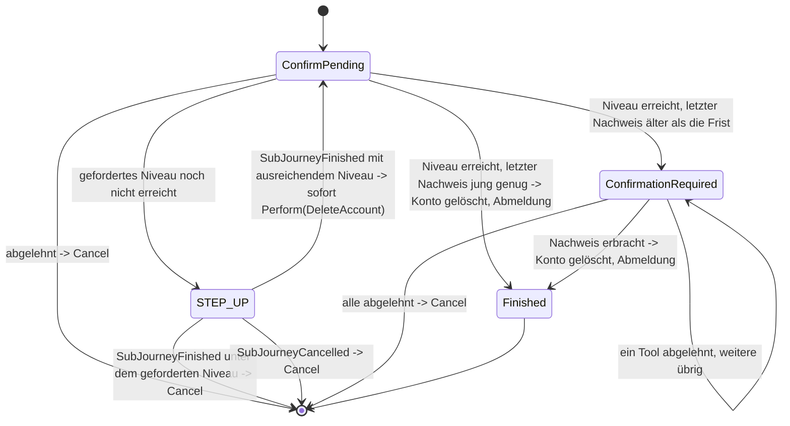

> Eine Journey aus dem Katalog. Wie die Diagramme zu lesen sind, erklärt
> [../04-orchestrierung.md](../04-orchestrierung.md), Abschnitt 3.

# `DELETE_ACCOUNT`

Mit dieser Journey löscht ein Nutzer sein eigenes Konto. Sie setzt einen Kanal voraus, der schon
`AUTHENTICATED` ist, also eine angemeldete Verbindung von App oder Website.

Zuerst kommt in jedem Fall die Ja/Nein-Frage, ob der Nutzer sein Konto wirklich löschen will. Sie
wird nie erst nach einem Step-up gestellt, also nach dem Anheben des Sicherheitsniveaus. Wie die
Frage technisch aussieht, beschreibt [05-api.md](../05-api.md) im Abschnitt „Das
`Prompt`-Objekt“.

**Welches Niveau verlangt wird.** `ConfirmPending` ist ein `AnswerableState`, also ein Zustand, der
eine Ja/Nein-Frage stellt. Seine Frage ist als folgenschwer markiert (`destructive: true`). Nach der
Zustimmung gilt dieselbe Schwelle wie bei [`MANAGE_AUTH_METHODS`](manage-auth-methods.md), denn
`Action.DeleteAccount.requiredAcr` ruft dieselbe Funktion `selfServiceAcrFloor` auf. Verlangt wird
`loa2`. Für ein Konto, das nie identifiziert wurde, reicht `loa1`.

**Nur mit frischem Nachweis.** Ein Nachweis ist das, was der Nutzer in dieser Sitzung bewiesen hat,
etwa ein richtig eingegebenes Passwort. Gelöscht wird nur mit einem frischen Nachweis: Der jüngste
Nachweis der Sitzung darf höchstens fünf Minuten alt sein (`AuthPolicy.hasFreshProof`,
`identity.policy.self-service-max-age`). Ist er älter, weist der Nutzer noch einmal ein Verfahren
nach. Das kann jedes aktive Verfahren sein, egal welches Niveau es erreicht. So wird ein Konto nie
aus einer Sitzung heraus gelöscht, die schon länger offen ist. Musste vorher ein Step-up laufen,
zählt dessen Nachweis bereits als frisch.

**Wie gelöscht wird.** Der letzte Übergang ist
`Transition.Perform(Action.DeleteAccount, resumeState = ConfirmPending)`. Die Strategie entscheidet
damit nur, dass gelöscht werden soll. Ausgeführt wird die Löschung danach vom gemeinsamen
Mechanismus. Wird die Journey anschließend mit `ActionCompleted` fortgesetzt, wird daraus
`Transition.Logout`: Das Konto ist gelöscht, und der Kanal wird beendet.

Unmittelbar vor der Ausführung prüft `JourneyActionExecutor` `requiredAcr(account)` noch einmal.
Das entspricht der Prüfung vor `Action.RevokeAuthMethod`, ob sich der Nutzer aussperren würde.

Der Nachweis in `ConfirmationRequired` führt direkt zu `Action.DeleteAccount` und nie über
`Action.AcceptProof`. Er erlaubt genau diese eine Löschung. Er wird nie als dauerhafter Nachweis der
Sitzung gespeichert (`MethodEvidence`, siehe Orchestrierung, Abschnitt 8).
