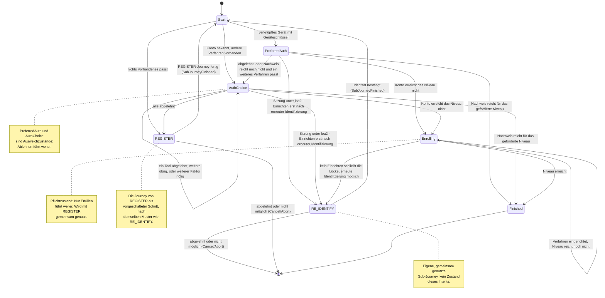

> Eine Journey aus dem Katalog. Wie die Diagramme zu lesen sind, erklärt
> [../04-orchestrierung.md](../04-orchestrierung.md), Abschnitt 3.

# `FAST_ACCESS`

`FAST_ACCESS` ist die schnelle Anmeldung in der App und der Standard-Einstieg. Sie versucht zuerst
die bequemen Wege. Lehnt der Nutzer einen Weg ab, bietet sie Schritt für Schritt aufwendigere an.
Solche Zustände heißen **Ausweichzustände**: Ablehnen führt zum nächsten Weg.

Danach folgen **Pflichtzustände**. In ihnen führt Ablehnen nicht weiter, nur Erfüllen. Sie sorgen
dafür, dass der Nutzer sich auch beim nächsten Mal anmelden kann.

**Was die Zustände enthalten.** `PreferredAuth` enthält genau das eine vorgeschlagene Tool
(`toolId`). `AuthChoice` und `Enrolling` enthalten das Angebot und die bisherigen Ablehnungen. Diese
beiden Zustände nutzt `FAST_ACCESS` gemeinsam mit `RegisterState` (siehe [`REGISTER`](register.md)).

`Enrolling` hat zusätzlich das Feld `emailObligation`. `FAST_ACCESS` setzt es nie, es bleibt also
`false`. Die Pflicht, die E-Mail-Adresse zu bestätigen, gibt es nur, wenn die Journey über
`RegisterState.Identifying` gelaufen ist (Orchestrierung, Abschnitt 5).

**Identifizieren lassen andere.** `FAST_ACCESS` identifiziert nie selbst. Dafür startet es eine
Sub-Journey, also einen untergeordneten Ablauf, der auch von anderen Journeys genutzt wird:

- Gibt es kein Konto, oder hat der Nutzer jedes Verfahren abgelehnt, startet die Journey von
  [`REGISTER`](register.md) als vorgeschalteter Schritt (`Transition.RequireSubJourney`).
- Kann in `Enrolling` kein neu eingerichtetes Verfahren das fehlende Niveau liefern, fragt die
  gemeinsam genutzte Sub-Journey [`RE_IDENTIFY`](re-identify.md) nach einer erneuten
  Identifizierung.

Ist die Sub-Journey fertig (`SubJourneyFinished`), prüft `Start` mit `afterProof` erneut, ob der
Nachweis reicht.

**Der Unterschied im Code.** Der Unterschied zwischen beiden Zustandsarten zeigt sich im Feld
`declined`. In einem Ausweichzustand sammelt es die abgelehnten Tools. In einem Pflichtzustand tut
es das **nicht**, denn dort führt Ablehnen nicht weiter.
