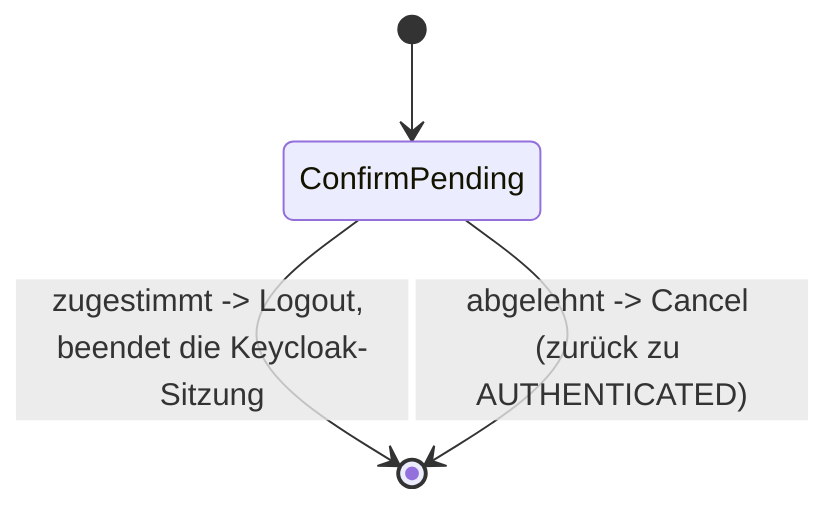

> Eine Journey aus dem Katalog. Wie die Diagramme zu lesen sind, erklärt
> [../04-orchestrierung.md](../04-orchestrierung.md), Abschnitt 3.

# `LOGOUT`

Mit dieser Journey meldet sich der Nutzer ab. Vorher stellt sie eine einzige Rückfrage. Ein Tool,
also ein eigener Bedienschritt wie eine Code-Eingabe, ist dafür nicht nötig.

`ConfirmPending` ist wie bei `DELETE_ACCOUNT` ein `AnswerableState`, also ein Zustand, der eine
Ja/Nein-Frage stellt. Stimmt der Nutzer zu, folgt der Übergang `Transition.Logout`. Er beendet den
Kanal und die Keycloak-Sitzung. Lehnt der Nutzer ab, folgt `Cancel`, und der Kanal ist wieder
`AUTHENTICATED`, also angemeldet.
