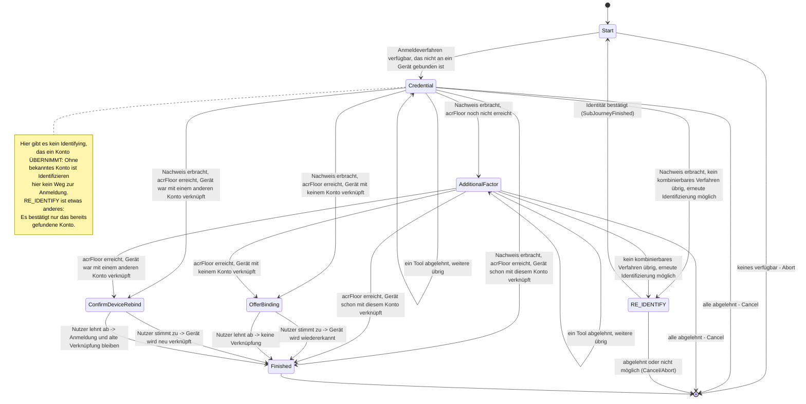

> Eine Journey aus dem Katalog. Wie die Diagramme zu lesen sind, erklärt
> [../04-orchestrierung.md](../04-orchestrierung.md), Abschnitt 3.

# `LOOKUP_LOGIN`

Mit dieser Journey meldet sich ein Nutzer an, ohne dass sein Gerät schon mit dem Konto gekoppelt
ist. Er gibt seine E-Mail-Adresse an und weist eines seiner Anmeldeverfahren nach.

**Was angeboten wird.** Angeboten werden alle Tools mit der Rolle `ToolRole.ACCOUNT_LOOKUP_AUTH`,
die die App meldet. Das sind Tools, die das Konto selbst aus der Eingabe finden. `auth-invite-lookup`
gehört auch zu dieser Rolle, gibt es aber nur im Web-Kanal. Die App meldet es nicht, und die
Voreinstellung sperrt es im App-Kanal
([ADR-48](../adr/ADR-048-vorgangszugang-mit-einmalkennwort.md)).

Die Kandidatenliste von `AuthPolicy.authCandidates` passt hier nicht. Sie setzt nämlich ein Konto
voraus, das bereits gefunden ist.

**Das Gerät wiedererkennen.** Nach dem Nachweis stellt `OfferBinding` eine freiwillige Frage:
„Dieses Gerät für künftige Anmeldungen wiedererkennen?“ Dafür implementiert der Zustand das
allgemeine Markierungs-Interface `AnswerableState` (Orchestrierung, Abschnitt 8). So erkennt der
gemeinsame Mechanismus den Zustand als Frage, ohne `LookupLoginState.OfferBinding` zu kennen.

Je nachdem, wem das Gerät gerade zugeordnet ist, geht es verschieden weiter:

- Gehört das Gerät bereits einem anderen Konto als dem gerade angemeldeten, wechselt die Journey nach
  `ConfirmDeviceRebind`. Dort läuft dieselbe Ja/Nein-Frage, zusammen mit dem Hinweis, dass die alte
  Verknüpfung verloren geht. Lehnt der Nutzer ab, entfällt nur das neue Verknüpfen. Die Anmeldung
  selbst bleibt bestehen.
- Ist das Gerät schon mit genau diesem Konto verknüpft, gibt es nichts zu fragen. Die Journey endet
  direkt mit einer erfolgreichen Anmeldung.

Die dauerhafte Zuordnung von Gerät zu Konto (`DeviceAccountLink`) entsteht in dieser Journey
**nur** mit Zustimmung und nie nebenbei beim Anmelden.

**Wenn das Niveau nicht reicht.** Jeder Kanal hat eine Untergrenze für das Sicherheitsniveau
(`acrFloor`, Orchestrierung, Abschnitt 4). `AdditionalFactor` sorgt dafür, dass sie erreicht wird,
und verlangt dafür einen weiteren Faktor. Bleibt danach kein kombinierbares Verfahren übrig, bietet
die Strategie die erneute Identifizierung nicht selbst an. Sie startet stattdessen die gemeinsam
genutzte Sub-Journey [`RE_IDENTIFY`](re-identify.md). Ist diese fertig, prüft `Start` mit
`settleOrRaise` erneut.

Diese Journey bietet bewusst **nicht** an, ein weiteres Verfahren einzurichten. Die erneute
Identifizierung ist dagegen erlaubt. Bei ihr entsteht nämlich kein Credential, also kein
gespeichertes Anmeldemerkmal, auf einem ungeprüften Gerät.

**Schutz vor dem Ausforschen von Adressen:** Ein Angreifer soll nicht herausfinden können, ob es
zu einer E-Mail-Adresse ein Konto gibt. Eine unbekannte E-Mail-Adresse erhält deshalb dieselbe
Antwort wie ein gefundenes Konto, dessen Nachweis fehlschlägt. Es gibt keine eigene Fehlerform
dafür. Auch wann Demo-Werte in der Antwort erscheinen, unterscheidet sich nicht ([API](../05-api.md)).
Darüber hinaus ist der Schutz bewusst nicht verstärkt. Die Antwortzeiten werden zum Beispiel nicht
angeglichen.
