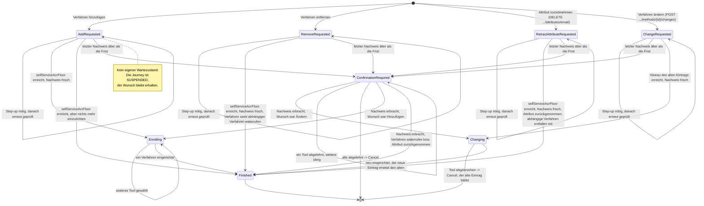

> Eine Journey aus dem Katalog. Wie die Diagramme zu lesen sind, erklärt
> [../04-orchestrierung.md](../04-orchestrierung.md), Abschnitt 3.

# `MANAGE_AUTH_METHODS`

Mit dieser Journey verwaltet ein angemeldeter Nutzer seine Anmeldeverfahren. Er kann ein Verfahren
hinzufügen, ändern oder entfernen. Außerdem kann er eine bestätigte Angabe zurücknehmen, heute die
E-Mail-Adresse. Jeder dieser Wünsche hat einen eigenen Startzustand.

**Wunsch und Wartezustand zugleich.** `AddRequested`, `ChangeRequested`, `RemoveRequested` und
`RetractAttributeRequested` halten den Wunsch des Nutzers fest. `ChangeRequested` und
`RemoveRequested` enthalten dafür die `methodInstanceId`, also welcher Eintrag gemeint ist.
`RetractAttributeRequested` enthält den `attributeType`.

Derselbe Zustand gilt vor der Prüfung gegen die geforderte Schwelle (`selfServiceAcrFloor`). Er gilt
auch, während er auf einen Step-up wartet, also auf das Anheben des Sicherheitsniveaus. Lehnt der
Nutzer den Step-up ab, endet die Journey (`Cancel`). Derselbe Step-up wird nicht erneut angeboten.
`Enrolling` enthält das Angebot und die bisherigen Ablehnungen.

**Ändern ist erneutes Einrichten.** `ChangeRequested` nennt den Eintrag, der ersetzt werden soll.
`Changing` bietet genau ein Tool an: das `enroll-*`-Tool dieses Verfahrens. Der neue Eintrag
ersetzt den alten erst, wenn er fertig ist (`Action.AdoptCredential`). Bricht der Nutzer ab, endet
die Journey, und der alte Eintrag gilt weiter. Ein anderes Verfahren wird nicht angeboten. „Zurück“
im Tool zeigt deshalb eine Auswahl mit diesem einen Verfahren und „Abbrechen“.

- **Änderbar** ist ein Verfahren, wenn sein Einrichtungs-Tool das erlaubt
  (`enroll(…, changeable = true)`). Das sind `sms` und `password`. Verfahren mit einem Credential
  je Gerät (`device`, `kobil`) werden nur hinzugefügt oder entfernt. `email` und `qr` haben nichts,
  was ein neuer Lauf ersetzen könnte. Die Liste der Verfahren enthält das Kennzeichen
  (`changeable`). Ein Aufruf für ein anderes Verfahren wird mit `409` abgelehnt.
- **Niveau.** Die Schwelle ist das höhere von zwei Niveaus: `selfServiceAcrFloor` und das Niveau,
  unter dem der alte Eintrag eingerichtet wurde (`enrolledUnderAcr`). Ein Ändern stuft also nie
  herab. Reicht die Sitzung nicht, folgt der Step-up. Erreicht dabei kein Verfahren das Niveau,
  bietet der Step-up die Re-Identifizierung an. `Changing` hält das Niveau fest, das die Sitzung bei
  dieser Prüfung hatte. Der neue Eintrag wird mindestens unter diesem Niveau gespeichert. Das gilt
  auch, wenn die Nachweise der Sitzung während der Eingabe altern
  (`Action.AdoptCredential.admittedAt`).
- **Was das Tool weiß.** Das Einrichtungs-Tool kennt den Wunsch nicht. Es fragt beim Start, ob das
  Konto schon ein Credential seines Verfahrens hat (`ToolJourney.findEnrollment`). Das meldet es in
  seinem `stepData` (`replaces`).

**Frischer Nachweis.** Nach der Schwelle prüft jeder Wunsch, ob der jüngste Nachweis der Sitzung
höchstens fünf Minuten alt ist (`AuthPolicy.hasFreshProof`, wie bei
[`DELETE_ACCOUNT`](delete-account.md)). Ist er älter, hält `ConfirmationRequired` den Wunsch fest.
Der Zustand bietet dann jedes aktive Verfahren zur erneuten Bestätigung an, egal welches Niveau es
erreicht. Der Nachweis aus einem Step-up, der gerade lief, ist schon frisch.

Der Nachweis in `ConfirmationRequired` erlaubt genau diesen einen Wunsch. Er wird nie zu einem
Nachweis der Sitzung. Lehnt der Nutzer alle Verfahren ab, endet die Journey, und nichts ist
geändert. Gibt es nichts mehr einzurichten, endet das Hinzufügen ohne Nachfrage.

**Ein Verfahren je Journey.** `MANAGE_AUTH_METHODS` ist der einzige Intent ohne Zielniveau in der
Richtlinie. Die Journey endet, sobald **ein** Verfahren erfolgreich eingerichtet ist, unabhängig vom
erreichten Niveau. Für ein zweites Verfahren beginnt eine neue Journey.

**Der Wunsch bleibt beim Step-up erhalten.** Dass die Journey wartet, erkennt man an
`JourneyLifecycle.SUSPENDED` (pausiert) und an der `parentJourneyId` der Kind-Journey, also am
Verweis des Step-ups auf die wartende Journey. Deshalb geht der Wunsch beim Step-up nicht verloren.
Ist der Step-up fertig, wird derselbe Zustand erneut ausgewertet. Er prüft die Vorbedingung noch
einmal und führt dann aus, was ursprünglich verlangt war.

**Welches Niveau verlangt wird.** Die Vorbedingung folgt derselben Überlegung wie die Begrenzung
durch `enrolledUnderAcr` (Orchestrierung, Abschnitt 4): Niemand soll sich selbst mehr Rechte
verschaffen können, als ihm zustehen. Wer eine fremde Sitzung übernommen hat, darf deshalb keine
Verfahren hinzufügen oder entfernen. Das geforderte Niveau liefert die gemeinsam genutzte Funktion
`selfServiceAcrFloor` (`orchestrator/domain/journey/IntentStrategy.kt`). `DeleteAccountStrategy`
nutzt sie auch:

- Für ein identifiziertes Konto ist es `loa2`.
- Für ein Konto, das nie identifiziert wurde (`personId == null`, etwa aus dem Experiment „Erst
  Anmeldeverfahren einrichten“), reicht `loa1`. Bei einem solchen Konto gibt es keine gebundene
  Identität, der eine übernommene Sitzung zusätzlich schaden könnte. Außerdem wäre `loa2` dort nie
  erreichbar. Die Regel für kombinierte Verfahren begrenzt jede Erhöhung auf das höchste
  `enrolledUnderAcr` der Verfahren eines Kontos. Bei einem nie identifizierten Konto ist das immer
  `loa1`.

**Nicht aussperren.** Beim Entfernen wird zusätzlich geprüft, ob das Konto danach die Untergrenze
des Kanals noch erreichen kann. Wenn nicht, antwortet der Server mit `409`. So kann sich niemand
selbst aussperren.

**Bewusst nur die Untergrenze des Kanals, nicht `selfServiceAcrFloor`**: Ein identifiziertes Konto
darf Verfahren entfernen, bis es mit den eigenen Verfahren nur noch `loa1` erreicht. Ein Beispiel ist
das Entfernen des Passworts, wenn nur SMS bleiben soll. Für die nächste Verwaltung braucht das Konto
dann wieder `loa2`. Der vorgesehene Weg dorthin ist die Re-Identifizierung (`ident-fsc`, eID, Nect,
siehe `AuthPolicy.reIdentCandidates`).

Die Registrierung verlangt dagegen `loa2` (`AuthEnrollCore.ENROLLMENT_FLOOR_ACR`), aber aus einem
anderen Grund: Neue Verfahren werden nur in einer Sitzung mit mindestens `loa2` eingerichtet. Die
beiden Schwellen meinen also verschiedene Dinge und widersprechen sich nicht.

Würde man beim Entfernen zusätzlich verlangen, dass `loa2` erreichbar bleibt, würde das berechtigte
Wünsche ablehnen. Es würde nur eine Re-Identifizierung ersparen, die ohnehin vorgesehen ist.

Ein Restrisiko bleibt: Ist gerade keine Re-Identifizierung verfügbar (Verfahren gesperrt,
Freischaltcode abgelaufen), muss der Nutzer auf einen neuen Brief warten oder die eID nutzen.
