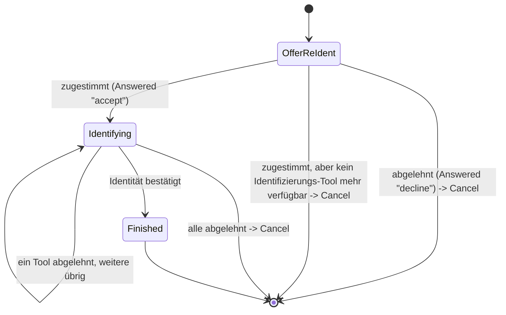

> Eine Journey aus dem Katalog. Wie die Diagramme zu lesen sind, erklärt
> [../04-orchestrierung.md](../04-orchestrierung.md), Abschnitt 3.

# `RE_IDENTIFY`

Bei der **erneuten Identifizierung** weist der Nutzer noch einmal nach, wer er ist, etwa mit dem
Online-Ausweis. Das ist der Ausweg, wenn seine Anmeldeverfahren das geforderte Sicherheitsniveau
nicht erreichen.

Die erneute Identifizierung ist eine gemeinsam genutzte **Sub-Journey**, also ein untergeordneter
Ablauf, den andere Journeys starten. Diese Journeys fordern sie an:

- [`FAST_ACCESS`](fast-access.md), [`LOOKUP_LOGIN`](lookup-login.md) und [`STEP_UP`](step-up.md).
- [`WEB_SELECT_METHOD`](web-select-method.md) beim Step-up im Web-Kanal, wenn kein Verfahren des
  Kontos das fehlende Niveau liefern kann.
- [`REGISTER`](register.md), und zwar über `AuthEnrollCore.offerEnrollment`, wenn ein neues
  Verfahren erst nach einer erneuten Identifizierung eingerichtet werden darf.
- Das Experiment „Erst Anmeldeverfahren einrichten“ (`RegisterEnrollFirstStrategy`, siehe
  [register-enroll-first.md](register-enroll-first.md)).

Es gibt nur diese eine Umsetzung und nicht sechs fast gleiche. `RE_IDENTIFY` ist nie der Einstieg
einer Journey. Man erreicht sie nur über den Übergang `Transition.RequireSubJourney`.

`OfferReIdent` fragt immer zuerst nach: „Erneut identifizieren?“. Technisch ist das ein
`AnswerableState`, also ein Zustand mit einer Ja/Nein-Frage. Die erneute Identifizierung beginnt
deshalb nie, ohne dass der Nutzer es merkt.

`Identifying` enthält das Zielniveau (`targetAcr`), das Niveau beim Start (`startingAcr`), das
Angebot und die bisherigen Ablehnungen. Für sich allein erreicht `ident-fsc` das Niveau `loa2`.
`ident-eid` und `ident-nect` erreichen `loa3`.

**Eigener Text für das Experiment.** Der Standardtext lautet „Sicherheitsniveau mit den
vorhandenen Anmeldeverfahren nicht erreichbar“. Er passt nur für `FAST_ACCESS`, `LOOKUP_LOGIN`,
`STEP_UP` und `WEB_SELECT_METHOD`. Für das abschließende Angebot von `RegisterEnrollFirstStrategy`
ist er falsch.

Deshalb hat `ReIdentifyState` ein optionales Feld `wording` vom Typ `Wording`. Heute gibt es dafür
nur den Wert `OPTIONAL_IDENTIFICATION`. Das Feld wählt Titel, Beschreibung und Knopftexte von
`OfferReIdent` und `Identifying`. Gesetzt wird es über
`forSubJourney(targetAcr, startingAcr, wording)`, und nur dieser eine Aufrufer belegt es. Bleibt
es `null`, gilt der Standardtext. Das folgt demselben Muster wie `reason` in
`StepUpState.forSubJourney`.

**Wohin eine Ablehnung führt.** Wie bei jeder Journey kehrt der Kanal zu dem Anmeldestand zurück,
den er vor dem Start hatte ([Orchestrierung](../04-orchestrierung.md), `IntentStrategy`):

- War der Kanal noch nicht angemeldet (`FAST_ACCESS`, `LOOKUP_LOGIN`), fällt er auf `ANONYMOUS`
  zurück.
- War er schon angemeldet (`STEP_UP`), bleibt er `AUTHENTICATED`. Eine abgelehnte erneute
  Identifizierung meldet also keine laufende Sitzung ab.

**Bestätigen, nicht übernehmen.** Meldet ein Tool eine erfolgreiche Identifizierung
(`Identified`), liefert `transition()` immer dieselbe Aktion `Action.RecordIdentification`. Hier ist
stets schon ein Konto zugeordnet. Deshalb bestätigt die Aktion die Identität nur und übernimmt kein
anderes Konto. Die identifizierte Person muss zum bereits bekannten Konto passen. Sonst antwortet der
Server mit `409`. Das gilt unabhängig davon, welcher Intent die Sub-Journey angefordert hat.

Einzige Ausnahme ist ein Konto, das noch nie identifiziert wurde. Ein solches Konto entsteht im
Experiment „Erst Anmeldeverfahren einrichten“. Es übernimmt die Identität hier zum ersten Mal.
