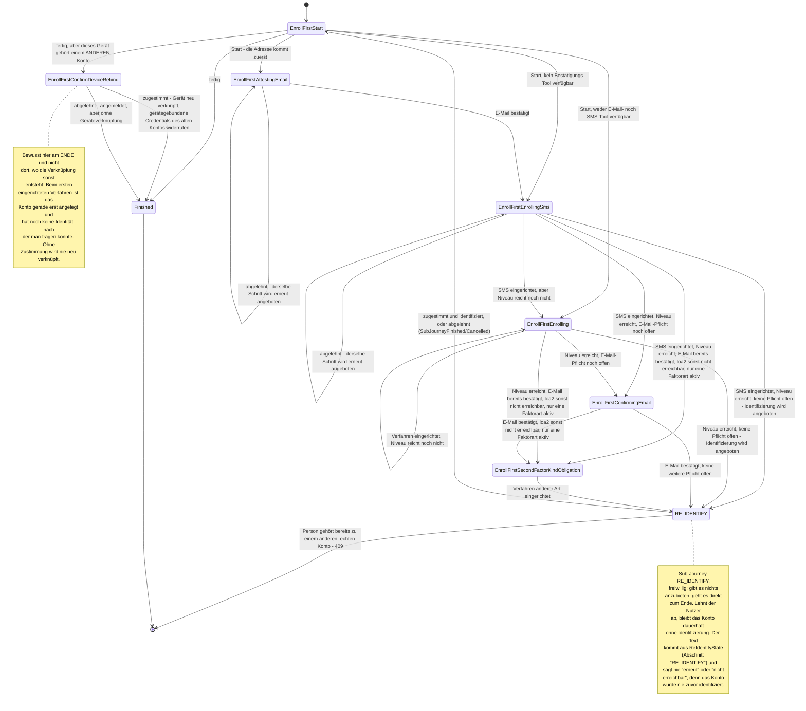

> Eine Journey aus dem Katalog. Wie die Diagramme zu lesen sind, erklärt
> [../04-orchestrierung.md](../04-orchestrierung.md), Abschnitt 3.

# `REGISTER`: Experiment „Erst Anmeldeverfahren einrichten“

Die normale Registrierung beschreibt [`REGISTER`](register.md).

Dies ist eine zweite, eigenständige Variante der Registrierung (`REGISTER`). Sie dreht die
Reihenfolge um: Der Nutzer richtet zuerst Anmeldeverfahren ein, und die Identifizierung wird erst
am Ende angeboten.

**Eigene Zustände, eigene Strategie.** Die Variante hat eigene Zustände (`RegisterEnrollFirstState`)
und eine eigene Strategie. Keiner dieser Zustände wird mit `RegisterState`, `AuthChoice` oder
`Enrolling` geteilt.

**Wie die Variante gewählt wird.** Unter `AuthIntent.REGISTER` ist nur ein einziges Spring-Bean
registriert, `RegisterDispatchStrategy`. Es wählt für jede **neue** Journey einmal zwischen beiden
Varianten. Welche Variante eine laufende Journey nutzt, ergibt sich danach allein aus ihrem
Zustandstyp (`is RegisterEnrollFirstState` oder `is RegisterState`). Der Schalter wird dafür nie
erneut gelesen.

**Der Schalter.** Eingeschaltet wird die Variante über einen Schalter, den der Betreiber zur
Laufzeit umstellen kann (`JourneyFeatureFlag.REGISTER_ENROLL_FIRST`, `"register-enroll-first"`).
Den Wert liefert `FeatureFlagService` (`@Service`, implementiert `FeatureFlagProvider`) aus der
Tabelle `orchestrator.feature_flag`. Dort steht eine Zeile je Schalter. Fehlt die Zeile, ist der
Schalter aus. Lesen und setzen lässt er sich über
`GET/PUT /orchestrator/admin/registration-order` (`RegistrationOrderController`).

**Grundidee:** Zum Start ist kein Konto nötig. Das Konto entsteht erst, wenn das erste Verfahren
fertig eingerichtet ist, und nicht schon bei der Identifizierung. Das erledigt die allgemeine Aktion
`Action.AdoptCredential` im `JourneyService`. Bis dahin rechnet die Strategie mit einem
Platzhalter-Konto. Es existiert nur im Arbeitsspeicher und wird nie gespeichert
(`AccountProfile(accountId = -1, ...)`).

**Feste Reihenfolge: erst E-Mail, dann SMS.** In der normalen Variante (`RegisterState`,
`AuthEnrollCore`) wählt der Nutzer frei. Diese Variante verlangt dagegen eine feste Reihenfolge:

1. Zuerst bestätigt der Nutzer seine E-Mail-Adresse (`EnrollFirstAttestingEmail`). Das ist ein
   `ATTESTATION`-Schritt, der eine Angabe bestätigt, und kein Einrichten eines Verfahrens.
2. Danach richtet er SMS ein (`EnrollFirstEnrollingSms`).

Beide Schritte lassen sich nicht überspringen. Wer ablehnt (`Abandoned`), bekommt denselben Schritt
erneut angeboten. Hat der Betreiber eines der beiden Tools gesperrt, entfällt nur dieser Schritt.
Die Journey bleibt dadurch nicht stehen.

**Danach die üblichen Pflichten.** Danach gelten dieselben Pflichten wie in der normalen Variante
(Orchestrierung, Abschnitt 5), in dieser Reihenfolge:

- ein weiteres Verfahren, falls das Niveau nicht reicht,
- dann die E-Mail-Bestätigung,
- dann die Pflicht zu einem Verfahren einer zweiten Faktorart.

`EnrollFirstEnrolling` übernimmt alles, was E-Mail und SMS nicht abdecken, etwa ein höheres
Sicherheitsniveau. Es ist außerdem der Startzustand, wenn beim Start weder E-Mail noch SMS
verfügbar waren.

**Die Identifizierung am Ende.** Erst wenn alle Pflichten erfüllt sind, wird die Identifizierung
**einmal angeboten, aber nie erzwungen**. Das geschieht über die Sub-Journey `RE_IDENTIFY`
(`Transition.RequireSubJourney`), also über den gemeinsam genutzten Ablauf zur Identifizierung.

Lehnt der Nutzer ab oder gibt es nichts anzubieten, endet die Journey trotzdem erfolgreich
(`Transition.Authenticated`). Das Konto ist dann angemeldet, aber nicht identifiziert.

Gehört die identifizierte Person bereits zu einem anderen, echten Konto, lehnt der Executor die
Identifizierung mit `409` ab. Zwei echte Konten werden nämlich nie zusammengeführt. Gibt es für
diese Person dagegen nur ein verwerfbares Konto (etwa aus einem früher abgebrochenen eID-Lauf),
wird es übernommen (ADR-20). Verwerfbar ist ein Konto, das keiner Person zugeordnet ist und in dem
nie ein Anmeldeverfahren eingerichtet wurde.

**Rückfrage zum Gerät am Ende.** Das Smartphone kann schon mit einem anderen Konto verknüpft sein.
Dann fragt diese Variante erst am **Ende** der Journey, nach der freiwilligen Identifizierung, ob
es neu verknüpft werden soll (`EnrollFirstConfirmDeviceRebind`).

Der Grund für diesen späten Zeitpunkt: Die normale Variante identifiziert zuerst und kann direkt
danach fragen. Hier verknüpft die Journey dagegen beim ersten eingerichteten Verfahren. Zu diesem
Zeitpunkt ist das Konto gerade erst entstanden und hat noch keine Identität.

Lehnt der Nutzer ab, endet die Registrierung ohne Geräteverknüpfung. Das Konto bleibt über die
Anmeldung per E-Mail-Adresse voll nutzbar ([09-dpop.md](../09-dpop.md) Abschnitt 3).

