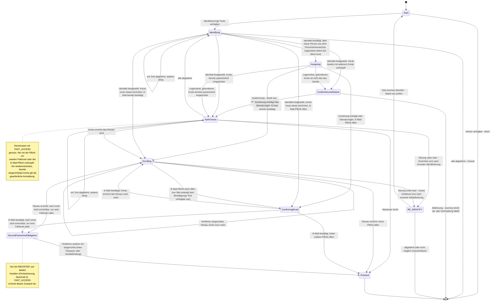

> Eine Journey aus dem Katalog. Wie die Diagramme zu lesen sind, erklärt
> [../04-orchestrierung.md](../04-orchestrierung.md), Abschnitt 3.

# `REGISTER`

Bei der **Registrierung** legt ein neuer Nutzer ein Konto an. Normalerweise identifiziert er sich
zuerst, etwa mit dem Online-Ausweis, und richtet danach ein Anmeldeverfahren ein.

Die Registrierung hat ihre eigene Journey mit eigenem Zustandstyp (`RegisterState`). Zwei Zustände
teilt sie mit [`FAST_ACCESS`](fast-access.md): `AuthChoice` und `Enrolling`. Nur zu ihr gehören
diese Zustände:

- `Identifying` (identifizieren),
- `ConfirmDeviceRebind` (Rückfrage, ob das Gerät neu verknüpft werden soll),
- `Assigning` (einer Person im Personenverzeichnis zuordnen),
- `ConfirmingEmail` (E-Mail-Adresse bestätigen),
- `SecondFactorKindObligation` (Pflicht zu einem Verfahren einer zweiten Faktorart).

Auch `FAST_ACCESS` nutzt diese Journey. Muss sich jemand beim schnellen Anmelden erst
identifizieren, startet sie als vorgeschalteter Schritt (siehe [`FAST_ACCESS`](fast-access.md)).

**Das Gerät gehört schon einem anderen Konto.** Ein Smartphone kann über die Geräteverknüpfung
(`DeviceAccountLink`) schon mit einem Konto verbunden sein. Es kann sein, dass die Identifizierung
ein **anderes** Konto findet als dieses („Zweitaccount“). Dann wird die Geräteverknüpfung nicht
stillschweigend überschrieben. `afterIdentification` prüft diesen Fall als Allererstes, noch bevor
ein Anmeldeverfahren angeboten wird. Dann wechselt die Journey nach `ConfirmDeviceRebind` und fragt
den Nutzer:

- Stimmt der Nutzer zu (`accept`), wird das Gerät neu verknüpft (`Action.LinkDevice`). Dabei wird
  jedes Credential (gespeichertes Anmeldemerkmal) des bisherigen Kontos widerrufen, das an genau
  diesen `bindingKeyRef` gebunden ist (`AccountDeletionService.revokeMethod`). Das betrifft heute
  `device` und `kobil`, also die Verfahren mit `ToolModule.onePerDevice`
  ([09-dpop.md](../09-dpop.md) Abschnitt 3). Danach geht es mit `afterIdentification` weiter.
- Lehnt er ab (`decline`), endet die Journey regulär über `Transition.Cancel`. Das ist kein Fehler,
  sondern dasselbe wie `DELETE .../journey`. Die bestehende Verknüpfung bleibt unverändert.

**Identifiziert, aber noch keiner Person zugeordnet.** Nach `ident-eid` (Online-Ausweis) oder
`ident-nect` (Nect) steht fest, wer jemand ist. Eine Person im Personenverzeichnis, also in den
Stammdaten der Versicherung, ist damit aber noch nicht gefunden. Denn auf einem Ausweisdokument
steht keine KVNR (ADR-18). Die Journey geht deshalb direkt nach `Assigning`, und `next` zeigt sofort
auf `ident-kvnr`. Dort gibt man die KVNR an oder, wenn man keine hat, die Partnernummer (ADR-34).

Eine Ja/Nein-Frage davor gibt es bewusst nicht. „Darf ich nach der Nummer fragen?“ und das
Formular, das nach ihr fragt, wären dieselbe Frage zweimal. Außerdem erklärt das Formular selbst,
wofür die Nummer gebraucht wird.

Wer nicht zuordnen will, bricht den Schritt ganz normal ab
(`DELETE /tools/api/ident-kvnr/v1/{toolSessionId}`, im Frontend beschriftet mit „Jetzt nicht“). Die
Registrierung läuft dann weiter. Das Konto bleibt **Interessent** (ADR-10): Die Identität ist voll
bestätigt, aber keiner Person im Personenverzeichnis zugeordnet. `Assigning` ist damit ein
Ausweichzustand und kein Pflichtzustand.

Nach `ident-fsc` wird `Assigning` nie erreicht. Bei diesem Verfahren bestätigt das
Personenverzeichnis die Person selbst, und die PersonId ist sofort bekannt.

**Identifizieren heißt: finden oder anlegen.** `Identifying` hat zwei Aufgaben. Es ist der Einstieg
in die Registrierung. Zugleich ist es der letzte Ausweg beim Anmelden (für `FAST_ACCESS`, als
Sub-Journey). Eine Trennung in Registrierung und Anmeldung gibt es dabei nicht. Welches von beiden
es war, zeigt sich erst danach. Dann wird das Konto anhand der Claims gesucht, also anhand der
Angaben, die die Identifizierung geliefert hat. Deshalb darf eine leere Kandidatenliste hier nicht
zum Abbruch führen.

Ein `Identified`-Ergebnis bedeutet an dieser Stelle „finde das Konto oder übernimm es“. Das ist
keine Besonderheit von `REGISTER`. Es folgt daraus, dass hier noch kein Konto zugeordnet ist. Ist
bereits eines zugeordnet (bei `RE_IDENTIFY` oder bei `Identifying` nach `AuthChoice`), läuft
dieselbe Action mit derselben Prüfung, nur mit anderem Ergebnis.

**Was mit dem Konto geschieht:**

- **Kein Konto gefunden** (`Resolution.Unresolved`): Die Journey schreibt auf das Konto, das sie
  bereits hat, solange dieses noch keine PersonId hat. Andernfalls entsteht ein neues Konto ohne
  zugeordnete Person.
- **Keine fremde Identität übernehmen:** Ein bereits identifiziertes Konto übernimmt nie die
  bestätigte Identität eines anderen. Angenommen, die Identifizierung ergibt eine Person ohne Konto,
  während der Kanal schon ein identifiziertes Konto kennt (etwa über die Geräteverknüpfung beim
  schnellen Anmelden). Dann wird die Person abgewiesen. Wer auf einem verknüpften Gerät ein eigenes,
  neues Konto will, startet mit `intent=register`. Dieser Einstieg übernimmt das Konto des Geräts
  nicht. Eine Person mit eigenem Konto führt dagegen zur Frage nach der Geräteverknüpfung (oben).
  Einen Zweig, der im ersten Fall still ein zweites Konto anlegt, gibt es nicht.
- **Speichern:** `recordClaims` schreibt PersonId und E-Mail auf demselben Weg für Claims und Anker.
  Ein **Anker** ist eine Angabe, über die sich ein Konto eindeutig wiederfinden lässt. Konto,
  Claims und Journey-Zustand werden in derselben Transaktion gespeichert. Scheitert sie an einem
  Konflikt, wird auch das neue Konto zurückgenommen.
- **Wiederfinden nur über Anker:** Bestehende Konten werden ausschließlich über Anker gefunden
  ([12-entscheidungen.md](../12-entscheidungen.md) ADR-19). Bei einer eID ist das die an die Karte
  gebundene `restricted_id`, egal ob die eID direkt oder über Nect gelesen wurde. Passt kein Anker,
  bleibt es beim neuen Interessenten.
- **Regeln der Kontoschicht:** Führt ein `Identified` zu einem bereits gebundenen Konto, setzt die
  Kontoschicht ihre Regeln durch. Die PersonId wird nur einmal gebunden und danach nie geändert.
  Jeder Anker gehört genau einem Konto.
- **Zwei Konten zusammenführen:** Findet der Schritt ein **anderes** Konto als das, mit dem die
  Journey arbeitet, wird das verwerfbare der beiden Konten in das andere übernommen. Seine Daten
  werden in das andere Konto übertragen, danach wird es gelöscht
  ([12-entscheidungen.md](../12-entscheidungen.md) ADR-20).
  Verwerfbar ist ein Konto ohne PersonId, auf dem nie ein Anmeldeverfahren eingerichtet wurde.
  - Ist das Konto der Journey das verwerfbare, wechselt die Journey zum gefundenen Konto und
    durchläuft `afterIdentification` noch einmal.
  - Ist das gefundene Konto das verwerfbare, bleibt die Journey bei ihrem Konto und übernimmt
    dessen Daten.
  - Sind beide echte Konten, bleibt es bei der Antwort `409`.

**Web-Kanal:** Auch im Web-Kanal kann man die Registrierung direkt starten, neben
`WEB_SELECT_METHOD`. Das geht mit `PATCH /kc/channels/{channelSessionId}` und `intent=register`
([05-api.md](../05-api.md) Abschnitt 3b). Ein eigenes Registrierungsformular von Keycloak gibt es
dafür nicht. `ident-fsc`, `ident-eid`, `ident-nect` und die `enroll-*`-Tools laufen über dieselben
Web-Tool-Renderer wie jeder andere Schritt. `ident-nect` kehrt von Nect auf die Action-URL des
laufenden Schritts zurück (ADR-47).

**Ein schon eingerichtetes Konto.** Manchmal findet `Identifying` ein **bereits bestehendes** Konto
(über die KVNR oder die Partnernummer), auf dem schon ein ausreichend starkes Verfahren eingerichtet
ist. Dann läuft der Nachweis über `AuthChoice`/`afterProof` und nicht über
`Enrolling`/`afterEnrollment`. Die Pflicht zur zweiten Faktorart und die E-Mail-Pflicht gelten dann
**nicht**.

Es gibt eine zweite Variante dieser Journey: das Experiment „Erst Anmeldeverfahren einrichten“
(`RegisterEnrollFirstStrategy`). Es richtet zuerst Verfahren ein und bietet die Identifizierung erst
am Ende an. Beschrieben ist es in [register-enroll-first.md](register-enroll-first.md).
