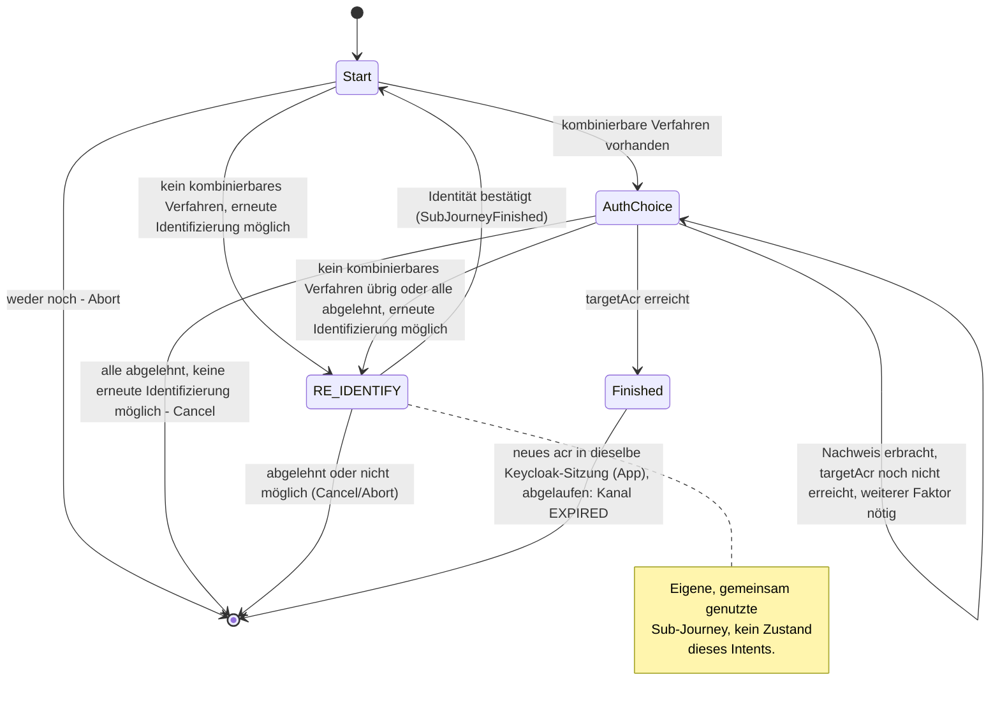

> Eine Journey aus dem Katalog. Wie die Diagramme zu lesen sind, erklärt
> [../04-orchestrierung.md](../04-orchestrierung.md), Abschnitt 3.

# `STEP_UP`

Jeder Zustand enthält `targetAcr`, `startingAcr`, `allowReIdentification` und `reason`.
`targetAcr` ist das Ziel dieses einen Laufs, nicht die dauerhafte Untergrenze des Kanals
(Orchestrierung, Abschnitt 8). `reason` sagt, warum ein Aufrufer den Step-up braucht (heute nur
`PEER_LOGIN`); ohne ihn gilt der allgemeine Text. `AuthChoice` enthält außerdem das Angebot, die
bisherigen Ablehnungen und `additionalFactorRound`. Liegt auf dem Kanal schon der Nachweis eines
Anmeldeverfahrens vor, sagt der Text, dass jetzt ein Verfahren anderer Art nötig ist.

`CONFIRM_PEER_LOGIN` fordert seinen Step-up mit `allowReIdentification = false` an. Dann entfällt
der Weg über `RE_IDENTIFY` ganz, und die Journey endet mit `Abort` oder `Cancel`.

Kann kein aktives Verfahren die Lücke schließen, bietet die Strategie die erneute Identifizierung
nicht selbst an. Sie startet stattdessen die gemeinsam genutzte Sub-Journey
[`RE_IDENTIFY`](re-identify.md). Das betrifft etwa ein Konto mit nur einem aktiven Verfahren, das
allein `loa1` erreicht. Ist die Sub-Journey fertig (`SubJourneyFinished`), prüft `Start` mit
`finishOrContinue` erneut, ob der Nachweis jetzt reicht.
