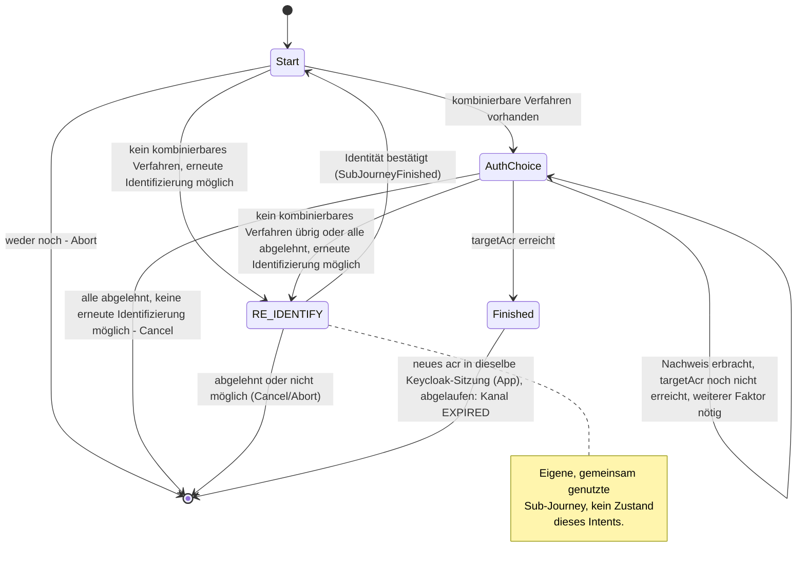

> Eine Journey aus dem Katalog. Wie die Diagramme zu lesen sind, erklärt
> [../04-orchestrierung.md](../04-orchestrierung.md), Abschnitt 3.

# `STEP_UP`

Ein **Step-up** hebt das Sicherheitsniveau (kurz Niveau, `loa1` bis `loa3`) einer schon
angemeldeten Sitzung an. Das ist zum Beispiel vor einer heiklen Aktion nötig. Der Nutzer weist dafür
ein weiteres Anmeldeverfahren nach.

**Was die Zustände enthalten.** Jeder Zustand enthält diese vier Felder:

- `targetAcr` ist das Niveau, das dieser eine Lauf erreichen soll. Es ist nicht die dauerhafte
  Untergrenze des Kanals (Orchestrierung, Abschnitt 4).
- `startingAcr` ist das Niveau beim Start.
- `allowReIdentification` sagt, ob eine erneute Identifizierung als Ausweg erlaubt ist.
- `reason` sagt, warum ein Aufrufer den Step-up braucht. Heute gibt es nur `PEER_LOGIN`. Ohne
  `reason` gilt der allgemeine Text.

`AuthChoice` enthält außerdem das Angebot, die bisherigen Ablehnungen und `additionalFactorRound`.
Liegt auf dem Kanal schon der Nachweis eines Anmeldeverfahrens vor, sagt der Text dem Nutzer, dass
jetzt ein Verfahren anderer Art nötig ist.

**Ohne erneute Identifizierung.** `CONFIRM_PEER_LOGIN` fordert seinen Step-up mit
`allowReIdentification = false` an. Dann entfällt der Weg über `RE_IDENTIFY` ganz. Reicht kein
Verfahren, endet die Journey mit `Abort` oder `Cancel`.

**Mit erneuter Identifizierung.** Manchmal kann kein aktives Verfahren das fehlende Niveau
liefern. Das betrifft etwa ein Konto mit nur einem aktiven Verfahren, das allein `loa1` erreicht.
Dann bietet die Strategie die erneute Identifizierung nicht selbst an. Sie startet stattdessen die
gemeinsam genutzte Sub-Journey [`RE_IDENTIFY`](re-identify.md), also einen untergeordneten Ablauf,
den mehrere Journeys nutzen. Ist die Sub-Journey fertig (`SubJourneyFinished`), prüft `Start` mit
`finishOrContinue` erneut, ob der Nachweis jetzt reicht.
