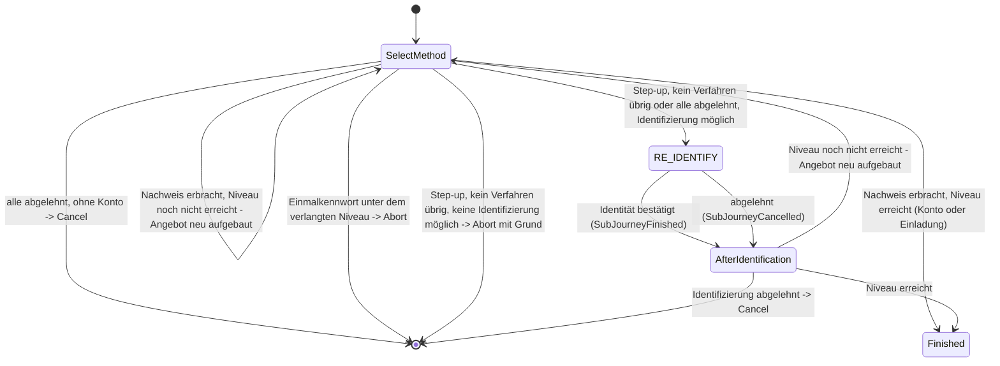

> Eine Journey aus dem Katalog. Wie die Diagramme zu lesen sind, erklärt
> [../04-orchestrierung.md](../04-orchestrierung.md), Abschnitt 3.

# `WEB_SELECT_METHOD`

Der `WEB`-Kanal ist die Verbindung der Website zum Orchestrator. Die Website wird dabei über
Keycloak angebunden, das Produkt, das dort die Anmeldung führt. Mit dem Intent `WEB_SELECT_METHOD`
beginnt im Web-Kanal jede Anmeldung und jeder Step-up (das Anheben des Sicherheitsniveaus), wenn
nichts anderes angegeben ist. Jeden Anmeldeschritt führt dabei der Orchestrator als Tool aus;
Keycloak hat keine eigenen ([ADR-58](../adr/ADR-058-keycloak-fuehrt-keine-eigenen-anmeldeschritte.md)).
Mehr dazu in [05-api.md](../05-api.md) Abschnitt 3b. Der zweite mögliche Einstieg im Web-Kanal ist
[`REGISTER`](register.md).

**Ein Zustand für das Angebot.** Die Journey hat einen Zustand für das Angebot. Er bietet alle im
Web-Kanal nutzbaren Tools, die hier etwas nachweisen können, in einem gemeinsamen
`selectMethod`-Schritt an. Ein Verfahren einzurichten, bietet die Journey nie an.

**Ein Ausweg nur beim Step-up.** Kann beim Step-up kein Verfahren des Kontos das fehlende Niveau
liefern, fordert die Journey die erneute Identifizierung an. Das tut [`STEP_UP`](step-up.md) in der
App genauso (siehe unten).

**Keycloak bestimmt das Niveau.** Ob überhaupt ein Niveau angefragt wird und welches, entscheidet
Keycloak selbst. Das legt seine Ablaufkonfiguration fest (Conditional-LoA-Subflows). Die Journey
prüft nur, ob die Nachweise dieses Niveau schon erreichen (siehe unten).

**Zwei Fälle, ein Zustand.** Derselbe Zustand bedient zwei Fälle im Web-Kanal. Sie unterscheiden
sich nur im Feld `accountAlreadyKnown`:

- **Erste Anmeldung** (`ctx.account` ist `null`): Angeboten werden alle Tools, die ihr Subjekt
  selbst aus der Eingabe finden (`CandidateTools.forLookupLogin`). Das Subjekt ist das, worauf sich
  die Anmeldung bezieht: ein Konto oder eine Einladung. Eine Identifizierung wird hier nie
  angeboten. Angeboten werden zwei Arten von Tools:
  - die Anmeldungen über die E-Mail-Adresse, die ein Konto finden,
  - `auth-invite-lookup`, das mit KVNR oder Partnernummer und Einmalkennwort eine Einladung findet
    ([ADR-48](../adr/ADR-048-vorgangszugang-mit-einmalkennwort.md)).

  Nach einem Einmalkennwort ist das Subjekt des Kanals die Einladung und kein Konto. Die Journey ist
  dann sofort fertig, denn eine Einladung kann keine weiteren Nachweise sammeln. Verlangt die
  Anmeldung ein höheres Niveau, als die Einladung erreicht, bricht die Journey ab, bevor etwas
  gebunden wird.
- **Step-up** (das Konto ist schon vor Beginn der Journey auf dem Kanal gesetzt): Angeboten werden
  nur Anmelde-Tools für dieses Konto.

**Bei jedem Ereignis neu prüfen.** Bei jedem Ereignis (`Started`, `ActionCompleted`) prüft die
Journey erneut, ob die vorhandenen Nachweise reichen. Dann baut sie die Kandidatenliste ganz neu
auf. Ein Nachweis kann nämlich schon vorliegen, bevor überhaupt etwas angeboten wurde. Er kann etwa
aus einem früheren Durchlauf derselben Keycloak-Sitzung stammen ([Orchestrierung](../04-orchestrierung.md)
Abschnitt 8, „Übernommene Nachweise als erster Übergang“).

**Der Ausweg beim Step-up.** Manchmal bleibt für das Konto kein Anmelde-Tool übrig, das das
fehlende Niveau liefern kann, oder der Nutzer hat alle abgelehnt. Dann fordert die Journey die
Sub-Journey [`RE_IDENTIFY`](re-identify.md) an, also die gemeinsam genutzte erneute
Identifizierung. Voraussetzung ist, dass ein Identifizierungs-Tool im Web das verlangte Niveau
erreicht.

Ein Beispiel ist ein Konto mit Gerät und SMS. Das Gerät gilt nur in der App. Die SMS ist schon
nachgewiesen. Ein zweites Verfahren anderer Art fehlt im Web. Eine Identifizierung in derselben
Sitzung zählt als `loa2` ([Überblick](../01-ueberblick.md) Abschnitt 9).

Nach der Sub-Journey geht es im Zustand `AfterIdentification` weiter. Er hat kein eigenes Angebot,
weil die Identifizierung das fehlende Niveau schon liefern kann. Reicht es noch nicht, wird das
Angebot neu aufgebaut. Lehnt der Nutzer die Identifizierung ab, endet die Journey mit `Cancel`,
statt dieselbe Frage noch einmal zu stellen.

Ist auch keine Identifizierung möglich, endet die Journey mit `Abort` und einem Grund, den Keycloak
anzeigt (`Reachability.toAuthAbortMessage`). Ein Beispiel für diesen Text: „Hier steht gerade kein
passendes Anmeldeverfahren zur Verfügung – etwa weil es in dieser Sitzung schon genutzt wurde oder
an ein anderes Gerät gebunden ist.“ So bekommt Keycloak nie eine leere Auswahl.

Bei der ersten Anmeldung ohne Konto gibt es diesen Ausweg nicht. Ohne Konto gibt es niemanden, den
eine Identifizierung bestätigen könnte. Für diesen Fall ist die Registrierung da.
