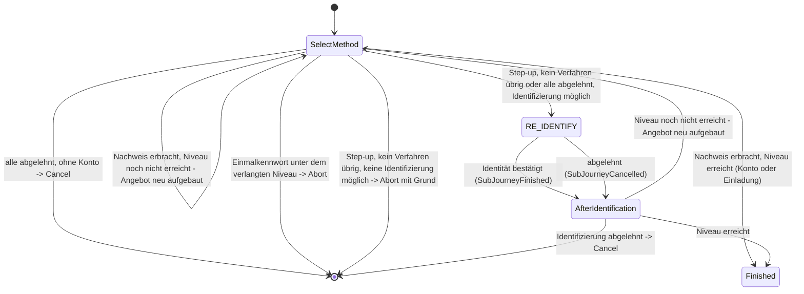

> Eine Journey aus dem Katalog. Wie die Diagramme zu lesen sind, erklärt
> [../04-orchestrierung.md](../04-orchestrierung.md), Abschnitt 3.

# `WEB_SELECT_METHOD`

Mit diesem Intent beginnt im `WEB`-Kanal jede Anmeldung und jeder Step-up, wenn nichts anderes
angegeben ist ([05-api.md](../05-api.md) Abschnitt 3, ADR-8 in
[12-entscheidungen.md](../12-entscheidungen.md)). Der zweite mögliche Einstieg im Web-Kanal ist
[`REGISTER`](register.md).

Die Journey hat einen Zustand für das Angebot. Er bietet alle im Web-Kanal nutzbaren Tools, die
hier etwas nachweisen können, in einem gemeinsamen `selectMethod`-Schritt an. Ein Verfahren
einzurichten, bietet sie nie an. Einen Ausweg gibt es nur beim Step-up: Kann kein Verfahren des
Kontos die Lücke schließen, fordert sie wie [`STEP_UP`](step-up.md) in der App die erneute
Identifizierung an (siehe unten). Ob überhaupt
ein Niveau angefragt wird und welches, entscheidet Keycloak selbst: Seine Ablaufkonfiguration
(Conditional-LoA-Subflows) legt es fest. Die Journey prüft nur, ob die Nachweise dieses Niveau schon
erreichen (siehe unten).

Derselbe Zustand bedient zwei Fälle im Web-Kanal. Sie unterscheiden sich nur im Feld
`accountAlreadyKnown`:

- **Erste Anmeldung** (`ctx.account` ist `null`): Angeboten werden alle Tools, die ihr Subjekt aus der
  Eingabe selbst finden (`CandidateTools.forLookupLogin`), nie eine Identifizierung. Das sind die
  Anmeldungen über die E-Mail-Adresse, die ein Konto finden, und `auth-invite-lookup`, das mit
  KVNR oder Partnernummer und Einmalkennwort eine Einladung findet
  ([ADR-48](../adr/ADR-048-vorgangszugang-mit-einmalkennwort.md)). Nach einem Einmalkennwort ist
  das Subjekt des Kanals die Einladung, kein Konto; die Journey ist dann sofort fertig, denn weitere
  Nachweise kann eine Einladung nicht sammeln. Verlangt die Anmeldung ein höheres Niveau, als die
  Einladung trägt, bricht sie ab, bevor etwas gebunden wird. Diesen Fall gibt es nur, wenn der Schalter `loa1` auf den Orchestrator stellt
  ([ADR-42](../adr/ADR-042-loa1-anmeldung-umschalten.md)); sonst meldet Keycloaks Passwortformular
  das Konto schon vorher.
- **Step-up** (das Konto ist schon vor Beginn der Journey auf dem Kanal gesetzt): Angeboten werden nur
  Anmelde-Tools für dieses Konto.

Bei jedem Ereignis (`Started`, `EvidenceReported`, `ActionCompleted`) prüft die Journey erneut, ob
das Vorhandene reicht, und baut die Kandidatenliste ganz neu auf. Ein Nachweis kann nämlich schon
vorliegen, bevor überhaupt etwas angeboten wurde, etwa aus einem eigenen Verfahren von Keycloak oder
aus RestoreData.

**Der Ausweg beim Step-up.** Bleibt für das Konto kein Anmelde-Tool übrig, das die Lücke schließen
kann, oder hat der Nutzer alle abgelehnt, fordert die Journey die Sub-Journey
[`RE_IDENTIFY`](re-identify.md) an, sofern ein Identifizierungs-Tool im Web das verlangte Niveau
erreicht. Das betrifft etwa ein Konto mit Gerät und SMS: Das Gerät gilt nur in der App, die SMS ist
schon nachgewiesen, ein zweites Verfahren anderer Art fehlt im Web. Eine Identifizierung in derselben
Sitzung zählt als `loa2` ([Überblick](../01-ueberblick.md) Abschnitt 9). Danach geht es im Zustand
`AfterIdentification` weiter. Er hat kein eigenes Angebot, weil die Identifizierung die Lücke schon
schließen kann; sonst wird das Angebot neu aufgebaut. Lehnt der Nutzer die Identifizierung ab, endet
die Journey mit `Cancel`, statt dieselbe Frage noch einmal zu stellen.

Ist auch keine Identifizierung möglich, endet die Journey mit `Abort` und einem Grund, den Keycloak
anzeigt (`Reachability.toAuthAbortMessage`), etwa „Hier steht gerade kein passendes
Anmeldeverfahren zur Verfügung – etwa weil es in dieser Sitzung schon genutzt wurde oder an ein
anderes Gerät gebunden ist.“ Keycloak bekommt so nie eine leere Auswahl.

Bei der ersten Anmeldung ohne Konto gibt es diesen Ausweg nicht: Ohne Konto gibt es niemanden, den
eine Identifizierung bestätigen könnte; dafür ist die Registrierung da.
