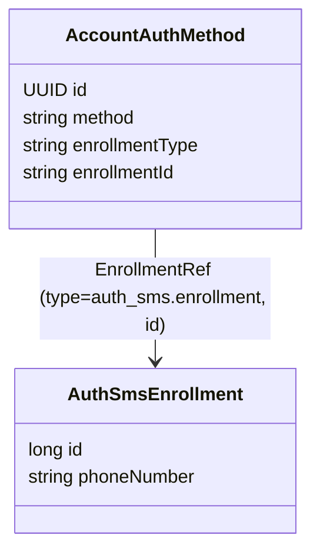

# Verfahren `sms`

Ein Code per SMS an eine Telefonnummer, die das Verfahren beim Einrichten selbst bestätigt. Die
Nummer gehört dem Verfahren, nicht dem Konto.

## Tools

| toolId | Rolle | Fassungen |
|---|---|---|
| `enroll-sms` | `ENROLLMENT`, `changeable` | 1, 2 |
| `auth-sms` | `KNOWN_ACCOUNT_AUTH` | 1 |
| `auth-sms-lookup` | `ACCOUNT_LOOKUP_AUTH` | 1 |

Faktor `{possession}`, höchstens `loa1`; ein aktiver Eintrag je Konto (`allowsMultipleInstances =
false`). Deklariert in `tools/auth_sms/SmsToolModule.kt`.

## Datenmodell

Das Credential ist die Zeile in `auth_sms.enrollment` mit der Telefonnummer; der Eintrag in
`account.auth_method` verweist über die `EnrollmentRef` darauf. Das allgemeine Modell dahinter steht
in [06-ablaeufe.md](../06-ablaeufe.md) Abschnitt 1.

- **Die TAN steht nicht im Enrollment.** Sie ist ein Einmalgeheimnis für genau einen Versuch und
  liegt als Hash mit Ablaufzeit in der Tabelle der Tool-Sitzung; sonst würden sich zwei
  gleichzeitige Versuche gegenseitig überschreiben. Die eingegebene TAN wird nie gespeichert, nur
  mit dem Hash verglichen.
- Die Arbeitsdaten eines Durchlaufs (Nummer, TAN-Hash und Ablaufzeit) hält das Tool als Datenklasse
  (`AuthSmsToolSession`) an der Tool-Sitzung des Orchestrators
  ([ADR-49](../adr/ADR-049-arbeitsdaten-der-tools-am-orchestrator.md)).
- Die Mobilnummer ist kein Anker des Kontos: `enroll-sms` beweist die Kontrolle mit derselben TAN,
  mit der es das Verfahren einrichtet, und nichts anderes hängt an der Nummer. Deshalb gibt es kein
  `confirm-phone` ([03-tool-architektur.md](../03-tool-architektur.md) Abschnitt 4, ADR-17). Aus
  demselben Grund steht heute keine Mobilnummer im Token ([05-api.md](../05-api.md) Abschnitt 3a,
  „ID-Token-Claims“).

## Einrichten: `enroll-sms`

Wie `auth-sms` (unten), nur entsteht der Datensatz `AuthSmsEnrollment` hier neu – und zwar erst **nach**
erfolgreicher Prüfung der TAN, nie schon beim ersten `PATCH` mit der Telefonnummer (die ist zu
diesem Zeitpunkt ja noch nicht bestätigt). Nach dem Abschluss legt der Orchestrator, wie in
[Orchestrierung](../04-orchestrierung.md) Abschnitt 8 beschrieben, den Eintrag in `account.auth_method`
an, einschließlich `enrolledUnderAcr` aus dem aktuellen Nachweis der Sitzung (`SessionEvidence`).

Die Aufrufe zeigt das Beispiel in [05-api.md](../05-api.md) Abschnitt 2 („Ein Tool-Durchlauf als
Beispiel“, Schritte 4 bis 6): erst `phoneNumber`, was den Versand der TAN auslöst, dann `tan`.

`enroll-sms` ist `changeable`: Über `POST .../methods/{methodInstanceId}/changes` läuft es noch
einmal, und der neue Eintrag ersetzt den alten ([05-api.md](../05-api.md) Abschnitt 3a, „Verfahren
verwalten“). Die Seite im Web-Kanal nennt dann aus `stepData.replaces`, dass der bisherige Eintrag
ersetzt wird.

**Zwei Fassungen** ([ADR-51](../adr/ADR-051-versionen-als-pfadsegment.md)): `enroll-sms` ist das
erste Tool mit zweiter Fassung. In **Fassung 2** kommt mit der Telefonnummer die Einwilligung
(`consent`), dass die Nummer gespeichert und für SMS-Codes genutzt wird. Ohne sie geht keine SMS
hinaus, und `missingFields` nennt `consent` neben `phoneNumber`. Eine Korrektur der Nummer im
TAN-Schritt braucht sie nicht noch einmal: Die Tool-Sitzung merkt sich, dass sie vorliegt.
**Fassung 1** kennt die Einwilligung nicht und läuft unverändert, weil eine App, die die Checkbox
nicht anzeigen kann, sonst keine Nummer mehr einrichten könnte. Gespeichert wird die Einwilligung
nicht eigens: Das Ereignis `METHOD_ADDED` im Änderungsprotokoll nennt die Fassung
(`enroll-sms@1` oder `@2`), und daraus folgt, ob sie vorlag. Ein Handler bedient beide Fassungen
(`EnrollSmsToolHandler`, Zweig nach `ToolContext.version`), je Fassung gibt es einen Controller.
Die App spricht Fassung 1, der Web-Kanal Fassung 2 (Checkbox auf der Einrichtungsseite). Wann ein
Tool eine neue Fassung braucht: [05-api.md](../05-api.md) Abschnitt 2, „Fassungen eines Tools“.

## Anmelden: `auth-sms`

Der Orchestrator liest die aktive Enrollment-Referenz des Kontos
(`AccountDirectory.activeEnrollment`) und übergibt sie an den Handler. `auth_sms` greift also nicht
selbst auf `account` zu, sondern bekommt eine undurchsichtige `EnrollmentRef` übergeben (Grenze des
Moduliths, [Projektrahmen](../08-projektrahmen.md)). `auth_sms` löst die Referenz
auf ein bestehendes Enrollment auf, erzeugt, versendet und prüft die TAN, verändert das Enrollment
aber nie. `auth-password` und `auth-email` arbeiten entsprechend
([Verfahren `password`](password.md), [Verfahren `email`](email.md)).

`auth-sms` ist neben `auth-password` und `auth-email` eines der Tools, die Keycloak im Web-Kanal für
Login und Step-up nutzt: `POST /tools/api/auth-sms/v1?channel={channelSessionId}`, danach
`PATCH`/`GET /tools/api/auth-sms/v1/{toolSessionId}` ([05-api.md](../05-api.md) Abschnitt 2,
„Zusammenspiel von Prozess-API und Tool-Ressourcen“).

## Anmelden über die E-Mail-Adresse: `auth-sms-lookup`

Nur über `intent: "lookup_login"` erreichbar. Zwei `PATCH`-Aufrufe: erst `{"email": "..."}` (findet
das Konto und verschickt bei Erfolg die TAN), dann `{"tan": "..."}`. Das Konto findet das Tool über
`AccountDirectory` anhand der E-Mail-Adresse. Die gemeinsamen Regeln der Lookup-Anmeldung, auch der
Schutz vor dem Ausforschen von Adressen: [05-api.md](../05-api.md) Abschnitt 3a, „Anmeldung über
die E-Mail-Adresse“.

## Versand begrenzen

Wie viele Codes an eine Nummer gehen, begrenzt das Modul selbst (`SmsSendLimit`, eine
Mengenbegrenzung über das Zählwerk des Orchestrators, [03-tool-architektur.md](../03-tool-architektur.md)
Abschnitt 7, `RateLimit`). Beim Löschen eines Kontos räumt `auth_sms` seine Tabelle über
`EnrollmentCleanup` auf.

## Fehlerfälle

Zusätzlich zum allgemeinen Vertrag ([Betrieb](../07-betrieb.md)):

- `auth-sms`: unbekannte `enrollmentRef` oder fehlendes Enrollment -> `422`.
- `enroll-sms`: ungültige Telefonnummer (Formatfehler) -> `400`.

Eine falsche TAN ist ein gewöhnlicher Fehlversuch (`200` mit `stepData.error`).

## In der Demo

Die gerade ausgestellte TAN steht im `demo`-Objekt (`demo.tan`, [05-api.md](../05-api.md)
Abschnitt 1); die Mobilnummer füllt die Auswahl der Testperson vor (`demo.persons`).
