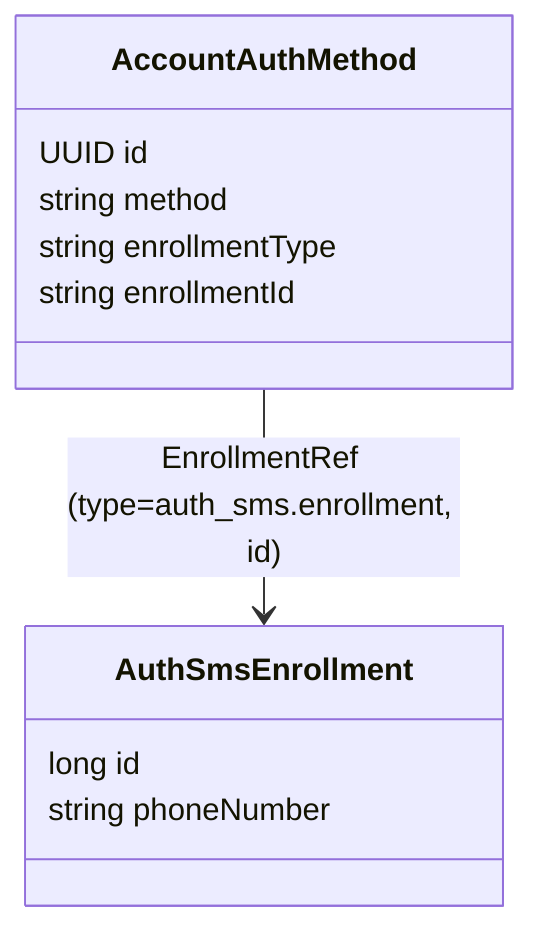

# Verfahren `sms`

**Was es ist:** Der Nutzer hinterlegt in seinem Konto eine Telefonnummer. Wenn er sich anmeldet,
schickt der Server einen Code (eine TAN) per SMS an diese Nummer. Der Nutzer tippt den Code ein und
zeigt damit, dass er das Telefon besitzt.

**Wozu es dient:** Es ist ein einfaches Anmeldeverfahren. Allein reicht es für das niedrigste
Niveau `loa1`. Der Nutzer kann sich damit auch anmelden, wenn das Konto noch nicht bekannt ist: Er
gibt dann zuerst seine E-Mail-Adresse an.

Die Telefonnummer bestätigt das Verfahren beim Einrichten selbst. Sie gehört zum Verfahren, nicht
zum Konto.

Begriffe wie Tool, Rolle, Fassung, Faktortyp und Niveau erklärt die
[Übersicht der Verfahren](README.md). Weitere Begriffe stehen im [Glossar](../glossar/glossar.md).

## Tools

Das Verfahren hat drei Tools: eines zum Einrichten (`enroll-sms`), eines zum Anmelden eines
bekannten Kontos (`auth-sms`) und eines zum Anmelden über die E-Mail-Adresse (`auth-sms-lookup`).

| toolId | Rolle | Fassungen |
|---|---|---|
| `enroll-sms` | `ENROLLMENT`, `changeable` | 1, 2 |
| `auth-sms` | `KNOWN_ACCOUNT_AUTH` | 1 |
| `auth-sms-lookup` | `ACCOUNT_LOOKUP_AUTH` | 1 |

Das Verfahren erbringt den Faktortyp Besitz (`{possession}`) und liefert höchstens das Niveau
`loa1`. Je Konto gibt es höchstens einen aktiven Eintrag (`allowsMultipleInstances = false`).
Deklariert ist das Verfahren in `tools/auth_sms/SmsToolModule.kt`.

## Datenmodell

Das **Credential** ist das gespeicherte Merkmal, mit dem sich der Nutzer später anmeldet. Bei SMS ist
das die Zeile in `auth_sms.enrollment` mit der Telefonnummer. Das Konto führt seine eingerichteten
Verfahren in `account.auth_method`. Der Eintrag dort verweist über die `EnrollmentRef` auf diese
Zeile. Das allgemeine Modell dahinter steht in [06-ablaeufe.md](../06-ablaeufe.md) Abschnitt 1.

- **Die TAN steht nicht im Enrollment.** Sie ist ein Einmalgeheimnis für genau einen Versuch. Sie
  liegt als Hash mit Ablaufzeit in der Tabelle der Tool-Sitzung, also beim einzelnen Durchlauf des
  Tools. Sonst würden sich zwei gleichzeitige Versuche gegenseitig überschreiben. Die eingegebene
  TAN wird nie gespeichert, sondern nur mit dem Hash verglichen.
- Die Arbeitsdaten eines Durchlaufs (Nummer, TAN-Hash und Ablaufzeit) hält das Tool als Datenklasse
  (`AuthSmsToolSession`) an der Tool-Sitzung des Orchestrators. Mehr dazu in
  [ADR-49](../adr/ADR-049-arbeitsdaten-der-tools-am-orchestrator.md).
- Die Mobilnummer ist kein **Anker** des Kontos, also keine Angabe, über die sich das Konto
  eindeutig wiederfinden lässt. `enroll-sms` beweist die Kontrolle über die Nummer mit derselben
  TAN, mit der es das Verfahren einrichtet. Nichts anderes nutzt die Nummer. Deshalb gibt es kein
  eigenes Tool `confirm-phone` ([03-tool-architektur.md](../03-tool-architektur.md) Abschnitt 4,
  ADR-17). Aus demselben Grund steht heute keine Mobilnummer im Token ([05-api.md](../05-api.md)
  Abschnitt 3a, „ID-Token-Claims“).

## Einrichten: `enroll-sms`

`enroll-sms` arbeitet wie `auth-sms` (unten). Der Unterschied: Hier entsteht der Datensatz
`AuthSmsEnrollment` neu. Er entsteht erst **nach** der erfolgreichen Prüfung der TAN, nie schon beim
ersten `PATCH` mit der Telefonnummer. Denn zu diesem Zeitpunkt ist die Nummer noch nicht bestätigt.

Nach dem Abschluss legt der Orchestrator den Eintrag in `account.auth_method` an, wie in
[Orchestrierung](../04-orchestrierung.md) Abschnitt 8 beschrieben. Dazu gehört auch
`enrolledUnderAcr`: das Niveau, das die Sitzung beim Einrichten nachgewiesen hatte
(`SessionEvidence`).

Die Aufrufe zeigt das Beispiel in [05-api.md](../05-api.md) Abschnitt 2 („Ein Tool-Durchlauf als
Beispiel“, Schritte 4 bis 6). Zuerst kommt `phoneNumber`, was den Versand der TAN auslöst, danach
`tan`.

`enroll-sms` ist `changeable`, lässt sich also ändern. Über
`POST .../methods/{methodInstanceId}/changes` läuft es noch einmal, und der neue Eintrag ersetzt den
alten ([05-api.md](../05-api.md) Abschnitt 3a, „Verfahren verwalten“). Die Seite im Web-Kanal
liest dann `stepData.replaces` und weist darauf hin, dass der bisherige Eintrag ersetzt wird.

**Zwei Fassungen** ([ADR-51](../adr/ADR-051-versionen-als-pfadsegment.md)): `enroll-sms` ist das
erste Tool mit einer zweiten Fassung.

- In **Fassung 2** gibt der Nutzer zusammen mit der Telefonnummer seine Einwilligung (`consent`),
  dass die Nummer gespeichert und für SMS-Codes genutzt wird. Ohne Einwilligung geht keine SMS
  hinaus, und `missingFields` nennt `consent` neben `phoneNumber`. Korrigiert der Nutzer im
  TAN-Schritt seine Nummer, muss er nicht noch einmal einwilligen: Die Tool-Sitzung merkt sich,
  dass die Einwilligung vorliegt.
- **Fassung 1** kennt die Einwilligung nicht und läuft unverändert weiter. Sonst könnte eine App,
  die die Checkbox nicht anzeigen kann, keine Nummer mehr einrichten.

Die Einwilligung wird nicht eigens gespeichert. Das Ereignis `METHOD_ADDED` im Änderungsprotokoll
nennt die Fassung (`enroll-sms@1` oder `@2`). Daraus folgt, ob die Einwilligung vorlag. Ein
einziger Handler bedient beide Fassungen (`EnrollSmsToolHandler`, Verzweigung nach
`ToolContext.version`). Je Fassung gibt es einen eigenen Controller. Die App spricht Fassung 1, der
Web-Kanal Fassung 2 (mit Checkbox auf der Einrichtungsseite). Wann ein Tool eine neue Fassung
braucht, steht in [05-api.md](../05-api.md) Abschnitt 2, „Fassungen eines Tools“.

## Anmelden: `auth-sms`

Der Orchestrator liest die aktive Enrollment-Referenz des Kontos
(`AccountDirectory.activeEnrollment`) und übergibt sie an den Handler. Das Modul `auth_sms` greift
also nicht selbst auf das Modul `account` zu. Es bekommt nur eine undurchsichtige `EnrollmentRef`
übergeben. So bleibt die Grenze zwischen den Modulen gewahrt ([Projektrahmen](../08-projektrahmen.md)).

`auth_sms` löst die Referenz zu einem bestehenden Enrollment auf. Es erzeugt, versendet und prüft
die TAN, verändert das Enrollment aber nie. `auth-password` und `auth-email` arbeiten genauso
([Verfahren `password`](password.md), [Verfahren `email`](email.md)).

Im Web-Kanal führt **Keycloak** die Anmeldung auf der Website. Keycloak nutzt `auth-sms` neben
`auth-password` und `auth-email` für die Anmeldung und für den Step-up, also wenn ein angemeldeter
Nutzer ein höheres Niveau erreichen muss. Die Aufrufe sind
`POST /tools/api/auth-sms/v1?channel={channelSessionId}`, danach
`PATCH`/`GET /tools/api/auth-sms/v1/{toolSessionId}` ([05-api.md](../05-api.md) Abschnitt 2,
„Zusammenspiel von Prozess-API und Tool-Ressourcen“).

## Anmelden über die E-Mail-Adresse: `auth-sms-lookup`

Dieses Tool ist für Nutzer gedacht, deren Konto noch nicht bekannt ist. Es ist nur über
`intent: "lookup_login"` erreichbar und braucht zwei `PATCH`-Aufrufe:

1. `{"email": "..."}`: Das Tool sucht das Konto über `AccountDirectory` anhand der E-Mail-Adresse
   und verschickt bei Erfolg die TAN.
2. `{"tan": "..."}`: Das Tool prüft die TAN.

Die gemeinsamen Regeln der Anmeldung über die E-Mail-Adresse stehen in [05-api.md](../05-api.md)
Abschnitt 3a, „Anmeldung über die E-Mail-Adresse“. Dazu gehört auch der Schutz davor, dass jemand
ausprobiert, welche Adressen es gibt.

## Versand begrenzen

Das Modul begrenzt selbst, wie viele Codes an eine Nummer gehen (`SmsSendLimit`). Dafür nutzt es eine
Mengenbegrenzung über das Zählwerk des Orchestrators
([03-tool-architektur.md](../03-tool-architektur.md) Abschnitt 7, `RateLimit`). Wird ein Konto
gelöscht, räumt `auth_sms` seine Tabelle über `EnrollmentCleanup` auf.

## Fehlerfälle

Zusätzlich zum allgemeinen Vertrag ([Betrieb](../07-betrieb.md)) gilt:

- `auth-sms`: unbekannte `enrollmentRef` oder fehlendes Enrollment -> `422`.
- `enroll-sms`: ungültige Telefonnummer (Formatfehler) -> `400`.

Eine falsche TAN ist ein gewöhnlicher Fehlversuch (`200` mit `stepData.error`).

## In der Demo

Die gerade ausgestellte TAN steht im `demo`-Objekt (`demo.tan`, [05-api.md](../05-api.md)
Abschnitt 1). Die Mobilnummer füllt die Auswahl der Testperson vor (`demo.persons`).
